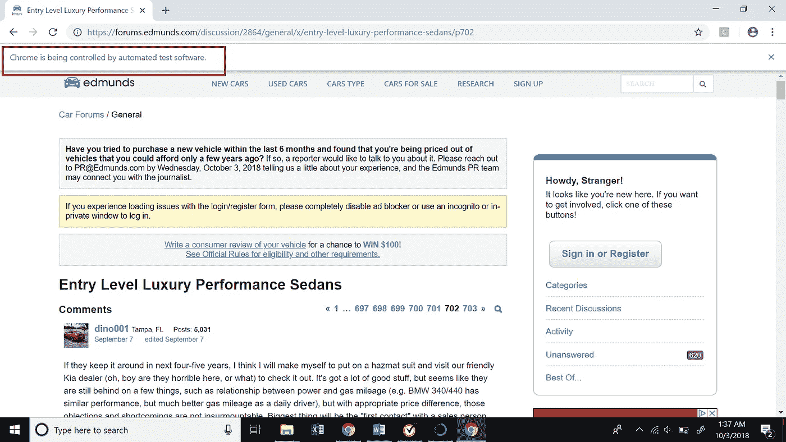
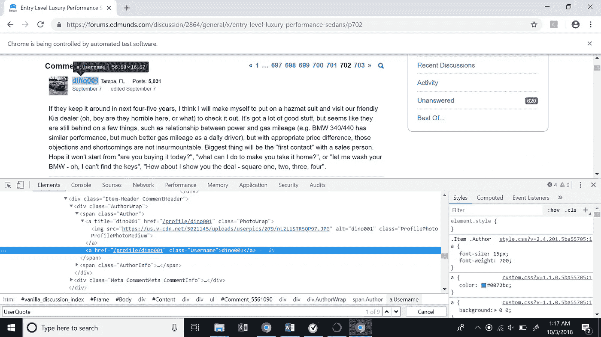
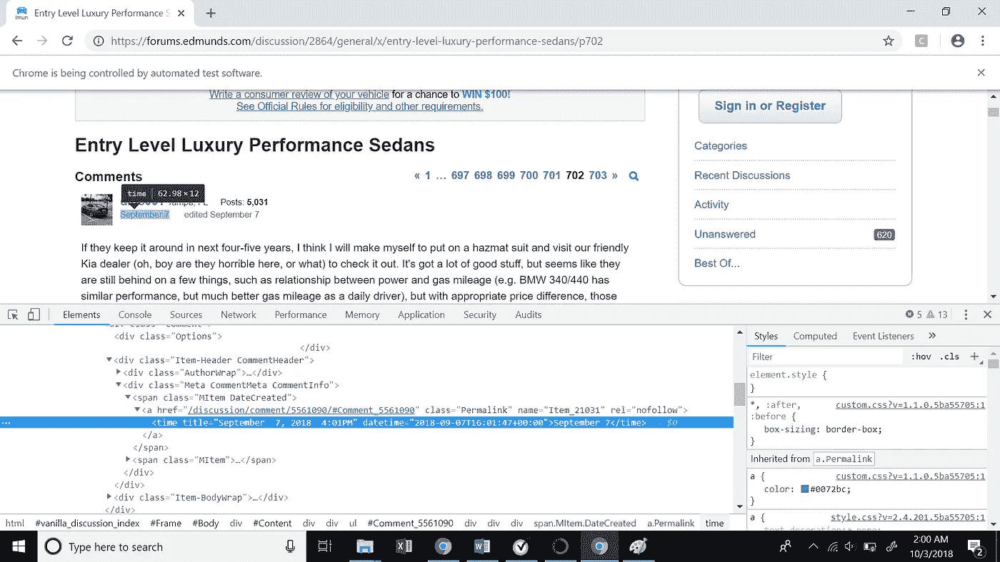
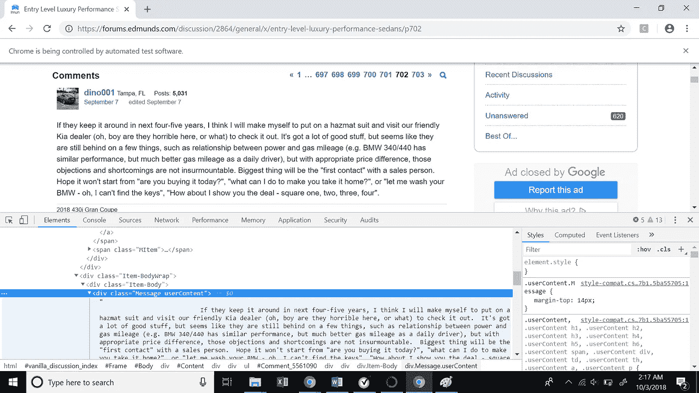
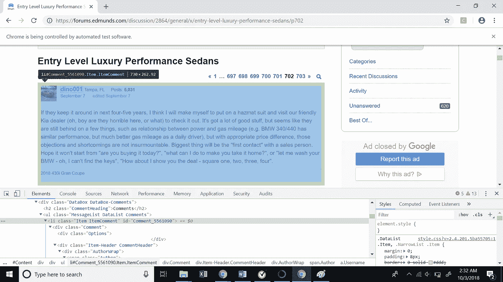

# 使用 Selenium-Python 进行 Web 抓取

> 原文：<https://towardsdatascience.com/web-scraping-using-selenium-python-8a60f4cf40ab?source=collection_archive---------0----------------------->

## 如何在 Python 中使用 Selenium 浏览网站的多个页面并收集大量数据


**Shhh! Be Cautious Web Scraping Could be Troublesome!!!**

在我们深入探讨本文的主题之前，让我们先了解一下什么是网络抓取，它有什么用处。

1.  **什么是网络抓取？**

网络抓取是一种使用模拟人类网上冲浪的软件从互联网上自动提取信息的技术。

2.**网络抓取有什么用？**

网络抓取帮助我们提取大量关于客户、产品、人员、股票市场等的数据。使用传统的数据收集方法通常很难获得大规模的此类信息。我们可以利用从电子商务门户网站、社交媒体渠道等网站收集的数据来了解客户行为和情绪、购买模式以及品牌属性关联，这些对于任何企业都是至关重要的洞察。

现在让我们把手弄脏吧！！

既然我们已经定义了抓取的目的，那就让我们深入研究如何真正做有趣的事情吧！在此之前，下面是一些关于软件包安装的内务操作说明。

a. **Python 版本**:我们将会使用 Python 3.0，但是也可以通过稍微的调整来使用 Python 2.0。我们将使用 jupyter 笔记本，所以你不需要任何命令行知识。

b. **Selenium 包**:您可以使用以下命令安装 Selenium 包

```
!pip install selenium
```

c. **Chrome 驱动**:请从[这里](https://chromedriver.storage.googleapis.com/index.html?path=2.42/)安装最新版本的 Chrome 驱动。

请注意，你需要在你的机器上安装[谷歌浏览器](https://support.google.com/chrome/answer/95346?co=GENIE.Platform%3DDesktop&hl=en)来完成这个插图。

当抓取一个网站时，首要的事情是理解网站的结构。我们将刮[Edmunds.com](https://www.edmunds.com/)，汽车论坛。这个网站帮助人们做出购车决定。人们可以在论坛上发布他们对不同汽车的评论(非常类似于在亚马逊上发布评论)。我们将讨论入门级豪华车品牌。

我们将从不同用户的多个页面收集约 5000 条评论。我们将收集用户 id、评论日期和评论，并将其导出到 csv 文件中，以供进一步分析。

**让我们开始编写我们的刮刀**！

我们将首先在笔记本中导入重要的包—

```
#Importing packages
from selenium import webdriver
import pandas as pd
```

现在让我们创建一个新的谷歌浏览器实例。这将有助于我们的程序在谷歌浏览器中打开一个网址。

```
driver = webdriver.Chrome('Path in your computer where you have installed chromedriver')
```

现在让我们访问谷歌浏览器，打开我们的[网站](https://forums.edmunds.com/discussion/2864/general/x/entry-level-luxury-performance-sedans/p702)。顺便说一句，chrome 知道你是通过一个自动化软件来访问它的！

```
driver.get('[https://forums.edmunds.com/discussion/2864/general/x/entry-level-luxury-performance-sedans/p702'](https://forums.edmunds.com/discussion/2864/general/x/entry-level-luxury-performance-sedans/p702'))
```



Web page opened from python notebook

# 哇哈哈！我们刚刚从 python 笔记本中打开了一个 url。

**那么，我们的网页看起来怎么样？**

我们将检查网页上的 3 个项目(用户 id、日期和评论),并了解如何提取它们。

1.  **用户 id** :检查用户 id，我们可以看到高亮显示的文本代表用户 id 的 XML 代码。



XML path for user id

userid 的 XML 路径(XPath)如下所示。这里有一件有趣的事情需要注意，XML 路径包含一个评论 id，它唯一地表示网站上的每个评论。这将非常有帮助，因为我们试图递归抓取多个评论。

```
//*[[@id](http://twitter.com/id)=”Comment_5561090"]/div/div[2]/div[1]/span[1]/a[2]
```

如果我们看到图中的 XPath，我们会发现它包含用户 id‘dino 001’。

**我们如何提取 XPath 中的值？**

Selenium 有一个函数叫做“ *find_elements_by_xpath* ”。我们将把 XPath 传递给这个函数，并获得一个 selenium 元素。一旦有了元素，我们就可以使用' *text* '函数提取 XPath 中的文本。在我们的例子中，文本基本上是用户 id ('dino001 ')。

```
userid_element = driver.find_elements_by_xpath('//*[[@id](http://twitter.com/id)="Comment_5561090"]/div/div[2]/div[1]/span[1]/a[2]')[0]
userid = userid_element.text
```

2.**评论日期**:类似于用户 id，我们现在将检查发表评论的日期。



XML path for comment date

让我们看看注释日期的 XPath。再次注意 XPath 中惟一的注释 id。

```
//*[[@id](http://twitter.com/id)="Comment_5561090"]/div/div[2]/div[2]/span[1]/a/time
```

**那么，我们如何从上面的 XPath 中提取 date 呢？**

我们将再次使用函数“find_elements_by_xpath”来获取 selenium 元素。现在，如果我们仔细观察图片中突出显示的文本，我们会看到日期存储在“title”属性中。我们可以使用函数“get_attribute”来访问属性中的值。我们将在这个函数中传递标记名，以获取其中的值。

```
user_date = driver.find_elements_by_xpath('//*[[@id](http://twitter.com/id)="Comment_5561090"]/div/div[2]/div[2]/span[1]/a/time')[0]date = user_date.get_attribute('title')
```

3.**评论**:最后，我们来探讨一下如何提取每个用户的评论。



XML Path for user comments

下面是用户评论的 XPath

```
//*[[@id](http://twitter.com/id)="Comment_5561090"]/div/div[3]/div/div[1]
```

同样，我们的 XPath 中有注释 id。与 userid 类似，我们将从上面的 XPath 中提取注释

```
user_message = driver.find_elements_by_xpath('//*[[@id](http://twitter.com/id)="Comment_5561090"]/div/div[3]/div/div[1]')[0]comment = user_message.text
```

我们刚刚学习了如何从网页中抓取不同的元素。**现在如何递归提取 5000 个用户的这些项？**

如上所述，我们将使用注释 id，注释 id 对于提取不同用户数据的注释是唯一的。如果我们看到整个注释块的 XPath，我们会看到它有一个与之关联的注释 id。

```
//*[[@id](http://twitter.com/id)="Comment_5561090"]
```



XML Path for entire comment block

下面的代码片段将帮助我们提取特定网页上的所有评论 id。我们将再次对上述 xpath 使用函数' *find_elements_by_xpath* ，并从' *id* 属性中提取 id。

```
ids = driver.find_elements_by_xpath("//*[contains([@id](http://twitter.com/id),'Comment_')]")
        comment_ids = []
for i in ids:
    comment_ids.append(i.get_attribute('id'))
```

上面的代码给出了一个特定网页上所有评论 id 的列表。

**如何将所有这些整合在一起？**

现在，我们将把目前为止看到的所有东西放入一个大代码中，这将递归地帮助我们提取 5000 条评论。我们可以通过遍历在前面的代码中找到的所有评论 id 来提取特定网页上每个用户的用户 id、日期和评论。

下面是从特定网页中提取所有评论的代码片段。

Scrapper To Scrape All Comments from a Web Page

最后，如果你检查我们的网址有页码，从 702 开始。因此，我们可以通过简单地改变 url 中的页码来递归地转到前面的页面，以提取更多的评论，直到我们获得所需数量的评论。

这个过程需要一些时间，取决于你的计算机的计算能力。所以，冷静下来，喝杯咖啡，和你的朋友和家人聊聊天，让硒发挥它的作用吧！

**总结**:我们学习了如何在 Python 中使用 Selenium 抓取网站并获得大量数据。您可以进行多种非结构化数据分析，并发现有趣的趋势、观点等。利用这些数据。如果有人有兴趣看完整的代码，这里是我的 [Github](https://github.com/bandiatindra/Edmunds_WebScraping/blob/master/Web_Scraping_Unstructured_Data_Analysis.ipynb) 的链接。

让我知道这是否有帮助。享受刮擦，但要小心！

如果你喜欢读这篇文章，我会推荐你读另一篇关于使用 Reddit API 和 Google BigQuery 抓取 Reddit 数据的文章，作者是德克萨斯大学奥斯汀分校的一位同学([Akhilesh naraparetdy](https://towardsdatascience.com/@akhilesh.narapareddy))。

[](/scrape-reddit-data-using-python-and-google-bigquery-44180b579892) [## 使用 Python 和 Google BigQuery 抓取 Reddit 数据

### 访问 Reddit API 和 Google Bigquery 的用户友好方法

towardsdatascience.com](/scrape-reddit-data-using-python-and-google-bigquery-44180b579892)