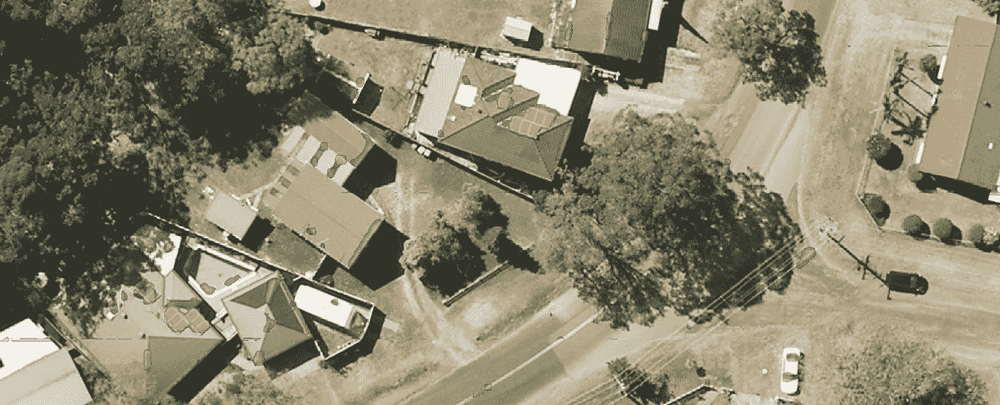
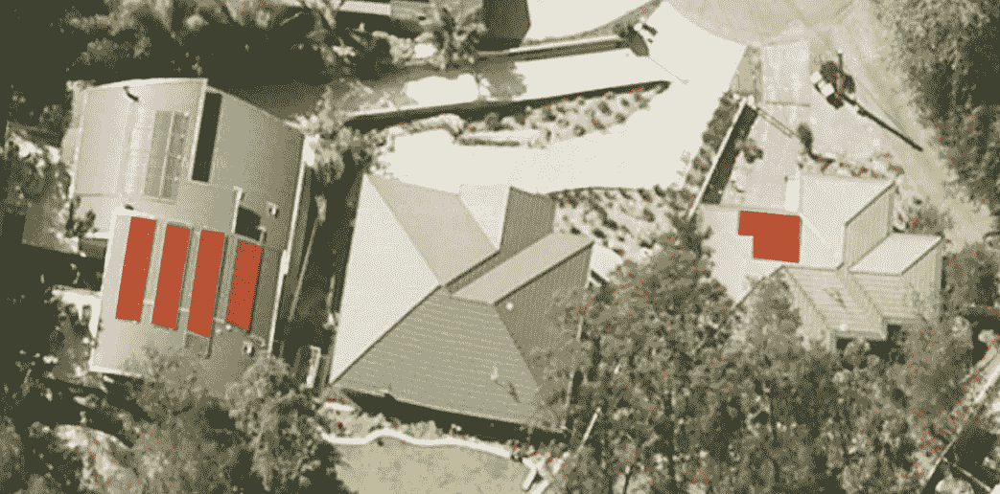
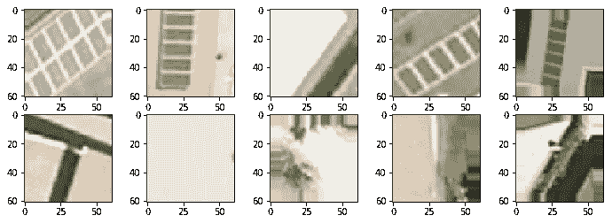
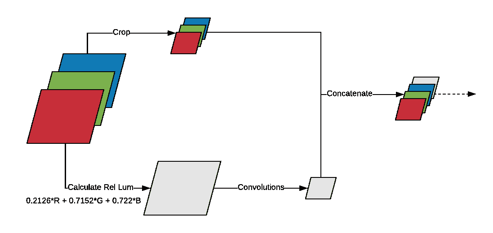
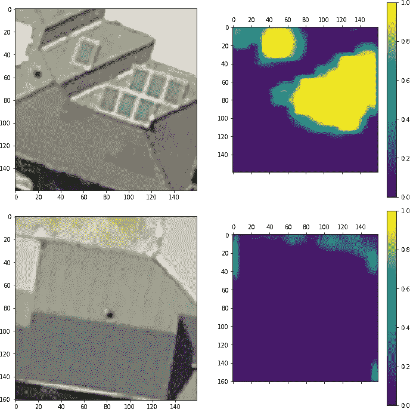
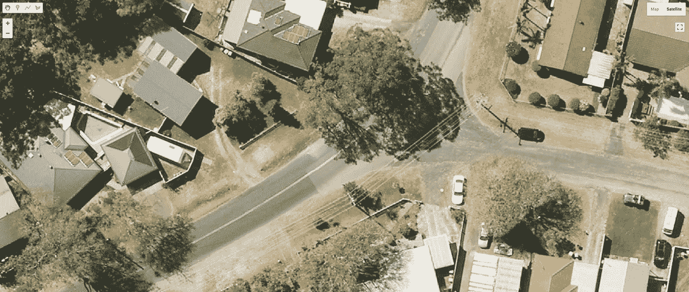

# 周末项目:从卫星图像中探测太阳能电池板

> 原文：<https://towardsdatascience.com/weekend-project-detecting-solar-panels-from-satellite-imagery-f6f5d5e0da40?source=collection_archive---------10----------------------->

我花了很多时间处理卫星图像或衍生产品，主要是与土壤科学相关的项目。你可以看看我以前的一篇文章，我用多任务卷积神经网络和环境信息来预测土壤有机碳含量:

 [## 深度学习和土壤科学—第二部分

### 使用上下文空间信息的数字土壤制图。从点信息生成土壤图的多任务 CNN

towardsdatascience.com](/deep-learning-and-soil-science-part-2-129e0cb4be94) 

这个周末，我想探索另一个领域，我认为这将是一个好主意，试图从卫星图像检测太阳能电池板。目前我住在澳大利亚，利用太阳能的潜力是巨大的。政府坚持推动使用煤来生产能源，所以我认为任何强调可再生能源的个人努力都是重要的。

# 目标

这是一个周末项目，所以我的想法是在短时间内实现一些东西，并希望得到一些下降的结果。结果并不完美，但这是良好的第一步。

整个过程包括:

*   生成数据集
*   训练卷积神经网络(CNN)
*   尝试用模型做一些有趣的事情

# 资料组

我确信有可能找到一个好的数据集来实现这一点，但目标之一是从头生成一个数据集。CNN 非常强大，但是没有数据，你做不了什么。

为了生成对应于太阳能电池板位置的多边形，我使用了[谷歌地球引擎](https://medium.com/google-earth)。我花了大约 1.5 个小时在 1 公里的范围内划分太阳能电池板，结果总共 124 个多边形(没有我预期的那么多)。

Creating polygons

下一步是在这些多边形内生成 1800 个随机点，并提取以这些位置为中心的图像。那些是阳性样品(有太阳能电池板)。对于负样本(没有太阳能电池板)，我生成了 1800 个不与多边形相交的随机点(加上一个缓冲区，以确保电池板不在图像中)。

Examples of positive samples (top) and negative samples (bottom)

# 模型

我能想到几种检测太阳能电池板的方法。我们可以尝试分割图像，使用遮罩，预测多边形的顶点。我不想花几个小时训练这个模型，所以我选择了一个相对简单的完全卷积神经网络来预测一个像素成为太阳能电池板一部分的概率。几个 conv-马克斯普尔序列，最初几层中的一些空间退学者，以及接近结尾时更多的退学者。我使用的一个小技巧(我在一次会议上从谷歌的某人那里学到的)是计算 RGB 图像的[相对亮度](https://en.wikipedia.org/wiki/Relative_luminance)，并将其用作上下文。我对 RGB 图像进行了裁剪(没有调整大小),并将其与亮度图像合并(在使用一些卷积减少亮度图像的大小之后)。

People has been asking about this “trick”. Just make sure that the shape of the cropped RGB is equal to the RelLum after the convolutions. The number of convolutions will depend on the shape of the original image and how much you crop it (not resize it).

在训练 100 个时期的模型之前，我使用 Kera 的`ImageDataGenerator`对图像应用了一些数据增强(垂直和水平翻转，80-120%亮度范围)。用 GPU 在桌面上运行训练只需要几分钟。

# 结果

考虑到我花在生成数据集和训练模型上的时间，我对结果印象深刻。该模型对训练集和验证集的准确率分别达到了 95%和 92%。

输出的几个例子:

High probabilities in an image with solar panels (top) and low probability in image without panels.

总的来说，结果是好的。有些地方模型会混淆，比如汽车挡风玻璃，房屋边缘，电缆。在实践中这不是一个大问题，因为在这些区域的概率通常低于 0.8，所以在适当的阈值下，误差是最小的。通过这个模型的第一次迭代，我可以预测一个大的区域，并手动选择负样本来进一步改进模型。

# 使用私有 API 进行预测

我决定使用 Flask 编写一个小的 tile 服务器，而不是运行 Jupyter 笔记本并使用它来预测新图像。大概我会写一篇关于这个的文章，但总的来说逻辑是:

*   给定 API 的视口，前端向 API 请求图块。
*   API 从官方切片服务器(卫星视图)检索切片。
*   API 使用图块进行预测。
*   API 使用用户定义的模型、阈值和不透明度生成覆盖图(原始图像+概率)。
*   前端显示瓷砖。

由于这种方法，我可以探索任何领域，并迅速得到预测。

Frontend displaying tiles predicted “on-the-fly”. Showing probabilities > 95%. Still some errors, but probably easy to correct with more negative samples.

# 最后的话

这是一个有趣的项目，结果比我预期的好得多。我可能会尝试改进模型，使其达到生产水平。API 肯定是我想继续改进的东西，因为我需要这样的东西已经有一段时间了。如果有人知道替代方案，请告诉我。

我希望你喜欢这篇文章。我想我会坚持太阳能主题，并尝试生成一个辐射模型来估计一所房子安装太阳能电池板的潜力。