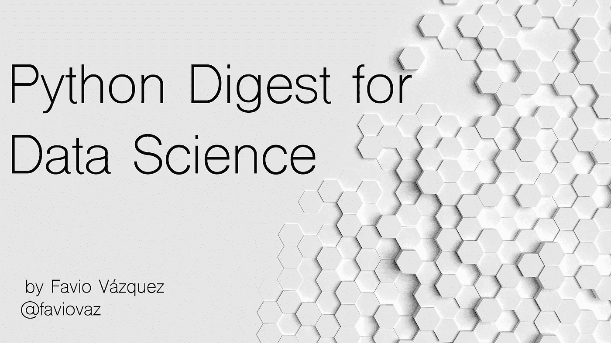
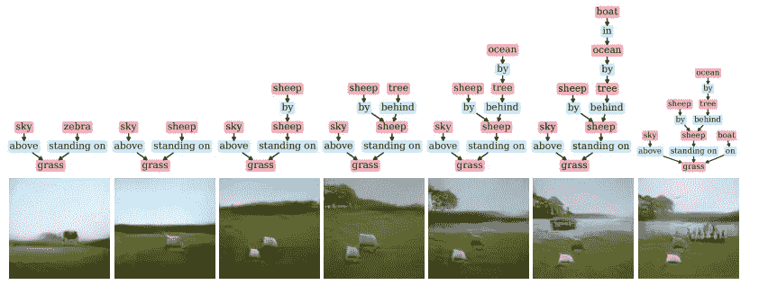
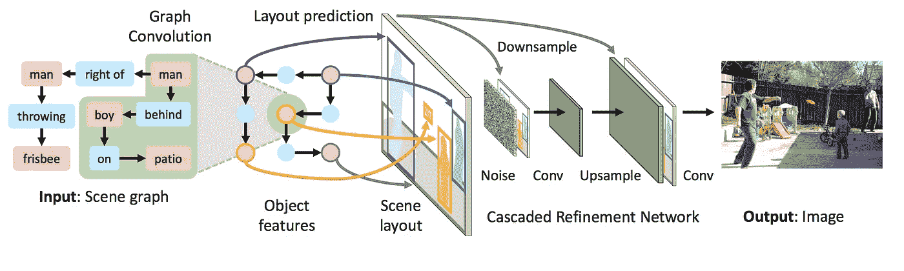
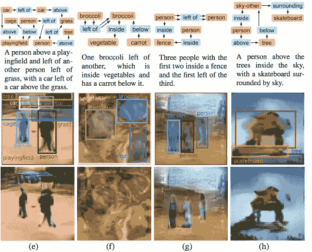
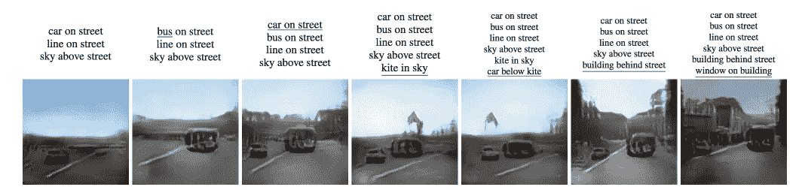
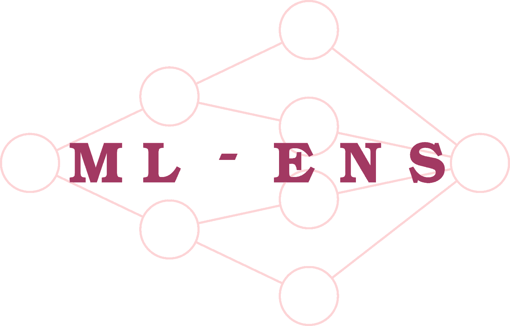
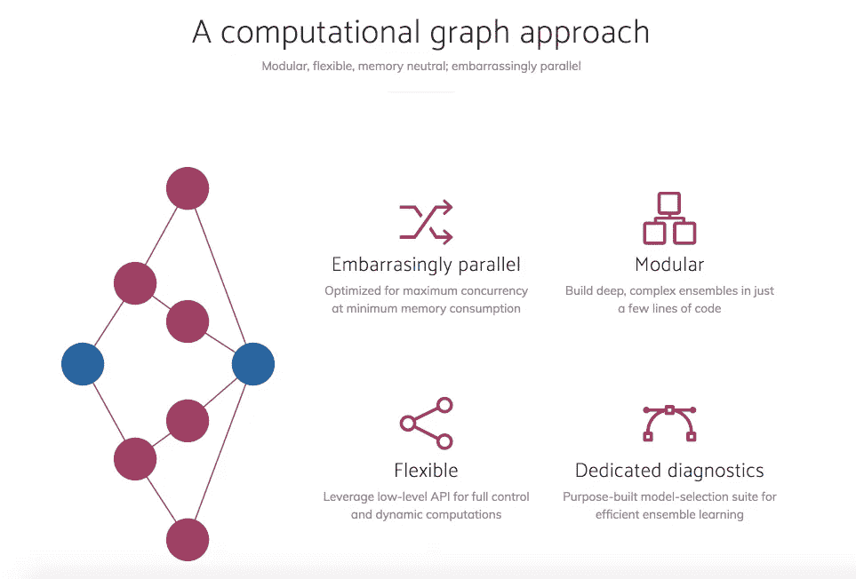

# 数据科学每周 Python 摘要(7 月第一周)

> 原文：<https://towardsdatascience.com/weekly-python-digest-for-data-science-1st-week-july-83bbf0355c36?source=collection_archive---------3----------------------->

## 大家好！我正在开始一个新的系列，我将谈论和测试一些谈论 Python 和 R 的库、代码或博客，以及它们在机器学习、深度学习和数据科学中的应用。第一份出版物是关于 Python 的。



# [1。sg2im](https://github.com/google/sg2im) —从场景图生成图像



[https://github.com/google/sg2im](https://github.com/google/sg2im)

这个伟大的开源代码将允许您使用图形卷积来处理输入图形，通过预测对象的边界框和分段遮罩来计算场景布局，并使用级联优化网络将布局转换为图像。

该论文可在此处找到:

 [## [1804.01622]从场景图生成图像

### 摘要:要真正理解视觉世界，我们的模型不仅要能识别图像，还要能生成…

arxiv.org](https://arxiv.org/abs/1804.01622) 

那么这段代码是做什么的呢？它实现了一个端到端的神经网络模型，输入一个场景图，输出一个图像。**场景图**是视觉场景的结构化表示，其中节点表示场景中的*对象*，边表示对象之间的*关系*。

用 ***图形卷积*** ***网络*** 处理输入的场景图形，该网络沿着边缘传递信息以计算所有对象的嵌入向量。这些向量用于预测所有对象的边界框和分割遮罩，它们被组合以形成粗略的 ***场景布局*** 。该布局被传递到 [*级联细化网络*](https://arxiv.org/abs/1707.09405) ，该网络以递增的空间比例生成输出图像。该模型针对一对 ***鉴别器网络*** 进行对抗性训练，以确保输出图像看起来逼真。



## 如何运行和测试代码？

首先克隆代码

```
git clone https://github.com/google/sg2im.git
```

原始代码是在 Ubuntu 16.04 上用 Python 3.5 和 PyTorch 0.4 开发和测试的。我在我的 Mac 上测试，没有问题:)

我建议您在虚拟环境中尝试一下。您可以设置虚拟环境来运行代码，如下所示:

```
python3 -m venv env               # Create a virtual environment
source env/bin/activate           # Activate virtual environment
pip install -r requirements.txt   # Install dependencies
echo $PWD > env/lib/python3.5/site-packages/sg2im.pth  # Add current directory to python path
# Work for a while ...
deactivate  # Exit virtual environment
```

你需要安装 *python-venv* 来完成这个。哦，顺便说一句，我需要改变一些脚本，这是我用的:

```
python3 -m venv --without-pip env # Added the --without-pip
source env/bin/activate           # Activate virtual environment
pip install -r requirements.txt   # Install dependencies
echo $PWD > env/lib/python3.6/site-packages/sg2im.pth  # Add current directory to python path
# Work for a while ...
deactivate  # Exit virtual environment
```

哦！也因为某些原因，我需要从 requirements.txt 中删除`**pkg-resources=0.0.0**` 。这似乎是一个错误:

[](https://stackoverflow.com/questions/39577984/what-is-pkg-resources-0-0-0-in-output-of-pip-freeze-command/39638060) [## pip 冻结命令输出中的“pkg-resources==0.0.0”是什么

### 本网站使用 cookies 来提供我们的服务，并向您显示相关的广告和工作列表。通过使用我们的网站，您…

stackoverflow.com](https://stackoverflow.com/questions/39577984/what-is-pkg-resources-0-0-0-in-output-of-pip-freeze-command/39638060) 

我已经创建了问题和 PR:)

要运行预先训练好的模型，您需要通过运行脚本`bash scripts/download_models.sh`来下载它们。这将下载以下型号，并需要大约 **355 MB 的磁盘空间**:

*   `sg2im-models/coco64.pt`:在 COCO-Stuff 数据集上训练生成 64 x 64 的图像。该模型用于从论文中生成图 5 中的 COCO 图像。


[https://arxiv.org/pdf/1804.01622.pdf](https://arxiv.org/pdf/1804.01622.pdf)

*   `sg2im-models/vg64.pt`:经过训练可以在可视基因组数据集上生成 64 x 64 的图像。该模型用于从论文中生成图 5 中的可视基因组图像。



[https://arxiv.org/pdf/1804.01622.pdf](https://arxiv.org/pdf/1804.01622.pdf)

*   `sg2im-models/vg128.pt`:经过训练，可以在可视基因组数据集上生成 128 x 128 的图像。这个模型被用来从纸上生成图 6 中的图像。



您可以使用脚本`scripts/run_model.py`使用简单的人类可读的 JSON 格式在新的场景图上轻松运行任何预训练的模型。

要重现上面的绵羊图像，你必须运行:

```
python scripts/run_model.py \
  --checkpoint sg2im-models/vg128.pt \
  --scene_graphs scene_graphs/figure_6_sheep.json \
  --output_dir outputs
```

您将获得:


我们来看看 figure_6_sheep.json:

```
[
  {
    "objects": ["sky", "grass", "zebra"],
    "relationships": [
      [0, "above", 1],
      [2, "standing on", 1]
    ]
  },
  {
    "objects": ["sky", "grass", "sheep"],
    "relationships": [
      [0, "above", 1],
      [2, "standing on", 1]
    ]
  },
  {
    "objects": ["sky", "grass", "sheep", "sheep"],
    "relationships": [
      [0, "above", 1],
      [2, "standing on", 1],
      [3, "by", 2]
    ]
  },
  {
    "objects": ["sky", "grass", "sheep", "sheep", "tree"],
    "relationships": [
      [0, "above", 1],
      [2, "standing on", 1],
      [3, "by", 2],
      [4, "behind", 2]
    ]
  },
  {
    "objects": ["sky", "grass", "sheep", "sheep", "tree", "ocean"],
    "relationships": [
      [0, "above", 1],
      [2, "standing on", 1],
      [3, "by", 2],
      [4, "behind", 2],
      [5, "by", 4]
    ]
  },
  {
    "objects": ["sky", "grass", "sheep", "sheep", "tree", "ocean", "boat"],
    "relationships": [
      [0, "above", 1],
      [2, "standing on", 1],
      [3, "by", 2],
      [4, "behind", 2],
      [5, "by", 4],
      [6, "in", 5]
    ]
  },
  {
    "objects": ["sky", "grass", "sheep", "sheep", "tree", "ocean", "boat"],
    "relationships": [
      [0, "above", 1],
      [2, "standing on", 1],
      [3, "by", 2],
      [4, "behind", 2],
      [5, "by", 4],
      [6, "on", 1]
    ]
  }
]
```

让我们来分析第一个:

```
{
    "objects": ["sky", "grass", "zebra"],
    "relationships": [
      [0, "above", 1],
      [2, "standing on", 1]
    ]
  }
```

因此，我们有天空、草地和斑马，其中天空[0]在草地[1]上方，斑马[2]站在草地[1]上。


First image from figure_6_sheep.json

让我们创建一个新的来测试代码:

```
[{
    "objects": ["sky", "grass", "dog", "cat", "tree", "ocean", "boat"],
    "relationships": [
      [0, "above", 1],
      [2, "standing on", 1],
      [3, "by", 2],
      [4, "behind", 2],
      [5, "by", 4],
      [6, "on", 1]
    ]
  }]
```

跑步:

```
python scripts/run_model.py \
  --checkpoint sg2im-models/vg128.pt \
  --scene_graphs scene_graphs/figure_blog.json \
  --output_dir outputs
```

我有:


有点奇怪，但很有趣:)。

# [2。算法](https://github.com/TheAlgorithms) / [Python](https://github.com/TheAlgorithms/Python) —所有算法都用 Python 实现。嗯“所有”

[](https://github.com/TheAlgorithms/Python) [## 算法/Python

### 所有算法都用 Python 实现

github.com](https://github.com/TheAlgorithms/Python) 

编程是数据科学中的一项必备技能，在这个伟大的资源库中，我们将看到几个重要算法的全 Python 代码实现。

这些仅用于演示目的。出于性能原因，Python 标准库中有许多更好的实现。

例如，你会发现机器学习代码，神经网络，动态编程，排序，哈希等等。例如，这是用 Numpy 在 Python 中从头开始的 K-means:

# [3。mlens](https://github.com/flennerhag/mlens) — ML-Ensemble —高性能集成学习

[](https://github.com/flennerhag/mlens) [## 弗伦纳哈格/姆伦斯

### 高性能集成学习

github.com](https://github.com/flennerhag/mlens) 

ML-Ensemble 将 Scikit-learn 高级 API 与低级计算图框架相结合，以尽可能少的代码行构建内存高效、最大化并行化的集成网络。

只要基础学习者是线程安全的，ML-Ensemble 就可以依靠内存映射多处理实现内存中立的基于进程的并发。有关教程和完整文档，请访问项目[网站](http://ml-ensemble.com/)。



## 通过 PyPI 安装

ML-Ensemble 在 PyPI 上可用。与一起安装

```
pip install mlens
```

简单示例(iris 义务示例):

```
**import** numpy **as** np
**from** pandas **import** DataFrame
**from** sklearn.metrics **import** accuracy_score
**from** sklearn.datasets **import** load_iris

seed **=** 2017
np**.**random**.**seed(seed)

data **=** load_iris()
idx **=** np**.**random**.**permutation(150)
X **=** data**.**data[idx]
y **=** data**.**target[idx]**from** mlens.ensemble **import** SuperLearner
**from** sklearn.linear_model **import** LogisticRegression
**from** sklearn.ensemble **import** RandomForestClassifier
**from** sklearn.svm **import** SVC

*# --- Build ---*
*# Passing a scoring function will create cv scores during fitting*
*# the scorer should be a simple function accepting to vectors and returning a scalar*
ensemble **=** SuperLearner(scorer**=**accuracy_score, random_state**=**seed, verbose**=**2)

*# Build the first layer*
ensemble**.**add([RandomForestClassifier(random_state**=**seed), SVC()])

*# Attach the final meta estimator*
ensemble**.**add_meta(LogisticRegression())

*# --- Use ---*

*# Fit ensemble*
ensemble**.**fit(X[:75], y[:75])

*# Predict*
preds **=** ensemble**.**predict(X[75:])
```

您将获得:

```
Fitting 2 layers
Processing layer**-**1             done **|** 00:00:00
Processing layer**-**2             done **|** 00:00:00
Fit complete                        **|** 00:00:00

Predicting 2 layers
Processing layer**-**1             done **|** 00:00:00
Processing layer**-**2             done **|** 00:00:00
Predict complete                    **|** 00:00:00
```

要检查层中估计器的性能，请调用`data`属性。属性可以包装在一个`[**pandas.DataFrame**](http://pandas.pydata.org/pandas-docs/stable/generated/pandas.DataFrame.html#pandas.DataFrame)`中，但是以表格格式打印出来。

```
**print**("Fit data:\n%r" **%** ensemble**.**data)
```

我们看到:

```
Fit data:
                                   score**-**m  score**-**s  ft**-**m  ft**-**s  pt**-**m  pt**-**s
layer**-**1  randomforestclassifier       0.84     0.06  0.05  0.00  0.00  0.00
layer**-**1  svc                          0.89     0.05  0.01  0.01  0.00  0.00
```

还不错。让我们来看看整体表现如何:

```
Prediction score: 0.960
```

他们这里有很棒的教程:

 [## 入门- mlens 0.2.1 文档

### 编辑描述

ml-ensemble.com](http://ml-ensemble.com/info/tutorials/start.html) 

今天就到这里了:)。很快你会得到更多的信息，也可以用 R 发帖。如果您想了解最新信息，请订阅以下内容:

感谢你阅读这篇文章。希望你在这里发现了一些有趣的东西:)

如果你有任何问题，请在推特上关注我

[](https://twitter.com/faviovaz) [## 法维奥·巴斯克斯(@法维奥·巴斯克斯)|推特

### Favio Vázquez 的最新推文(@FavioVaz)。数据科学家。物理学家和计算工程师。我有一个…

twitter.com](https://twitter.com/faviovaz) 

还有 LinkedIn。

[](http://linkedin.com/in/faviovazquez/) [## Favio Vázquez —首席数据科学家— OXXO | LinkedIn

### 查看 Favio Vázquez 在世界上最大的职业社区 LinkedIn 上的个人资料。Favio 有 15 个工作职位列在…

linkedin.com](http://linkedin.com/in/faviovazquez/) 

那里见:)