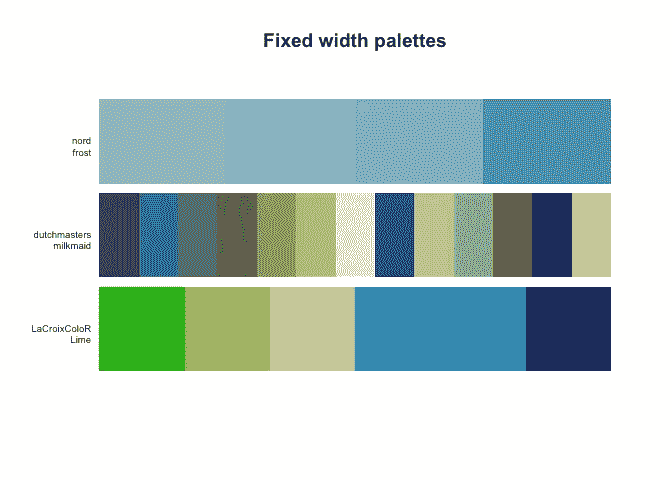
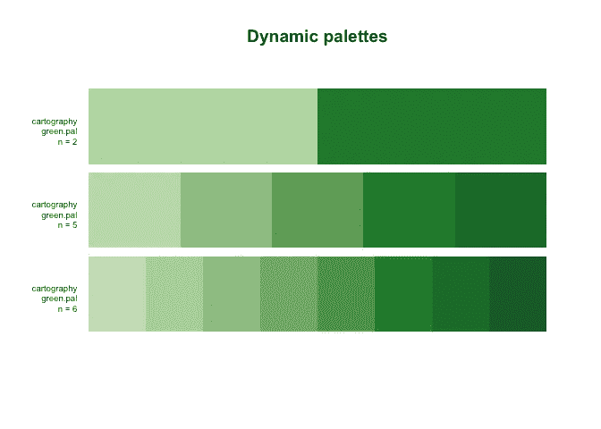
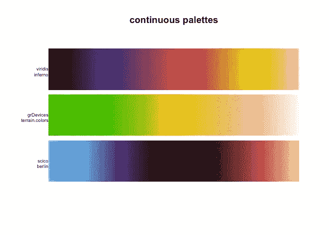
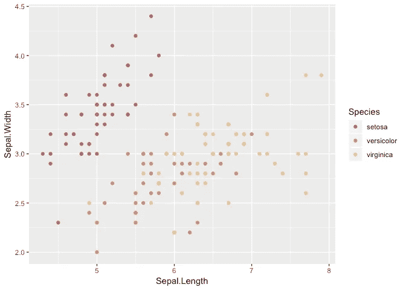
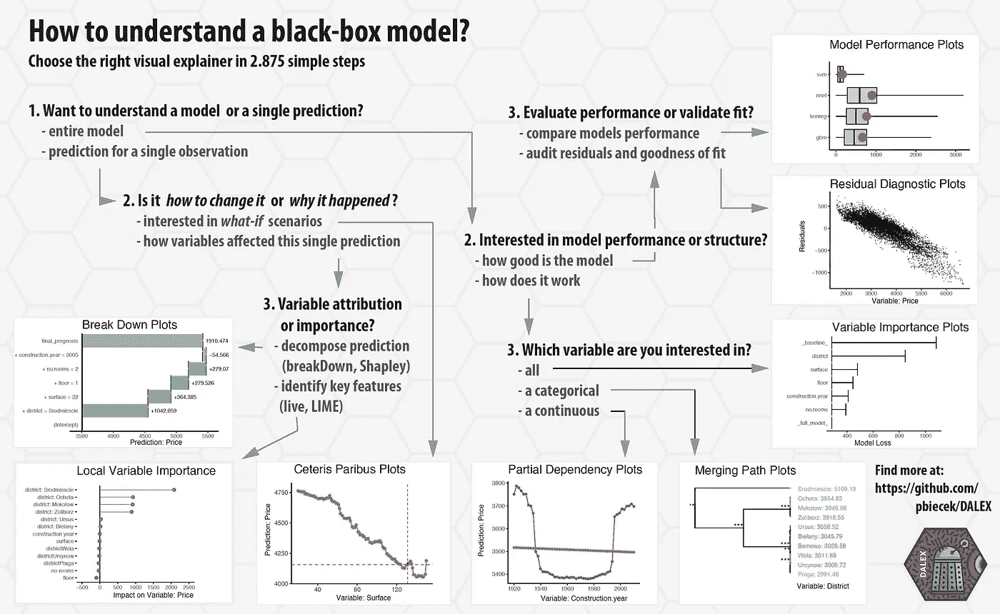
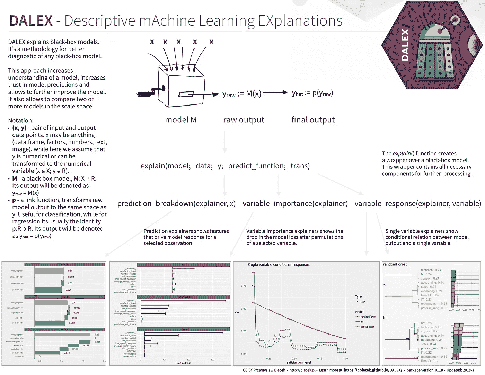
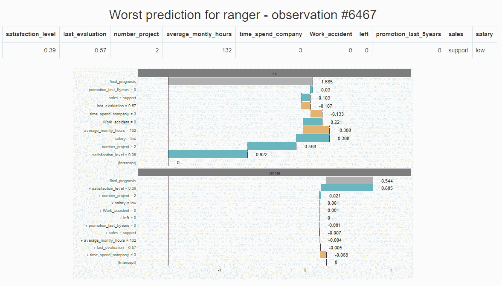
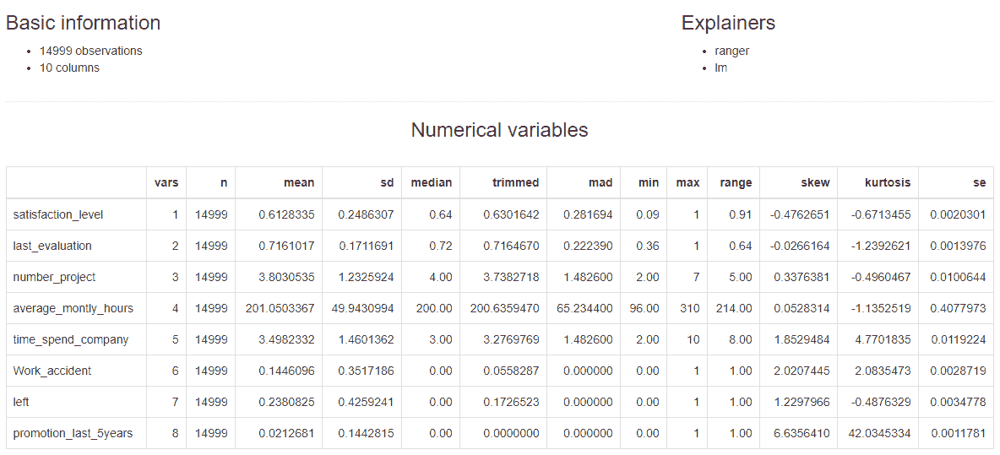
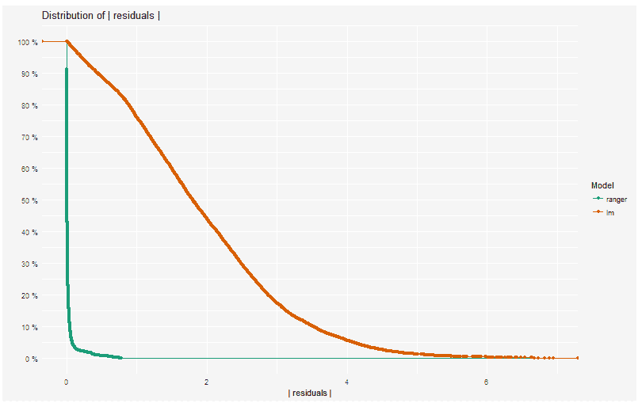
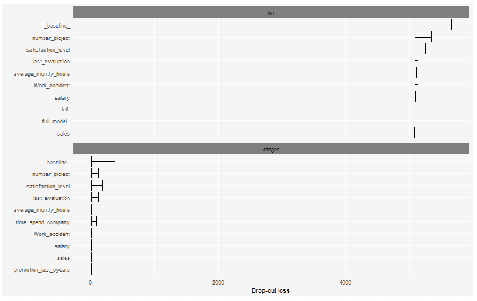

# 数据科学每周文摘(7 月第一周)

> 原文：<https://towardsdatascience.com/weekly-r-digest-for-data-science-1st-week-july-df8ce2f3bb72?source=collection_archive---------9----------------------->

## 大家好！在这个新系列中，我将讨论并测试一些关于 R 及其在机器学习、深度学习和数据科学中的应用的库、代码或博客。你可以在这里阅读[的 Python 版本](/weekly-python-digest-for-data-science-1st-week-july-83bbf0355c36)。


# [1。调色板](https://github.com/EmilHvitfeldt/paletteer) —单个 R 包中大多数调色板的集合


[https://github.com/EmilHvitfeldt/paletteer](https://github.com/EmilHvitfeldt/paletteer)

数据可视化在数据科学中至关重要。是我们向企业解释我们的发现的途径，它还帮助我们理解我们正在分析的数据，将几周的工作压缩成一幅画面。

r 是一种很好的可视化语言。这个伟大的软件包 **paletteer** 的目标是使用一个公共接口成为 R 中调色板的综合集合。把它想象成“调色板的脱字符号”。

这个包还没有在 CRAN 上，但是如果你想要开发版本，那么直接从 GitHub 安装:

```
# install.packages("devtools")
devtools::install_github("EmilHvitfeldt/paletteer")
```

## 调色板

调色板分为两组；*离散*和*连续*。对于离散调色板，您可以在*固定宽度调色板*和*动态调色板*之间进行选择。两者中最常见的是固定宽度调色板，它具有固定的颜色数量，当所需的颜色数量变化时，该数量不会改变，如下调色板所示:



另一方面，我们有动态调色板，其中调色板的颜色取决于您需要的颜色数量，如`cartography`包中的`green.pal`调色板:



最后，我们有连续调色板，它可以根据您的需要提供任意多种颜色，以实现颜色的平滑过渡:



该包包括来自 28 个不同包的 958 个包，有关这些包的信息可以在以下数据框中找到:`palettes_c_names`、`palettes_d_names`和`palettes_dynamic_names`。

该套件还包括使用相同标准接口的`ggplot2`秤

```
library(ggplot2)ggplot(iris, aes(Sepal.Length, Sepal.Width, color = Species)) +
  geom_point() +
  scale_color_paletteer_d(nord, aurora)
```



非常容易和有用。记得访问 GitHub repo:

[](https://github.com/EmilHvitfeldt/paletteer) [## EmilHvitfeldt/paletteer

### 调色板-在一个 R 包中收集了大多数调色板

github.com](https://github.com/EmilHvitfeldt/paletteer) 

并启动它；).

# [2。DALEX](https://github.com/pbiecek/DALEX) —描述性的机器学习解释


[https://github.com/pbiecek/DALEX](https://github.com/pbiecek/DALEX)

解释机器学习模型并不总是容易的，但对于一些商业应用来说却非常重要。有一些很棒的库可以帮助我们完成这项任务，例如:

[](https://github.com/thomasp85/lime) [## 托马斯 p85/石灰

### 本地可解释的模型不可知解释(原始 Python 包的 R 端口)

github.com](https://github.com/thomasp85/lime) 

顺便说一句，有时候一个简单的 ggplot 可视化可以帮助你解释一个模型。关于这方面的更多信息，请看马修·梅奥的这篇精彩文章:

[](https://www.kdnuggets.com/2017/11/interpreting-machine-learning-models-overview.html) [## 解释机器学习模型:综述

### 一篇关于机器学习解释的文章早在三月份就出现在 O'Reilly 的博客上，作者是 Patrick Hall，Wen…

www.kdnuggets.com](https://www.kdnuggets.com/2017/11/interpreting-machine-learning-models-overview.html) 

在许多应用中，我们需要知道、理解或证明输入变量是如何在模型中使用的，以及它们对最终模型预测有什么影响。`DALEX`是一套帮助理解复杂模型如何工作的工具。

要从 CRAN 安装，只需运行:

```
install.packages("DALEX")
```

他们有关于如何将 DALEX 用于不同 ML 包的惊人文档:

*   [如何使用带有脱字符号的 DALEX】](https://rawgithub.com/pbiecek/DALEX_docs/master/vignettes/DALEX_caret.html)
*   [如何配合 mlr 使用 DALEX】](https://rawgithub.com/pbiecek/DALEX_docs/master/vignettes/DALEX_mlr.html)
*   [如何与 H2O 一起使用 DALEX】](https://rawgit.com/pbiecek/DALEX_docs/master/vignettes/DALEX_h2o.html)
*   [如何在 xgboost 包中使用 DALEX】](https://rawgithub.com/pbiecek/DALEX_docs/master/vignettes/DALEX_and_xgboost.html)
*   [如何使用 DALEX 进行教学？第一部分](https://rawgithub.com/pbiecek/DALEX_docs/master/vignettes/DALEX_teaching.html)
*   [如何使用 DALEX 进行教学？第二部分](https://rawgit.com/pbiecek/DALEX_docs/master/examples/What%20they%20have%20learned%20-%20part%202.html)
*   [分解 vs 石灰 vs 沙普利](https://rawgit.com/pbiecek/DALEX_docs/master/vignettes/Comparison_between_breakdown%2C_lime%2C_shapley.html)

伟大的备忘单:



[https://github.com/pbiecek/DALEX](https://github.com/pbiecek/DALEX)



[https://github.com/pbiecek/DALEX](https://github.com/pbiecek/DALEX)

一个交互式笔记本，您可以在其中了解有关该产品包的更多信息:

 [## 粘合剂(测试版)

### 编辑描述

mybinder.org](https://mybinder.org/v2/gh/pbiecek/DALEX_docs/master?filepath=jupyter-notebooks%2FDALEX.ipynb) 

最后是一个书籍风格的文档，其中讨论了 DALEX、机器学习和可解释性:

 [## DALEX:描述性机器学习解释

### 不要相信黑箱模型。除非它能自我解释。

pbiecek.github.io](https://pbiecek.github.io/DALEX_docs/) 

在原始存储库中签出它:

[](https://github.com/pbiecek/DALEX) [## pbiecek/DALEX

### DALEX -描述性机器学习解释

github.com](https://github.com/pbiecek/DALEX) 

而且记得启动它:)。

# [modelDown](https://github.com/MI2DataLab/modelDown) —生成一个包含预测模型的 HTML 摘要的网站



`modelDown`生成一个包含预测模型 HTML 摘要的网站。Is 使用 [DALEX](https://github.com/pbiecek/DALEX) (见上文)解释器来计算和绘制给定模型如何表现的概要。我们可以看到预测分数是如何精确计算的(预测分解)，每个变量对预测的贡献有多大(变量响应)，哪些变量对给定模型最重要(变量重要性)，以及模型的表现如何(模型性能)。

您现在可以从 GitHub 安装它:

```
devtools::install_github("MI2DataLab/modelDown")
```

当您成功地安装了这个包之后，您需要为您的模型创建 DALEX 解释器。下面是一个简单的例子(来自作者):

```
*# assuming you have two models: glm_model and ranger_model for HR_data*
explainer_glm <- DALEX::explain(glm_model, data=HR_data, y=HR_data$left)
explainer_ranger <- DALEX::explain(ranger_model, data=HR_data, y=HR_data$left)
```

接下来，将所有创建的解释器传递给函数`modelDown`。例如:

```
modelDown::modelDown(explainer_ranger, explainer_glm)
```

就是这样！现在，您应该已经用默认选项生成了 html 页面。

您将看到如下页面:

## 索引页



索引页提供了 explainers 中提供的数据的基本信息。您还可以看到作为参数给出的所有解释器的类型。此外，数字变量的汇总统计数据也是可用的。对于分类变量，表中列出了因子水平的频率。

## 模型性能



模块显示功能`model_performance`的结果。

## 可变重要性



函数`variable_importance`的输出以图表的形式呈现。

还有更多。下面是一个用这个包生成的页面的实例:

[https://mi2datalab.github.io/modelDown_example/](https://mi2datalab.github.io/modelDown_example/)

今天就到这里了:)。很快你会得到更多的信息，也可以用 R 发帖。如果您想了解最新信息，请订阅以下内容:

感谢你阅读这篇文章。希望你在这里发现了一些有趣的东西:)

如果你有任何问题，请在推特上关注我

[](https://twitter.com/faviovaz) [## 法维奥·巴斯克斯(@法维奥·巴斯克斯)|推特

### Favio Vázquez 的最新推文(@FavioVaz)。数据科学家。物理学家和计算工程师。我有一个…

twitter.com](https://twitter.com/faviovaz) 

还有 LinkedIn。

[](http://linkedin.com/in/faviovazquez/) [## Favio Vázquez —首席数据科学家— OXXO | LinkedIn

### 查看 Favio Vázquez 在世界上最大的职业社区 LinkedIn 上的个人资料。Favio 有 15 个工作职位列在…

linkedin.com](http://linkedin.com/in/faviovazquez/) 

那里见:)