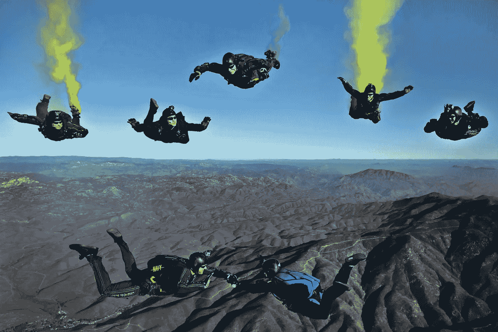

# 每周精选—2017 年 10 月 20 日

> 原文：<https://towardsdatascience.com/weekly-selection-26-5fb7439a1f58?source=collection_archive---------8----------------------->

[Join us as an Editorial Associate of Towards Data Science](https://medium.com/towards-data-science/join-us-as-an-editorial-associate-of-towards-data-science-766cdd74d13e)

## [庆祝迈向数据科学一周年](https://medium.com/towards-data-science/celebrating-1-year-of-towards-data-science-ca13cf65481)

由[钟楚红](https://medium.com/u/a0ad04b856d7?source=post_page-----5fb7439a1f58--------------------------------) — 3 分钟读完。

迈向数据科学始于一年前的 2016 年 10 月 21 日。我们现在已经成长为一个在 Medium 上拥有超过 30，000 名粉丝的社区，并在[脸书](https://www.facebook.com/towardsdatascience/)、 [Twitter](https://twitter.com/tdatascience?lang=en) 、 [LinkedIn](https://www.linkedin.com/in/towards-data-science-online-publication-41b94a135/) 和 [Instagram](https://www.instagram.com/towardsdatascience/) 上开展业务。

## [为什么 OpenMined 成为开源项目的榜样](https://medium.com/towards-data-science/why-openmined-is-becoming-a-role-model-for-open-source-projects-ae11749fc577)

由 [Awa 孙茵](https://medium.com/u/7463c0c17b07?source=post_page-----5fb7439a1f58--------------------------------) — 3 分钟读完。

这不是我第一次写关于 OpenMined 的开源项目。

## [机器学习工程师新手犯的 6 大错误](https://medium.com/towards-data-science/top-6-errors-novice-machine-learning-engineers-make-e82273d394db)

克里斯托弗档案员 — 5 分钟阅读。

在机器学习中，有许多方法来构建产品或解决方案，每种方法都有不同的假设。很多时候，如何导航和识别哪些假设是合理的并不明显。

## [利用 Python 中的客户细分找到您的最佳客户](https://medium.com/towards-data-science/find-your-best-customers-with-customer-segmentation-in-python-61d602f9eee6)

由[苏珊李](https://medium.com/u/731d8566944a?source=post_page-----5fb7439a1f58--------------------------------) — 5 分钟读完。

当谈到找出谁是你的最佳客户时，古老的 RFM 矩阵原理再次发挥作用。RFM 代表近期、频率和货币。

## [为机器学习和深度学习学习数学](https://medium.com/towards-data-science/learning-maths-for-machine-learning-and-deep-learning-5509c097ee83)

由 [Aneesha Bakharia](https://medium.com/u/66fcd719ea06?source=post_page-----5fb7439a1f58--------------------------------) — 3 分钟阅读。

虽然我在攻读工程学位时确实学了很多数学，但当我想进入机器学习领域时，我已经忘记了大部分。毕业后，我从未真正需要过任何数学。

## [从网络开发到计算机视觉和地理](https://medium.com/towards-data-science/my-next-two-years-de448d3141a)

由[伦纳德·博格多诺夫](https://medium.com/u/72744a57b325?source=post_page-----5fb7439a1f58--------------------------------) — 7 分钟读完。

在过去的四年里，我一直有一个想法，那就是我要创办一家公司。潜在的感觉是，我想做一些我能热情地承担全部责任的事情。

*   [与我们的团队实时聊天](https://www.patreon.com/posts/chat-live-with-13837221)
*   [为走向数据科学而写作](https://www.patreon.com/posts/write-for-data-13837153)
*   [订阅](https://www.getrevue.co/profile/towardsdatascience)我们的官方简讯(新)
*   [成为 Patreon](https://www.patreon.com/towardsdatascience)