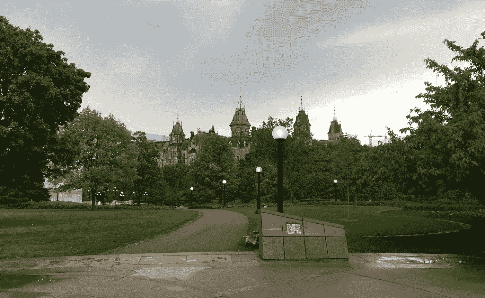

# 每周精选

> 原文：<https://towardsdatascience.com/weekly-selection-6c25cd42348a?source=collection_archive---------5----------------------->

# [神经形态和深度神经网络](https://medium.com/towards-data-science/neuromorphic-and-spiking-or-not-894a836dc3b3)

由[Eugenio culrciello](https://medium.com/u/e53b1a2a902f?source=post_page-----6c25cd42348a--------------------------------)—6 分钟阅读。

用于计算神经网络的神经形态或标准数字:**哪个更好？这个问题很难回答。标准的数字神经网络是我们在深度学习中看到的那种，它们取得了所有的成功。他们使用 64 位或更低的数字值进行计算，所有这些都在标准数字硬件中。**

# [提高机器学习模型的准确性](https://medium.com/towards-data-science/boosting-the-accuracy-of-your-machine-learning-models-f878d6a2d185)

通过 [Prashant Gupta](https://medium.com/u/a84d0e60277a?source=post_page-----6c25cd42348a--------------------------------) — 8 分钟读取。

厌倦了机器学习模型的低准确率吗？助推是来帮忙的。 *Boosting 是一种流行的机器学习算法，可以提高你的模型的准确性，*就像赛车手使用 nitrous boost 来提高他们的汽车速度一样。

# [Tensorflow RMSD:使用 Tensorflow 做它没有被设计去做的事情](https://medium.com/towards-data-science/tensorflow-rmsd-using-tensorflow-for-things-it-was-not-designed-to-do-ada4c9aa0ea2)

斯坦福大学潘德实验室(Matthew p . Harrigan)——8 分钟阅读。

深度学习彻底改变了图像和语音处理，让你可以把[边缘变成猫](https://affinelayer.com/pixsrv/index.html)。在我们的实验室里，我们将这些技术应用于小分子药物研发。

# [我的 Spotify 音乐很无聊吗？涉及音乐、数据和机器学习的分析](https://medium.com/towards-data-science/is-my-spotify-music-boring-an-analysis-involving-music-data-and-machine-learning-47550ae931de)

胡安·德·迪奥斯·桑托斯 10 分钟阅读。

几天前，我一边听着 Spotify 保存的歌曲，一边和一个朋友聊天。唱了几首歌后，她打断了谈话告诉我:“你的音乐品味很有趣……你的播放列表里有很多**综艺**、**器乐**歌曲，其中一些是**无聊**”。

# [上周的数据故事、数据集和可视化综述](https://medium.com/towards-data-science/data-curious-29-05-2017-a-roundup-of-data-stories-datasets-and-visualisations-from-last-week-c5c73894a29c)

本杰明·库利 — 8 分钟阅读。

每个星期，我都会剪辑、保存和收藏大量我在网上找到的关于用数据讲述故事的很酷的东西。以下是 5 月 22 日这一周吸引我眼球的内容。在典型的时事通讯中，我会包含一堆链接供你点击，保存起来以后再看(没关系，我们都这样做)。

# [生成模型和 gan](https://medium.com/towards-data-science/generative-models-and-gans-fe7efc20020b)

由 Anish Singh Walia — 4 分钟阅读。

简单地说，它们是一类**无监督的**机器学习模型，用于生成一些数据。它使用观测值的联合概率分布。

# [Stock2Vec —从 ML 到 P/E](https://medium.com/towards-data-science/stock2vec-from-ml-to-p-e-2e6ba407c24)

由乔恩·佩尔 — 3 分钟读完。

## Word2Vec 是一个简单却惊人强大的算法。

它构建[单词向量](https://blog.acolyer.org/2016/04/21/the-amazing-power-of-word-vectors/)来表示单词含义。它仅仅通过周围的单词来学习这些意思。然后你可以使用这些单词向量作为输入，让机器学习算法[执行得更好](https://ronan.collobert.com/pub/matos/2008_nlp_icml.pdf)并找到[有趣的抽象](http://byterot.blogspot.co.uk/2015/06/five-crazy-abstractions-my-deep-learning-word2doc-model-just-did-NLP-gensim.html)。

# [为大家揭秘人工智能](https://medium.com/towards-data-science/artificial-intelligence-the-present-7ffeb0ff1ae6)

由 [Namit Chaturvedi](https://medium.com/u/c26f5bd4e3ca?source=post_page-----6c25cd42348a--------------------------------) — 8 分钟阅读。

每个计算机程序的核心都有一个数学函数在起作用。这可能像计算未偿还贷款的利息一样简单，也可能像自动驾驶飞机一样复杂。*人工智能*，或 *AI* ，是一个计算机程序的通称，其核心数学功能已经(几乎)自动创建；而*机器学习*，或 *ML* ，指的是提供创造人工智能方式的一系列技术。