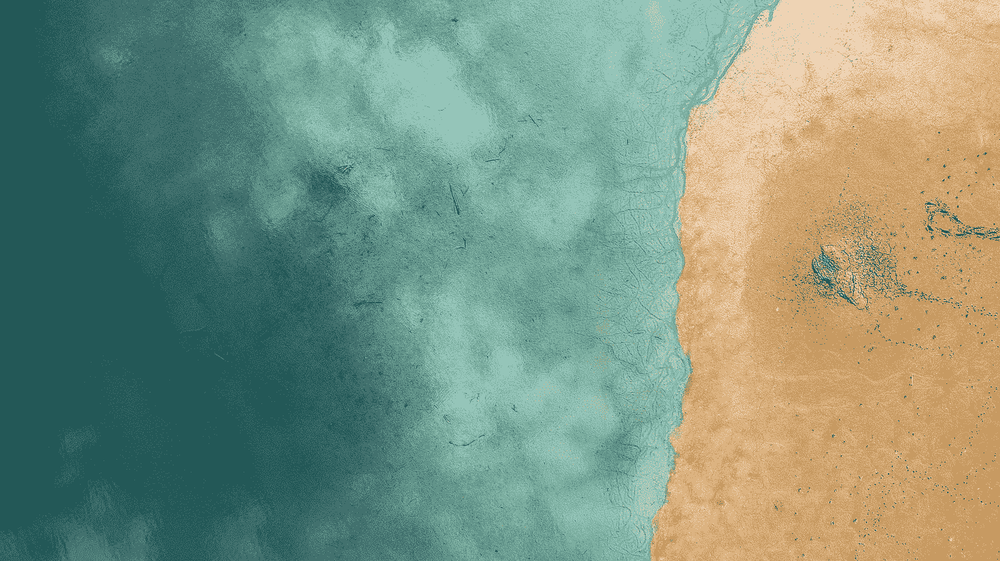

# 每周精选

> 原文：<https://towardsdatascience.com/weekly-selection-9795aa406956?source=collection_archive---------10----------------------->

## 这是第一次计算机可视化吗？

由[冒险中的数据](https://medium.com/u/6e29cdd66791?source=post_page-----9795aa406956--------------------------------) — 3 分钟读取。

有一段时间，我一直在寻找第一个计算机数据可视化。

## [做数据科学更快](https://medium.com/towards-data-science/do-data-science-faster-fe27294fd417)

通过[罗布·托马斯](https://medium.com/u/91395b7f9c69?source=post_page-----9795aa406956--------------------------------) — 3 分钟读取。

人工智能是许多企业的目标。但是，为了做人工智能，一个组织需要机器学习。而且，没有分析，机器学习是不可能的。

## [使用 Tensorflow 对象检测 API 构建玩具检测器](https://medium.com/towards-data-science/building-a-toy-detector-with-tensorflow-object-detection-api-63c0fdf2ac95)

通过 [Priya Dwivedi](https://medium.com/u/b040ce924438?source=post_page-----9795aa406956--------------------------------) — 5 分钟阅读。

这个项目是我的热门项目的第二阶段-[Google tensor flow 物体检测 API 是实现图像识别最简单的方法吗](https://medium.com/towards-data-science/is-google-tensorflow-object-detection-api-the-easiest-way-to-implement-image-recognition-a8bd1f500ea0)？

## [学术生态系统被破坏了，下面是我们应该如何恢复它](https://medium.com/towards-data-science/academic-ecosystem-is-damaged-heres-how-we-should-restore-it-b038f81c367b)

由 Sofija Melnikaite — 8 分钟读取。

我在伦敦大学学院(University College London)攻读组织心理学硕士学位时，意识到学术界的生态系统遭到了破坏，而目前我们没有采取多少措施来恢复它。

## [PyTorch 教程精华](https://medium.com/towards-data-science/pytorch-tutorial-distilled-95ce8781a89c)

伊拉里昂·赫列斯托夫——7 分钟阅读。

当我刚开始研究 PyTorch 时，几天后我就放弃了。与 TensorFlow 相比，我很难理解这个框架的核心概念。

## [使用 Scrapy 构建自己的数据集](https://medium.com/towards-data-science/using-scrapy-to-build-your-own-dataset-64ea2d7d4673)

由迈克尔·加拉尼克 — 7 分钟读完。

当我刚开始在工业界工作时，我很快意识到的一件事是，有时你必须收集、组织和清理你自己的数据。

## [阿姆斯特丹的环境救星:循环经济](https://medium.com/towards-data-science/amsterdams-environmental-saviour-the-circular-economy-c83200222e61)

由[劳伦麦克森](https://medium.com/u/afd0306a89f1?source=post_page-----9795aa406956--------------------------------) — 9 分钟阅读。

原材料是一种有限的资源。随着依赖这些资源的行业数量的增加(如智能手机和平板电脑的金属)，消费者的数量也在增加。

## [TED 中反复出现的话题是什么](https://medium.com/towards-data-science/what-are-the-recurring-topics-in-ted-8392cf9f3fb)

汉娜·韩嫣 3 分钟阅读。

今天我探索了 TED 演讲的数据、主题和观众。鉴于 TED 上想法的多样性，演讲通常有几个相关的主题和标签。

## [如今五家企业如何使用人工智能和大数据](https://medium.com/towards-data-science/how-five-businesses-are-using-ai-and-big-data-today-784abeb6f9ef)

由克拉克·博伊德 — 8 分钟读完。

预测分析可以定义为一种数据挖掘形式，它使用统计建模来分析历史模式，然后使用这些模型来预测未来的结果。