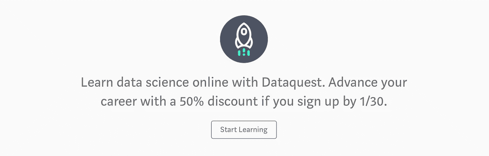

# 每周精选—2018 年 1 月 26 日

> 原文：<https://towardsdatascience.com/weekly-selection-jan-26-2018-66e12abc1bff?source=collection_archive---------7----------------------->

## [使用 Tensorflow 和 Keras 进行手写识别](/handwriting-recognition-using-tensorflow-and-keras-819b36148fe5)

由 [Priya Dwivedi](https://medium.com/u/b040ce924438?source=post_page-----66e12abc1bff--------------------------------) — 4 分钟阅读

由于个人书写风格的巨大差异，手写识别(也称为按书写者对每个手写文档进行分类)是一个具有挑战性的问题。

## [我的深度学习之旅](/my-journey-into-deep-learning-c66e6ef2a317)

通过[法维奥·巴斯克斯](https://medium.com/u/e8ec6fa4d7d4?source=post_page-----66e12abc1bff--------------------------------) — 8 分钟读取。

在这篇文章中，我将分享我如何研究深度学习并使用它来解决数据科学问题。这是一个非正式的帖子，但内容有趣(我希望如此)。

## [机器学习新手的 10 大算法之旅](/a-tour-of-the-top-10-algorithms-for-machine-learning-newbies-dde4edffae11)

由詹姆斯·勒 — 11 分钟读完

在机器学习中，有一种东西叫做“[没有免费的午餐](http://www.no-free-lunch.org/)”定理。简而言之，它指出没有一种算法对每个问题都是最好的，并且它特别适用于监督学习(即预测建模)。

[-> Start Learning with Dataquest](https://www.dataquest.io/subscribe?discount=2018new_year&only_yearly=true&utm_source=TDS&utm_medium=ad)

## [使用 Tensorflow 对象检测在 Android 上检测皮卡丘](/detecting-pikachu-on-android-using-tensorflow-object-detection-15464c7a60cd)

由胡安·德·迪奥斯·桑托斯 — 12 分钟阅读

在 **TensorFlow** 的众多功能和工具的深处，隐藏着一个名为 [**TensorFlow 对象检测 API**](https://github.com/tensorflow/models/tree/master/research/object_detection) 的组件。顾名思义，这个库的目的是训练一个能够识别帧中对象(例如图像)的神经网络。

## [在 NLP 和 CV 中应用迁移学习](/applying-transfer-learning-in-nlp-and-cv-d4aaddd7ca90)

由 Lars Hulstaert — 8 分钟阅读

在这篇博文中，我将讨论迁移学习的两个应用。我将概述自然语言处理和计算机视觉领域的例子。

## [优步司机排班优化](/uber-driver-schedule-optimization-62879ea41658)

由[伊万·周](https://medium.com/u/83e0c547ee57?source=post_page-----66e12abc1bff--------------------------------) — 12 分钟读完

优步的关键价值主张之一是为他们的司机合作伙伴提供调度灵活性。根据 Beneson Strategy Group 的一份报告，73%的司机更喜欢有一份可以让他们选择时间表的工作。

## [比谷歌更擅长机器学习——可能吗？](/being-better-at-machine-learning-than-google-is-it-possible-62c5e4643ddb)

由[亚伦·爱戴](https://medium.com/u/b9a723f6b2a0?source=post_page-----66e12abc1bff--------------------------------) — 3 分钟读完

说你在某件事上比谷歌更好是没有意义的。然而，当我对我们的面部识别技术进行测试时，我发现我们比谷歌的视觉 API 更准确。

## [描绘神经科学的图景](/mapping-the-landscape-of-neuroscience-s-bc14628e8713)

由[法赫德·阿尔哈兹米](https://medium.com/u/c29852ddab0b?source=post_page-----66e12abc1bff--------------------------------) — 5 分钟读取

神经科学是一个多样化的科学领域，由不同的学科组成:生物学、心理学、计算机科学、语言学等等。脑科学的主要目标是了解神经系统。

## [为什么 AI 不会取代放射科医生](/why-ai-will-not-replace-radiologists-c7736f2c7d80)

休·哈维 — 10 分钟阅读

2016 年末，神经网络教父杰弗里·辛顿教授表示，“很明显，我们应该停止培训放射科医生”，因为图像感知算法很快就会明显优于人类。他说，放射学家是“已经越过悬崖边缘但还没有往下看的郊狼”。

## [通过分享学习](/learn-by-sharing-4461cc93f8c1)

由威廉·科尔森 — 4 分钟阅读

传统教育很简单:坐下，闭嘴，听老师讲课。课后去图书馆反复阅读同样的单词，试图理出我们日常生活中意义不大的抽象话题。

**我们感谢 47 位帕特里翁的支持者，是他们让我们的工作成为可能😊**

威廉·霍格、克里斯·塞德尔、拉梅什·沙拉姆、[丹尼尔·夏皮罗、博士](https://medium.com/u/e7f791e64e83?source=post_page-----66e12abc1bff--------------------------------)、[文卡特·拉曼](https://medium.com/u/613e8869b6c5?source=post_page-----66e12abc1bff--------------------------------)、[基里尔·帕纳林](https://medium.com/u/c2c4e577b008?source=post_page-----66e12abc1bff--------------------------------)、[哈比卜·巴卢瓦拉](https://medium.com/u/d33f5f90c7c5?source=post_page-----66e12abc1bff--------------------------------)、赛赛、[扎克·塞格彭](https://medium.com/u/b561ae67ef31?source=post_page-----66e12abc1bff--------------------------------)、[提尔塔吉约蒂·萨卡尔](https://medium.com/u/cb9d97d4b61a?source=post_page-----66e12abc1bff--------------------------------)、[帕布·帕拉尼萨米](https://medium.com/u/c52f26e982c1?source=post_page-----66e12abc1bff--------------------------------)、安东尼·马内洛、让·皮埃尔和[迪潘詹·萨卡尔](https://medium.com/u/6278d12b0682?source=post_page-----66e12abc1bff--------------------------------)

[成为✨的资助人](https://www.patreon.com/towardsdatascience)