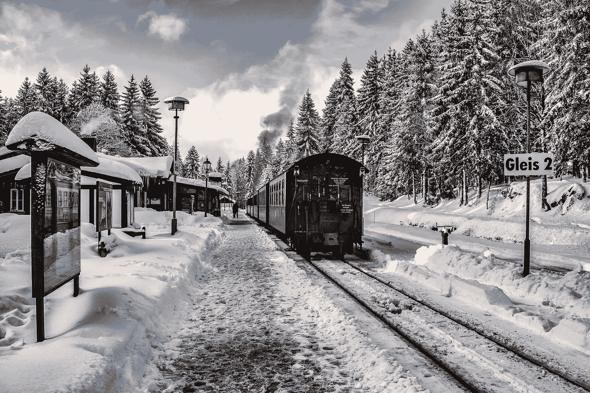

# 每周精选—2018 年 1 月 5 日

> 原文：<https://towardsdatascience.com/weekly-selection-jan-5-2018-76fc5287bd1c?source=collection_archive---------5----------------------->

## [信息规划和朴素贝叶斯](/information-planning-and-naive-bayes-380ee1feedc7)

由[瓦迪姆·斯莫里亚科夫](https://medium.com/u/5d7cb5e269f9?source=post_page-----76fc5287bd1c--------------------------------) — 7 分钟阅读

信息规划包括基于信息度量做出决策。信息规划与主动学习[1]和最优实验设计[2]密切相关，其中标记数据的获取是昂贵的。

## [基于网络的语音命令识别](/web-based-voice-command-recognition-58a9bb1ec8db)

Boris Smus — 7 分钟阅读。

[上次](http://smus.com/web-audio-ml-features)我们将音频缓冲区转换成图像。这次我们将拍摄这些图像，并使用 [deeplearn.js](https://deeplearnjs.org/) 训练一个神经网络。结果是[一个基于浏览器的演示](https://google.github.io/web-audio-recognition/inference-demo/?model=yesno)，让你说出一个命令(“是”或“否”)，并实时查看分类器的输出。

## [艺术风格转移](/artistic-style-transfer-b7566a216431)

通过 [Firdaouss Doukkali](https://medium.com/u/d7a31d72a9b3?source=post_page-----76fc5287bd1c--------------------------------) — 5 分钟读取。

这篇文章是关于艺术风格转移，或者你也可以称之为神经风格转移。知道深度学习可以用图像做出一些神奇的东西，很有意思。所以，我会试着让你更好地理解这个概念，以及它是如何工作的。

## [理解特征工程(上)——连续数值数据](/understanding-feature-engineering-part-1-continuous-numeric-data-da4e47099a7b)

由 [Dipanjan Sarkar](https://medium.com/u/6278d12b0682?source=post_page-----76fc5287bd1c--------------------------------) — 18 分钟读取

任何智能系统基本上都由一个端到端的管道组成，从接收原始数据开始，利用数据处理技术从这些数据中获取、处理和设计有意义的特征和属性。然后，我们通常利用统计模型或机器学习模型等技术对这些功能进行建模，然后根据手头要解决的问题，在必要时部署该模型以供将来使用。

## [概率概念解释:最大似然估计](/probability-concepts-explained-maximum-likelihood-estimation-c7b4342fdbb1)

由 [Jonny Brooks-Bartlett](https://medium.com/u/c6ab8048de41?source=post_page-----76fc5287bd1c--------------------------------) — 8 分钟阅读

在这篇文章中，我将解释什么是参数估计的最大似然法，并通过一个简单的例子来演示这种方法。有些内容需要基本概率概念的知识，如联合概率的定义和事件的独立性。

## [人工智能，2018 年及以后的 AI](/artificial-intelligence-ai-in-2018-and-beyond-e06f05167f9c)

到[尤金尼奥·库勒切洛](https://medium.com/u/e53b1a2a902f?source=post_page-----76fc5287bd1c--------------------------------) — 13 分钟阅读

这些是我对深度神经网络和机器学习在更大的人工智能领域的发展方向的看法，以及我们如何才能获得越来越多的复杂机器来帮助我们的日常生活。

## [将大规模枪击事件政治化——当我们可以谈论枪支管制的时候](/politicizing-mass-shootings-when-we-can-talk-about-gun-control-f196ebee2b0c)

通过 [Viet Vu](https://medium.com/u/3c636f3dcd72?source=post_page-----76fc5287bd1c--------------------------------) — 2 分钟读取

2017 年 10 月 1 日，一名枪手从拉斯维加斯一家酒店房间内射出子弹，[造成 59 人死亡，546 人受伤](https://en.wikipedia.org/wiki/2017_Las_Vegas_shooting)。这是美国近代史上最致命的大规模枪击事件。在每一次大规模枪击事件后，这种叙述都变得很熟悉，几乎是照本宣科。

## [使用 TensorFlow 对象检测 API、ML 引擎和 Swift 构建 Taylor Swift 检测器](/build-a-taylor-swift-detector-with-the-tensorflow-object-detection-api-ml-engine-and-swift-82707f5b4a56)

莎拉·罗宾逊——11 分钟阅读

**注意:**在撰写本文时，Swift 还没有官方的 TensorFlow 库，我使用 Swift 构建了针对我的模型的预测请求的客户端应用程序。这种情况将来可能会改变，但泰勒对此有最终决定权。

## [你需要知道的 10 种机器学习算法](/10-machine-learning-algorithms-you-need-to-know-77fb0055fe0)

通过 [Sidath Asiri](https://medium.com/u/f3ba6a470945?source=post_page-----76fc5287bd1c--------------------------------) — 6 分钟读取

由于数据分析、大计算能力和云计算的发展，我们生活在一个革命性时代的开端。机器学习肯定会在那里发挥巨大作用，机器学习背后的大脑是基于算法的..

## [甘斯真的模拟了真实的数据分布吗，或者他们只是在巧妙地愚弄我们？](/do-gans-really-model-the-true-data-distribution-or-are-they-just-cleverly-fooling-us-d08df69f25eb)

由 [Gal Yona](https://medium.com/u/c81e4b81bed8?source=post_page-----76fc5287bd1c--------------------------------) — 6 分钟读完

自 2014 年引入以来，生成对抗网络(GANs)已经成为密度估计任务的流行选择。方法很简单:GAN 框架由两个网络组成，一个用于生成新样本，另一个用于区分真实样本(来自真实数据分布)和生成的样本。

## [GPU 优化的动态编程](/gpu-optimized-dynamic-programming-8d5ba3d7064f)

由阿努拉达·维克拉马拉奇——3 分钟阅读

我们来考虑一下 ***路径和:项目欧拉问题 81 ( [链接](https://projecteuler.net/problem=81))中的两种方式*** 。探索解的动态编程范式和 GPU 优化是我们感兴趣的问题。

## [训练和可视化单词向量](/training-and-visualising-word-vectors-2f946c6430f8)

由 Priya Dwivedi — 6 分钟阅读

在本教程中，我想展示如何在 tensorflow 中实现 skip gram 模型，为您正在处理的任何文本生成单词向量，然后使用 tensorboard 将它们可视化。我发现这个练习非常有用，有助于我理解 skip gram 模型是如何工作的，以及在你将它们用于 CNN 或 RNNs 之前，感受一下这些向量捕捉到的关于你的文本的关系。

## [GPU 优化简介](/an-introduction-to-gpu-optimization-6ea255ef6360)

通过[阿努拉达·维克拉马拉奇](https://medium.com/u/ddf633dcad17?source=post_page-----76fc5287bd1c--------------------------------)——5 分钟阅读

大多数涉及大量计算的任务都需要时间，随着数据集变得越来越大，这将变得更加耗时。解决这个问题的一种方法是使用线程。

## [看德国交通标志](/looking-at-german-traffic-signs-a03eb49def72)

由[卡斯帕·弗雷登斯伦德](https://medium.com/u/c662e319122d?source=post_page-----76fc5287bd1c--------------------------------) — 10 分钟阅读

我的意思是，当然，当我们开车穿过德国时，它们就在那里，我们(希望)确实*看到了*它们，有时我们甚至会记录它们的含义，并根据这些含义改变我们的行为。但是我们看那些醒目的蓝色、红色和白色的几何象形图做得还远远不够。

我们感谢 39 位 Patreon 支持者，是他们让我们的工作成为可能😊

威廉·霍格、克里斯·塞德尔、拉梅什·沙拉姆、[丹尼尔·夏皮罗、博士](https://medium.com/u/e7f791e64e83?source=post_page-----76fc5287bd1c--------------------------------)、[文卡特·拉曼](https://medium.com/u/613e8869b6c5?source=post_page-----76fc5287bd1c--------------------------------)、[公式化](https://medium.com/u/49ed00376aec?source=post_page-----76fc5287bd1c--------------------------------)、[基里尔·帕纳林](https://medium.com/u/c2c4e577b008?source=post_page-----76fc5287bd1c--------------------------------)、赛赛、[扎克·塞格彭](https://medium.com/u/b561ae67ef31?source=post_page-----76fc5287bd1c--------------------------------)、[蒂尔塔约蒂·萨卡尔](https://medium.com/u/cb9d97d4b61a?source=post_page-----76fc5287bd1c--------------------------------)、安东尼·马内洛、[纳温·蒂鲁帕图尔](https://medium.com/u/baf56c00792b?source=post_page-----76fc5287bd1c--------------------------------)。

[成为✨的资助人](https://www.patreon.com/towardsdatascience)