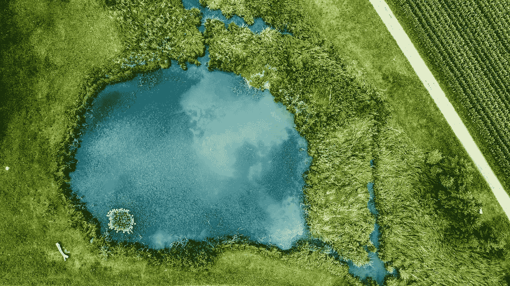

# 每周精选—2017 年 11 月 3 日

> 原文：<https://towardsdatascience.com/weekly-selection-nov-3-2017-c7f7d2eaddc2?source=collection_archive---------10----------------------->

## [45 种激活数据科学职业生涯的方法](https://medium.com/towards-data-science/45-ways-to-activate-your-data-science-career-6a0d9c664e84)

由[基里尔叶列缅科](https://medium.com/u/6b467d74ac43?source=post_page-----c7f7d2eaddc2--------------------------------) — 8 分钟阅读。

我们询问了 LinkedIn 小组成员，他们在成为成熟的数据科学家时面临的最大挑战是什么。一些最常见的挫折是:不知道从哪里开始，缺乏经验，无法形成网络，难以联系到合适的人。

Watch [#DSFORALL](https://www.ibm.com/analytics/us/en/events/dsforall/?cm_mmc=Email_External-_-Analytics_Hybrid+Cloud+Signature+Moments-_-WW_WW-_-TDS+replay+promo&cm_mmca1=000027BL&cm_mmca2=10000864&cvosrc=email.External.NA&cvo_campaign=000027BL) with Nate Silver, Tricia Wang and others.

## [一个数据科学工作流程](https://medium.com/towards-data-science/a-data-science-workflow-26c3f05a010e)

到 [Aakash Tandel](https://medium.com/u/befbb97a016a?source=post_page-----c7f7d2eaddc2--------------------------------) — 13 分钟读取。

没有解决数据科学问题的模板。路线图会随着每个新数据集和新问题而变化。但是我们确实在许多不同的项目中看到类似的步骤。

## [数据科学家需要掌握的 10 项统计技术](https://medium.com/towards-data-science/the-10-statistical-techniques-data-scientists-need-to-master-1ef6dbd531f7)

由詹姆斯·勒 — 15 分钟读完。

不管你站在数据科学性感的立场上，都不可能忽视数据的持续重要性，以及我们分析、组织和联系数据的能力。

## [张量流入门(第一部分)](https://medium.com/towards-data-science/a-beginner-introduction-to-tensorflow-part-1-6d139e038278)

由纳拉辛哈·普拉桑娜·HN—7 分钟阅读。

Tensorflow 是广泛用于实现机器学习和其他涉及大量数学运算的算法的库之一。

## [建立分析文化](https://medium.com/towards-data-science/establishing-a-culture-of-analytics-947c7947af)

由乔治·克拉萨达斯 — 7 分钟阅读。

“大数据时代”的数据可用性大幅提高。公司通常会积累大量复杂的数据，描述越来越多的业务活动。

## [机器学习遇上时尚](https://medium.com/towards-data-science/machine-learning-meets-fashion-48ee8f6541ad)

由[郁风 G](https://medium.com/u/2a2ae028a675?source=post_page-----c7f7d2eaddc2--------------------------------) — 5 分钟读完。

在《人工智能历险记》的这一集中，我们将尝试把整个机器学习工作流程整合成一个流程，从我们之前的剧集中汲取最佳实践。这是一个很大的材料，但我认为我们可以做到这一点！