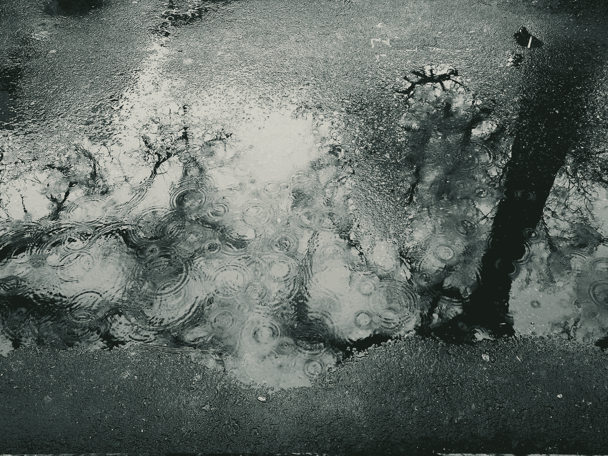

# 每周精选—2018 年 11 月 9 日

> 原文：<https://towardsdatascience.com/weekly-selection-nov-9-2018-25b26b120302?source=collection_archive---------18----------------------->

## [为什么你不应该成为数据科学通才](/why-you-shouldnt-be-a-data-science-generalist-f69ea37cdd2c)

由[杰瑞米·哈里斯](https://medium.com/u/59564831d1eb?source=post_page-----25b26b120302--------------------------------) — 6 分钟阅读

我在一家[数据科学导师初创公司](http://sharpestminds.com)工作，我发现有一条建议是我反复给有抱负的学员的。这真的不是我所期望的。

## [我的秘制酱料将在一场纸牌比赛中名列前 2%](/my-secret-sauce-to-be-in-top-2-of-a-kaggle-competition-57cff0677d3c)

通过[阿沛·帕瓦尔](https://medium.com/u/e0c80b6d3c2?source=post_page-----25b26b120302--------------------------------) — 7 分钟阅读

在 kaggle 比赛中竞争是有趣和令人上瘾的！在过去的几年里，我开发了一些标准的方法来探索功能并建立更好的机器学习模型。

## [5 份数据科学总结](/5-bite-sized-data-science-summaries-a5afb8509353)

凯西·科济尔科夫(Cassie Kozyrkov)—7 分钟

本着团队合作的精神， [Next Rewind 视频系列](http://bit.ly/NextRewind2018)要求一群人从 **Google Cloud Next SF 2018** 中挑选五个最喜欢的演讲，并在不超过五分钟的时间内对着镜头进行讨论。

## [预测工程:如何设置你的机器学习问题](/prediction-engineering-how-to-set-up-your-machine-learning-problem-b3b8f622683b)

威廉·科尔森 — 9 分钟阅读

这些文章将涵盖应用于预测客户流失的概念和完整实现。project [Jupyter 笔记本在 GitHub](https://github.com/Featuretools/predicting-customer-churn/tree/master/churn) 上都有。

## [轻松调度:Python 成本优化教程](/scheduling-with-ease-cost-optimization-tutorial-for-python-c05a5910ee0d)

由[艾瑞克·斯托罗兹](https://medium.com/u/1056c764b0a1?source=post_page-----25b26b120302--------------------------------) — 6 分钟读出

恭喜你！你是镇上最酷商店的骄傲的新主人。为了保持运营，您需要确保为每个班次安排了正确数量的工人。在本教程中，我们将为即将到来的一周设计最低成本的时间表。

## [我在找房子，所以我用 Python 做了一个 web scraper！](/looking-for-a-house-build-a-web-scraper-to-help-you-5ab25badc83e)

由[法比奥·内维斯](https://medium.com/u/216b84c5c70f?source=post_page-----25b26b120302--------------------------------) — 8 分钟阅读

几个月后，我将不得不离开我租的公寓，去找一个新的。尽管这种经历非常痛苦，尤其是当房地产泡沫即将出现时，我决定将它作为提高我的 Python 技能的又一个激励！最后，我希望能够做两件事

## [使用 3D 可视化调整 ML 模型中的超参数](/using-3d-visualizations-to-tune-hyperparameters-of-ml-models-with-python-ba2885eab2e9)

由 Xoel López Barata — 6 分钟读取

想象一下，你正试图为 [Kaggle 的 Rossmann 商店销售](https://www.kaggle.com/c/rossmann-store-sales)竞争开发一个解决方案。你已经做了大量的功能工程，并创造了大量的新变量，这可能有助于你更好地预测未来的销售。

## [用 RNNs 进行时间序列预测](/time-series-forecasting-with-rnns-ff22683bbbb0)

通过[Marek galo VI](https://medium.com/u/f123cbbbb2c3?source=post_page-----25b26b120302--------------------------------)—6 分钟阅读

在这篇文章中，我想给你一个我建立的预测时间序列数据的 RNN 模型的概述。这项工作的主要目标是设计一个模型，该模型不仅可以预测下一个时间步，还可以生成一系列预测，并利用多个行驶时间序列以及一组静态(标量)特征作为其输入。