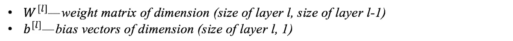
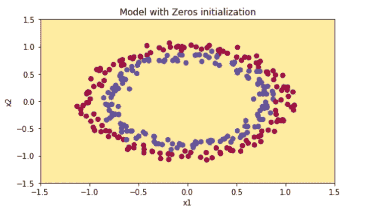
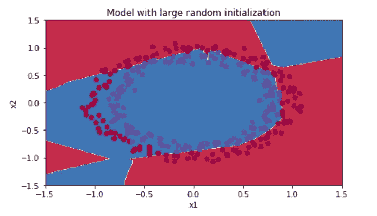
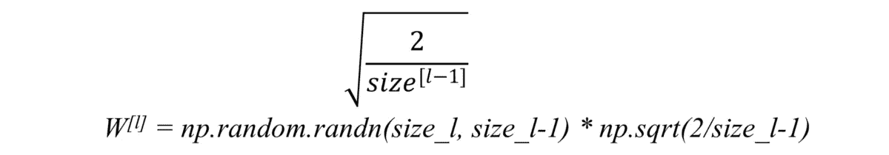
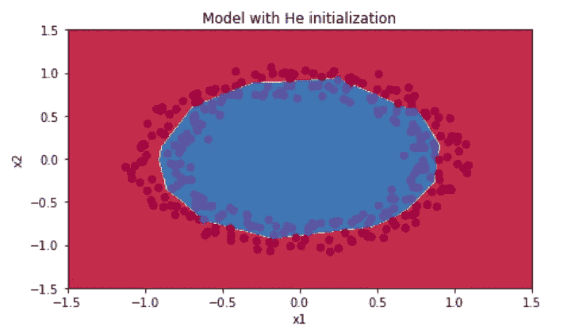
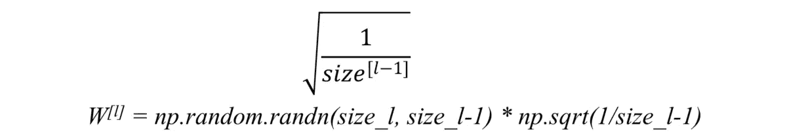
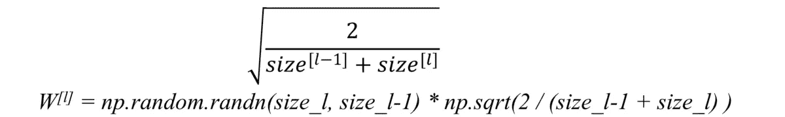

# 神经网络中的权重初始化技术

> 原文：<https://towardsdatascience.com/weight-initialization-techniques-in-neural-networks-26c649eb3b78?source=collection_archive---------0----------------------->

即使构建一个简单的神经网络也是一项令人困惑的任务，在此基础上调整它以获得更好的结果是极其乏味的。但是，在建立神经网络时要考虑的第一步是参数的初始化，如果做得正确，那么优化将在最少的时间内实现，否则使用梯度下降收敛到最小值将是不可能的。

本文假设读者已经熟悉神经网络的概念、权重、偏差、激活函数、前向和后向传播等。

## 基本符号

考虑一个 L 层神经网络，它有 L-1 个隐藏层和 1 个输入和输出层。层 l 的参数(权重和偏差)表示为

在这篇文章中，我们将看看一些基本的初始化方法，以及一些为了达到更好的效果而必须使用的改进技术。以下是初始化参数的一些常用技术:

*   **零点初始化**
*   **随机初始化**

## 零初始化:

在一般实践中，偏差用 0 初始化，权重用随机数初始化，如果权重用 0 初始化呢？

为了理解，让我们考虑对输出层应用 sigmoid 激活函数。

Sigmoid function ([https://towardsdatascience.com/derivative-of-the-sigmoid-function-536880cf918e](/derivative-of-the-sigmoid-function-536880cf918e))

如果所有权重被初始化为 0，则对于 W[l]中的每个 W，关于损失函数的导数是相同的，因此所有权重在后续迭代中具有相同的值。这使得隐藏单元对称，并持续所有 n 次迭代，即，将权重设置为 0 并不会使其优于线性模型。需要记住的一件重要事情是，用 0 初始化时，偏差没有任何影响。

`W[l] = np.random.zeros((l-1,l))`

让我们考虑一个只有三个隐藏层的神经网络，在隐藏层有 ReLu 激活函数，在输出层有 sigmoid。

在来自 sklearn.datasets 的数据集“make circles”上使用上述神经网络，获得如下结果:

对于 15000 次迭代，损失= 0.6931471805599453，准确度= 50 %

显然，零初始化在分类中是不成功的。

## 随机初始化:

为权重分配随机值比只分配 0 值要好。但有一点我要记住，如果权重被初始化为高值或非常低值会发生什么，什么是合理的权重值初始化。

**a)** 如果权重初始化为非常高的值，则项`np.dot(W,X)+b`变得显著更高，并且如果应用类似 sigmoid()的激活函数，则该函数将其值映射到 1 附近，其中梯度的斜率变化缓慢，并且学习需要大量时间。

**b)** 如果权重被初始化为低值，它将被映射为 0，情况同上。

这个问题通常被称为消失梯度。

为了看到这一点，让我们看看上面的例子，但是现在权重被初始化为非常大的值而不是 0:

`W[l] = np.random.randn(l-1,l)*10`

神经网络与前面的相同，使用来自 sklearn.datasets 的数据集“make circles”上的这种初始化，获得如下结果:

对于 15000 次迭代，损失= 0.38278397192120406，准确度= 86 %

这种解决方案更好，但不能完全满足需要，因此，让我们看看一种新技术。

## 新的初始化技术

正如我们在上面看到的，对于大的或 0 的权重(W)初始化，即使我们使用适当的权重初始化，也不会获得显著的结果，训练过程很可能将花费更长的时间。有一些与之相关的问题:

a)如果模型太大，需要花很多天来训练，那怎么办

b)消失/爆炸梯度问题怎么办

这些是多年来一直存在的一些问题，但在 2015 年，何等人(2015)提出了激活感知权重初始化(用于 ReLu)，能够解决这个问题。ReLu 和 leaky ReLu 还解决了渐变消失的问题。

**他初始化:**我们只是简单地将随机初始化与相乘

为了了解该解决方案的有效性，让我们使用之前的数据集和神经网络进行上述初始化，结果如下:

对于 15000 次迭代，损失=0.07357895962677366，准确度= 96 %

当然，这是对以前技术的改进。

除了正在使用的初始化之外，还有一些比旧技术相对更好并且经常使用的其他技术。

**Xavier 初始化:**与 He 初始化相同，但用于 tanh()激活函数，在该方法中 2 被 1 代替。

**有些人还使用以下技术进行初始化:**

这些方法是初始化的良好起点，减少了渐变爆炸或消失的机会。他们设定的权重既不会比 1 大太多，也不会比 1 小太多。因此，梯度不会消失或爆炸得太快。它们有助于避免缓慢收敛，也确保我们不会一直偏离最小值。存在上述的其他变体，其中主要目标也是最小化参数的方差。谢谢你。

来源:神经网络和深度学习，吴恩达(Coursera.org)。