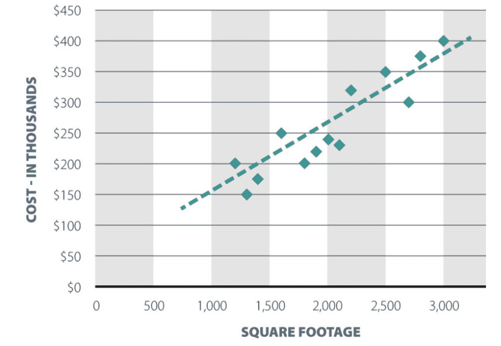

# 欢迎，机器学习

> 原文：<https://towardsdatascience.com/welcome-machine-learning-647b59c15ef5?source=collection_archive---------5----------------------->

Photo by [Sai Kiran Anagani](https://unsplash.com/photos/5Ntkpxqt54Y?utm_source=unsplash&utm_medium=referral&utm_content=creditCopyText) on [Unsplash](https://unsplash.com/search/photos/data?utm_source=unsplash&utm_medium=referral&utm_content=creditCopyText)

目前最受欢迎的主题之一是机器学习，尽管这并不是什么新鲜事。ML 背后的数学来自 80 年代！年复一年，算法变得越来越好，让我们离备受期待的人工智能更近了一步。

我开始探索它，我正在一点一点地学习什么是机器学习(什么不是)。当公司开始在人工智能的冰水中浸泡双脚时，有些问题总是困扰着他们，第一个问题是“这些麻烦值得吗？”

如果你还不确定人工智能的力量，建议你看看凯文·凯利的书《*必然——*[*塑造我们未来的 12 种技术力量*](https://www.amazon.com.br/Inevitable-Understanding-Technological-Forces-Future-ebook/dp/B016JPTOUG/ref=sr_1_1?s=books&ie=UTF8&qid=1511375988&sr=1-1&keywords=The+12+Technological+Forces+That+Will+Shape+Our+Future) 》。如果你没有太多的时间去读它，十二种力量中的第一种是人工智能，它足以播下好奇心的种子。

我说的不是试图将人类从地球表面消灭的嗜血机器人，而是非常具体(和专注)的应用。在我们的算法中加入自我意识只会让它们在完成设计任务时效率更低。我们不希望特斯拉遭遇生存危机而碰壁，对吗？

既然我们已经把“我，机器人”从等式中去掉了，下一个要解决的问题是数学。我们必须了解线性代数、微积分、微分方程和统计学吗？大多数博客说没有，但我认为一个诚实的答案比这要复杂一点。有一些图书馆可以为我们提供帮助，但是我们如何获得我们不了解的专业知识呢？我们甚至不知道它是如何工作的。懂得数学很重要，但也许只有在我们已经学会用自己的腿走路之后，它才是值得的。在不了解数学的情况下应用机器学习是可能的，但在某个点上改进算法需要对幕后发生的事情有更深入的了解。迟早，我们将不得不学习它。数学最终会降临到我们每个人身上。

重点是机器学习的先决条件不是数学而是知道[如何分析数据](http://sharpsightlabs.com/blog/start-with-data-visualization-manipulation/)。难怪如今最受欢迎的专业人士之一是数据科学家。如果数据结构不良或被误解，数学将无法保存您的工作，而使用数据完成的工作即使没有高等数学也能很好地完成。

算法会预测事情，但不会告诉我们那个预测的“为什么”。这个秘密隐藏在数据中，我们应该把大部分工作集中在数据上。

# 我可以用 ML 做什么？

要将 ML 应用到我们的产品中，我们必须了解它的能力。机器学习基本上是一个从数据中自动学习的程序。不要绝对地说出它需要做的一切，而是提供一些例子，让它自己学习。

是不是看起来太神秘了？它不是。到最后，都只是数学。以线性回归为例。有一个非常经典的例子，根据房子的平方英尺来预测房子的价值。如果我们从几个房子里得到数据，我们可以像这样在图上画点:

虚线是模型将学习的内容。它通过画一条线来概括问题，这条线可以根据点来调整自己，并使用这条线来进行预测。如果我们把 y 轴上的线下移，结果会有所改善吗？如果我们稍微倾斜一下呢？这是一个优化过程，算法将尝试降低错误率。

使用 ML 可以解决不同类型的问题:

*   回归:当我们想要找到一个数值，比如房子或机票的价格；
*   建议:当我们试图找到用户真正想要的东西。亚马逊或网飞推荐算法就是很好的例子；
*   分类:当我们试图找出事物的类型时。最著名的例子是电子邮件中的垃圾邮件过滤器，但我们可以建立，例如，一个判断汽车是否损坏的算法；
*   排名:这些结果中哪些是最相关的？当我们用谷歌搜索某样东西时，它就是这样做的；
*   异常检测:在我们的数据中寻找不寻常的东西；
*   聚类:谁买了这个也买了…

机器学习是一门庞大的综合性学科。我还有很多要学，但有一点是肯定的:我们所有的努力都应该集中在数据上。有了更好的数据，我们可以向我们的系统灌输智能，做出更好、更自信的预测。知道存储什么本身就是一个巨大的问题，将数据组织成尚不存在的模型似乎是一项艰巨的任务。

目前，我们要做的就是继续前进，看看机器学习会把我们引向何方。