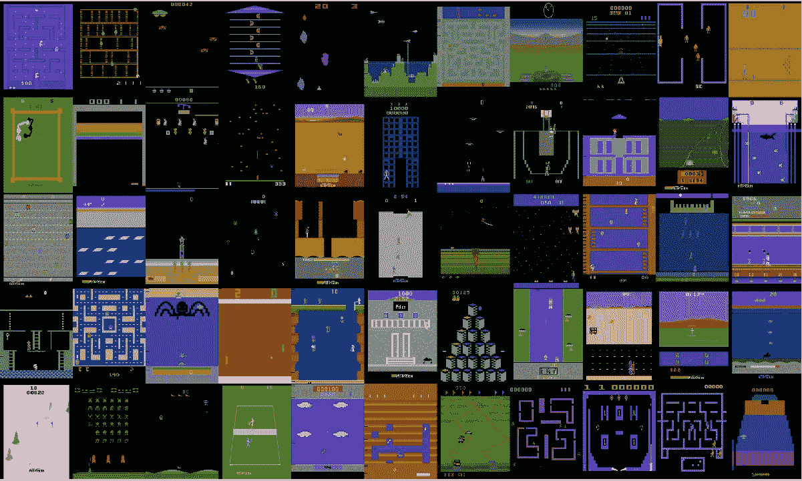
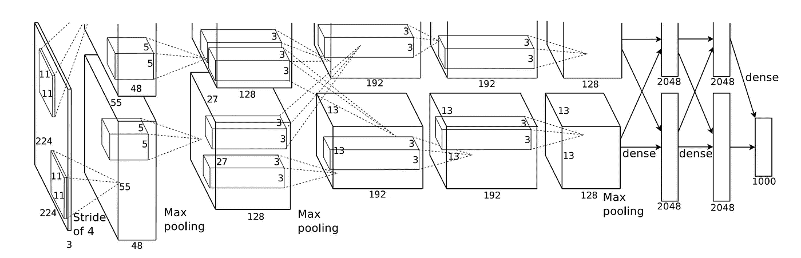
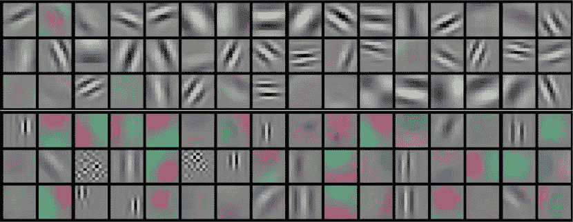
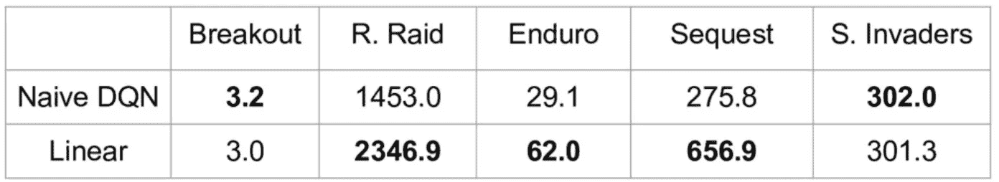
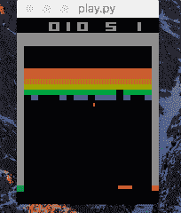
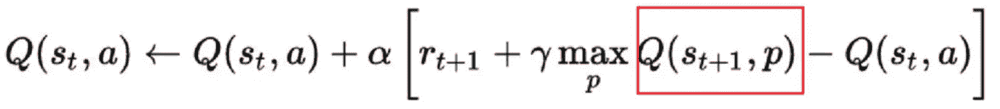
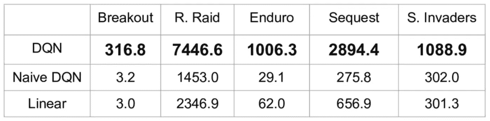
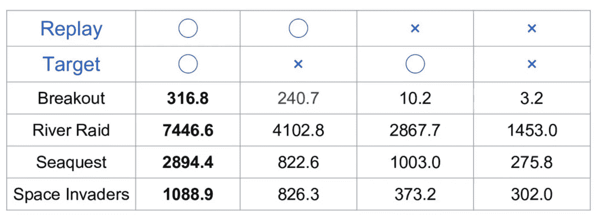

# 欢迎来到深度强化学习第一部分:DQN

> 原文：<https://towardsdatascience.com/welcome-to-deep-reinforcement-learning-part-1-dqn-c3cab4d41b6b?source=collection_archive---------0----------------------->

近年来，许多人工智能实验室正在致力于研究深度强化学习(DRL ),它有望成为未来的核心技术。我也在庆应义塾大学从事 DRL 研究。在接下来的几篇文章中，我将写下我对最近 DRL 的调查。所有这些都假设读者具备强化学习的基础知识。

在这篇文章中，我介绍了 DeepMind 提出的第一个深度强化学习方法——深度 Q 网络(DQN)。该论文于 2015 年在《自然》杂志上发表后，许多研究机构加入了这一领域，因为由于 DQN 使用的技术，深度神经网络可以让 RL 直接处理图像等高维状态。让我们看看 DQN 取得了多大的成就。

# 街机学习环境

[街机学习环境:总代理评估平台](https://arxiv.org/pdf/1207.4708.pdf)于 2013 年发布，提出了 AI 的学习环境。ALE 有很多游戏最初是为一款古典游戏主机 Atari 2600 设计的。大概是 Pong，SpaceInvaders，PacMan，Breakout 这些游戏中的一部分大家都非常了解。

Atari games available in ALE

这个模拟器的任务是提供一个平台，在这个平台上，AI 可以玩很多游戏，而不需要任何特定的功能设计。在 DQN 出版之前，RL 代理需要手工设计的功能作为输入。比如 RL 代理玩太空入侵者的时候，入侵者位置是显式提取的。但是这些信息在玩突围的时候完全没用。因此，代理商不能依赖这种功能来玩 ALE 中的所有游戏。

# 深度神经网络(DNN)

[AlexNet](https://papers.nips.cc/paper/4824-imagenet-classification-with-deep-convolutional-neural-networks.pdf) 利用 DNN 在 ILSVRC 2012 图像分类竞赛中取得了不可思议的成绩。

AlexNet

DNN 最伟大的事情是通过反向传播提取特征表示。

learned weights of a convolutional layer in AlexNet

由于这种能力，分类器不再需要手工设计的特征。经过适当的多次反向传播后，DNN 知道颜色或形状等哪些信息对完成任务很重要。

# 将 DNN 带入 RL

人们很自然地认为 DNN 使 RL 代理能够将图像与价值联系起来。然而事情并不容易。

Comparison between naive DQN and linear model (with DQN techniques) from Nature

朴素 DQN 具有 3 个卷积层和 2 个全连接层，以直接从图像估计 Q 值。另一方面，线性模型只有一个完全连接的层，一些学习技术将在下一节讨论。两个模型都以 Q 学习方式学习 Q 值。如上表所示，朴素 DQN 的结果非常差，甚至比线性模型还要差，因为 DNN 很容易在在线强化学习中过度拟合。

# 深度 Q 网络

在两篇论文中介绍了 DQN，2013 年在 NIPS 上[用深度强化学习玩雅达利](https://arxiv.org/pdf/1312.5602.pdf)，2015 年在 Nature 上[通过深度强化学习进行人类级别的控制](http://www.davidqiu.com:8888/research/nature14236.pdf)。有趣的是，在 2013 年至 2015 年期间，关于 DRN 的论文很少。我猜原因是人们不能在没有自然版本信息的情况下复制 DQN 实现。

DQN agent playing Breakout

DQN 主要通过四种技巧来克服不稳定学习。

*   **经历回放**
*   **目标网络**
*   **剪裁奖励**
*   **跳过帧**

我逐一解释每种技术。

# 体验回放

经验重放最初是在 1993 年的[使用神经网络的机器人强化学习](https://pdfs.semanticscholar.org/54c4/cf3a8168c1b70f91cf78a3dc98b671935492.pdf)中提出的。DNN 很容易过度适应当前的剧集。一旦 DNN 过度满足，就很难产生各种体验。为了解决这个问题，经验重放存储了包括状态转换、奖励和行动在内的经验，这些经验是执行 Q 学习的必要数据，并进行小批量更新神经网络。这种技术有以下优点。

*   降低更新 DNN 的经验之间的相关性
*   通过小批量提高学习速度
*   重用过去的转换以避免灾难性的遗忘

# 目标网络

在 TD 误差计算中，目标函数随 DNN 频繁变化。目标函数不稳定，训练困难。因此，目标网络技术确定目标函数的参数，并且每隔数千步用最新的网络替换它们。

target Q function in the red rectangular is fixed

# 剪裁奖励

每个游戏都有不同的分数尺度。例如，在乒乓球比赛中，玩家赢得比赛可以得到 1 分。否则，玩家得到-1 点。但在《太空入侵者》中，玩家击败入侵者获得 10~30 分。这种差异会使训练不稳定。因此，修剪奖励技术修剪分数，所有积极的奖励设置为+1，所有消极的奖励设置为-1。

# 跳过帧

ALE 每秒能够渲染 60 幅图像。但实际上人们不会在一秒钟内采取这么多行动。AI 不需要计算每一帧的 Q 值。因此，跳帧技术是 DQN 每 4 帧计算 Q 值，并使用过去的 4 帧作为输入。这样降低了计算成本，积累了更多的经验。

# 表演

所有上述技术使 DQN 能够实现稳定的训练。

DQN overwhelms naive DQN

在 Nature 版本中，它显示了经验重放和目标网络对稳定性的贡献有多大。

Performance with and without Experience Replay and Target Network

经验回放在 DQN 非常重要。目标网络也提高了其性能。

# 结论

DQN 已经用以上 4 种技术在很多雅达利游戏中实现了人类水平的控制。然而，仍然有一些游戏 DQN 不能玩。在这个系列中，我将介绍与它们斗争的论文。

接下来，我提供 DQN 的 TensorFlow 实现。

*   欢迎学习深度强化学习第二部分:张量流中的 DQN(即将推出)