# 应用描述告诉我们什么:Python 中的文本数据预处理

> 原文：<https://towardsdatascience.com/what-app-descriptions-tell-us-text-data-preprocessing-in-python-afc7ed88360d?source=collection_archive---------5----------------------->

## 将 NLP 应用于 App Store 上的应用描述

继续讨论数据清理和探索的主题，许多有效的 NLP 分析都依赖于文本数据的预处理。因此，我决定对来自 Apple Appstore 描述的一些文本数据和结果文本的 K-Means 聚类进行逐步预处理。

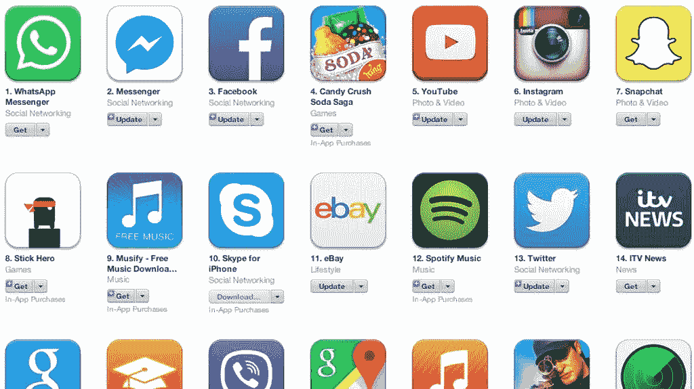

为什么是 Appstore？来自 kaggle 的这个数据集包含 7197 个应用及其各自的应用描述。应用描述是应用创建者尽力“推销”他们的应用的地方。利用预处理后的数据，我检验了“应用描述是应用类型的良好预测者吗？”。

我在这里使用的预处理“框架”如下:

1.  翻译*
2.  删除非字母字符
3.  全部转换为小写
4.  标记化
5.  删除停用词
6.  词干**
7.  分析

**我想先翻译所有的描述，因为非字母字符的正则表达式会删除像日语和中文这样的语言。*

***在这个特殊的例子中，我已经省略了词汇化，因为我想以后再看词汇多样性。*

像往常一样，我们从读入包含相关数据的 csv 文件开始。这里，我们将具有基本应用信息的数据帧与具有应用描述的另一个数据帧合并。

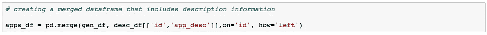

因为特性变量的数据类型很大程度上是合适的，所以让我们快速看一下底层数据。

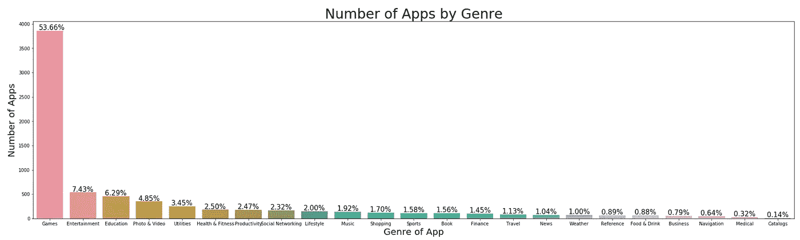

不出所料，App Store 上的大多数应用都是游戏，占数据集的 54%左右。接下来最具代表性的类型是“娱乐”和“教育”，远远落后于 7%和 6%左右。

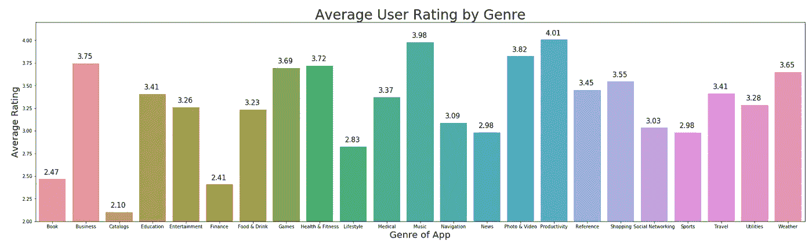

平均而言，评分最高的类型是“生产力”和“音乐”。有趣的是，到目前为止,“目录”、“金融”和“书籍”是应用商店中评分最低的应用。

# 预处理过程

## 1 翻译成英语

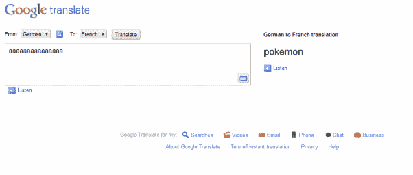

预处理从将所有应用程序描述翻译成英语开始。这里，我们使用 [googletrans](https://pypi.org/project/googletrans/) 包对 Google Translate 进行 API 调用。不幸的是，这个 API 调用有 15k 字符的限制。虽然这不是最好的解决方案，但我们可以通过为数据帧中的每一行重新初始化转换器来解决这一限制。

为了防止在语言已经是英语时进行 API 调用的不必要操作，我们可以使用 [langdetect](https://pypi.org/project/langdetect/) 包进行条件检查，并且只在语言不是“en”时进行 API 调用。

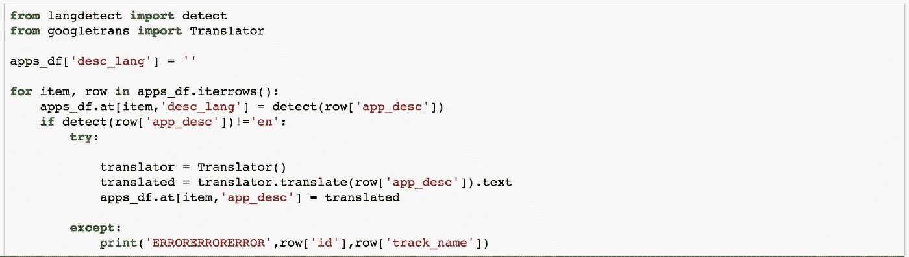

有 46 个应用程序的描述返回了错误调用。虽然长度对一些人来说是个问题，但对另一些人来说却无法确定错误。由于这是数据集的一小部分，我们可以放弃这些应用程序。

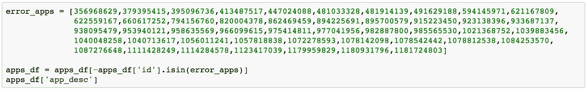

## 2 删除非字母字符

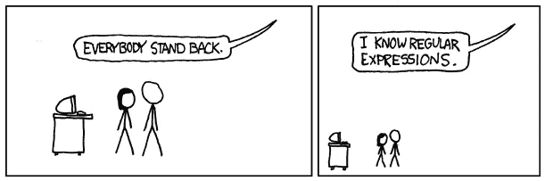

既然我们已经确定诸如日语或汉语这样的语言不会被正则表达式过滤，我们就创建一个表达式[^a-zA-Z ]来返回所有的字母字符和空格。在 helper 函数 cleaned()中使用 re.sub()方法删除其他任何内容。保留空格，以便在进行标记化时，字符串可以被空格分割。

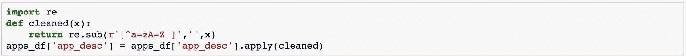

## 3 转换为小写

规范化文本数据的另一个步骤是将所有字符转换成小写字母。这与在 dataframe 的目标列上运行 str.lower()一样简单。

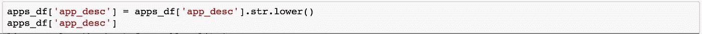

## 4，5，6 标记化、删除停用词和词干

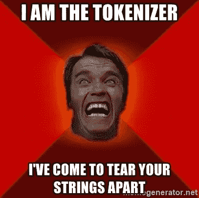

由于接下来的 3 个步骤是通过 [nltk](https://www.nltk.org/) 包实现的，所以我为它们创建了一个聚合助手函数。

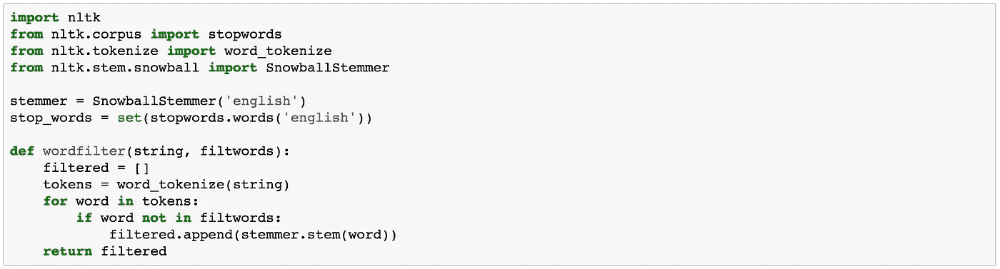

标记化是指将一个长字符串分割成更小的块或标记。这非常类似于在字符串上运行 split 函数，根据定义的分隔符返回单个组件的列表。我们在这里用 nltk 包中的 word_tokenize 来标记字符串。

停用词是被过滤掉的词，因为它们对文本的整体意义没有太大贡献。这些词包括“a”、“to”、“and”等。我们通过 nltk 包中的 stopwords.words('english ')找到英语的一组停用词。

词干是指从一个单词中去掉词缀。比如‘爬’就变成了‘爬’。我们在 nltk 包中用 SnowballStemmer('english ')初始化一个词干分析器。

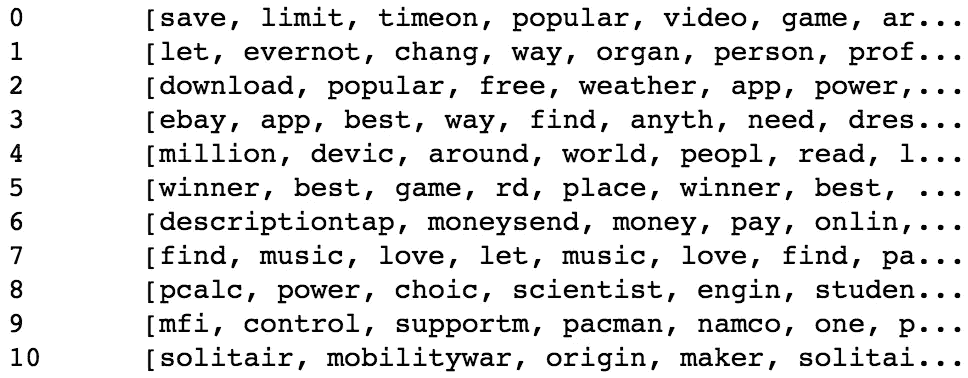

Example of sanitized output

下面的 helper 函数将首先对字符串进行标记。然后，它检查每个标记是否是停用词。最后，如果这个词不是停用词，它就运行词干分析器，并将这个词附加到一个列表中。

## 7 分析

现在让我们深入研究一下经过清理的数据。

## 7.1 字云生成

在特定类型的应用中，最常用的词是什么？虽然简单的单词计数或 tfidf 矢量器会返回单词的排名，但也许顶部的单词可以更有效地在单词云中可视化。

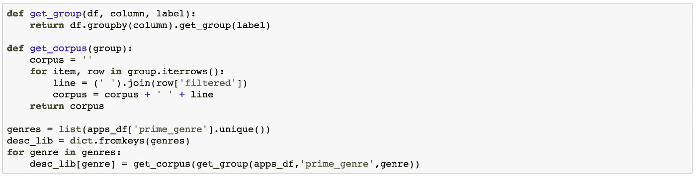

为了给每种类型生成一个词云，我为每种类型创建了一个净化应用程序描述的语料库(或集合)。幸运的是，有一个 wordcloud 包可以方便地从给定的语料库中生成 word cloud。

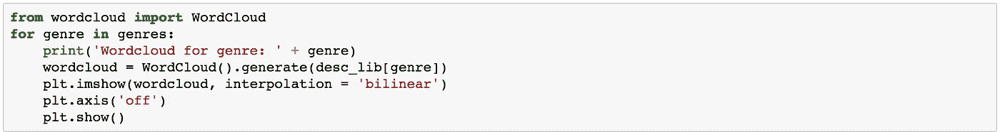

[wordcloud](https://github.com/amueller/word_cloud) 包的工作原理是为一个语料库创建一个前 200 个单词的列表，并为每个单词创建一个附带的标准化单词计数列表。然后使用 Python 图像库来绘制单词云。这个总结并没有公平对待他的代码，你可以在这里[阅读更多。](http://peekaboo-vision.blogspot.com/2012/11/a-wordcloud-in-python.html)

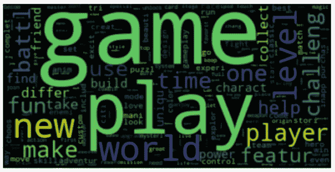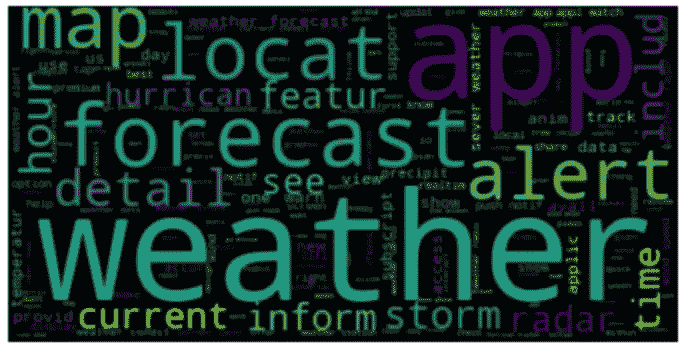

Wordclouds for games and weather apps

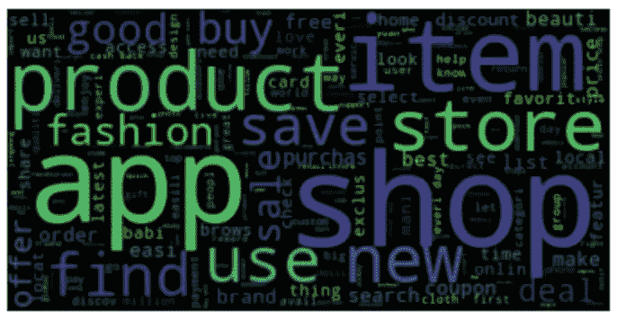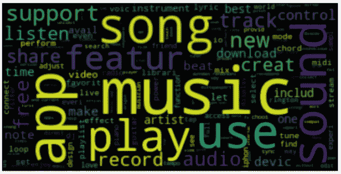

Wordclouds for shopping and music apps

以“游戏”、“天气”、“购物”和“音乐”的词云为例，我们看到最突出的词确实是我们对特定类型的预期。虽然这些流派的区别似乎很明显，但对其他流派来说就有点模糊了，这一点我们将在聚类时再讨论。

## 7.2 词汇多样性

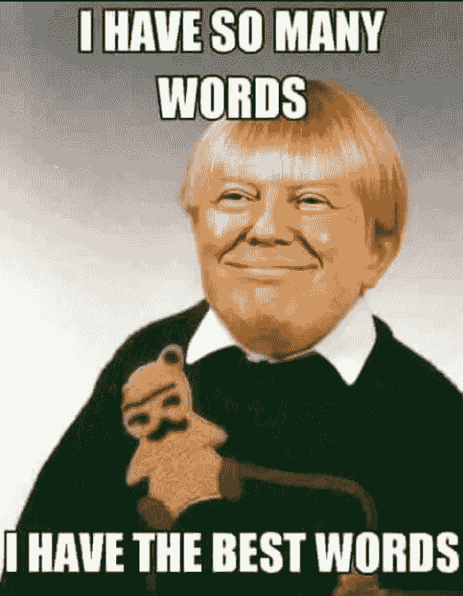

像‘游戏’这样的不同体裁，自然会产生更丰富多彩的语言和描述吗？我试图通过使用一个简单的公式来确定词汇多样性来回答这个问题。我取了每个过滤单词列表中唯一单词的数量，并除以该描述的总单词数。数字越大，使用的词汇就越多样化。

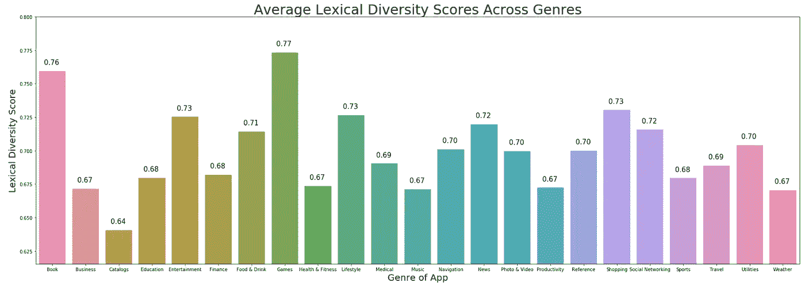

正如所料，“游戏”和“书籍”的平均词汇多样性得分最高。这可能是由于这两种类型的子类型的多样性，以及这种描述更“吸引人”的趋势。

目录的描述毫无疑问是枯燥的。

## 7.3 情感分析

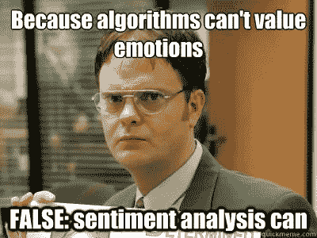

是不是有些流派的 app 描述比其他流派的更正面？我决定通过在 [Textblob](https://textblob.readthedocs.io/en/dev/) 包中运行情感分析来描绘这个画面。

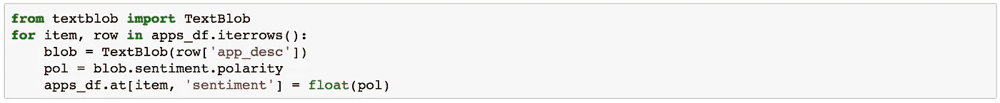

情绪极性 0 表示中性情绪，极性低于 0 表示消极情绪，极性高于 0 表示(你猜对了)积极情绪。

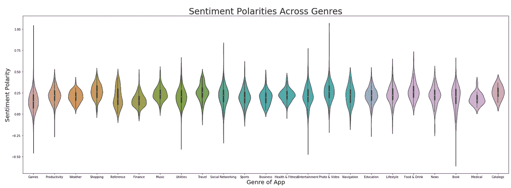

“游戏”、“金融”和“医疗”类别的平均情绪极性最低。如果游戏包含令人苦恼的主题，如战争或恐怖(这些主题被很好地表现出来)，那么“游戏”可能具有非常低的情感极性。“金融”和“医疗”的描述可能较低，因为应用程序可能正在描述不利的金融或医疗状况。

似乎有一些催人泪下的人(约翰·格林)弥补了书籍的离群值。提到“捕捉快乐时光”似乎弥补了“照片和视频”应用的异常值。

## 7.4 K 均值聚类

现在回到我们开始时试图回答的问题，“应用程序描述是应用程序类型的良好预测者吗？”。

为了回答这个问题，我在单词向量上应用 K-means 聚类，看看它们如何映射到实际的类别。

当我们用 10 个聚类运行聚类时，结果聚类中的前 10 个单词如下:

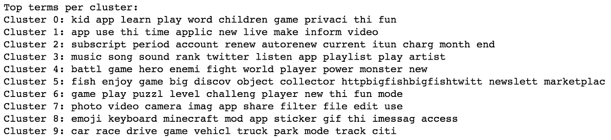

乍看起来，一些集群可以被标记为:

集群 0:儿童应用

集群 3:音乐应用

集群 4:涉及战争/战斗/怪物的游戏

第六组:益智游戏

集群 7:照片和视频应用

集群 9:汽车相关应用

那么这些集群如何映射到实际的应用类型呢？

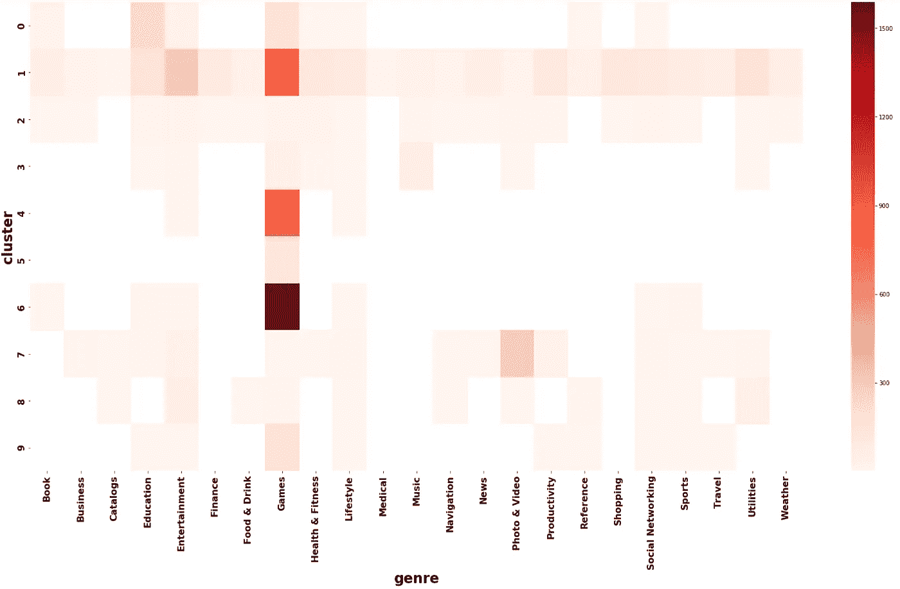

上面的标签似乎在很大程度上具有代表性，但似乎有一个问题是游戏在样本中的代表性过高。其他类别的阴影太淡，无法获得任何有意义的见解。同样的热图在没有“游戏”类应用的情况下再次出现。

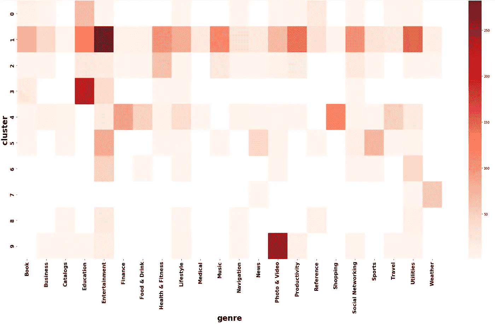

没有了“游戏”这种被大量代表的类型，其他类型的代表深度现在被更清楚地确定了。一些明显的群是群 3“教育”，群 4“金融”和“购物”，群 7“天气”，群 9“照片和视频”。

如果我们将集群的数量增加到接近流派总数(22 个，不包括游戏)会怎么样？

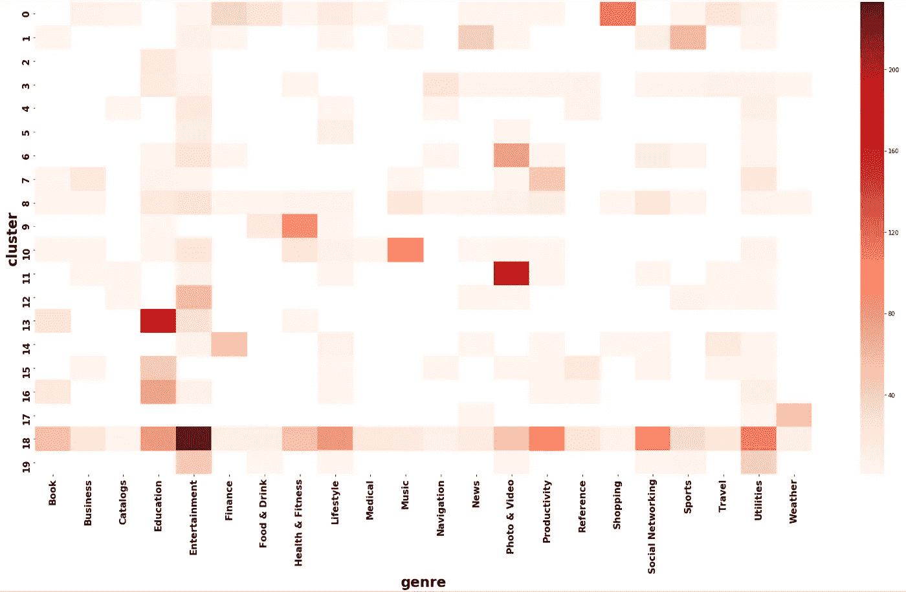

让我们也将这些映射与每个聚类中的顶级单词进行交叉比较:

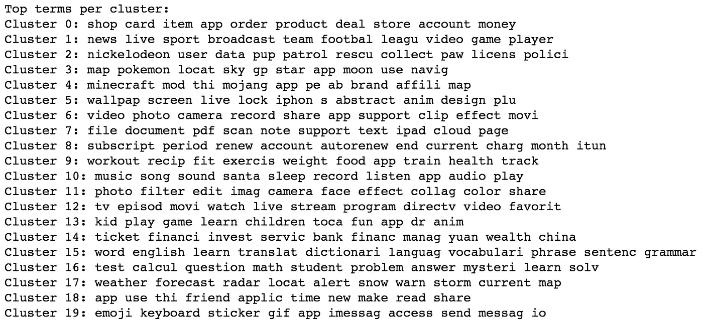

有 20 个集群，定义明确的集群如下:

集群 0:购物

第 9 组:健康与健身

第 10 组:音乐

第 11 组:照片和视频

第 13 组:教育

第 14 组:金融

第 17 组:天气

为什么只有三分之一的体裁被聚类很好地代表，有各种各样的原因，其中两个最明显的原因是样本大小不平衡和跨体裁的单词重叠。

## 不平衡的样本量

正如在最初的 EDA 中所看到的，大约 54%的应用是游戏。即使去掉了游戏，很大一部分仍然是“教育”和“娱乐”应用。

All the games.

在所有流派中选择一个恒定的样本量是很有趣的，但这需要更大的样本总量。

## 单词重叠

尽管样本量很小，但“天气”应用还是被集群 17 很好地识别出来。有争议的是，被聚类很好地识别的流派是那些具有独特命名的流派。

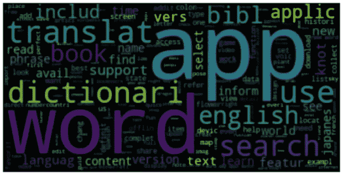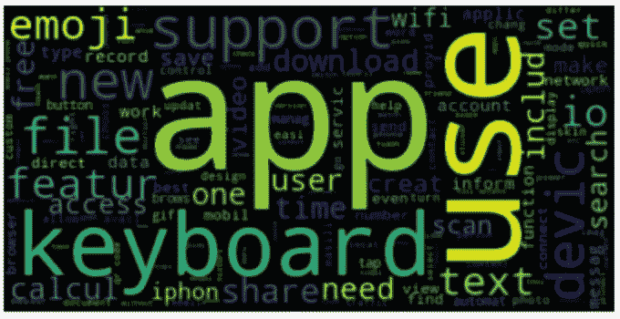

Wordclouds for utilities and reference apps

看看像“实用工具”和“参考”这样的体裁的词云，它们包含的词在其他多种体裁中也有很好的表现。

也许可以跨所有流派形成流行标记的列表，并从当前净化的字符串中过滤掉。尽管如此，像“生产力”和“公用事业”这样的类型可能仍然会重叠，不会完美地聚集在一起。

我当然希望在修复了这个 NLP 分析的一些问题后，创建一个模型，不仅仅考虑应用程序描述来预测应用程序类型。

我也一直在尝试从每种类型中产生应用描述。以下是“体育”类型的几个例子:

Not great as you can tell ¯\_(ツ)_/¯

感谢阅读，代码可在[这里](https://github.com/finnqiao/apple_appstore)找到！