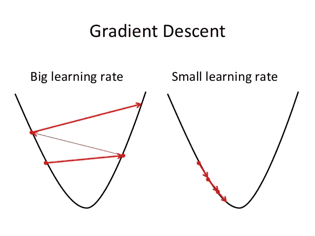

# 什么是超参数？以及如何调整深度神经网络中的超参数？

> 原文：<https://towardsdatascience.com/what-are-hyperparameters-and-how-to-tune-the-hyperparameters-in-a-deep-neural-network-d0604917584a?source=collection_archive---------0----------------------->

什么是**超参数**？

**超参数**是决定网络结构的**变量(例如:隐藏单元的数量)和决定网络如何训练的**变量**(例如:学习率)。**

**超参数**是在训练之前**设定的(在优化权重和偏差之前)。**

# **与网络结构相关的超参数**

## 隐藏层和单元的数量

隐藏层是输入层和输出层之间的层。

*“很简单。只要不断增加层，直到测试误差不再改善。”*

使用正则化技术的图层中的许多隐藏单元可以提高精度。单元数量较少可能会导致**装配不足**。

## 拒绝传统社会的人

Random neurons are cancelled

Dropout 是一种正则化技术，用于避免过拟合(提高验证精度)，从而提高泛化能力。

*   通常，使用 20%-50%的神经元的小丢弃值，其中 20%提供了一个好的起点。过低的概率影响最小，过高的值导致网络学习不足。
*   使用更大的网络。当在更大的网络上使用 dropout 时，您可能会获得更好的性能，从而为模型提供更多学习独立表示的机会。

## 网络权重初始化

理想地，根据在每层上使用的激活函数，使用不同的权重初始化方案可能更好。

大多使用**均匀分布**。

## **激活功能**

Sigmoid activation function

激活函数用于**向模型引入非线性**，这允许深度学习模型学习非线性预测边界。

一般来说，**整流器激活功能**最受欢迎。

**在进行**二进制预测时，在输出层使用 Sigmoid** 。** **Softmax** 用于输出层，同时进行**多类预测。**

# **与训练算法相关的超参数**

## **学习率**

Learning rate

学习率定义了网络更新其参数的速度。

**学习率低**减缓学习过程但平滑收敛。**较大的学习速率**加速学习但可能不收敛。

通常一个**衰减学习率**是首选。

## **气势**

动量有助于用前几步的知识知道下一步的方向。它有助于防止振荡。动量的典型选择在 0.5 到 0.9 之间。

## 时代数

epochs number 是训练时整个训练数据显示给网络的次数。

增加历元数，直到验证精度开始下降，即使训练精度在增加(过拟合)。

## 批量

最小批量是参数更新发生后给网络的子样本数。

批量大小的一个好的默认值可能是 32。也试试 32，64，128，256 等等。

# **找出超参数的方法**

1.  *手动搜索*
2.  *网格搜索*[(http://machinelingmastery . com/Grid-Search-hyperparameters-deep-learning-models-python-keras/](http://machinelearningmastery.com/grid-search-hyperparameters-deep-learning-models-python-keras/))
3.  *随机搜索*
4.  *贝叶斯优化*