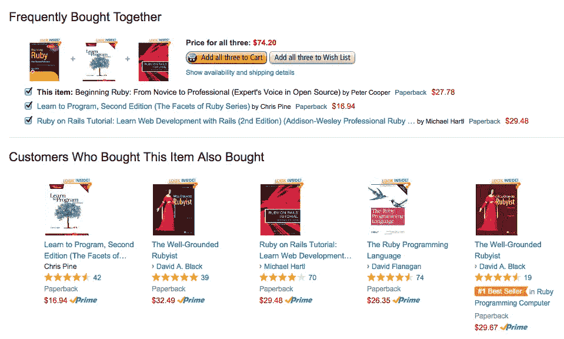
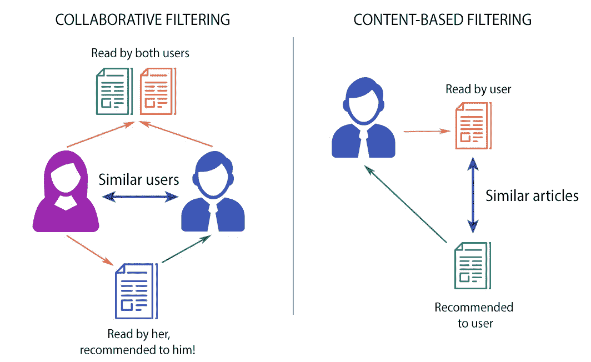
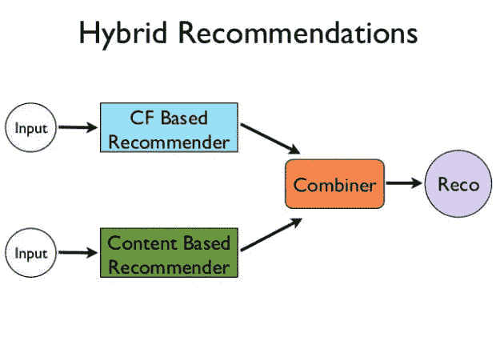

# 什么是产品推荐引擎？以及它们的各种版本？

> 原文：<https://towardsdatascience.com/what-are-product-recommendation-engines-and-the-various-versions-of-them-9dcab4ee26d5?source=collection_archive---------0----------------------->

Ref - [http://www.emailvendorselection.com/recommendation-engines-for-email-marketing/](http://www.emailvendorselection.com/recommendation-engines-for-email-marketing/)

# 什么是产品推荐？

产品推荐基本上是一个过滤系统，它试图预测和显示用户想要购买的商品。它可能不完全准确，但如果它向你展示了你喜欢的东西，那么它就做对了。

[推荐系统](https://en.wikipedia.org/wiki/Recommender_system)近年来变得越来越流行，并且被用于各种领域，包括电影、音乐、新闻、书籍、研究文章、搜索查询、社交标签和一般产品。大多数用于数字领域，今天的大多数电子商务网站，如易贝、亚马逊、阿里巴巴等，利用其专有的推荐算法，以便更好地为客户提供他们肯定会喜欢的产品。[还有很多好处](https://www.marutitech.com/recommendation-engine-benefits/)，我们将在接下来的博客中介绍。

如果设置和配置得当，它可以显著提高收入、点击率、转化率和其他重要指标。此外，它们还可以对用户体验产生积极影响，这转化为更难衡量但对在线业务非常重要的指标，如客户满意度和保留率。

所有这些都只能通过推荐引擎来实现。推荐引擎基本上是数据过滤工具，它利用算法和数据向特定用户推荐最相关的项目。或者简单地说，他们只不过是“商店柜台伙计”的自动化形式。你向他要一个产品。他不仅展示了那个产品，还展示了你可以购买的相关产品。他们在交叉销售和追加销售方面训练有素。

随着互联网上信息量的增长和用户数量的显著增加，公司根据他们的偏好和口味搜索、绘制并向他们提供相关信息变得越来越重要。[聊天机器人也在做同样的工作](https://www.marutitech.com/what-chatbots-can-do-for-e-commerce-industry/)，但是它们更聪明并且从用户查看或购买的每个产品中学习。

让我们考虑一个例子来更好地理解推荐引擎的概念。如果我没看错的话，你们几乎所有人肯定都用过亚马逊购物。如你所知，[亚马逊网站 35%的收入来自其推荐引擎](http://www.mckinsey.com/industries/retail/our-insights/how-retailers-can-keep-up-with-consumers)。那么他们的策略是什么？

*Reference: Amazon*

亚马逊在电子邮件活动和大部分网站页面上使用推荐作为有针对性的营销工具。亚马逊会根据你浏览的内容推荐不同类别的产品，并将你可能购买的产品放在你面前。比如产品页面底部的“经常一起购买”选项，吸引你购买套餐。这一建议有一个主要目标:提高平均订单价值，即通过根据顾客购物车中的商品或他们目前正在现场查看的商品提供产品建议来追加销售和交叉销售顾客。

[亚马逊利用用户的浏览历史](http://rejoiner.com/resources/amazon-recommendations-secret-selling-online/)来让这些产品始终留在顾客的眼中。它使用客户的评级和评论来显示推荐和最畅销选项中平均得分较高的产品。亚马逊想让你买一个包，而不是一个产品。比如你买了一部手机，它会推荐你买一个保护套或者一个屏幕保护套。它将进一步使用来自引擎的建议来发送电子邮件，并让您了解产品/类别的当前趋势。

# 有哪些不同类型的推荐？

基本上有三种重要的推荐引擎[:](https://www.marutitech.com/recommendation-engine-benefits/)

*   协同过滤
*   基于内容的过滤
*   混合推荐系统

# 协作过滤:

这种过滤方法通常基于收集和分析关于用户的行为、活动或偏好的信息，并基于与其他用户的相似性来预测他们会喜欢什么。协同过滤方法的一个关键优点是它不依赖于机器可分析的内容，因此它能够准确地推荐诸如电影之类的复杂项目，而不需要“理解”项目本身。协同过滤基于这样的假设，即过去同意的人将来也会同意，并且他们会像过去一样喜欢相似种类的项目。例如，如果一个人 A 喜欢项目 1、2、3，而 B 喜欢项目 2、3、4，那么他们有相似的兴趣，A 应该喜欢项目 4，B 应该喜欢项目 1。

此外，有几种类型的协同过滤算法:

*   **用户-用户协同过滤:**在这里，我们试图搜索长相相似的顾客，并根据他/她的长相相似者的选择提供产品。这种算法非常有效，但需要大量的时间和资源。这种类型的过滤需要计算每个客户对信息，这需要时间。因此，对于大型基础平台，这种算法很难实施。
*   **项目-项目协同过滤:**它与前面的算法非常相似，但我们不是寻找看起来相似的客户，而是尝试寻找看起来相似的项目。一旦我们有了商品外观相似矩阵，我们就可以很容易地向从商店购买了任何商品的顾客推荐相似的商品。这种算法比用户-用户协同过滤需要更少的资源。因此，对于一个新客户，该算法比用户-用户协作花费的时间少得多，因为我们不需要客户之间的所有相似性得分。亚马逊在其推荐引擎中使用这种方法来显示促进销售的相关产品。
*   **其他更简单的算法:**还有像购物篮分析这样的其他方法，它们通常没有上述算法那样高的预测能力。

# 基于内容的过滤:

这些过滤方法基于项目的描述和用户偏好选择的简档。在基于内容的推荐系统中，关键字用于描述项目；此外，还建立了一个用户简档来说明该用户喜欢的项目类型。换句话说，算法试图推荐与用户过去喜欢的产品相似的产品。基于内容过滤的理念是，如果你喜欢一个项目，你也会喜欢一个“相似”的项目。例如，当我们推荐同一种类的项目时，如电影或歌曲推荐。这种方法源于信息检索和信息过滤研究。

基于内容的过滤的一个主要问题是系统是否能够从用户关于一个内容源的动作中学习用户偏好，并在其他不同的内容类型中复制它们。当系统被限制为推荐与用户已经在使用的内容类型相同的内容时，当可以推荐来自其他服务的其他内容类型时，来自推荐系统的价值明显较小。例如，基于新闻浏览推荐新闻文章是有用的，但是当基于新闻浏览推荐来自不同服务的音乐、视频时，不是更有用吗？

# 混合推荐系统:

[最近的研究表明](http://dataconomy.com/2015/03/an-introduction-to-recommendation-engines/)将协作和基于内容的推荐结合起来会更有效。混合方法可以通过分别进行基于内容和基于协作的预测，然后将它们结合起来来实现。此外，将基于内容的能力添加到基于协作的方法中，反之亦然；或者将这些方法统一到一个模型中。

一些研究集中于将混合方法的性能与纯协作和基于内容的方法进行比较，并证明混合方法可以提供比纯方法更准确的推荐。这种方法可以用来克服推荐系统中的常见问题，例如冷启动和数据缺乏问题。

网飞是使用混合推荐系统的一个很好的例子。该网站通过比较相似用户的观看和搜索习惯(即协同过滤)以及通过提供与用户评价高的电影具有共同特征的电影(基于内容的过滤)来进行推荐。

*Reference:* [*http://dataconomy.com/2015/03/an-introduction-to-recommendation-engines/*](http://dataconomy.com/2015/03/an-introduction-to-recommendation-engines/)

**总之，**在[类型的产品推荐引擎](https://www.marutitech.com/recommendation-engine-benefits/)上可以做出很多技术性的解释。用户或买家最关心的是产品和引擎给出的推荐质量。[这样的认知计算方法](https://www.marutitech.com/cognitive-computing-features-scope/)可以让你的推荐人的质量更上一层楼。