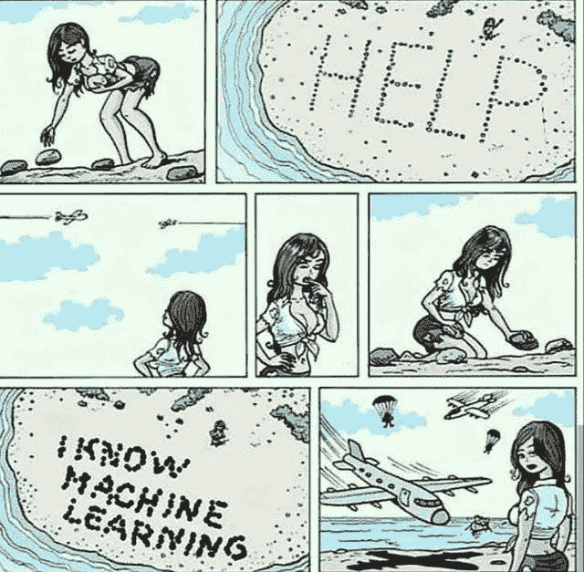
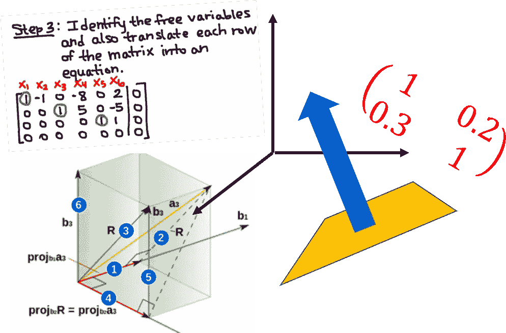

# 有哪些‘高级’的 AI 和机器学习在线课程？

> 原文：<https://towardsdatascience.com/what-are-some-advanced-ai-and-machine-learning-online-courses-8609ab281450?source=collection_archive---------1----------------------->

## 你在哪里可以找到不那么常见，但高质量的‘高级’机器学习和人工智能在线课程(免费)？

# 为什么是这篇文章？

机器学习是热门且有需求的。

但问题就在这里。

许多年轻的专业人士已经开始了他们的数据科学和机器学习之旅，他们面临着一个共同的问题——他们已经完成了一两门基本的在线课程，完成了一些编程课程，在 Github 上建立了几个项目，然后……然后呢？

> **学什么？哪里可以找到集中的资源？基础掌握之后去哪里找稍微高级一点的课程？**

在我之前的一篇关于媒体的文章(由 [TDS 团队](https://medium.com/u/7e12c71dfa81?source=post_page-----8609ab281450--------------------------------)发表)中，我详细讨论了**，在那里你可以找到 MOOC(大规模开放在线课程)来启动你进入数据科学和机器学习的旅程**。那篇文章假设读者是初学者，并涵盖了基本的 MOOCs，这些 MOOCs 针对基础和中级学习进行了优化。你可以在这里找到那个，

 [## 机器学习和数据科学如何选择有效的 MOOCs？

### 给渴望学习并为数据科学/机器学习做出贡献的非 CS 领域专业人士的建议。策划自…

towardsdatascience.com](/how-to-choose-effective-moocs-for-machine-learning-and-data-science-8681700ed83f) 

我写了另一篇详细的文章，专门关注数据科学和机器学习需要掌握的数学概念以及学习哪些课程的主题。你可以在这里找到那个，

 [## 数据科学的基本数学——“为什么”和“如何”

### 数学是科学的基础。我们讨论了成为更好的数据科学家需要掌握的基本数学主题…

towardsdatascience.com](/essential-math-for-data-science-why-and-how-e88271367fbd) 

最近，我在个人邮箱和 LinkedIn 收件箱里收到了很多信息，大多来自聪明、年轻的专业人士，询问类似的问题和我对在线课程的建议。

对于这些信息，我大多都有现成的答案。我只是给他们发了一个我的文章列表(依次包含了来自 KDnuggets 或 [Team AV](https://medium.com/u/c7c686fcd4b?source=post_page-----8609ab281450--------------------------------) 的其他高引用文章的链接和参考)。大多数情况下，我都会收到满意的回复:-)

然而，自从写了这些文章，我个人参加了一些人工智能和机器学习(ML)的“高级”课程，看到了一些讨论和评论，自然觉得有必要更新这些参考资料。

> 经过一番思考后，我决定最好留下原来的文章，因为它们确实迎合了初学者的需要，也很好地满足了许多读者的需求，并尝试编写一份新的在线课程列表。

这就是这篇文章的内容。

# 我所说的“高级”水平课程是什么意思？

“高级”是一个相对的术语。最好有一个基线来解释这个上下文中的单词。幸运的是，说到 ML 在线 MOOC，我们几乎有了一个黄金标准——教授[吴恩达](https://medium.com/u/592ce2a67248?source=post_page-----8609ab281450--------------------------------)的 [Coursera 课程](https://www.coursera.org/learn/machine-learning)(原版的，不是 [Deeplearning.ai 专精](https://www.deeplearning.ai/deep-learning-specialization/))。

因此，在本文中，我所说的“高级”是指两个特征，这两个特征需要在将要讨论的课程中出现(不一定同时出现),

*   比上述课程更广泛，即涵盖更高级和更多样化的主题
*   与人工智能或 ML 相关的高度专业化的焦点

我希望我能说明，我的意图并不是说吴教授的课程是初级课程。这仍然是你所能要求的对机器学习世界的最好介绍——尤其是对初学者而言。但是，在你完成那门课程后，做一些编程，对数学概念感到舒适，你应该建立在你的基础上，学习不同的主题。

我只是希望这篇文章能通过列出一些专注于此的免费 mooc 来帮助你做到这一点。

# 选课的唯一重点是什么？

人工智能和人工智能是热门话题，涵盖这些主题的免费在线课程并不缺乏。尽管如此，我发现真正高质量的人工智能课程少得惊人。

是的，我就在那个阵营里，这个阵营坚信[深度学习不是人工智能](https://subscription.packtpub.com/book/big_data_and_business_intelligence/9781788992893/1/ch01lvl1sec13/some-common-myths-about-deep-learning)，因此拒绝任何课程的概念，标题里有“AI”这个词，但只涵盖 Python 中的深度学习框架，被归类为 AI 课程。

因此，为了将我的列表限制在有限数量的高质量课程上，我列出了一些简单的基本规则或过滤器。

*   我倾向于**避免任何重点放在特定编程框架**/工具上的课程，也就是说，没有像“Python 的机器学习……”这样的课程(一些例子或代码片段是可以的)
*   按照同样的逻辑，这份名单将有一些课程**非常强调理论基础**——这主要有利于大学课程，而不是由个体企业家或公司(如 fast.ai、谷歌、微软、IBM 等)提供的课程。)
*   类似地，我也加入了 Udacity 的课程，这些课程是由大学教师或知名研究人员教授的，比如巴斯蒂安·特龙或彼得·诺维格。我没有包括他们的纳米学位参考文献，我不认为这有助于提高智力。
*   我提出了两个对真正的人工智能学习非常重要但受到较少关注的主题— [**强化学习**](https://medium.freecodecamp.org/an-introduction-to-reinforcement-learning-4339519de419) 和 [**博弈论**](/what-data-scientists-should-know-about-game-theory-types-of-games-2ecc616ea725) 。
*   **没有主要侧重于数据科学/数据工程/数字分析/应用统计的课程**。在当今世界，它们都是非常重要的学习主题，但为了这篇文章，我更愿意将它们与我对纯机器学习和人工智能的关注完全分开。

我相信这种关注将会自动地将列表导向高质量的人工智能和人工智能的基础课程，这将有利于中级到高级的学习者。

毕竟，你将是法官。

就我个人而言，我并没有修完所有的课程，尽管我已经完成了其中很大一部分。所以，我尽量让我对课程的评论简洁而真实。

# 链接和参考

没有进一步的拖延，这是清单。

## 通用机器学习和深度学习

这些课程涵盖了一般的 ML 和 DL 主题。

Source: [https://www.jeremyjordan.me/support-vector-machines/](https://www.jeremyjordan.me/support-vector-machines/)

*   [**乔治亚理工学院的“*机器学习”*关于 Udacity**](https://in.udacity.com/course/machine-learning--ud262) 的课程:这是最全面的 ML 课程之一，涵盖了有监督的、无监督的学习、随机化优化技术(例如遗传算法)、强化学习，甚至是介绍性的博弈论概念。
*   **原斯坦福课堂版吴恩达讲座:这是吴教授在斯坦福的 ML 课程的完整课堂版。深入涵盖了淡化的在线 MOOC 中缺失的 ML 基础主题。**
*   **[***国家研究型大学高等经济学院关于 Coursera***](https://www.coursera.org/specializations/aml) 的“高级机器学习专业:这是俄罗斯研究人员提供的一套很棒的课程(共 5 门)。很好地涵盖了实用的深度学习技术以及基本概念。**
*   **[***【规模机器学习*】Yandex 在 Coursera**](https://www.coursera.org/learn/machine-learning-applications-big-data) 上的文章:涵盖了使用 MLib/Spark 等的 ML 模型的部署和放大。**
*   **[***“机器学习加州理工课程”***](https://work.caltech.edu/telecourse.html#lectures) :之前在 edX 上，但后来移到了 Mostafa 教授的主页。链接点在那里。在机器学习和一般学习理论的深层数学方面，这是一门伟大的基础课程。**
*   **[***机器学习基础*加州大学圣地亚哥分校 edX**](https://www.edx.org/course/machine-learning-fundamentals-0) 上的“机器学习基础”:一门平衡的课程，教授 ML 中的核心理论和实践概念，重点是算法问题。**

## **人工智能和博弈论**

****

**Photo by [rawpixel](https://unsplash.com/photos/n25oD0d4oiI?utm_source=unsplash&utm_medium=referral&utm_content=creditCopyText) on [Unsplash](https://unsplash.com/search/photos/game-theory?utm_source=unsplash&utm_medium=referral&utm_content=creditCopyText)**

**这些都是 AI 和博弈论相关的课程。**

**[**Udacity 的“*人工智能导论”*课程**](https://www.udacity.com/course/intro-to-artificial-intelligence--cs271) :你目前在网络上能找到的最全面的核心 AI 课程。它由两位著名的专家——巴斯蒂安·特龙和彼得·诺维格教授。它们涵盖的主题包括人工智能搜索算法、规划、表征逻辑、概率推理、机器学习、马尔可夫过程、隐马尔可夫模型(HMM)和过滤器、计算机视觉、机器人和自然语言处理。**

**[**哥伦比亚大学的“*人工智能(AI)*”edX**](https://www.edx.org/course/artificial-intelligence-ai)上的课程:这也是对 AI 中本质话题的综合复习，只是在不那么严谨的层面上。这是对人工智能广泛领域的一个很好的介绍，涵盖的主题包括-智能代理的类型和定义，人工智能的历史，搜索，游戏，逻辑，约束满足问题，人工智能在自然语言处理(NLP)，机器人和计算机视觉中的应用示例。**

**[**斯坦福大学在 Coursera**](https://www.coursera.org/learn/game-theory-1) 上的*博弈论*:这是对博弈论精彩世界的一个很好的介绍(还很全面)，涵盖了所有基本主题，如纳什均衡、混合策略、相关均衡、子博弈完美、扩展形式、重复博弈和民间定理、贝叶斯博弈、联盟博弈。**

**[***【基于知识的人工智能:认知系统*】由佐治亚理工学院在 Udacity**](https://www.udacity.com/course/knowledge-based-ai-cognitive-systems--ud409) 上举办:关于传统人工智能(或他们称之为 GOFAI)的综合课程，涵盖的主题包括——语义网络、手段和目的分析、基于案例的推理、增量概念学习、逻辑和规划、类比推理、约束传播和元推理。**

## **强化学习**

****

**Photo by [Franck V.](https://unsplash.com/photos/U3sOwViXhkY?utm_source=unsplash&utm_medium=referral&utm_content=creditCopyText) on [Unsplash](https://unsplash.com/search/photos/robot?utm_source=unsplash&utm_medium=referral&utm_content=creditCopyText)**

**这些是强化学习相关的课程。**

**[**佐治亚理工学院在 Udacity**](https://www.udacity.com/course/reinforcement-learning--ud600) 上的“*强化学习”*课程:这可能是最全面的强化学习课程了。两位老师都非常博学，对这门学科充满热情。交付方式是会话式的，有趣的。它涵盖了所有的主题，如 MDP 基础知识、时间差异(TD)学习、价值和政策迭代、Q 学习、收敛特性、奖励成形、土匪问题、Rmax 分析、一般随机 MDP、状态概括、POMDP、期权、目标抽象技术、机制设计、蒙特卡罗树搜索、DEC-POMDP、政策评论家概念等。**

**[***实用强化学习*，由国立研究型大学高等经济学院在 Coursera**](https://www.coursera.org/learn/practical-rl) 上提供:这是另一个涵盖基本 RL 主题的非常全面的课程。与乔治亚理工学院课程的主要区别在于，它不包括博弈论讨论，而是提供更多关于深度 Q 学习的讨论。这是一门实践性更强的课程，教你构建 RL 代理的实用技巧(但不一定是完整的代码)。**

## **其他相关主题**

****

**[**乌达城的“*机器人人工智能*”**](https://udacity.com/course/artificial-intelligence-for-robotics--cs373):这是一门很棒的小课程，专门关注人工智能在机器人领域的应用，授课老师不是别人，正是巴斯蒂安·特龙。他涉及的主题包括——定位、卡尔曼滤波器、粒子滤波器、高级人工智能搜索技术、PID 控制、SLAM(同步定位和绘图)等。**

**[***用于机器学习的数学专业化*伦敦帝国理工学院 Coursera**](https://www.coursera.org/specializations/mathematics-machine-learning) 上的:四门课程的伟大专业化，专门致力于建立机器学习的数学基础。它涵盖了——多变量微积分、线性代数和主成分分析(一个完整的短期课程)。**

# **摘要**

**我希望给你一些免费在线课程的建议，这些课程涵盖了机器学习和人工智能的一些高级主题。在这篇文章中，我特别列出了 MOOCs，没有考虑自由形式的视频讲座(斯坦福 CS229 课程除外)。当然，你可以从各个大学的在线平台上搜索这样的视频讲座，它们通常质量很高。**

**祝你在学习这些令人兴奋的话题的旅途中取得巨大成功！**

**如有问题或想法分享，请联系作者[**tirthajyoti【AT】Gmail . com**](mailto:tirthajyoti@gmail.com)。此外，您可以查看作者的 [**GitHub 资源库**](https://github.com/tirthajyoti?tab=repositories) 中其他有趣的 Python、R 或 MATLAB 代码片段和机器学习资源。如果你像我一样对机器学习/数据科学充满热情，请随时[在 LinkedIn 上添加我](https://www.linkedin.com/in/tirthajyoti-sarkar-2127aa7/)或[在 Twitter 上关注我。](https://twitter.com/tirthajyotiS)**

** [## Tirthajyoti Sarkar - Sr .首席工程师-半导体、人工智能、机器学习- ON…

### 查看 Tirthajyoti Sarkar 在世界上最大的职业社区 LinkedIn 上的个人资料。Tirthajyoti 有 8 份工作…

www.linkedin.com](https://www.linkedin.com/in/tirthajyoti-sarkar-2127aa7/)**