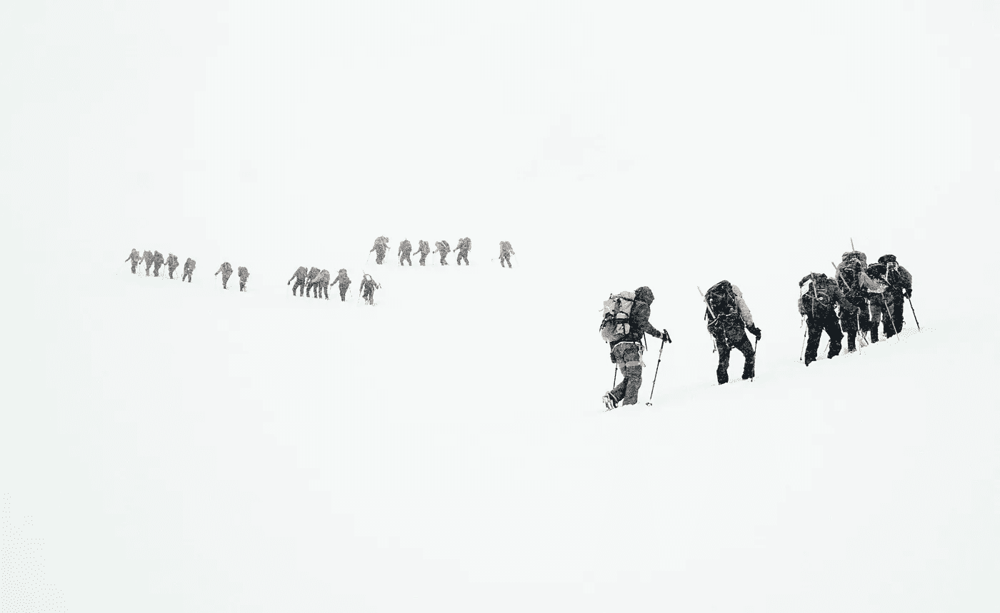
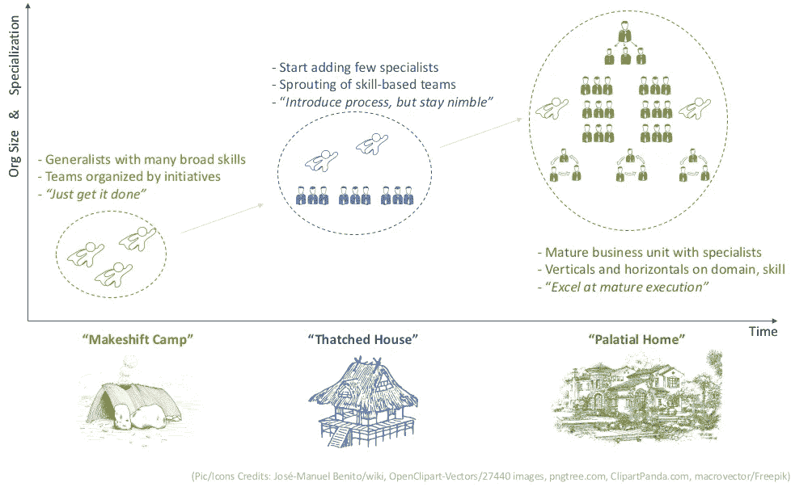

# 您的数据科学团队可能失败的 3 个阶段是什么？

> 原文：<https://towardsdatascience.com/what-are-the-3-stages-where-data-science-teams-fail-e9f8bcd86825?source=collection_archive---------7----------------------->

## 在分析成熟度的每个阶段，技能、工具和流程的正确组合是什么

今天，大多数组织都声称是人工智能驱动的。这到底是什么意思有待解释。一些组织可能正在制作 excel 报表，而其他组织可能正在构建认知模型。但是，事实是，每个人都渴望在分析中发挥作用。

但是最大的问题是，我们应该从哪里开始呢？

应该从哪里寻找人才？团队应该如何组织？他们如何扩大规模以避免不可避免的、缓慢的死亡，这是大多数团队面临的问题？在数据科学团队的早期阶段行之有效的方法，在几年后，在他们实现最初的承诺后，就不再适用了。

随着数据科学市场的不断发展，没有标准的指导方针可以遵循。本文旨在填补这一空白。

## 首先，数据科学团队的需求是什么？

根据任何分析师[的估计](https://www.forbes.com/sites/louiscolumbus/2018/05/23/10-charts-that-will-change-your-perspective-of-big-datas-growth/#77d81d9b2926)，公司正投入数千亿美元来解决数据问题。关键问题是得出可以推动业务决策的可行见解。一提到“分析”这个词，人们就会联想到预测模型和花哨的算法。

然而，只有在相关业务环境中正确应用相关技术，数据科学才能带来价值。即使是最简单的探索性分析，如果做得正确，也会带来丰厚的回报。人工智能有其应有的地位，但它不是解决所有数据问题的[银弹](/what-frustrates-data-scientists-in-machine-learning-projects-3398919a7c79)。

## 数据科学团队发展的 3 个阶段是什么？

Photo by [Todd Diemer](https://unsplash.com/photos/zglUlG8k47I?utm_source=unsplash&utm_medium=referral&utm_content=creditCopyText) on [Unsplash](https://unsplash.com/?utm_source=unsplash&utm_medium=referral&utm_content=creditCopyText)

让我们看看如何着手孵化一项数据科学实践或一家提供分析服务的初创公司。从建立 [Gramener](https://gramener.com/?utm_source=TDS&utm_medium=blog) 的经验中，我将追踪成长的三个不同阶段，每个阶段需要的重点领域和技能，并分享如何获得合适人才的智慧。

令人惊讶的是，这种数据科学团队的规模与我们的祖先多年来建造避难所的方式有几个相似之处。因此，为了增添一些乐趣，让我们将每个阶段与建造房屋的类比进行对比，并追溯不同时期的复杂程度:石器时代、中世纪和现代。

## 第一阶段:“临时营地”

(Pic by [José-Manuel Benito](https://commons.wikimedia.org/w/index.php?curid=548117) — Own work, Public Domain on wikimedia)

启动数据科学实践的最佳方式是直接投入，确定挑战的优先级，并提供一套现成的工具。人们必须挑选几个可以通过数据解决的紧急和关键的业务问题，而不是煮沸海洋。分析是一个漫长的旅程，开始的工作是成功的一半。

类似地，为理想的技能组合做过多的准备会导致分析瘫痪。船上的多面手，能够涵盖许多分析所需的[技能的人(比如统计、编程和信息设计)，即使只是有限的深度。需要的是幸存者，他们在匮乏中茁壮成长，身兼多职，并注入活力来解决任何特定的挑战。](/whats-the-secret-sauce-to-transforming-into-a-unicorn-in-data-science-94082b01c39d)

雇佣这样的初创阶段的超级明星需要非常规的方式。避开所有正规渠道。接入你的[网络](https://github.com/)，在会议上发言和联系，通过技术传播者发出试探。这些早期的人不是为了工作或额外津贴而来，而是为了满足他们原始激情的自由挑战。

> 从你所在的地方开始。利用你所拥有的。尽你所能。——阿瑟·阿什

在我们的房屋建筑类比中，我们现在处于石器时代。为了满足基本的生理需求，穴居人建造了基本的、[功能性*房屋*](http://www.ancientcraft.co.uk/Archaeology/stone-age/stoneage_living.html) 。帮助选择可行的地点、收集原材料、设计最粗糙的架构的通才技能，以及“完成工作”的常识就是所需要的全部。

## 第二阶段:“茅草屋”

(Pic by [OpenClipart-Vectors / 27440 images](https://pixabay.com/en/users/OpenClipart-Vectors-30363/))

在最初的团队取得小胜利并确立目标后，数据科学团队可以开始向邻近的用例展开。慢慢扩大所解决问题的范围，加深与用户的伙伴关系。最初的试点现在可以发展成跨越一个季度或一年的长期计划。

展示增强的投资回报率，以证明下一级投资需求的合理性。虽然事情可能开始朝着对你有利的方向发展，但是在这个过渡阶段要避免过度承诺。开始专业化，投资于几个更深的领域(比如销售分析、 [NLP](https://en.wikipedia.org/wiki/Natural_language_processing) )，同时继续保持浅层次，完成其他领域的工作(比如设计)。

随着多面手继续主持节目，开始填补更专业的角色。通过黑客马拉松、专业[精修](https://www.galvanize.com/seattle) [学校](https://www.insofe.edu.in)扩大招聘渠道，同时将现有员工提升到数据科学领域。开始根据所选的几个专业领域组织团队，同时保持视野开阔，反应敏捷。

> 前进，永不停止，因为前进就是完美。哈利勒·纪伯伦

随着人类的前进，房屋建筑的复杂程度迅速提高。效率和效果来自于稍微好一点的原材料和少数像[泥瓦匠](https://www.historylearningsite.co.uk/medieval-england/medieval-masons/)这样的核心角色，而多面手涵盖了其余部分。尽管梦想比头顶上的*多一点点，功能&目的才是至高无上的。*

## 第三阶段:“富丽堂皇的家”

(Pic by [pngtree](https://pngtree.com))

作为一个不断发展的实体，数据科学团队现在基本上是一个成熟的业务部门。凭借专业领域的专业知识和对所有关键数据科学技能领域的掌握，该团队现在已准备好处理广泛领域中足够复杂的问题。

不再面临生存挑战，团队的任务可以深深地融入到涉众的长期业务目标中。团队的结构可以是垂直排列的，或者是水平排列的技术卓越中心，或者是介于两者之间的混合矩阵结构。

用成熟的招聘流程和内部招聘人员推动快速增长的业务。对于庞大而多样的人数，通过增加传统渠道，广撒网招人。至关重要的是，在保持早期通才、满足专家期望的同时，还要标准化流程以扩大组织规模。

> 完美是不可达到的，但是如果我们追求完美，我们就能赶上优秀。——文斯·隆巴迪

快进到现代，我们有规模经营的建筑公司。专业组织拥有房屋建筑的各个方面，如设计、建筑、工程。虽然形式和功能被认为是理所当然的，但它承诺的是更高的生活质量和细微的方面，如优雅和可用性。

## 摘要

**3 Stages of Data Science teams evolution: Summary Illustration**

我们已经了解了数据科学团队发展的 3 个关键阶段。第一部分的重点是采取**小步**快速起步，完成小目标。第二种方式是通过提升特定领域的能力，同时在所有其他领域保持多面手的地位，迈出有分寸的步伐。

最后，第三种方式更像是在跑马拉松，你必须集中精力，正确处理，并做好长期高效工作的准备。因此，每个阶段的重点、技能、招聘渠道以及组建团队的指导方针在这三个阶段都有很大的不同。

未能认识到这种区别可能会被证明是致命的做法，而熟练地处理这些细微差别可以作为释放增长的硝基助推器。贯穿这三个方面的关键原则是提供可操作的见解，推动业务决策并为数据科学投资带来投资回报。

*如果你觉得这很有趣，你会喜欢我写的这些相关文章:*

*   [*让你在数据科学生涯中不可或缺的 4 种超能力*](/4-superpowers-that-will-make-you-indispensable-in-a-data-science-career-6571e8e7d504)
*   [*数据科学家面试失败的 4 种方式*](/4-ways-to-fail-a-data-scientist-job-interview-d9c4c85c683)

*对数据科学充满热情？随时在*[*LinkedIn*](https://www.linkedin.com/in/gkesari/)*上加我，订阅我的* [*简讯*](https://gkesari.substack.com/) *。*