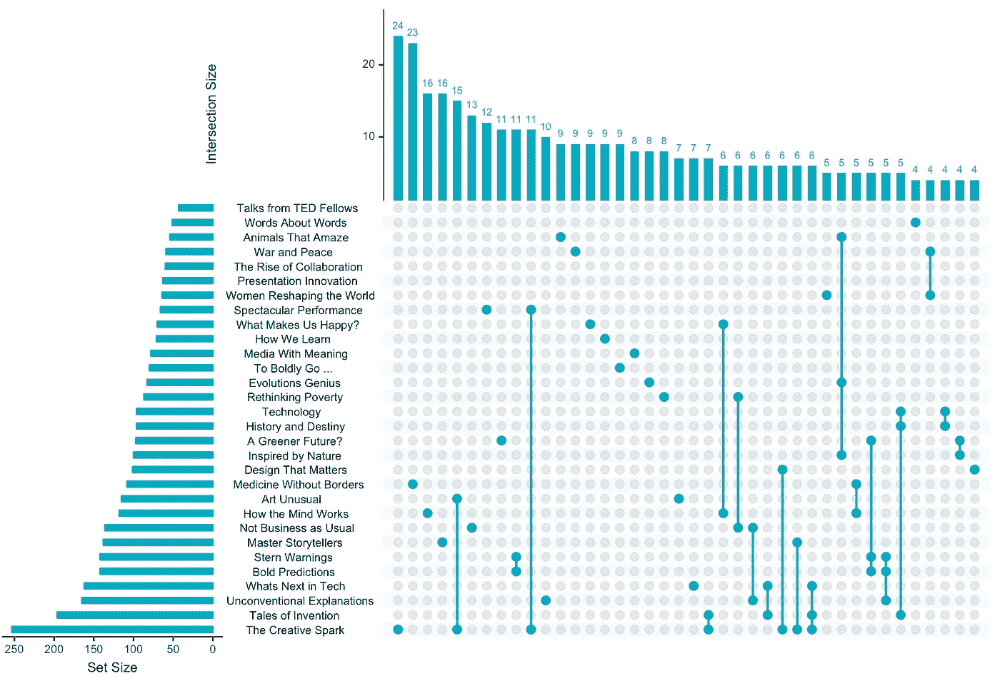
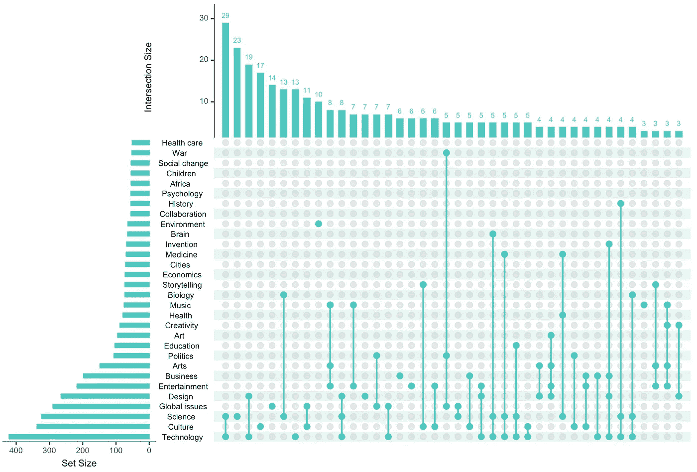
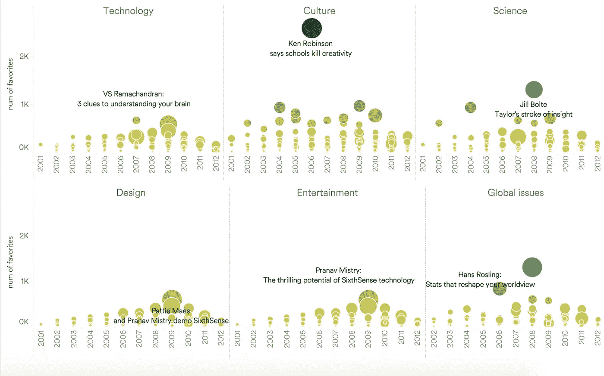
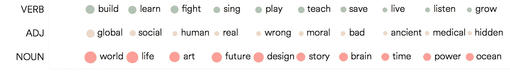
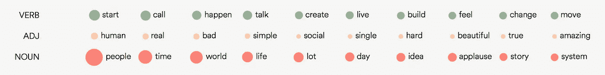

# TED 中反复出现的话题是什么

> 原文：<https://towardsdatascience.com/what-are-the-recurring-topics-in-ted-8392cf9f3fb?source=collection_archive---------2----------------------->

今天我探索了 TED 演讲和 T2 数据，他们的话题和观众。

鉴于 TED 上想法的多样性，演讲通常有几个相关的主题和标签。

为了可视化各个主题及其各种组合的频率，我使用了 R/python/D3 中的一个工具，名为 [UpSet](http://caleydo.org/tools/upset/) ，它是由一组哈佛研究人员开发的，使用矩阵、条形图和附加属性图来描述部分到整体的关系以及不同集合的交集。

首先，我研究了前 30 个主题的频率(总共 48 个主题)

我们可以看到:

*   创意火花是最常见的主题
*   顶级主题关注非传统智慧、前瞻性思维和有意义的故事
*   常见的组合主题包括艺术的不寻常和创造性的火花，壮观的表演和创造性的火花，什么让我们快乐&大脑是如何工作的

同样，我查看了标签/主题，因为有 289 个标签/主题，所以我偷偷查看了涵盖一半讲座的前 30 个标签/主题，所以这仅反映了这 30 个标签内的讲座，不包含其他标签。

我们可以看到:

*   技术、文化、科学、全球问题和设计是热门话题
*   科学与技术，设计与技术，生物与科学，全球问题与文化，以及音乐，艺术与娱乐是一些反复出现的组合主题

接下来，我按主题查看了 2001 年至 2012 年间观点和喜好最多的会谈。鉴于一个演讲会出现在不止一个主题中，我将把它列为下一个最受欢迎的。

肯·罗宾逊 2006 年关于学校扼杀创造力的演讲是有史以来点击率最高的演讲，有 1200 万次点击率，是 3K 的最爱。

看看标题中的关键词也能让我们对主题有所了解。以下是 TED 演讲题目中最常见的 10 个动词、形容词和名词:

在会谈的内容中，在总共 1000+次会谈中,“人民”一词出现在《10K 时报》周围。

相关文章:

[寻找 TED 演讲的特点](https://medium.com/towards-data-science/finding-characteristics-of-ted-talks-911879560146)
[TED 演讲人的职业](https://medium.com/@yanhann10/the-occupation-of-ted-speakers-4df1829c5ac7)

这是我关于数据科学和视觉故事的[# 100 日项目](https://medium.com/@yanhann10)的第 60 天。我的 [github](https://github.com/yanhann10/opendata_viz) 上的全部代码。感谢阅读。如果喜欢，请分享。欢迎新主题的建议和反馈。