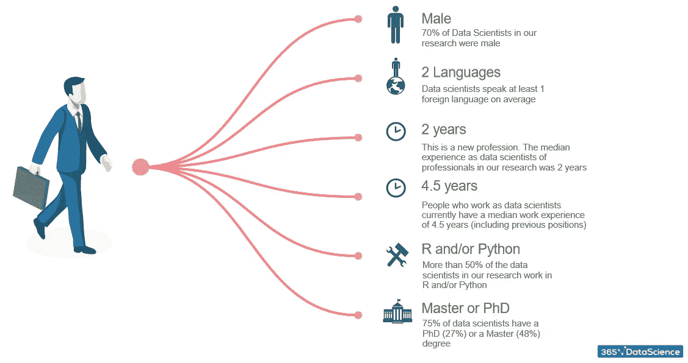
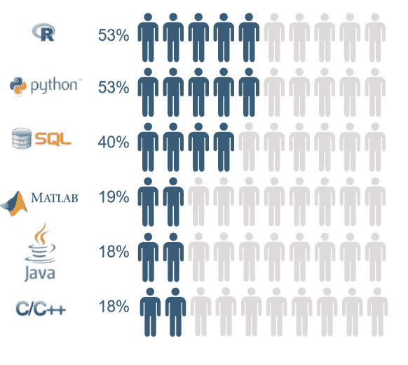
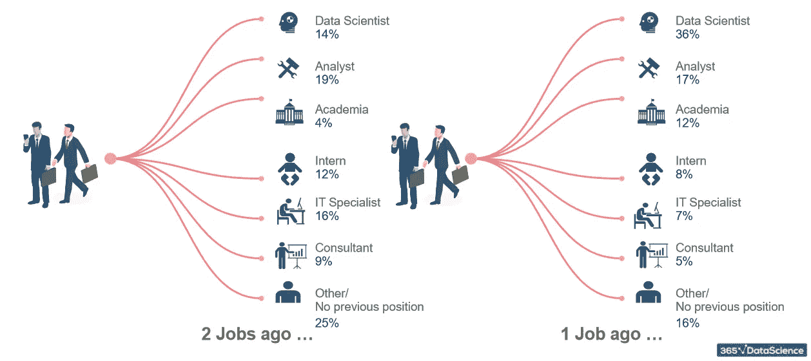
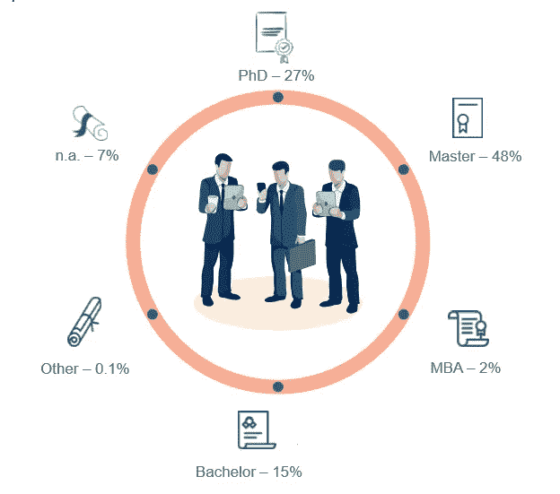
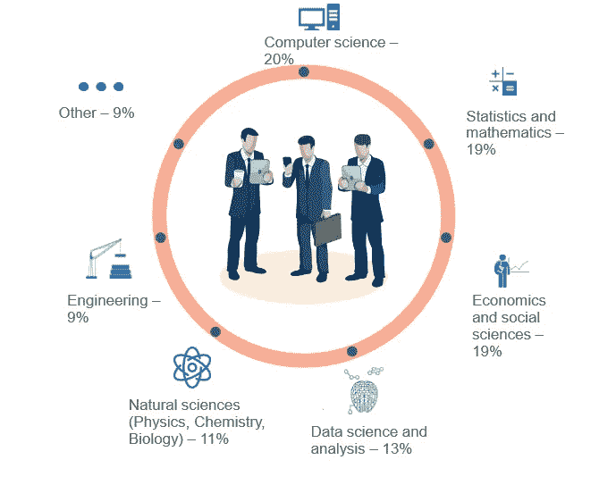
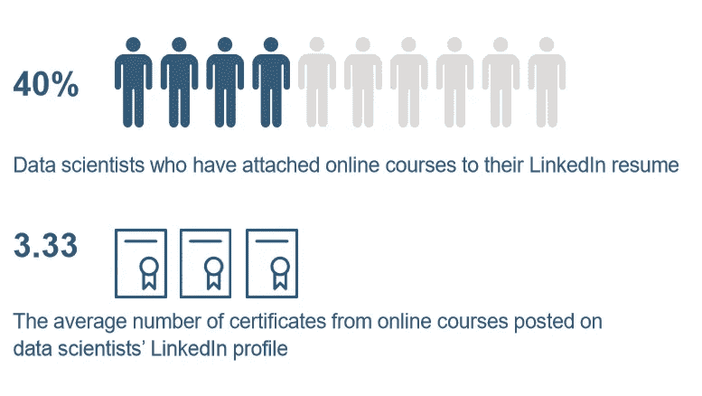
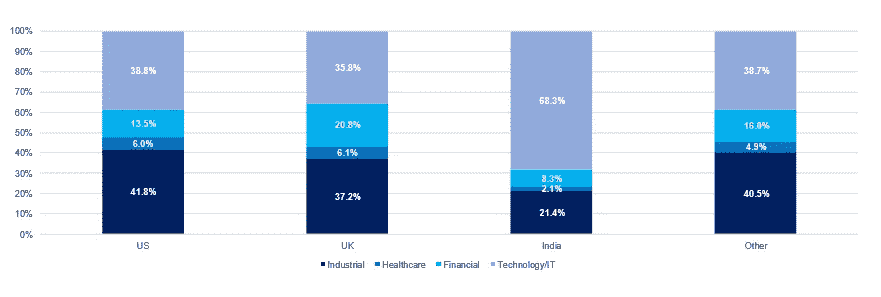
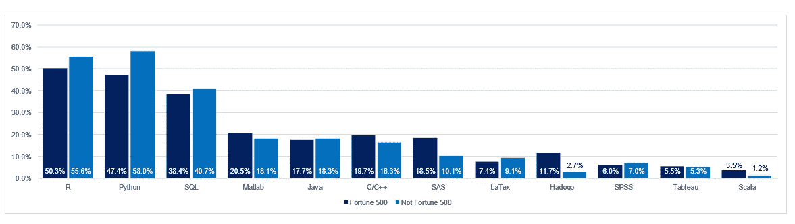

# 成为一名数据科学家需要具备哪些技能？

> 原文：<https://towardsdatascience.com/what-are-the-skills-needed-to-become-a-data-scientist-in-2018-d037012f1db2?source=collection_archive---------5----------------------->

根据 Glassdoor 的数据，数据科学家是 2017 年美国排名第一的职业。这并不奇怪，因为该领域的平均基本工资为 123，000 美元。尽管如此，数据科学就业市场远未饱和，仅在美国就估计短缺 19 万名专家。如果你正在考虑转向数据科学的职业生涯，2018 年将提供大量有利可图的机会。这篇文章的目的是让人们更清楚地知道在 2018 年成为一名数据科学家需要什么。

为了揭示这个不断发展的领域，我们在 2017 年底进行了一项关于这个主题的研究。这项研究包括从 1，001 份 LinkedIn 简历中收集数据，这些简历中的人目前都有“数据科学家”的头衔。这群人被分为两组——在财富 500 强公司工作的人和在其他地方工作的专业人士。此外，该样本包括在美国(40%)、英国(30%)、印度(15%)和其他国家(15%)工作的数据科学家。因此，数据是从具有各种背景的数据科学家那里收集的，以限制偏见。

# 典型的数据科学家特征

*A male, who speaks at least one foreign language, and has a second-cycle academic degree (Master’s or PhD). He has been in the workforce for 4.5 years, after taking him 2 years to land the title. R and Python are the preferred coding languages, followed by SQL*.

人们不禁会注意到，数据科学专业在很大程度上是由男性主导的，他们占样本的 70%。尽管如此，随着该领域的巨大需求，每个有知识的人在该行业都有一席之地。所以如果你恰好是女性，请不要气馁，继续读下去。

# 数据科学家需要哪些顶级技能？

以下是科学家在个人资料中发布的最常见的技能数据。

**R 和 Python 是主导数据科学领域的编程语言。**据报道，53%的数据科学家能够“说”R 和/或 Python。请注意，它们可能会重叠，因为一些数据科学家同时使用两种语言。

在不断变化的数据科学世界中，这些是专业人员在工作中使用的最新工具。r 和 Python 是最基本的编程语言，每个打算进入这个行业的人都应该学习。

尽管数据表明 R 是使用更广泛的语言，但是根据 [Stack Overflow](https://www.techrepublic.com/article/which-is-the-fastest-growing-programming-language-hint-its-not-javascript/) 社区的说法，考虑将 Python 放在你的待办事项列表的首位，因为这是发展最快的编程语言。很可能到 2019 年，Python 的受欢迎程度将大大超过其他编码语言。它的灵活性和相对易用性是 Python 脱颖而出的主要原因。

数据科学的其他流行语言有:

SQL (40%)

MATLAB (19%)

Java (18%)

C/C++ (18%)

渴望了解更多信息？

我们发现，拥有 SAS、LaTex、Hadoop 或 Tableau 也有好处。在基础之外扩展你的技能可以显著提高你获得数据科学家职位的机会。

# 工作经验

鉴于数据科学家这一职业最近才出现，数据科学家的工作经验中位数为 2 年也就不足为奇了。如果你申请的是一个数据科学职位，而之前没有该领域的经验，你也不必感到尴尬。你不会是第一个。在我们的样本中，只有 36%的数据科学家曾经是他们之前工作的数据科学家。这个领域有很大的发展空间。另外 64%的人的职位是什么？嗯，最常见的背景是分析师(19%)、IT 专家(16%)或学者(12%)。

此外，8%的人在获得数据科学家工作之前是实习生。

从底层开始，那些人实现了梦想。所以，你能不能！

# 教育和培训

大多数从事数据科学家工作的专业人士都受过高等教育。事实上，调查结果表明，大约 75%的数据科学家拥有博士或硕士学位。

另一方面，一个花哨的学位并不是必须的。研究样本中大约 25%的数据科学家毕业于“未排名的大学”。换句话说，你的大学是否在“泰晤士高等教育”排行榜上，并不一定会决定你在数据科学领域开始职业生涯的机会。

此外，只有 13%的专业人员参加了数据科学和分析大学项目。大多数数据科学家拥有计算机科学(20%)、统计和数学(19%)或社会科学(19%)学位。只要你有一些定量的背景知识，你就有可能踏入数据科学的大门。

因此，你不一定要参加额外的学术项目来获得工作所需的技能。如果你想提升你的技能，在线课程是一个可行的选择。近 40%的数据科学家在他们的 LinkedIn 简历中报告注册了在线课程。

# 就业行业

一旦你掌握了技能，你需要卷起袖子去找工作。那么，数据科学找工作最好的行业是什么？在英国和美国的就业市场，你很可能会被工业公司(制造业、快速消费品、公用事业、咨询等)聘为数据科学家。).然而，印度的情况并非如此，那里大多数(68%)的数据科学家受雇于科技和 IT 公司。

医疗保健和金融行业似乎也需要数据科学家，占整个样本的 14%和 6%。

# 雇佣公司

你觉得自己是在财富 500 强中还是更被小公司吸引？不管公司层级如何，似乎各种规模的公司都雇佣了能够用 R、Python、SQL 和 Matlab 编程的数据科学家。然而，如果你要去一家财富 500 强公司，SAS 和 Hadoop 可能会派上用场。图表之外的公司很少需要能够使用 Hadoop。在 F500 中，大数据为王，这对于较小的公司来说是不正确的。

这是数据科学专业在 2017 年底的样子，也可能是整个 2018 年的样子。好消息是，即使你没有匹配的学位或足够相关的工作经验，你仍然可以赶上相关的技能和工具。如果你对数据和终身学习充满热情，2018 年是开始从事数据科学家职业的时候了。

你可以在这里阅读完整的研究。