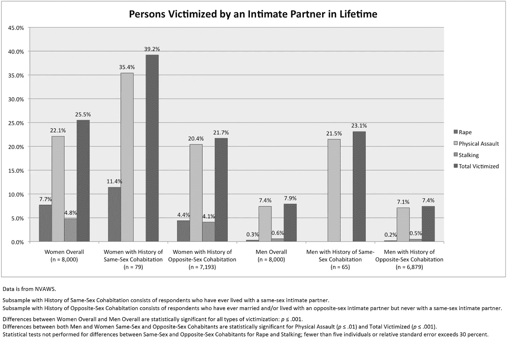
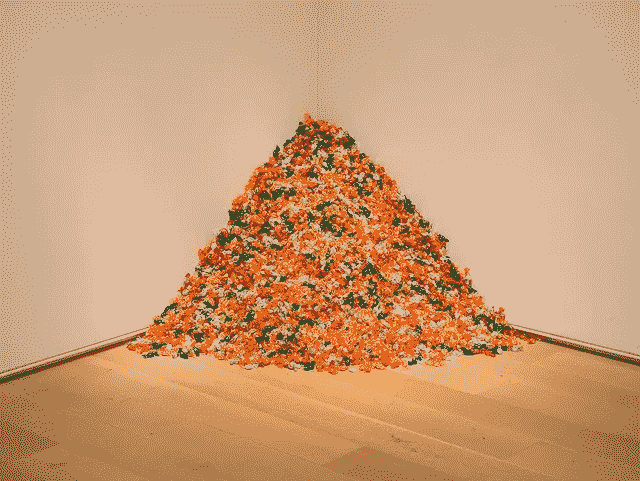
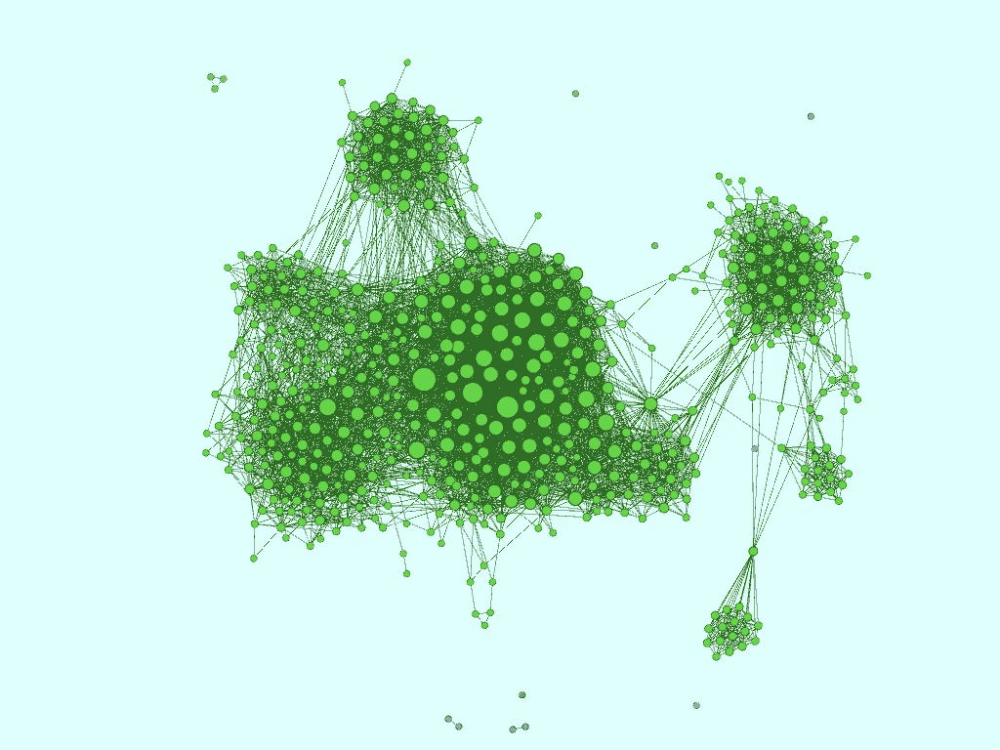
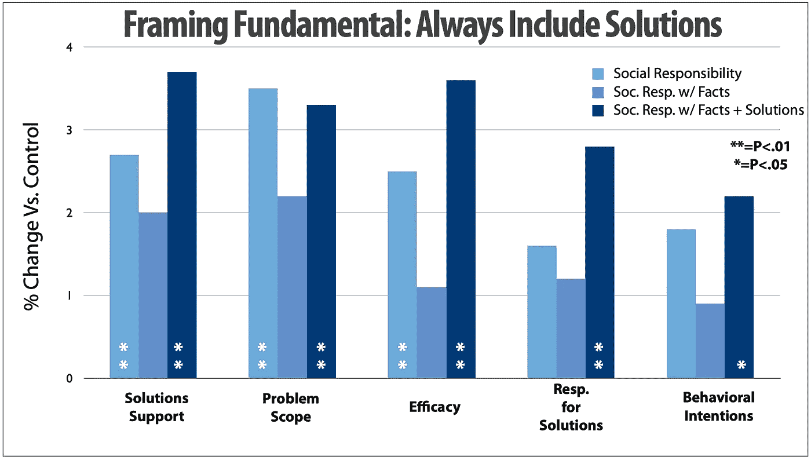

# 还有比现在更好的时机吗？

> 原文：<https://towardsdatascience.com/what-better-time-than-now-c7171cf8910e?source=collection_archive---------22----------------------->

## 艺术和想要改变世界是如何引导我走向数据科学的

数据在理解我们周围的世界中起着至关重要的作用。在我意识到数据的价值之前，我一直在以这样或那样的方式处理数据。现在我参加了一个沉浸式数据科学项目。这里有一点是关于我的旅程的:

在肯塔基大学，我是后来成为“绿点计划”的试点小组成员。我可以列举出遭受暴力或跟踪的女性的统计数据。然而，我知道有太多的人正在经历不符合“男人对女人的暴力”范式的暴力。我不得不就一个遗漏了很多人的框架提出问题。

后来，在佛蒙特大学的社会工作硕士项目中，我继续追寻这些问题。这包括利用国家调查数据研究性别和亲密伴侣暴力。

Exploratory chart I created for a 2011 project on Gender and Intimate Partner Violence

在 MSW 项目中，我还承担了一个更密集的数据项目，作为我实地工作的一部分。我所在的组织调查了佛蒙特州的所有公立学校，以评估 LGBTQ+青年的学校氛围。在过去，这是一个由学校管理者完成的五个问题的调查。我把它变成了一个更全面的学生调查。

新的调查对学校氛围有了更准确的了解。100%的学校管理者报告说，他们有一个法律要求的反欺凌政策。然而，许多学生报告说，学校工作人员目睹了欺凌行为，却无动于衷。令我印象深刻的发现是:同性恋学生在许多指标上与异性恋或异性恋学生表现相似。被认定为双性恋、同性恋、质疑者或跨性别者的学生报告了不成比例的更高的暴力、精神健康挑战和缺乏资源的比率。

我对数据的欣赏也是通过我的艺术背景发展起来的。我曾宣称摄影是我美术学士学位的重点，然而我的兴趣和实践更多的是跨学科的。

我从像[菲利克斯·冈萨雷斯-托雷斯](https://www.flickr.com/photos/mark6mauno/10788368034)这样的人的作品中找到了灵感。他用普通的材料来描述艾滋病流行、枪支暴力和历史上的重大事件。

“Untitled” (Portrait of Ross in L.A.) by Félix González-Torres. (photo: [mark6mauno](https://www.flickr.com/photos/mark6mauno/10788368034), CC BY-NC 2.0)

哈桑·埃拉希的[追踪瞬变项目](https://www.wired.com/2007/05/ps-transparency/)也引起了我的共鸣。作为对被列入政府观察名单的回应，他开始过度分享自己的生活:去过的每个机场，吃过的每顿饭，用过的每个厕所。该项目提出了关于隐私、我们共享的数据以及如何使用这些数据的问题。

后来，乔纳森·哈里斯的许多项目鼓励我继续思考艺术、数据和讲故事的交叉。在[我们感觉很好](http://number27.org/wefeelfine)中结合使用实时数据、情感分析和交互性让我大开眼界。为了好玩，我会继续学习社交网络分析和数据可视化之类的课程。

2013 social network analysis of my Facebook account made with Gephi

“危机短信热线”是数据科学在社会公益方面的首批应用之一，它一直困扰着我。当执行董事和我都向 [Hive Chicago](https://hivechicago.org/july-2014-meetup/) 展示我们各自的项目时，我第一次知道了这件事。短信热线是一个重要的资源，我与和我一起工作的年轻人以及其他关心年轻人的人分享。但我特别兴奋地看到他们在理解危机趋势方面取得的进展，以便提供更有效的支持。正如董事会成员 [DJ Patil 解释](https://www.crisistextline.org/blog/dj):“如果发短信的人带有‘布洛芬’一词，他们主动自杀的可能性会增加 16 倍(‘桥牌’是 8 倍，‘今晚’是 3 倍)，危机顾问可以立即开始风险评估，以帮助降低短信者的情绪。”

在过去的三年里，我的工作重点是在高中和大学学生中预防艾滋病和药物滥用。该职位包括更新、实施和分析当地青少年风险行为调查。我们用这些结果来指导我们自己的工作。

2016 年，我们带着一些高中同辈领导去了 CADCA 年中培训学院。框架研究所的 Moira O'Neil 做了主旨发言。放了四张幻灯片后，我的同事向我伸出手:“请不要因为它们而离开我们！”我笑了，但是我的同事是对的——框架的焦点和方法正好符合我的胃口。在奥尼尔在那次演讲中分享的所有东西中，这是我最大的收获:

From Moira O’Neil’s presentation “[Framing Change: A Strategic Approach to Communications](https://www.cadca.org/sites/default/files/pdfs/trainings/keynote.pdf)”

主要观点是:如果你试图围绕一个问题推动改变，分享一个使这个问题人性化的故事。这可能是一个问题如何影响一个人的故事。下一步，包括数据，以显示问题的规模超出了个人。如果你停在这里，人们会变得不太可能支持改变，因为问题感觉太大了。但是，当你将一个故事和数据与*可行的解决方案*结合起来时，人们更有可能支持改变，而不仅仅是一个故事。

虽然我以前听说过这种说法，但我从未见过它被形象化。终于卡住了。自从第一次看到这个图表以来，我已经多次分享了它的简化版本。我们高中的同龄人领导小组用它来思考如何为自己辩护，并在他们的社区创造变化。它为我在全组织一级的种族和性别平等倡议方面的工作提供了信息。

不幸的是，在新政府的领导下，我被聘用时所依据的联邦研究基金不再提供了。随着拨款截止日期的临近，我面临着不确定性，不知道我是否还会有一份工作，或者那份工作会是什么。无论如何，这将意味着我在公司所做工作的转变。这似乎是一个跳跃的好时机。

虽然十多年来数据一直是我故事的一部分，但我从来没有能够花我喜欢的时间去研究它。我手机上的一个列表包含了我想用数据探索的项目想法，问题如下:

*   生活成本和无家可归率之间有什么联系？
*   大麻法律的变化如何影响鸦片制剂的死亡？
*   一个州的种族构成和它的监禁率有什么关系？
*   社交媒体使用的增加与青少年性活动的减少有关吗？
*   想法是如何被采纳的？一个人在开始使用一个短语之前要接触它多少次？

虽然我多年来一直在增加清单，但我还没有愉快地检查过任何东西。我很高兴开发一套新的技能，这将有助于我承担这样的项目。

对我来说，提高自己的能力，为我们的社区做出积极的改变，这很重要。数据科学有助于更明智、更有效地讲述故事、制定战略、进行干预和评估。除了危机文本行，还有很多例子激励着我。uAspire 正在使用虚拟咨询帮助学生找到支付大学费用的方法。T2 正在努力使用人工智能来帮助遭受家庭暴力的人。虽然这是我进入数据科学之旅的开始，但它是我已经走过的路的延续。

*感谢阅读！想法、问题和反馈总是很受欢迎。*