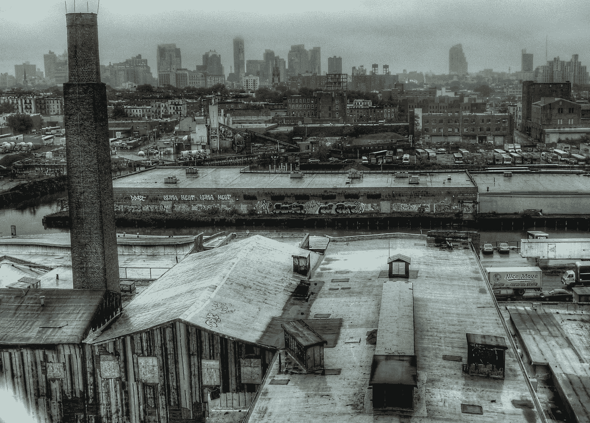
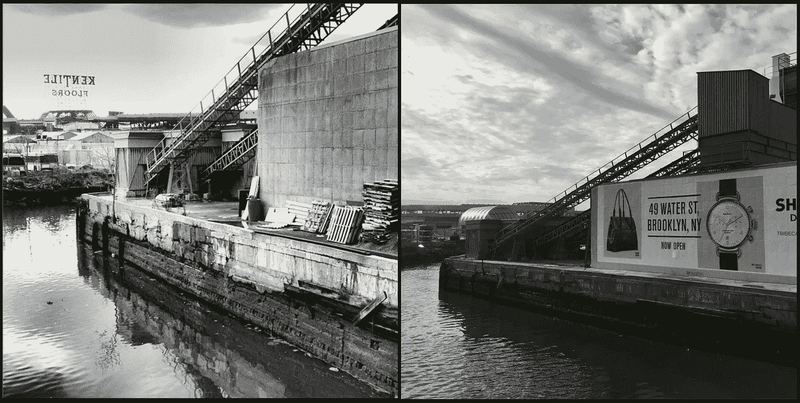
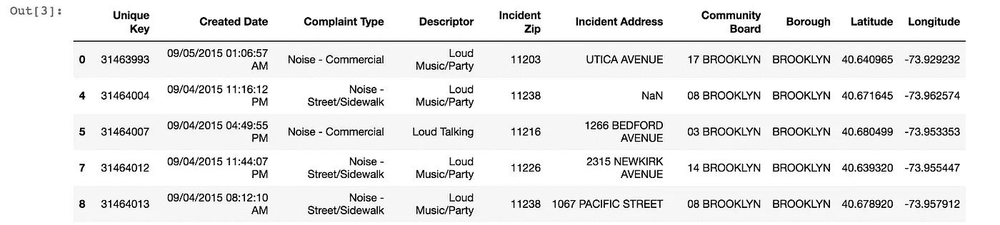
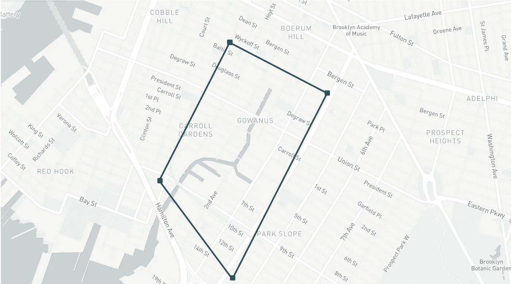
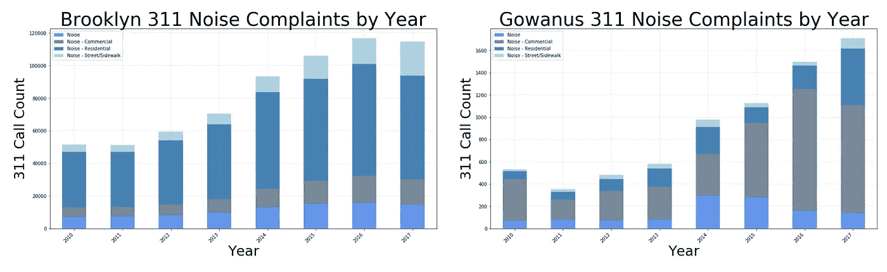
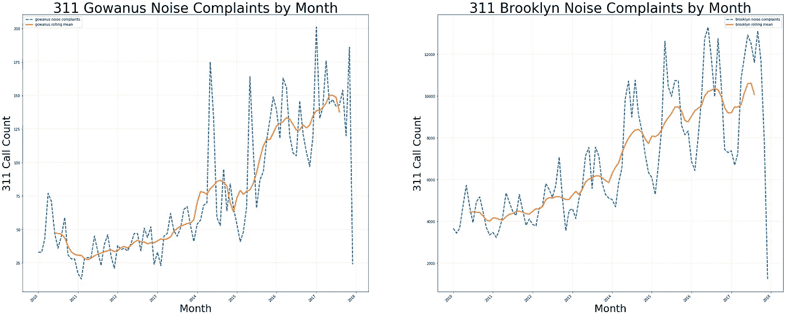
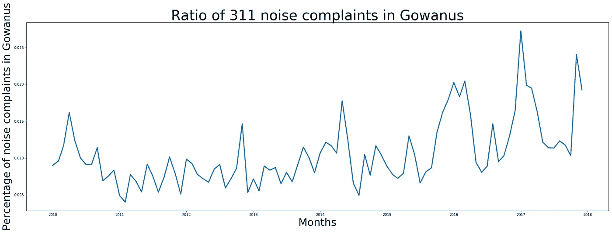
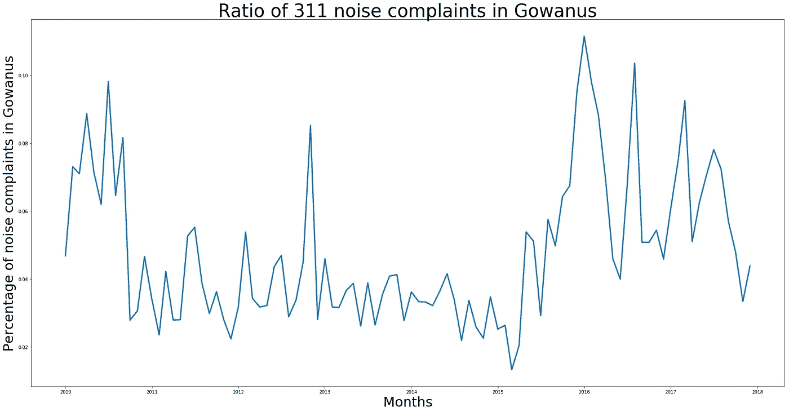

# 戈瓦纳斯的 311 噪音投诉能告诉我们关于中产阶级化的什么？

> 原文：<https://towardsdatascience.com/what-can-311-noise-complaints-in-gowanus-tell-us-about-gentrification-444c7da0a07a?source=collection_archive---------8----------------------->

## 使用 Python 和 NYC 开放数据来识别我最喜欢的布鲁克林社区的模式



A view of of the Gowanus Canal taken in 2010, the year it was given Superfund Site status. [Photo Credit](https://www.flickr.com/photos/mementosis/5034523372/in/photolist-8ETfp7-dLiYLv-2gyvk7-o2UQnq-8S7KTM-em6FNZ-pEodrG-8FZdZR-88g2LB-8G3nTL-dLptE7-8S7HNi-8S7Knx-cfYzBq-8G3pCo-k9U28T-88fWbU-dBjqhp-h5hTxi-jkXhRn-2gxK3o-2fS6d9-h5i9Ae-dRAh2N-h5gB9a-2fMBac-dRAhhj-kCqjRK-2fMBXB-9N7yGW-8G3pio-h5h46j-EXjcAN-dpgAUs-pEod97-pL9eYK-8yYtuW-pL9eX2-8G3nsq-ekFdsr-7SY8KY-5JMTn9-6JdyqZ-q3kEri-aiscbg-M9y3i-4uRqzw-4m8BVa-6T8fDT-6RASCM)

戈瓦纳斯是布鲁克林的一个街区，夹在公园坡和卡罗尔花园之间，沿着戈瓦纳斯运河，这是一条工业水道，现在因其“黑色蛋黄酱”而臭名昭著，这是一个被污染的假底的术语。这一街区仅占布鲁克林人口的 5%多一点，在 20 世纪中期，由于与集装箱化不兼容，这条大道在很大程度上被废弃后，这里相对安静。在过去的 15 年里，它经历了巨大的变化，部分原因是 2003 年的住宅重新分区和 2010 年的超级基金选址。今天，戈瓦努斯正在迅速贵族化。

在全食超市和[肯瓦地板](https://www.nytimes.com/2014/06/13/nyregion/kentile-floors-sign-stalwart-remnant-of-a-grittier-brooklyn-is-coming-down.html)的招牌落下之前，我住在戈瓦纳斯。自从我 2013 年离开这个街区以来，建筑环境的变化相当惊人。除了建设引入新的住房存量沿水，该社区正在投资绿色空间，努力提高宜居性。变化如此之大，我很想知道随着时间的推移，社区是如何表达他们的担忧的。



Picture of the Gowanus Canal from the 3rd St Bridge in 2012 (left) features the back of the Kentile Floors sign. Today, the sign is gone and the bridge view showcases high-end advertisements (right).

[**NYC 311**](http://www1.nyc.gov/311/index.page) 是非紧急呼叫系统，允许市民报告他们附近的问题。从一开始，它就是一个地区脉搏的快速快照。具体来说，噪音投诉被用作帮助理解中产阶级化的一个(不完善的)代理。这说明街上的人越来越多，但也说明那些使用电话线路报告噪音的人——那些潜在的不太熟悉附近基线声音的人。

通过查看 2010 年至 2017 年 311 个数据中的噪音投诉，我希望确定戈瓦纳斯的投诉如何偏离布鲁克林的整体分布。这个数据驱动的故事能告诉我们关于*何时*街区发生变化的什么，这种趋势对我最喜欢的布鲁克林街区的未来意味着什么？

# 数据

[311 数据集](https://nycopendata.socrata.com/Social-Services/311-Service-Requests-from-2010-to-Present/erm2-nwe9/data)从 2010 年至今在 OpenDataNYC 上可用。数据集很大，所以我用 api 过滤了布鲁克林的电话。噪音投诉分为四类:1)一般投诉；2)住宅；3)商业；4)街道/人行道。

在使用 Python 过滤掉其他类型的投诉后，这些年来，整个布鲁克林区有 664，116 个电话留给我处理。数据集`brooklyn.head()`如下所示:



# 隔离 Gowanus

识别发生在 Gowanus 的电话需要一些数据管理。这是一个玩 Geopandas 和 Shapely Python 包的好机会，这是我在 NYU 大学的城市信息学课上第一次遇到的东西(见这里一个[有点乱]的作业，它也使用这些包来质疑 link NYC Wifi hub distribution 的[公平性)。](https://github.com/sebscho/PUI2017_ses515/blob/master/HW9_ses515/HW9_geopandas_census%20(1).ipynb)

首先，我组合了为每一行提供的纬度和经度，并将它们转换成适当的几何图形。这一步至关重要，因为它为数据引入了空间意义。这些纬度/经度不仅仅是数字；他们有一个相关的地理投影。

我不会在这里包括这个项目的所有代码(为此，请查看我的 [Github](https://github.com/sebscho/Gowanus311/blob/master/311_Gowanus_Final.ipynb) )，但如果你想做类似的事情，下面是一些关键片段:

```
# creating a column which combines latitude and longitude
brooklyn['lonlat'] = zip(brooklyn['Longitude'],brooklyn['Latitude'])# creating a geometry column using shapely 
# this says: "these aren't numbers; they have a spatial definition"
brooklyn['geometry'] = brooklyn[['lonlat']].applymap(lambda x:shapely.geometry.Point(x))# assigning geometry, crs, and converting into a geodataframe
geometry = brooklyn.geometry
crs = {'init': 'epsg:4326'}
brooklyn = GeoDataFrame(brooklyn, crs=crs, geometry=geometry)
```

接下来，我使用 Google Maps 查看我定义的 Gowanus 社区的经纬度坐标。我用 Shapely 为这些点创建了一个多边形，如下图所示。从那里，我使用一个带有`contains()`函数的`for`循环来询问每个被记录的呼叫的位置是否在我标识为 Gowanus 的区域内，这产生了一个布尔数组。



I used Google Maps to eyeball my Gowanus boundary. From there I used python to create a new dataframe with calls that were contained within the polygon using the Geopandas and Shapely packages.

我将该数组作为一个新列添加到我的布鲁克林数据库中，名为“is _ gowanus”——描绘一个全部为“真”或“假”的列，指定每个呼叫的纬度/经度是否落在多边形内。使用该专栏，我创建了一个名为“Gowanus”的新数据框架，其中:`gowanus = brooklyn[brooklyn['is_gowanus'] == True]`

在这个空间分析练习结束时，我的 Gowanus 数据框架有 **7，262 行**，相比之下，Brooklyn 数据框架仍然有 **664，116 行**。

# 探索性分析

现在我们已经有了每个群体的数据框架——布鲁克林和戈瓦努斯的全部——我们可以做一点挖掘了。首先，我按照年份和投诉类型对数据进行了分组，以便随时间的推移对数据进行可视化(这需要 python 中的一些时间序列体操)。下面的图表显示了布鲁克林和戈瓦努斯的抱怨是如何演变的。



These plots show the distribution of 311 noise complaint types from 2010 to 2017\. While the volume of calls follows roughly the same trend, the noise types appear to follow a different distribution.

第一个堆积条形图显示了从 2010 年到 2017 年至今，整个布鲁克林 via 311 的噪音投诉稳步增加。请注意，总体而言，“住宅”噪音一直是投诉最多的。第二个堆积条形图显示了同一时期戈瓦努斯地区噪音投诉的稳步增长。Gowanus 地区主要是商业噪音投诉，而不是住宅噪音，以灰色显示。尤其是在 2016 年，电话数量似乎扩大到所有噪音投诉的大多数，这种模式在布鲁克林整体上没有观察到。

这两个图显示了这些年来电话总数增加的总趋势，但是在噪音投诉的类型方面有所不同。这可能主要是由于该地区的分区指定，但值得进一步调查。

# 平稳性测试

我的分析的下一部分使用平稳性测试来查看 Gowanus 的噪音投诉模式。如果数据是**稳定的**，那么它在一段时间内具有相同的统计属性，比如均值和方差。如果数据不稳定，通常是由于所谓的**单位根**，数据的一部分是不可预测的。

## 使用滚动方法直观评估平稳性

首先，因为只有相对较少的几个月的数据(少于 100 个月)，所以可以直观地查看趋势。我统计了自 2010 年以来每月的噪音投诉电话，按月份和年份分组。下图显示了一段时间内的数据，滚动平均窗口为 10。



These plots show total noise complaints by month. Notice that there is some periodicity in Brooklyn (right) that doesn’t seem to be mirrored in the Gowanus plot (left).

这些图显示了从 2010 年到 2017 年 12 月，Gowanus 和 Brooklyn 的投诉量。请注意，滚动平均值的一般趋势大致遵循相同的模式，随着时间的推移稳步增加。布鲁克林地块似乎具有更规律的季节性，而戈瓦纳斯地块在 2014 年春夏出现了一些有趣的峰值。2017 年，冬季还有另一个高峰，这似乎没有反映在布鲁克林的整体情节中。

绘制时间序列数据后，整体趋势是否不同，从视觉上看并不完全清楚。为了进一步挖掘，需要将 Gowanus 调用数据标准化，并使用平稳性统计测试来确定 Gowanus 是否实际上是平稳的，或者它是否有单位根。

## 平稳性的 AD Fuller 检验

首先，我把 Gowanus 的数据做成一个比率。我没有使用噪音投诉的总数，而是查看了与布鲁克林其他地方相比，高瑙斯噪音投诉的百分比。你会注意到随着时间的推移，剧情似乎相当稳定，在 2016 年和 2017 年有一些潜在的*变化点*。使用这些标准化的数据，我们可以真正了解关于 311 噪音投诉行为的核心问题。



This plot shows the ratio of noise complaints in Gowanus to all of complaints in Brooklyn over time.

我选择使用 AD Fuller 测试来评估平稳性。 [AD Fuller](https://en.wikipedia.org/wiki/Augmented_Dickey%E2%80%93Fuller_test) 测试的零假设是*是*一个单位根，这意味着不存在平稳性。如果我们可以拒绝零假设，这通常意味着数据是平稳的。我使用 python 中的 Statsmodels 包来实现测试。

单行测试的结果是 **p 值为 0.00132，**，这意味着我们可以在适当的置信区间拒绝空值。这个测试的假设是一个怪异的双重否定，但这意味着虽然有一些视觉上的变化，但这个数据*总体上是*平稳的。仅回顾过去三年，p 值仍接近于零，这也意味着稳定。

# 商业噪音投诉

看到平稳性测试的结果有点令人惊讶，但这可能并不能说明全部情况。我们探索性分析的一个较大偏差表明，噪音投诉细分存在较大偏差。为了特别关注这些，我重复了分析，只关注“商业噪音”投诉。



This plot shows the percentage of commercial noise complaints in Gowanus over time. Notice the irregularity in the past three years.

该图显示了戈瓦努斯地区商业噪音投诉的百分比。与所有随时间推移的噪声投诉不同，该图显示了过去几年中似乎存在的主要偏差，包括 2016 年和 2017 年明显的不规则峰值。特别是在进行过去五年的 AD Fuller 测试时，我们得到的 **p 值为 0.0541** 。在这里，我们不能拒绝零(只是勉强)，这意味着这些数据不是静态的。戈瓦努斯的情况有些不同。

# 结论和局限性

那么，戈瓦纳斯的 311 电话能告诉我们关于中产阶级化的什么呢？**绝对没有什么是肯定的。**

我们的测试结果表明，虽然这些噪音投诉数据总体上是稳定的，但对于 Gowanus 中的某些投诉类型，它们并不是稳定的。“商业噪音”在 311 数据集中的最佳描述是:“喧闹的音乐/聚会。”这可能意味着，随着社区的中产阶级化，会有更多吵闹的派对打扰居民。

然而，所有这些确实意味着，在 2016 年，更多的人会更加频繁地打电话给*咨询喧闹的派对。这带来了这项研究的一个有趣的限制:在 311 报告中存在已知的偏差(见研究[调查报告与实际违规的比率](http://www.urbanintelligencelab.org/krg_project/estimating-bias-in-311-service-request-data/))。尽管由于数据的偏差，很难从数据中得出具体的结论，但我们仍然可以使用这种数据驱动的轶事来支持“邻居走了”的说法。*


View from Smith Ave F stop looking over the canal towards Manhattan, 2013

## 下一步:周期性和变革点

该项目的下一步是调查不同类型投诉的确切变化点(偏离平均值超过 3 sigma 的区域)。布鲁克林时间序列数据中似乎也有明显的周期性，这在 Gowanus 呼叫的收集中并不明显。Gowanus 周期也可能存在，但它隐藏在噪声中，因为 Gowanus 调用的次数较少(信噪比随着 sqrt(N)下降)。傅立叶分析可以揭示是否存在类似的周期性，或者这是该社区与布鲁克林其他地区不同的另一个区域。

更多即将推出！参见 [Github](https://github.com/sebscho/Gowanus311/blob/master/311_Gowanus_Final.ipynb) 上的完整探索。