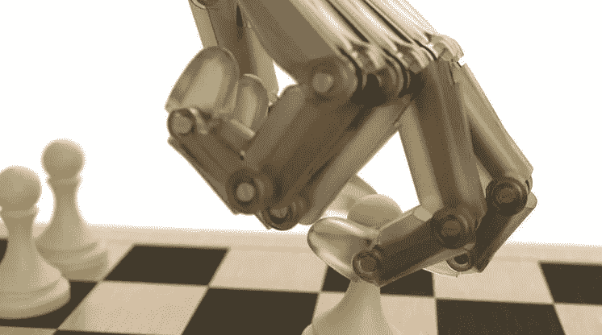

# 代理可以从自我游戏中学到什么？

> 原文：<https://towardsdatascience.com/what-can-agents-learn-through-self-play-37adb3f3581b?source=collection_archive---------9----------------------->

> 如果你想从零开始做一个苹果派，你必须首先发明宇宙——卡尔·萨根

[ [认知状态](http://joyousandswift.org/epistemic-status/):使想法更清晰成形的沉思尝试]

最近几个月，DeepMind 的人工系统在复杂的战略游戏中击败了人类玩家，取得了惊人的胜利:首先是围棋，然后是紧接着的象棋和松吉。他们伟大的新武器？重复的自我游戏，算法收集观察数据，通过自我游戏来学习。先前的方法(包括最初的 Alpha Go)通过学习专家的走法，训练智能体直接模拟人类的战略行为；自我游戏的范式更优雅，让战略洞察力从与另一个战略玩家的互动中消失。

这是一个巧妙的象征，自我游戏；你是自己最大的敌人，你是自己最伟大的老师。在某种程度上，这是愚蠢的:一个嫁接到机械过程中的人类故事。但是故事和人类已经运行良好。

自我游戏的最大好处是你不需要直接监督；代理用来学习的所有信息都来自另一个代理(它自己的克隆体),这个代理为了最大化它自己的目标而行动。在这种更不痛不痒的技术声明中，隐含的好处是功能无限的数据的承诺——仅受我们的计算机限制——机器可以在此基础上飙升至潜在的至高无上。AlphaZero 之所以能如此迅速地跃升为战略能力，是因为考虑到游戏的固定规则，这种积极并行的算法模拟游戏情节的速度比真正的人学习游戏要快得多。

自我游戏之所以诱人，是因为它不受人类收集的数据的限制，甚至也不受人类知识的现有限制，而只是纯粹优化游戏规则。

但是那些规则是什么？

要回答这个问题，我认为值得想清楚允许自我发挥的前提条件。

最重要的是，你需要一些方法来判定谁在一场特定的遭遇战中获胜。当您通过推动代理学习更有可能获胜的动作和状态来激励他们时，这是必要的。即使你没有对算法学习的数据进行硬编码，你也在对你试图优化的策略约束进行硬编码。当策略约束来自另一个玩家的行为时，它们可以被更简单地封装:作为判断游戏最终状态的规则。每种算法都根据你设定的规则来达到一个标准，并且根据它们符合你期望的行为的程度来惩罚或奖励它们。就游戏而言，这些规则很简单，因为游戏是一个固定且受约束的世界。有简单的方法来检查你是否赢了；它的设计是客观的。

这是必要的，因为在自我游戏的世界中，对一个代理人产生战略约束的世界完全是由一个单独的其他代理人的行为创造的。但在我看来，那些战略依赖完全在于试图通过简单规则取胜的代理人的问题是有限的。人类在宇宙中面临的大多数战略约束不是来自其他人，而是来自自然界的动态。

当我们想到 AGI 时，我们想到的是一个具有广泛战略能力的代理人，它也能获得关于世界的信息。我们能想象出什么样的环境，这些环境能产生什么样的习得行为，从而导致这种广泛的战略能力？

让我们想一想，如果我们有一个让自己活着的环境，会发生什么。给定的回合是什么？我们会在一个环境中设置一个代理，并给他们非常宽泛的指令“在最后，并产生最多数量的后代”吗？会有不同程度的其他代理人吗？他们能够结成联盟并传递信息吗？会有你不得不应对的随机事件吗？我们会等待语言进化，还是预先创造语言作为一种能力？环境如何激励代理人制定长期计划，在需要信息之前了解世界，建立联盟？从某种意义上来说，这个场景开始听起来像一个简单的游戏，其中数据是由代理的行为为我们创建的，而更像是一个复杂的环境，在这个环境中，我们假设了许多关于智能生物获得对世界的战略方法的环境的先验知识。

我是不是太过于模式匹配了？从进化已经使用的剧本中剽窃得太明目张胆了？也许吧。也许我们不应该认为进化环境是广义战略生物进化的唯一方式。但是我不知道我已经听到了一个令人信服的论点，关于那个模拟环境**看起来像什么**，从那些基于阿尔法零的存在断言 AGI 即将到来的人那里。

并且，冒着简短离题的风险，我认为人类进化的大框架值得在机器学习的世界里更多的考虑。我从 NIPS 2016 带回来的一个金块(不幸的是，我没有注意到演讲者)是这样一个想法:也许我们不应该只考虑一个人一生中学到了什么，而是全人类在数十亿年的时间里学到了什么？

当我还是个孩子的时候，我学会了如何说话，但在我有生之年，我没有学会为什么要说话。我没有遇到使语言适应的环境因素，也没有因此受到惩罚，没有尝试其他策略，也没有选择这个策略。对环境破坏的惩罚是死亡，这不是你能强加给一个生物并让它继续学习的惩罚。在许多方面，我更像是一个经过微调的网络，而不是一个经过全面训练的网络:我准备好了，就像海绵一样，通过漫长的世代将语言吸收到为它准备的路径中。对我来说，这是一个重要的区别:一旦工具存在，就学习如何使用它，而不是在面对促使它成为必要的动机之后，首先设计这个工具。

所有这些都是在说:如果我们希望通过激励一个智能体去赢得一场游戏来训练它，那么这个正确的比喻是指一个孩子成熟到成年，还是一个物种进化到生存？这个问题来自于(可能过于天真)的观察，即幼儿不会通过试图优化奖励和惩罚的某种客观函数，或者至少不是一种竞争性函数来了解世界。在很多方面，进化已经学会了以生存为标准的宏观目标函数，每个人都在几代人构建的机器基础上学习该目标的子元素:说话、联系、观察，使用一套物种水平的先验知识了解世界。

总结:是的，这是真的，当前最具体的机器学习问题是算法上的细微差别:我们如何以更实用的方式更好、更快地为系统建模。但是，我傲慢的假设是:我们设计的代理人的能力很快将不是由我们可以设计的模型的复杂性决定的，而是由他们成长和训练的环境的复杂性决定的。这些环境必须被设计，由人类明确指定，因为为了以数字速度运行，它们必须被参数化并被赋予可编程的规则。

机器智能的两大优势似乎是它可以迭代学习的速度，以及它可以用来做出决策的潜在巨大的数字数据池。但是，如果我们真的想利用第一个优势来构建一个战略智能体，而不仅仅是一个可以执行人类训练它执行的任务的智能体，我们需要为我们的智能体设计复杂、动态、多玩家的环境，以便在完全模拟的环境中迭代。因为人类已经领先一步了。