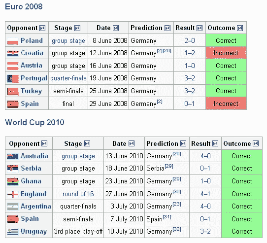
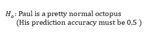
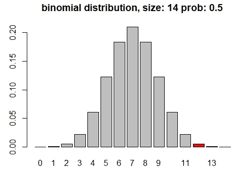
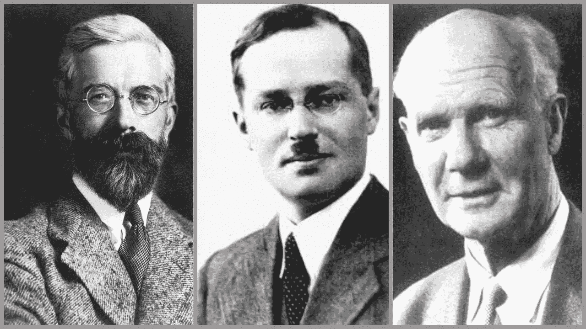
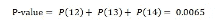
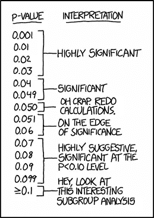
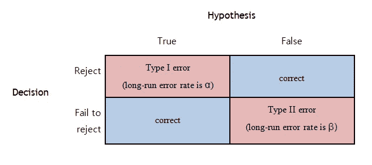
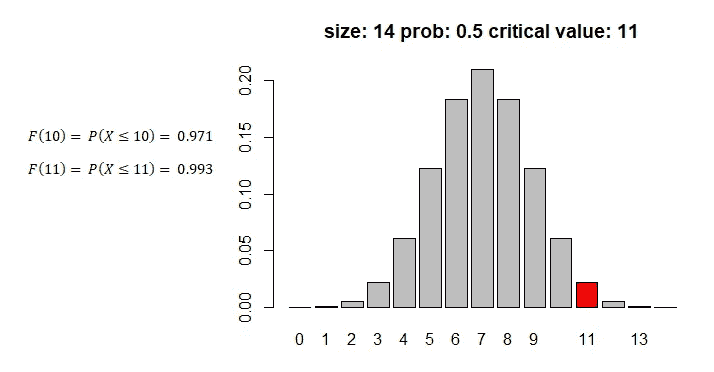

# 关于统计理论中最大的争论，一只章鱼能告诉我们什么？

> 原文：<https://towardsdatascience.com/what-can-an-octopus-tell-us-about-the-biggest-debate-in-statistical-theory-f017295d781f?source=collection_archive---------12----------------------->

Photo by [Serena Repice Lentini](https://unsplash.com/@serenarepice?utm_source=unsplash&utm_medium=referral&utm_content=creditCopyText) on [Unsplash](https://unsplash.com/s/photos/octopus?utm_source=unsplash&utm_medium=referral&utm_content=creditCopyText)

最杰出的统计学家(罗纳德·费雪和杰吉·内曼)会对通灵动物说些什么？

你可以在我的 [Github 页面](https://github.com/tuangauss/Various-projects/blob/master/R/Paul_hypothesis_test.R)找到可视化计算的 R 代码

看看我的另一篇文章:[贝叶斯统计如何说服我去健身房？](/how-bayesian-statistics-convinced-me-to-hit-the-gym-fa737b0a7ac)

见见保罗。！！

保罗是一只出生于英国的章鱼，在德国奥伯豪森过着平静的水生生活，除了玩他的触角爪鱼和享受他每天的贻贝之外，他什么也没做。那是在他以最强有力的方式开始正确并连续预测德国 2010 年世界杯所有比赛结果之前。他短暂的职业生涯拥有令人印象深刻的 12/14 的正确预测记录，比大多数博彩公司更令人印象深刻。

Paul’s more than impressive prediction track record (Wikipedia). He also successfully predicted the WC 2010 final match between Spain and Holland

他的方法？保罗通过从他的水族箱中的两个塑料容器中挑出一个贻贝并吃掉它，预测了比赛的获胜者。你知道的:盛放牺牲贻贝的容器上的旗帜代表胜利者。

奥伯豪森海洋生物水族馆是否藏有一只来自超时空的胡言乱语的黑暗章鱼，或者，事实上，保罗只是一只幸运的普通章鱼，仍然是一个激烈辩论的话题。

***从统计学的角度来看，保罗完美的占卜率是不能随便忽略的。***

那么，统计理论中最有影响力的人物，比如罗纳德·费雪、杰吉·内曼和埃贡·皮尔森，会对这个世界上最受喜爱和蔑视的头足类动物说些什么呢？

我们可以根据非参数统计检验的假设，提出关于保罗常态或超感知觉的基本问题，如下所示:

我们假设保罗只是在没有任何知识的情况下随机选择了一个赢家。在这种假设下，很容易看出，如果在总共 14 个匹配中， ***X*** 是匹配的数量，保罗预测正确，那么***×遵循大小为 14、概率为 0.5 且平均值为 7 的二项分布。***

Graph of binomial distribution with n = 14, p = 0.5\. Red columns represents data at least as extreme as actual observation (12 correctly predicted matches)

然后你会从统计学 101 中得到下一步的想法，我们进行一些假设检验。我们计算 P 值，将其与一些预设的显著性水平进行比较，然后我们可以拒绝或接受 I 型错误率为的零假设。

**没那么快！！！**

我必须阻止你行动太快，跳进计算 *P 值*和得出各种误解和错误的结论。

至少有两种方式*可以进行假设检验程序。介绍的第一个程序是**费希尔的数据测试方法**——显著性测试；第二个是尼曼-皮尔森的方法——验收测试。本文将区分这两种方法之间的差异，并揭示它们在灵媒章鱼保罗(或触角假保罗)的案例中是如何产生分歧的*

**

*From left to right: Ronald Fisher, Jerzy Neyman, and Egon Pearson (Images source: Wikipedia)*

## *P 值到底是什么？*

**P 代表概率(也许？)*。这是一种可能性，但不仅仅是一种可能性。简而言之，从实验中获得的 P 值代表获得至少与观察数据一样极端的数据的长期累积概率，**假设零假设为真**。*

*注意，P 值也是**一个条件概率**，以零假设为真的事实为条件。我稍后将回到它。*

*回到我们心爱的头足类动物，我们看到保罗在 14 场比赛中取得了令人印象深刻的 12 场预测准确性。因此，在预测率为 0.5 的零假设下，我们可以计算出观测数据的 *P 值*如下:*

**

***P 值和费希尔显著性检验***

*罗纳德·A·费希尔(Ronald A.Fisher)提出的 *P 值*是反对零假设的证据指标，其逻辑是:如果从实验中获得的 *P 值*很小，那么我们必须假设一个极其平常的事件刚刚发生，或者概率条件出现了问题。因此，0.0065 的低 *P 值*可以作为随机猜测不能令人满意地解释保罗记录的证据。*

*足以指出的是，Fisher 认为, *P 值*可以用作反对零假设的证据的连续度量。结果从“不重要”变为“重要”没有特定的固定值。正如罗斯诺所说:*

> *当然，上帝爱 0.06 和 0.05 一样多。上帝把支持或反对零的证据的力量看作是 p 的大小的一个相当连续的函数，对此有什么疑问吗？*

*换句话说，对于所有的意图和目的，p = 0.06 和 p = 0.05 构成了反对零假设的相同数量的证据。*

**

*Though following conventions, the choice of significance level could be, at best, arbitray. Source: XKMD*

*话虽如此，在实践中，通过比较研究*p*-值是否小于给定的**显著性水平(0.05 或 0.01** ) **、**，很大程度上使得对研究结果的评估受到约束。*

*似乎很明显，我们的 p 值(0.0065)在 5%和 1%的水平上都是显著的。*

> *但这实际上意味着什么呢？*

*许多人犯的一个常见错误是匆忙得出结论，例如:“*由于测试 p 值<为 0.05(测试具有显著的 p 值)，零假设为真的可能性非常小/我们可以拒绝零假设*。”*

> *这是不对的。跟我念:W-R-O-N-G*

*记得我之前说过， *P 值*是一个条件概率，也就是说，它提供了在假设为真的零假设下观察到的和更极端结果**的理论概率的信息。因为零假设 H 总是真的，所以它不可能同时是假的，也不可能是后验可证伪的。基本上，如果在任何时候你说 H 为假，那么你也使整个测试及其结果无效。***

> *那么解读结果的正确方法是什么呢？*

*一个显著的结果从字面上解释为双重陈述:要么是一个以低概率发生的罕见结果刚刚发生，要么是零假设不能令人满意地解释研究结果。换句话说，你可以说“*随机猜测的无效假设似乎没有解释通灵井保罗的占卜率，因此我们推断，其他过程——我们认为很可能是上帝对保罗的特殊指示——存在，解释了结果**

# *p 值和尼曼-皮尔逊假设检验*

*在费希尔引入显著性检验的八年后，Jerzey Neyman 和 Egon Pearson 发表了另一种统计推断方法，利用了长期误差率而不是证据强度。*

*比方说，零假设可能是真的，也可能不是真的——保罗可能真的是一只正常的头足类动物，也可能不是。(记住:*这种说法在费雪检验中是无效的，因为我们总是假设零假设为真*)。在我们研究的最后，我们不得不拒绝或者不能拒绝零假设。*

*因此，可能会发生 4 种情况。*

**

*本质上，你可以做出一个**正确的决定**(拒绝真或成功拒绝假)，犯一个第一类错误(假阳性——拒绝真零假设)或**一个第二类错误**(假阴性——拒绝假零假设)*

*奈曼和皮尔森设计了一个连贯的频率主义范式，使用 P 值作为正式决策过程的一部分。奈曼-皮尔森范式是这样运作的:*

*   *有一个零假设(*保罗是正常章鱼，成功率 0.5* )*
*   *有一个你认为可能是真的替代假设(*保罗是一只成功率为 0.75 的灵媒章鱼——我刚刚编造了这个*)*
*   *有一个长期的最大假阳性错误率，表示为α。我们预先设定这个错误率，通常是 5%或 1%*
*   *然后，我们需要计算可容忍的长期假阴性错误率所需的样本量β和检验的功效(正确拒绝零假设的概率，为 1β)*
*   *只有在仔细计算了这些特征之后，才能进行实验。在你的研究完成后，你将你的 p 值与α进行比较，如果 p < α*

*Now, if you are thinking that N-P’s α looks very similar to Fisher’s significance level, that’s a good catch as they both use the same conventional cut-off points (5 or 1%). However, there are 2 fundamental differences: 1) α has to be set *先验*(不一定是费希尔显著性水平)，则拒绝零假设；以及 2) α不接受分级——也就是说，在实验之前，您可以选择α = 0.05 或α = 0.01，但不能在同一测试中同时选择两者(而 Fisherian 方法允许您具有更极端显著性的不同水平)*

*从根本上说，N-P 和 Fisher 之间的差异归结为长期 I 型错误率和显著性水平之间的差异(通常被错误地认为是一): ***Neyman-Pearson 对长期假阳性错误率的控制是以排除任何基于观察到的 P 值*** 的证据意义的行动为代价实现的。如果你想控制误差率，那么使用尼曼-皮尔逊方法，并在实验前设置α；如果你想要一个衡量的证据，那么使用费希尔的方法，并解释实验后观察到的*P*-值。不能两个都用。*

## *让我们回到保罗身上，好吗？*

*使用 N-P 范式评估 Paul 的通灵能力的问题是，在实际进行观察之前，我们没有考虑设置、α、β和测试的 1β功效。*

> *是的，在玩弄保罗的神力之前，奥伯豪森海洋生物水族馆的管理员怎么能不考虑假设检验呢？*

*反正为了讨论方便，我们继续进行，假设长期假阳性错误率α预设为 0.01，保罗会在 14 次尝试后耗尽神力，所以尝试次数限定在 14 次。这意味着测试的临界值是 11。*

**

*在这个临界值和样本量下，我们可以计算出长期 II 型误差为 0.47，因此测试的功效为 0.53(请参见我所附的计算 R 脚本)。在一天结束的时候，我们仍然可以拒绝零假设，并相信通过在无限系列的试验中这样做，我们只在 1%的情况下错误地拒绝了它们。*

*请注意这与费希尔的方法有多么不同:N-P 不是**显著性测试**(他们对反对无效假设的证据的强度不感兴趣)，而是**接受性测试**(决定是否接受替代而不是无效)。尼曼-皮尔森框架会说，在你的研究结束时，你必须做出决定，然后离开。*

*与此同时，有传言称，一名研究人员曾带着“不重要”的结果找到费舍尔，问他应该怎么做，费舍尔说，“去获取更多数据”。*

*很抱歉让你一直烦到现在。如果你和我一样，那么我希望你能通过这个小小的(编码)挑战活跃起来？*

**现在让我们假设我们有条件建立完美的实验。我想有一个决策程序，可以确保长期 I 型错误率和 II 型错误率都是 10%(所以功效是 90%)，我至少需要进行多少次观察？**

*(尝试这个问题并在我的 [Github 页面](https://github.com/tuangauss/Various-projects/blob/master/R/Paul_hypothesis_test.R)查看解决方案)*

# *正确的方法是什么？*

**

*都是！！！*

*因为这两种方法来自完全不同的实验范围。*

> *当然，我们已经预见到了这一点*

*然而，这并不意味着在特定的环境中或为了特定的目的，一种方法并不比另一种更合适。*

*至少，在评估保罗的通灵能力时，我希望你能看到费希尔的方法比尼曼-皮尔森的方法提供了更多。费希尔方法的局部范围更符合基础实验科学实际进行的方式，因为我们通常试图在这些结果的基础上对这个系统做出推论。我们希望在给出一些观察结果的情况下得出一些关于 Paul 的结论，其中严格控制α、β和 1β幂的严格实验设计既无必要也不切实际。对于这样的实验，对结果的局部解释应该胜过对整体误差率的考虑。*

*尼曼-皮尔森方法的决策规则应该局限于旨在产生决策的实验——类似于一些临床试验的实验。*

# *但是保罗到底有没有通灵能力？*

*也许是，也许不是。*

*事情是这样的:就我们进行的假设检验(费希尔或尼曼-皮尔森)而言，我们可以有把握地得出结论:随机猜测不太可能产生如此令人印象深刻的记录。然而，这并不是说保罗肯定接受了高等生物的精神指导。至少，没有证据表明费希尔、尼曼或皮尔森喜欢精神推断能力。然而，他们很可能会同意这里面有猫腻(没有双关语！！！)关于保罗做预测的方式。*

*请注意，在 14 场比赛中，保罗在 11 场比赛中专门选择了德国国旗(这在概念上与说“它选择了德国”完全不同)。也许德国国旗有什么吸引保罗的地方。也许，他知道摘下这面旗会让管理员高兴，给他更多的食物。毕竟，作为德国的居民，保罗为什么要冒着被他的第二故乡鄙视和憎恨的风险呢(事实上，就在世界杯半决赛之前，他的确是这样做的)？*

**

*“Where is my German-looking flag?”. Source: Google doodle*

*你会很高兴地知道，保罗短暂而非凡的一生是不可能被遗忘的。*

*章鱼保罗的粉丝们可以在奥伯豪森海洋生物水族馆欣赏一个 6 英尺高的塑料保罗抓着一个足球的复制品，作为对这种软体动物的纪念，在那里他成为了世界杯预言家。*

**

*Image source: Alex Domansky/Reuters*

*来源:*

*[1]罗斯诺和罗森塔尔(1989 年)。心理科学中的统计程序和知识证明。美国心理学家，44(10)，1276–1284*