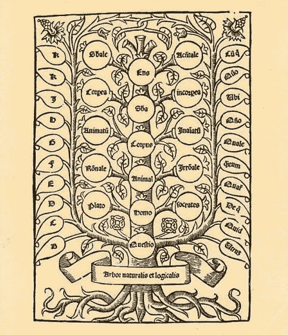
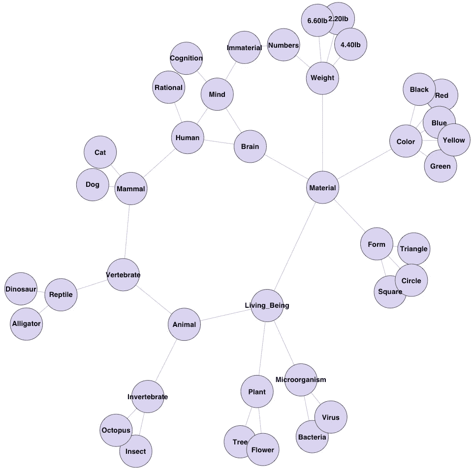
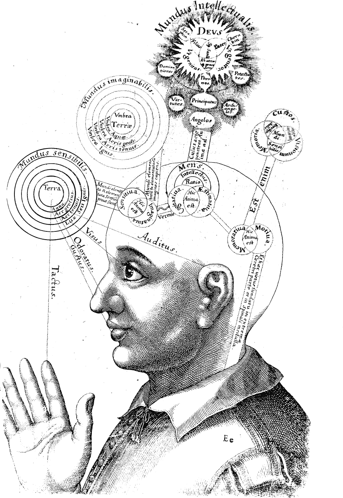
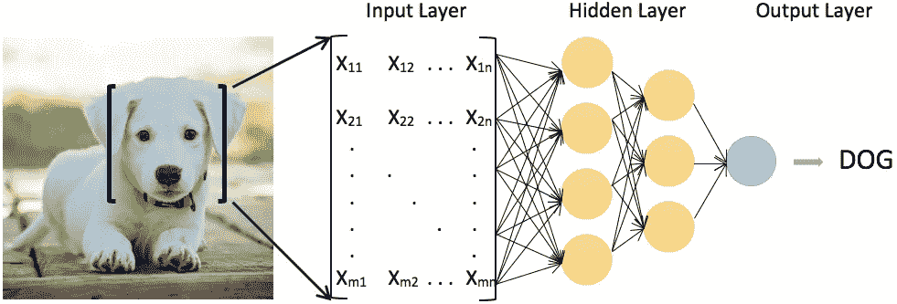
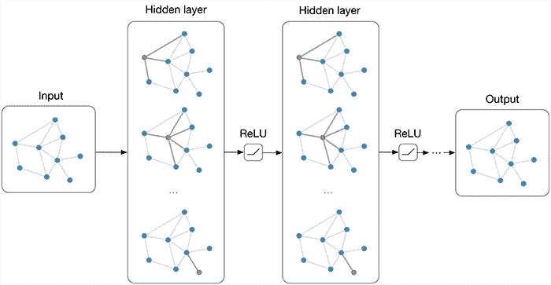
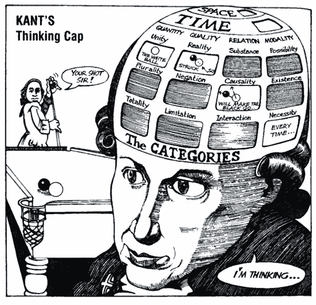

# 哲学能教会机器学习什么？

> 原文：<https://towardsdatascience.com/what-can-philosophy-teach-machine-learning-4ff091d43de6?source=collection_archive---------5----------------------->

## 从苏格拉底到人工智能的认知科学之旅

'Scuola di Atene' by Raffaello. Source: Pixavay

## 从苏格拉底到认知科学

自从苏格拉底向 Thrasymachus 询问正义概念的定义，哲学第一次提出了一个最具挑战性的哲学问题:什么是概念？数百年来，关于概念的性质和结构的探索吸引了世界上最优秀的头脑的注意力；然而，直到 16 世纪和 17 世纪，这种探索才在两种对立的哲学传统之手下充分繁荣起来:经验主义和理性主义。

经验主义者认为概念是头脑中的一种图画或图像。根据这种观点，狗的概念相当于一幅原型狗的心理图画或图像。反过来，公正的概念相当于我们通常认为公正的事物和事件的脑海画面或图像的组合。

另一方面，理性主义者认为概念不应该被理解为孤立的精神图像。相反，他们声称概念更像是一个巨大推理网络中相互连接的节点。

Alonso de Proaza’s illustration of the Porphyrian tree (sixth-century tree representing Aristotle’s categories) in his work "*De logica nova"* (1512). It illustrates one of the first attempts to build an inferential network.

经验主义者和理性主义者之间的竞争源于之前关于思想和知识本质的更根本的分歧。对于经验主义者来说，拥有一个概念就相当于拥有了感知识别和分类物体的能力，这是通过在头脑中计算这些物体所具有的所有感知特征来实现的。例如，拥有狗的概念——并因此拥有关于狗的思想和知识——相当于有能力根据这些物体通常具有的感知特征将狗与非狗的东西区分开来——因此得名( *Empiria* 在古希腊语中是经验的意思)。

相反，对于理性主义者来说，拥有一个概念需要更高的认知能力，也就是理性地得出所有推论的能力。因此，举例来说，拥有狗的概念——因此，拥有关于狗的思想和知识——包括能够推断狗是哺乳动物，哺乳动物是动物，狗也是，动物不同于植物，狗也是，植物和动物都是生物，狗也是，等等。

A graph representing a small inferential network

目前，大多数关于概念的讨论都是在认知科学的框架内进行的。根据这种方法，思维类似于计算机。因此，思维被理解为对头脑中的表征结构进行计算(见 Thagard，2018)。

认知科学方法继承了早期现代哲学的许多概念。事实上，经验主义和理性主义奠定了认知革命的基础。因此，毫不奇怪，多年来，许多认知科学家卷入了两种对立理论框架之间的长期争论:一方面，所谓的概念经验主义，概念原子主义，只是概念的表象观；另一方面，所谓的概念角色语义学，推理主义，或者只是概念的实用主义观点(参见 Margolis & Laurence，1999)。前者认为概念或者是一组基于感知的语义特征(心理图像)，或者是某种类似语言的心理词汇。在这两种情况下，概念都被认为是孤立的心理表征。相反，后者认为概念不是心理表征，而是推理能力的集合。根据这种观点，一个概念的意义在于它与许多其他概念的推理关系。

不言而喻，双方的分歧再现了经验主义和理性主义的同样分歧。因为，这里真正利害攸关的是关于认知本质的分歧，也就是说，那些认为整个认知架构最终依赖于孤立特征集上的计算的人，和那些认为思维从根本上讲是一个在推理性互联节点的大规模网络上进行计算的人之间的分歧。

Robert Fludd’s microcosm diagram of the mind, in his work "Utriusque cosmi maioris scilicet et minoris metaphysica, physica atqve technica historia" (1619)*.*

## 从认知科学到机器学习

你可能想知道这一切与机器学习和人工智能有什么关系。嗯，它实际上做了很多。人工神经网络是连接主义系统。联结主义是认知科学中的一个框架，旨在完全根据神经激活的模式来模拟心理现象。尽管脱离了早期的思维计算模型，即思维只是在符号心理结构上进行计算，但联结主义模型从思维的表象理论中借鉴了许多思想，包括经验主义者(原子主义者或只是表象主义者)对概念的观点(见福多尔&皮里希恩，1988)。

因此，对于连接主义者来说，概念是特征向量表示。特征向量表示是表示特征空间中特定对象或类别的向量。因此，例如，狗的概念只不过是表示类“狗”的特征活动的向量。

Illustration of a feature vector representation of the concept of dog

尽管联结主义的概念方法被证明是非常强大的，但它也有其局限性。当前的机器学习算法非常擅长执行许多我们通常与概念相关的认知任务，如识别事物、寻找相关性、对对象进行分类、记忆模式、编码和检索信息等。然而，我们通常会觉得，在很大程度上，这些算法是对真实人类认知进行建模的镜头。正如 D'Mello 等人(2006 年)所建议的:

> 机器学习通常需要大量准确的训练集，对已知或未知的知识知之甚少，将新知识很少地整合到旧知识中，一次只学习一项任务，几乎不允许将学到的知识转移到新任务中……相比之下，人类学习已经解决了许多这些问题，并且通常是持续的、快速的、高效的、准确的、健壮的、灵活的和毫不费力的。

我认为，机器学习算法现在面临的许多限制，部分是由于缺乏概念认知的完整概念造成的。在心理表征理论(这是认知科学的默认立场)底层的经验主义者精神的驱动下，连接主义者(或神经网络)模型对特征向量活动投入了太多的注意力，将概念之间的推理关系完全排除在讨论之外。

尽管已经有一些严肃的尝试来说明根据关系图表示的概念知识，但是为了在神经网络中实现这样的结构，做得很少。幸运的是，在过去的几年里，一些将图论与神经网络联系起来的研究得出了非常有趣的结果。这些研究有不同的风格。目前，在这个问题上最重要的两个项目是[关系神经网络](https://medium.com/intuitionmachine/intuitive-relational-reasoning-for-deep-learning-3ae164f9f5cd) (RNN)(见巴塔格利亚等人，2018 年)和[图卷积网络](http://tkipf.github.io/graph-convolutional-networks/) (GCNs)(见 Kipf & Welling，2017 年)。这两条研究路线都很有前途，但仍有很长的路要走。

Illustration of a multi-layer Graph Convolutional Network (GCN). Source: THOMAS KIPF’s "GRAPH CONVOLUTIONAL NETWORKS", URL = <[https://tkipf.github.io/graph-convolutional-networks/](https://tkipf.github.io/graph-convolutional-networks/)>

## 从机器学习回到哲学

当面对两种或两种以上对立的理论时，我们通常会觉得有必要选择其中一种。虽然很多时候这是正确的做法，但在对认知进行理论化时就不那么正确了。那些认为概念是特征向量表示的人和那些认为概念是关系图中的节点的人之间所谓的竞争是误导。在我看来，这两种理论不是对手，但事实上，它们需要共同努力，以达成一个更丰富、更现实的人类认知模型。

1781 年，伊曼纽尔·康德出版了有史以来最杰出的哲学和科学书籍之一:KrV。在许多其他事情中，康德意识到经验主义者和理性主义者同时是正确的和错误的。因为，根据康德的说法，概念知识是经验(或康德词汇中的*直觉*)和推理规则(或康德词汇中的*概念*)共同作用的结果。直觉和概念本身都不能让任何人了解这个世界。引用康德*批判*中非常著名的一句话:

> 没有直觉的概念是空洞的。没有概念的直觉是盲目的。

我真的认为康德的认知理论可能会给当前认知科学和人工智能领域的争论带来一些新的启示。特别是，我相信上面引用的话可以很好地适用于特征向量和推理主义的概念方法之间的争论。对于，没有特征向量表示的推理网络是空的，没有推理网络的特征向量表示是盲的。让我进一步阐述一下这个想法。

Source: <[https://medium.com/@rgrydns/kant-how-is-a-synthetic-a-priori-judgment-possible-45af58688600](https://medium.com/@rgrydns/kant-how-is-a-synthetic-a-priori-judgment-possible-45af58688600)>. Original from "*Philosophy for Beginners"*, by Richard Osborne, illustrated by Ralph Edney (New York: Writers and Readers Publishing, 1992), p. 104.

如上所述，绝大多数当前的机器学习算法仅仅依赖于特征活动的向量。这些算法已经被广泛用于从输入中识别、分类和记忆模式。然而，要做到这一点，他们需要接受大量准确数据的训练，一旦他们从训练集中学习，他们几乎没有能力从先前所学中发现和整合新知识。看起来好像机器是认知盲。每当他们学到新东西时，他们都忍不住要重新发明轮子。这些都是严重的问题。

现在，假设一台机器执行复杂的认知任务所需要的只是在大型关系图上进行计算，这些关系图包含成千上万个推理上互连的节点。很容易想象，对于一台机器来说，从它以前学到的知识中发现和整合新知识将会是怎样的。它只需要计算一个给定概念，比如“狗”，和许多其他概念，比如“哺乳动物”、“动物”等之间的适当的推理联系。然而，机器仍然对狗一无所知。因为，如果没有在后台工作的特征向量算法，当提供真实的狗(图片、文字或任何东西)作为输入时，它将无法识别、分类和记忆任何东西。确实，最终，机器会知道狗是哺乳动物，哺乳动物是动物，动物是生物，等等。；但与此同时，它真的对这些事情一无所知。他们的概念将只是空洞的。

威尔弗莱德·塞拉斯(1974)，一位杰出的美国哲学家和新康德主义认知方法的杰出捍卫者，他曾经区分三种不同的概念反应:

1.  **概念输入反应:**感知输入触发适当的辨别/分类/识别概念反应。
2.  **概念内反应:**条目概念反应触发关于其他概念的有效推理模式。
3.  **概念退出反应:**概念内反应引发新的歧视性/分类性/识别性概念反应。

根据这幅图，在入门阶段，输入被处理、识别并在概念下分类。这些概念性的反应反过来又引发了对其他概念的推理性反应，其中许多可能还没有在初级水平上处理过。最后，这种推理转换可以触发对那些在入门级别还没有被处理的概念的新的识别/分类响应，让系统在入门级别没有被完全训练的情况下学习新的东西。

不用说，这种入口-内部-出口的图景是对人类认知的过度简化。一些概念进入反应可能直接导致概念退出反应；概念退出反应可以作为新概念进入反应的输入；概念进入和概念退出反应之间的不一致可能导致认知系统改变或调整节点之间的推理模式等。我想在这里引起注意的是，概念认知是一种复杂的现象，它是不同类型的反应之间非常微妙的相互作用的结果。

## 结论

那么，哲学能教会机器学习什么呢？除此之外，它可以教会它，如果不整合到统一的图片(a)特征向量表示和(b)推理网络，就无法实现真正的深度学习。在完全承认这一点之前，人工智能和机器学习不会在模拟人类认知方面取得太大进展。

# 参考

*   巴塔格利亚·p .等人(2018)，“[关系归纳偏差、深度学习和图网络](https://arxiv.org/pdf/1806.01261.pdf)”， *arXiv:1806.01261v3 [cs .LG】。*
*   D'Mello，S. K .，Franklin，s .，Ramamurthy，u .，和 Baars，B. J. (2006)，“[基于认知科学的机器学习架构](https://pdfs.semanticscholar.org/ff23/f6b95c346484a64d626bdd0f748eef357e65.pdf)”。 *AAAI 2006 春季研讨会系列。美国人工智能协会*。加州帕洛阿尔托:斯坦福大学。
*   福多尔，j .，&皮里申，Z. (1988)，"[联结主义和认知架构:一个批判性的分析](http://ruccs.rutgers.edu/images/personal-zenon-pylyshyn/proseminars/Proseminar13/ConnectionistArchitecture.pdf)，*认知*，28:3–71。
*   Kipf，t .和 Welling，M. (2017)，“[带图卷积网络的半监督分类](https://arxiv.org/pdf/1609.02907.pdf)， *ICLR* 。
*   劳伦斯和马格里斯(1999 年)。[概念与认知科学](https://www.margolisphilosophy.com/concepts-and-cognitive-science.html)，载于*概念:核心读物*，E. Margolis & S. Laurence(编。)，第 3–81 页。
*   塞拉斯，W. (1974)，"[意为功能分类](https://link.springer.com/article/10.1007%2FBF00484606)"，*综合*，27(3–4):417–437。
*   Thagard，P. (2018)，"[认知科学](https://plato.stanford.edu/archives/win2018/entries/cognitive-science/)"，*斯坦福哲学百科全书*，爱德华·n·扎尔塔(ed .).