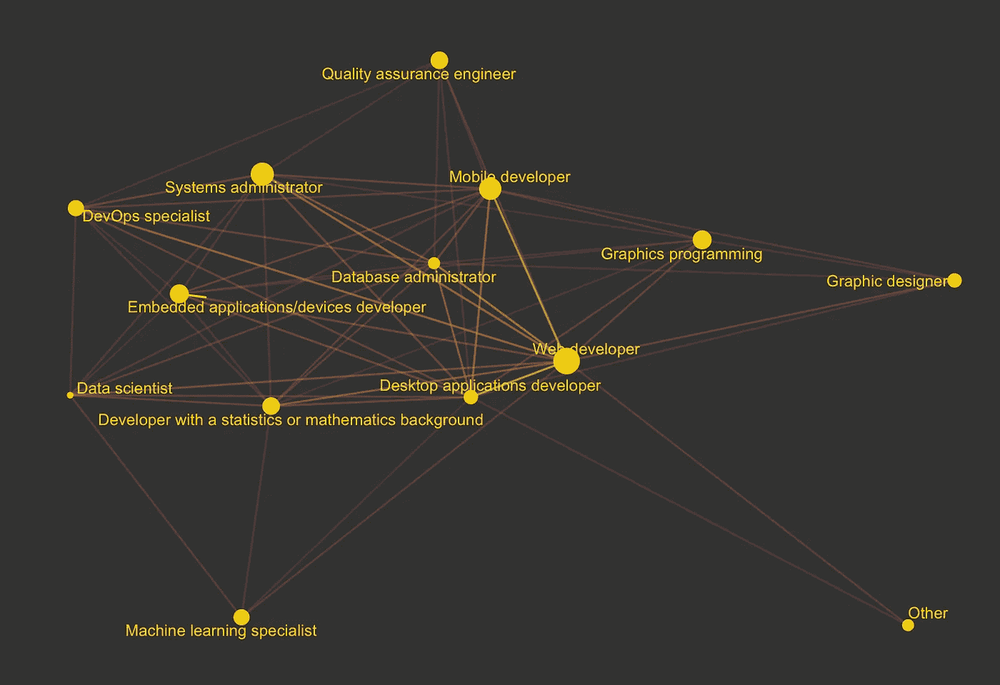
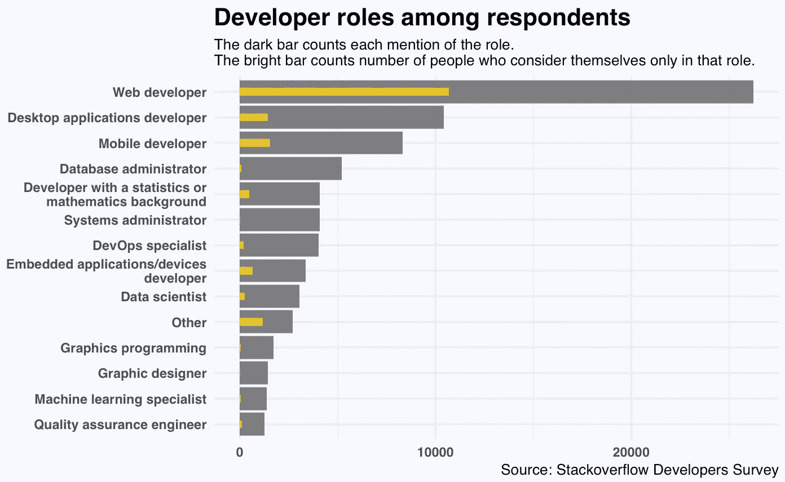
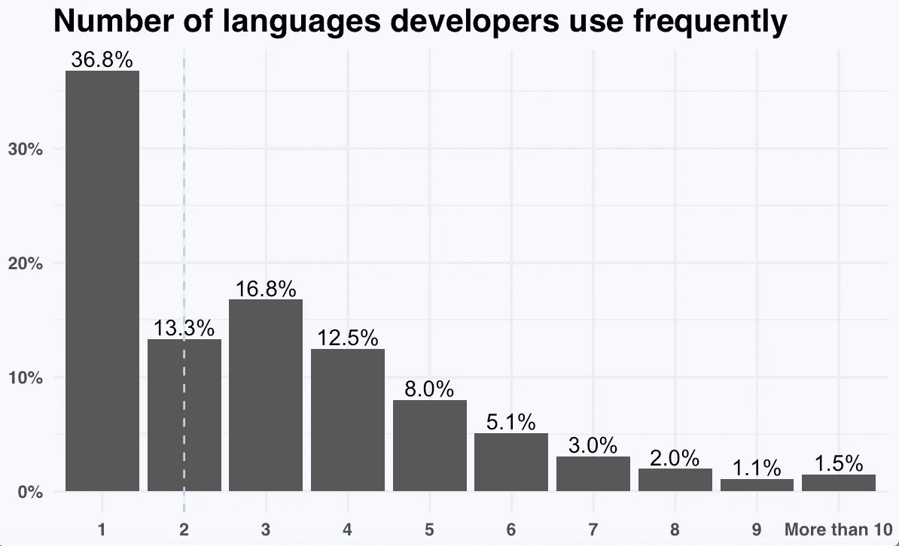
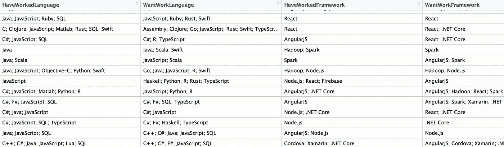
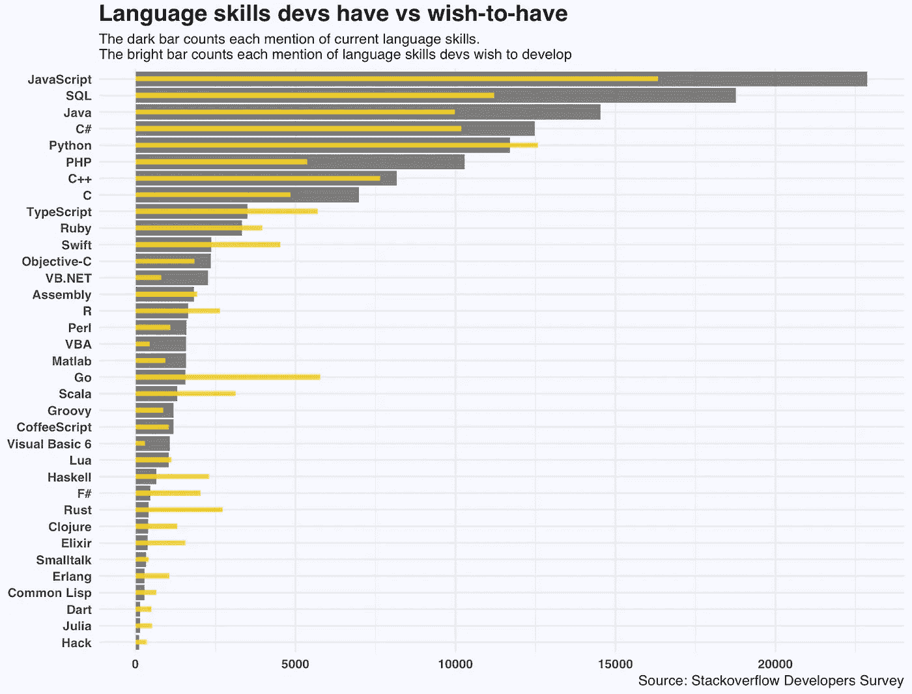
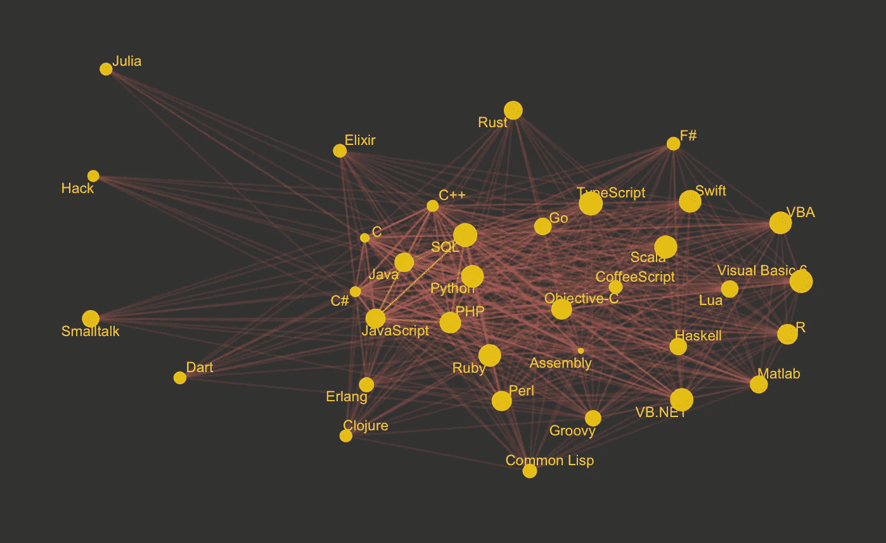
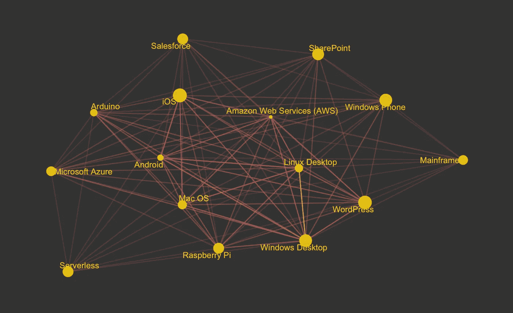
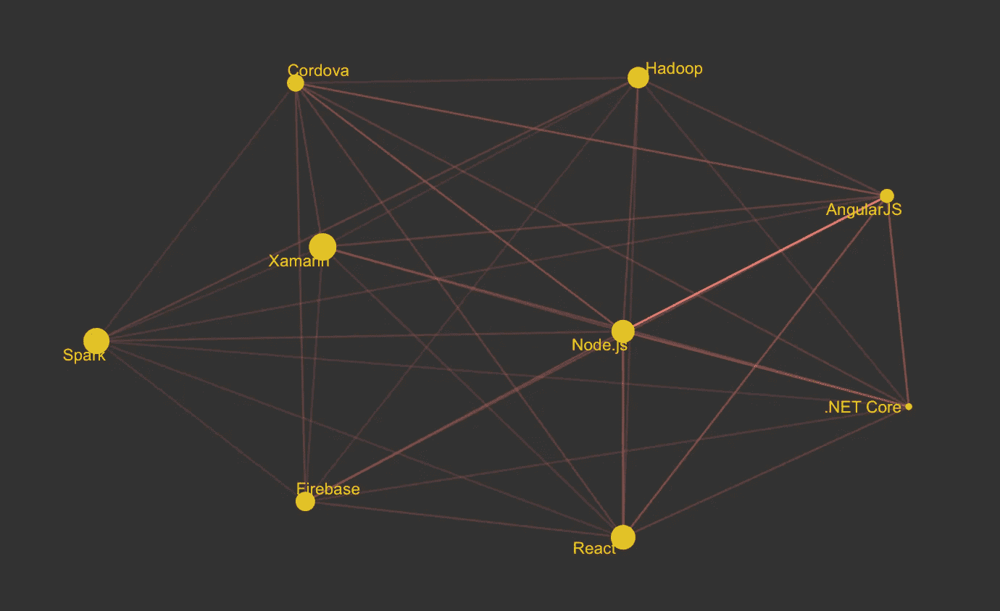
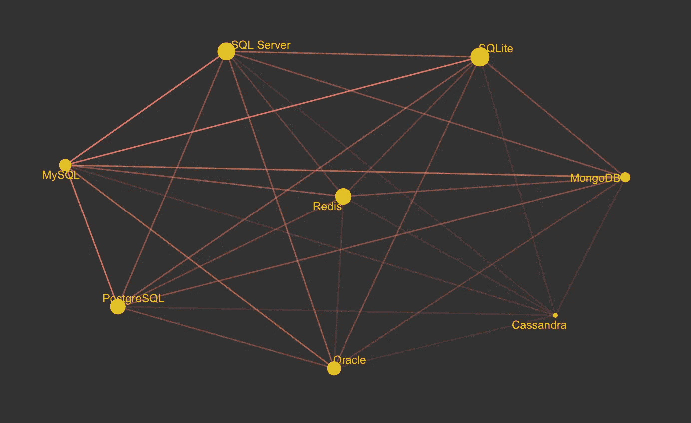

# 开发人员想要发展什么样的编码技能

> 原文：<https://towardsdatascience.com/what-coding-skills-do-devs-want-to-develop-a952ee620312?source=collection_archive---------8----------------------->

开发者的技能是如何相互关联的，技能会如何进化？

在最近的 [Stack Overflow 开发者调查](https://www.kaggle.com/stackoverflow/so-survey-2017)中，70%的受访者明确了他们的角色(前端、数据库管理员等)，其中许多人认为自己身兼数职。

devs of all trade

我们可以看到，web 开发是各行各业开发人员共享的通用技能，而机器学习专家和质量保证工程师更专业。

以下是按角色分列的受访者人数:

经常使用的语言数量的中位数是 2。

number of programming languages used

大约 80%的人使用 1 到 4 种编程语言，同时可能知道更多的语言。

考虑到这一点，我们可以比较受访者使用过的语言和想要掌握的语言。

## 当前技能与未来技能

A snippet of the survey data

由于数据包含了开发人员已经做了什么和他们希望开发什么，我们可以提取额外的语言/平台/框架/数据库，这通常是几个项目的列表。我们可以从整体和细节两方面来看待它们。

我们可以在 TypeScript、Swift、Go、Scala、R、Python、Haskell、Rust 等等里面看到很多兴趣点。

如果研究一下不同语言在每个人愿望清单中的共现情况，结果是这样的:

language skills devs want to acquire

platforms that devs want to work on in addition to what they have worked on

frameworks that devs want to work on in addition to what they have worked on

databases that devs want to work on in addition to what they have worked on

## 进一步的问题和想法

> 对于一个有共现模式的数据集，我们如何直观地把有共现的部分和没有共现的部分一起可视化？

例如，在使用 SQL 的受访者中，大多数人不仅使用 SQL，还使用其他语言。

我觉得一种方法是引入交互性和动画——通过提供放大感兴趣的语言的选项，人们可以看到部分受访者单独使用这种语言，而不是将其作为工具包的一部分，然后扩展到共同出现的语言技能的细节。

> 对于调查数据，我们如何确定它代表了总体？如果它有类别不平衡，我们如何在分析具有网络模式的数据集时考虑到这一点？

如果 javascript 是被调查的最受欢迎的语言，这可能只是因为有许多 web 开发人员返回了调查问卷。因此，我对使用节点大小来表示回答者的数量持谨慎态度，因此同时所有节点大小都显示度数。

> 给定所有的个体变化，我们如何以集体的方式最好地可视化网络的演变？

例如，一个开发人员今天使用 Go、Python、Ruby，将来想使用 Go、Python、Ruby 和 PHP。给定当前的语言集，我们如何可视化添加的语言？这也不同于 VBA 程序员想使用 Python 的场景，这是一种技能的转移而不是增强。

这是我关于数据科学和视觉故事的[# 100 日项目](https://medium.com/@yanhann10)的第 40 天。我的 [github](https://github.com/yanhann10/opendata_viz) 上的全部代码。感谢阅读。欢迎新主题的建议和反馈。