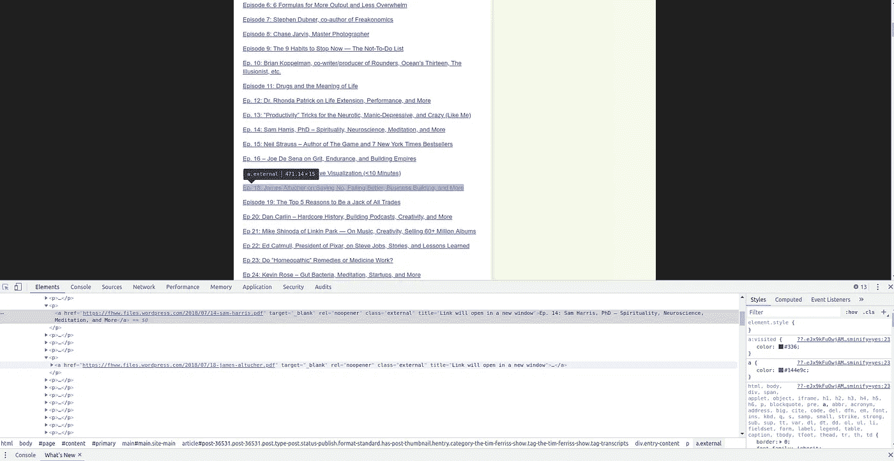
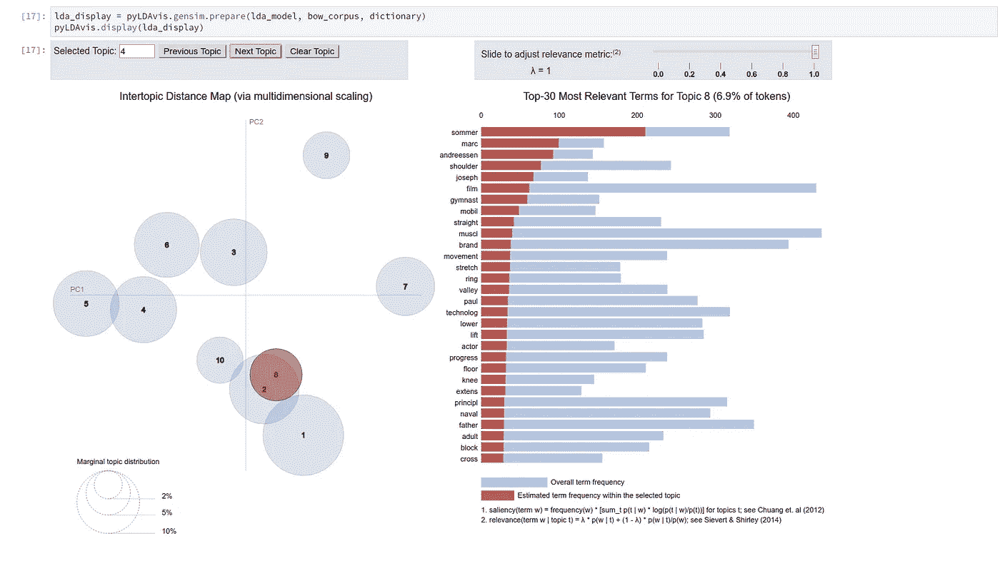

# 成功人士都聊些什么？

> 原文：<https://towardsdatascience.com/what-do-successful-people-talk-about-a-machine-learning-analysis-of-the-tim-ferris-show-161fc7ed4394?source=collection_archive---------16----------------------->

## 蒂姆·费里斯秀的机器学习分析

首先，我是蒂姆·费里斯和他作品的超级粉丝。他的几本书改变了我的生活。他还因他非常受欢迎的播客而闻名——我总是在手机上下载至少几集。因此，当他决定上传《T2》所有剧集的文字记录时，我很兴奋，这一点也不奇怪。作为一名数据科学家(尤其是专门研究 NLP 的)，我知道我能做些什么。我的分析是这样的。

**如果你想跳到结果并自己探索，请导航到互动网站:*[*https://boyanangelov.com/materials/lda_vis.html*](https://boyanangelov.com/materials/lda_vis.html)*

*首先我必须从他的网站上搜集数据。幸运的是，这很容易，因为 HTML 的结构非常好。我下载并解析了 200 集的数据。为此，我使用了一些非常酷的 Python 开源库。*

*任何 web 抓取项目的第一步都是调查网站的 HTML 结构。所有的现代浏览器都包含了可以帮助你的开发工具，在我的例子中，我使用的是 Chrome:*

**

*Using the Chrome developer tools to inspect the URLs*

*接下来的步骤是使用几个典型的抓取和 NLP(自然语言处理)库。其中包括 [BeautifulSoup](https://pypi.org/project/beautifulsoup4/) 和 [NLTK](https://www.nltk.org/) 。*

*最有趣的结果是 LDA 主题模型的可视化。LDA 代表潜在狄利克雷分配，是一种在文本数据中发现模式(主题)的常用技术。漂亮的包 [PyLDAvis](https://github.com/bmabey/pyLDAvis) 允许交互式可视化，你可以看到下面的截图:*

**

*在这里，您可以看到 Tim 和他的客人正在谈论的不同主题的几个分组。大多数话题都与**商业**有关，但也有一些例外，最显著的是**营养**和**运动**。*

*你可以尝试做一些我没有时间做的事情。例如，看看播客中提到的最常见的名字是什么，或者每集之间不同的词汇复杂性，这将是很有趣的。*

*希望这个简短的分析是有趣的，并在你自己的 web 抓取项目中随意借用这些方法。让我知道你发现了什么！*

*Github 的一个要点是重现分析的代码:*