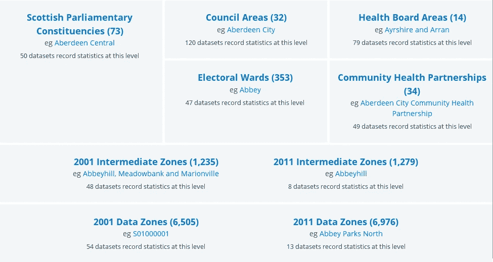
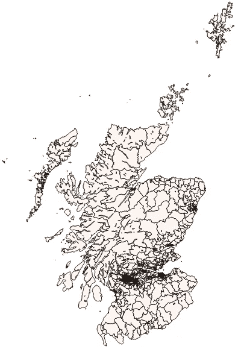

# 金丝雀在苏格兰看到了什么？

> 原文：<https://towardsdatascience.com/what-does-a-canary-see-in-scotland-1c6597d092b9?source=collection_archive---------1----------------------->

*…其中一位卡纳里亚流行病学家在苏格兰登陆，将它与尼泊尔进行比较，最后开始* ***见*** *一* ***小*** *数据…*

很奇怪，几十年前，我成为了[加那利群岛 Linux 用户组](http://www.gulic.org)的一员，并选择了“Shrek 0a”(“Shrek cero a”)作为我的用户名。我不知道史莱克是苏格兰人，因为他的口音不能翻译成西班牙语。当然，我无法想象我最终会生活在这个[“很远很远”的地方(“我们到了吗？”)](https://www.youtube.com/watch?v=basofea2UEs)。

[苏格兰](https://en.wikipedia.org/wiki/Scotland)人口超过 530 万，面积超过 77933 平方公里。这给了我们 67.5/公里的人口密度，比[加那利群岛](https://es.wikipedia.org/wiki/Canarias)(284.46/公里)小 4 倍。但这只是平均水平，因为还有格拉斯哥(3298.0 英镑/公里)，你知道你在哪里。还有因弗内斯(25.1/Km)，你以为你在哪里。还有[(苏格兰)高地](https://en.wikipedia.org/wiki/Highland_(council_area)) (9/km，你所在的地方……很远很远)。

将这些密度与[伦敦](https://en.wikipedia.org/wiki/London) (5，518/公里)[东京](https://en.wikipedia.org/wiki/Tokyo) (6，224.66/平方公里)[纽约](https://en.wikipedia.org/wiki/New_York_City) (10，831.1/公里)…或[西伯利亚](https://en.wikipedia.org/wiki/Siberia)(3/公里)[尼泊尔](https://en.wikipedia.org/wiki/Nepal)(180/公里)…

> 我提到尼泊尔是因为一周前我遇到了来自尼泊尔两姐妹，而就在昨天我偶然发现了 EdgeRyders 的 Matt(小 PDF) *的一个有趣的项目* [*，关于一种跨越深谷运送货物的方法。我想知道如果风允许的话，它是否可以在苏格兰的一些地区使用？这些风能很好地为电池提供能量？也许还有其他的适应措施，比如漂浮的工具，以防设备掉进湖里？*](https://edgeryders.eu/sites/edgeryders.eu/files/Concept.ElectricParamotorUAV.pdf)
> 
> 注意:要习惯“数据”与“关于基础设施的探索性想法”混合在一起。这两件事同时占据了我的头脑。事实和可能性。是什么，又能是什么。如果你恰好喜欢德博诺的帽子，你可以称之为“白帽”和“绿帽”。

总之…我终于开始研究苏格兰的一些公开数据。[这个非常详细的 PDF](https://www.nrscotland.gov.uk/files/geography/noticeboard/20150423-nrs-datadictionary.pdf) 和[这个很好的解释文本](http://www.gov.scot/Publications/2005/02/20697/52626)需要[这个更简单的页面](http://statistics.gov.scot/areas)来帮助理解它(32 **理事会区域**，1000+**中间区域**，6000+**数据区域**):

[http://statistics.gov.scot/areas](http://statistics.gov.scot/areas)

这个[查找页面](http://www.gov.scot/Topics/Statistics/sns/SNSRef/DZ2011Lookups)可能会派上用场。我发现我可以用。带熊猫的 CSV 文件，但是还是不知道怎么处理 [n-triples](https://en.wikipedia.org/wiki/N-Triples) (虽然[我找过](http://blog.datagraph.org/2010/03/grepping-ntriples))。我找到了[边界文件](http://www.gov.scot/Topics/Statistics/sns/BoundMap)，还有一个[QGIS](http://www.qgis.org)苏格兰用户组。

所以…这是我的第一个结果！这只是为了表明我已经使用了每个 2011 年数据区的人口，它们的面积([边界文件](http://sedsh127.sedsh.gov.uk/Atom_data/ScotGov/StatisticalUnits/SG_StatisticalUnits.atom.en.xml)提供了方便。DBF 文件与“中间地带”，与代码，名称，人口和面积)，以获得密度，然后显示它使用 QGIS。印象不深，但我要走了。

Colour is quintiles: most of the territory is in the lowest.

这告诉我们什么？苏格兰大部分地区都有人口密度< 155/km². Not strange considering that the average is 67.5/km², but still, it’s both “huge” and “mostly empty”.

Next Friday, I’ll go deeper and tell you what my **工具箱**开始看起来像…