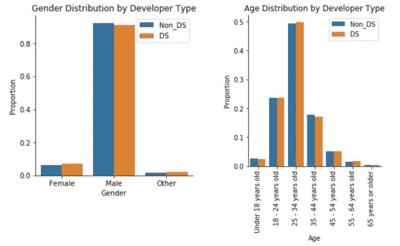
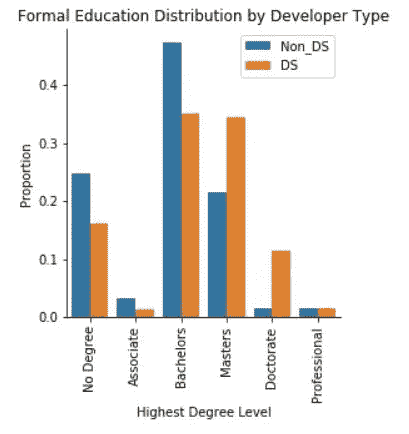
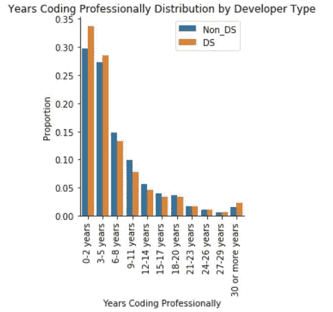
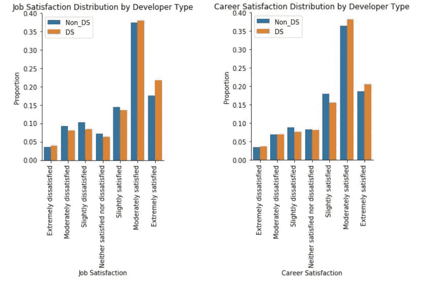

# 数据科学家到底长什么样？

> 原文：<https://towardsdatascience.com/what-does-a-data-scientist-really-look-like-eab503edb1bb?source=collection_archive---------11----------------------->

The cast of HBO’s *Silicon Valley (*Source:HBO)

## 基于 Stack Overflow 2018 年度发展调查数据的分析。

## 介绍

六年前,*哈佛商业评论*将数据科学家评为“21 世纪最性感的工作”,从那时起，数据科学家成为美国发展最快的职业之一，毕业生的起薪达到六位数，雇主的需求继续超过供应。

但是，这些人是谁，幸运地获得了 Glassdoor 所描述的“美国最好的工作”？成为他们中的一员需要什么？成为一名数据科学家真的像宣传的那样好吗？

为了探讨这些问题，我使用了 Stack Overflow 收集的数据来回应他们的 2018 年度开发者调查。该数据集包含来自全球 183 个国家和地区的软件开发人员的近 100，000 份回复。

在受访者中，7，088 人(7.7%)自认为是数据科学家。这些受访者与数据所代表的其余 85，010 名非数据科学家软件开发人员进行了比较。

## 第 1 部分:“典型的”数据科学家是什么样的？

计算机科学和软件开发在历史上被描绘成书呆子男性程序员的领域。看看 HBO 的*硅谷*的演员阵容就明白我的意思了。

但随着最近围绕数据科学的大肆宣传，我希望这种情况可能会有所改变。从事“21 世纪最性感的工作”的前景是否足以吸引更多人口多样化的人从事计算和技术工作？不幸的是，答案似乎是*不*。

Figure 1: Comparison of gender (left) and age (right) distributions for data scientists (DS) vs non-data scientists (Non_DS).

从图 1 中可以看出，数据科学家和非数据科学家受访者的年龄和性别分布几乎相同。数据科学家和非数据科学家的平均年龄都是 30.5 岁，91%的数据科学家是男性，而非数据科学家是 92%。

这表明，数据科学工作的增长并没有吸引个人从新的人口统计学转向计算和技术，而是仅仅为那些无论如何都有可能成为开发人员的人创造了一条新的职业道路。

然而，比较数据科学家和非数据科学家的教育背景确实揭示了这两个群体之间的一个关键差异。

Figure 2: Comparison of highest degree level distributions for data scientists (DS) vs non-data scientists (Non_DS).

图 2 显示，尽管与普遍看法相反，没有硕士或博士学位也有可能成为数据科学家，但数据科学家比非数据科学家更有可能拥有更高的学位，45%的数据科学家受访者拥有硕士或博士学位，而非数据科学家只有 23%。

这表明数据科学和非数据科学开发人员角色所需的技能存在差异，数据科学角色更可能需要作为高级学位课程一部分教授的技能。

## 第 2 部分:数据科学家和非数据科学家的编码技能有什么不同？

鉴于雇主对数据科学家角色的学术要求更高，这就提出了一个问题:与非数据科学家相比，雇主是否也要求数据科学家拥有更丰富的编码经验？

然而，图 3 显示，事实上情况正好相反。

Figure 3: Comparison of the distribution of professional coding experience for data scientists (DS) vs non-data scientists (Non_DS).

数据科学家通常比非数据科学家开发人员拥有更少的专业编码经验，62%的数据科学家受访者拥有五年或更少的专业编码经验，而非数据科学家只有 57%。

这表明，在开发人员的角色中，不是在各个方面对数据科学家提出更多要求，而是在编码技能和大学教授的各种技术技能之间存在权衡。

然而，并非所有的编程语言都是同等创造的，数据科学家和非数据科学家在日常工作中使用的编程语言也不一定相同。

数据科学家更有可能使用为统计建模和分析而设计的语言或带有统计建模和分析库的语言，如 Python 或 R，而非数据科学家更有可能使用与 web 开发活动相关的语言进行编程，如 HTML、CSS 和 JavaScript。例如，77%的数据科学家报告在过去的一年中使用 Python 编程，相比之下，35%的非数据科学家使用 Python 编程，而 72%的非数据科学家报告在过去的一年中使用 JavaScript 编程，相比之下，55%的数据科学家使用 JavaScript 编程。

这反映了数据科学家和非数据科学家通常执行的任务类型的差异，前者通常专注于使用统计和建模技术从数据中获得洞察力，后者更可能参与软件工程或 web 开发类型的活动。

## 第三部分:数据科学家比非数据科学家对职业更满意吗？

如果数据科学家真的是目前最好的工作，那么我们会期望数据科学家比非数据科学家对他们的工作和职业更满意。这正是我们从数据中观察到的。

然而，尽管数据科学家确实比非数据科学家更倾向于对自己的工作和职业感到满意，但这两个群体都倾向于对自己的工作/职业感到高度满意。

图 4 显示，73%的数据科学家和 70%的非数据科学家对自己的工作至少略有满意，而 74%的数据科学家和 73%的非数据科学家对自己的职业至少略有满意。

Figure 4: Comparison of the job satisfaction (left) and career satisfaction (right) distributions for data scientists (DS) vs non-data scientists (Non_DS).

因此，即使数据科学的职业不适合你，任何与发展相关的角色都可能导致类似于“美国最好工作”的工作和职业满意度水平。

## 结论

在本文中，我们探讨了获得一份数据科学家的工作需要什么，以及这与获得非数据科学家开发人员角色有何不同，并根据 2018 年 Stack Overflow 年度开发人员调查的数据，比较了这两个群体中人们的工作和职业满意度。

由此，我们发现:

**1。**虽然数据科学家和非数据科学家往往来自相似的人口背景(即主要是年轻男性)，但数据科学家比非数据科学家更有可能拥有更高的学位，但往往缺乏专业的编码经验。

**2。**与非数据科学家相比，数据科学家更有可能使用侧重于统计和建模的编程语言，如 Python 和 R，而非数据科学家则倾向于使用侧重于 web 开发的语言，如 HTML、CSS 和 JavaScript。

**3。**尽管数据科学家比非数据科学家享有更高的工作和职业满意度，但这两个群体都倾向于对自己的工作和职业高度满意。

综上所述，典型的数据科学家似乎是典型的书呆子男性程序员:30 岁出头的男性，拥有高级学位，并有一些用 Python 或 r 等语言编程的专业经验。

然而，仅仅因为这是一个“典型的”数据科学家现在的样子，并不意味着这是一个人未来的样子。事实上，为了全球经济，这种形象需要改变。

如前所述，数据科学是一个快速增长的职业，需求一直超过供应，预计未来许多年都将如此。

满足这一需求的最佳方式是，雇主想方设法吸引传统上在计算机科学和技术领域代表性不足的人群加入这一行业。

因此，如果你不认为自己符合“典型”数据科学家的标准，那么我的建议是:**不要气馁**。

在数据科学职业中，各种背景的人都有很大的发展空间，根据数据科学家对工作和职业的满意度，努力培养获得数据科学职位所需的技能是非常值得的。

毕竟，谁不想从事“21 世纪最性感的工作”呢？

要了解关于这个分析的更多信息，请访问这个项目的 GitHub 资源库，这里有。

*Genevieve Hayes 博士是数据科学家、教育家和人工智能及分析专家，拥有*[*Genevieve Hayes Consulting*](https://www.genevievehayes.com/)*。你可以在*[*LinkedIn*](https://www.linkedin.com/in/gkhayes/)*或者*[*Twitter*](https://twitter.com/genevievekhayes)*上关注她。她还是* [*价值驱动数据科学*](https://www.genevievehayes.com/episodes/) *的主持人，这是一个每月两次的播客，面向希望最大化其数据和数据团队价值的企业。*

*想要发掘企业数据的价值，但不知道从哪里开始？**[***下载免费的数据科学项目发现指南。***](https://www.genevievehayes.com/discovery-guide/)*