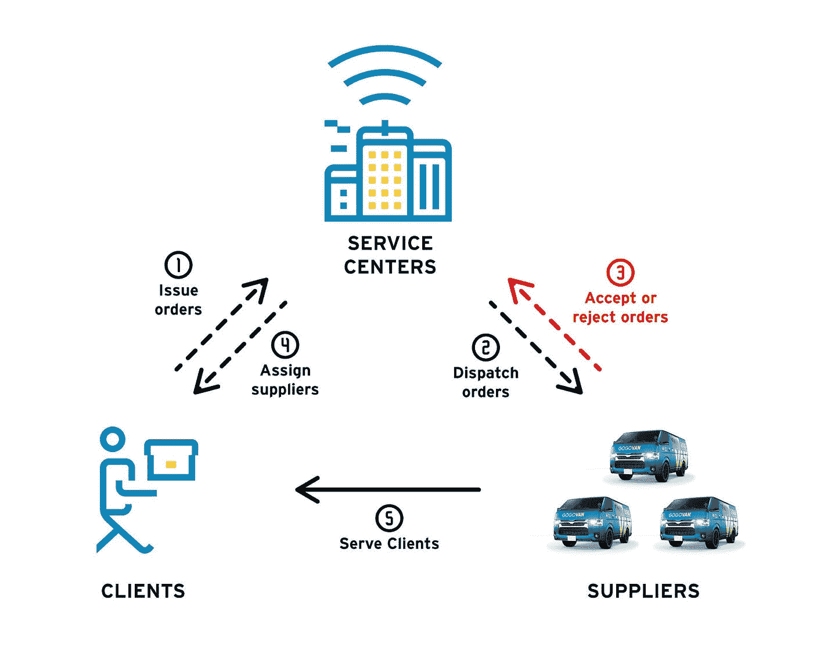
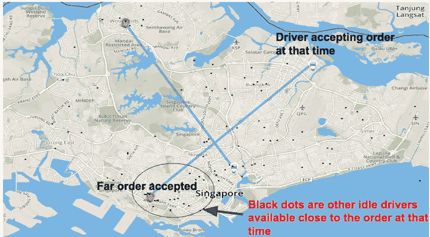
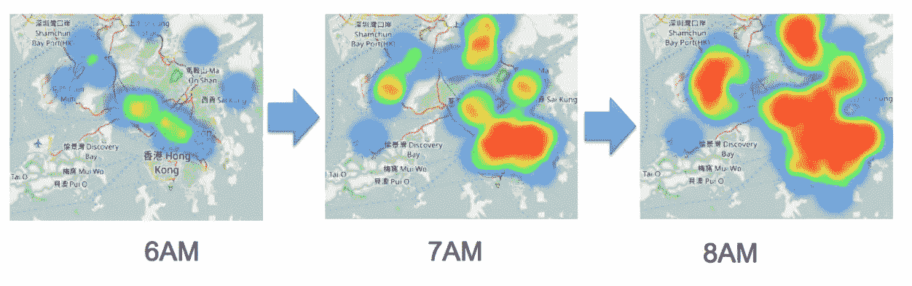
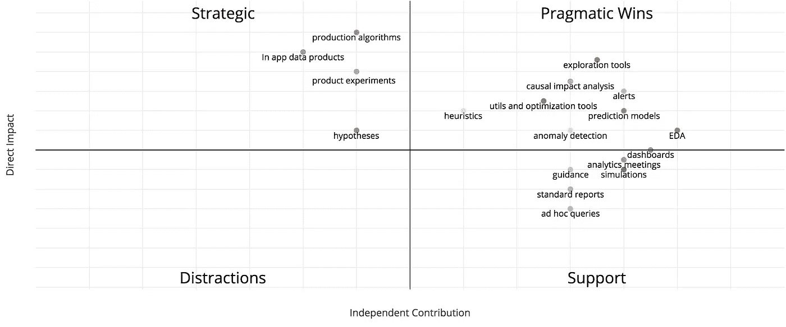
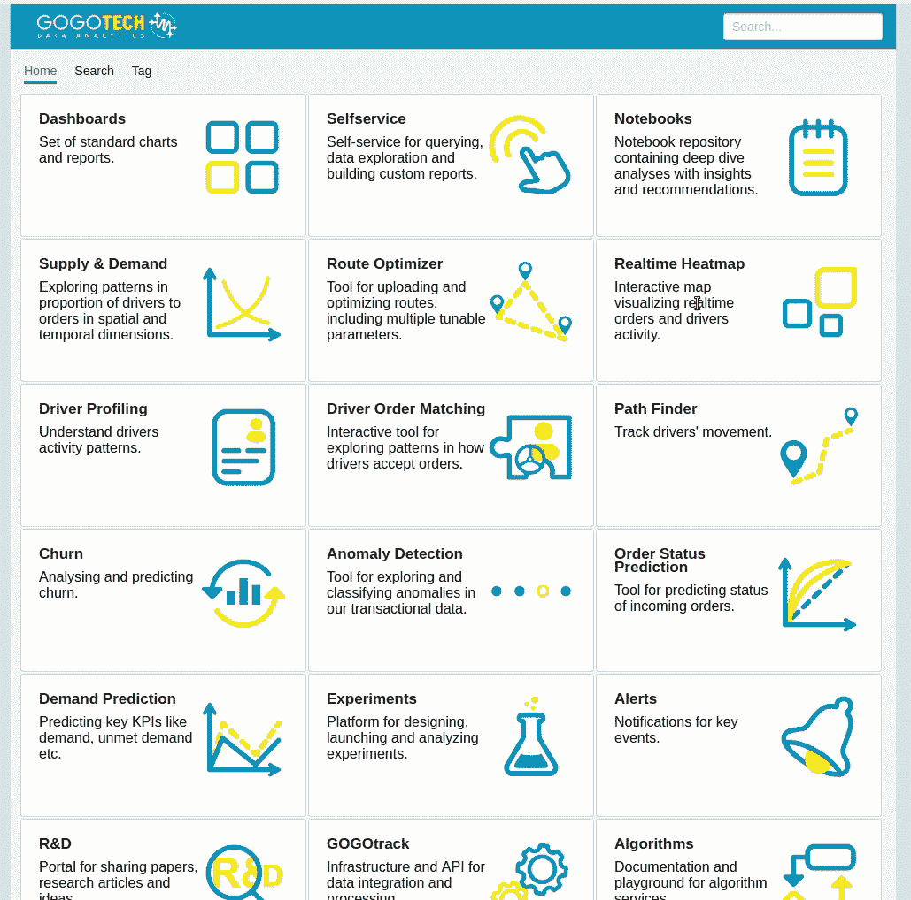
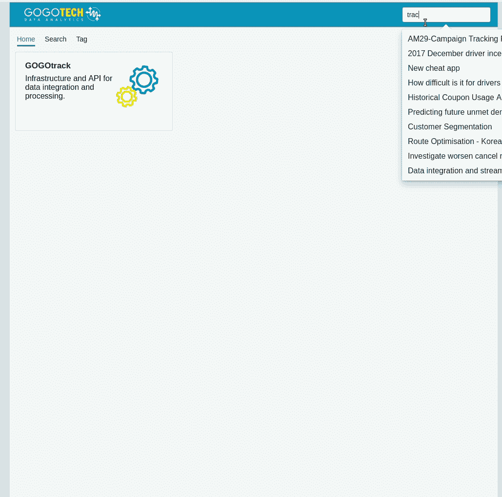
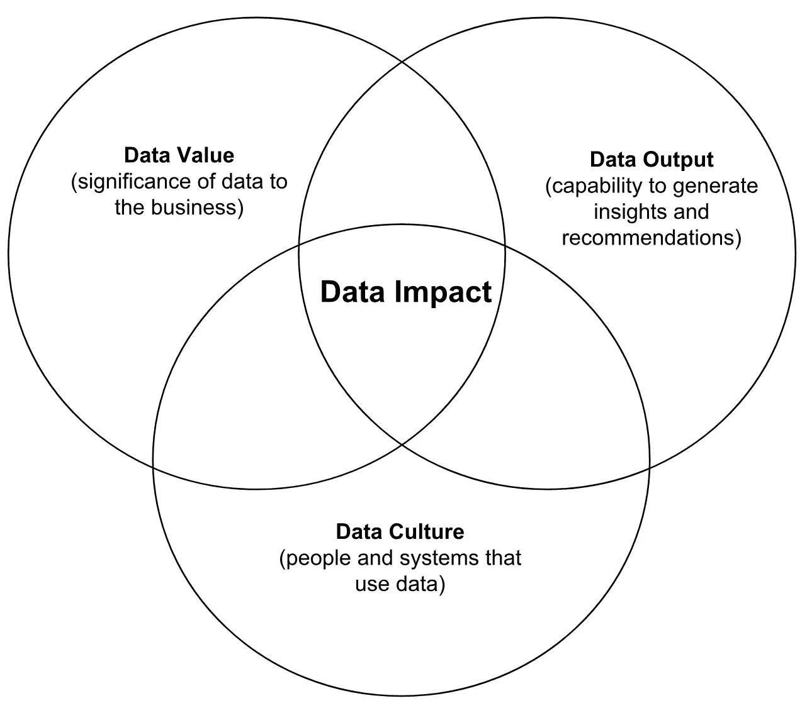

# 数据团队真正做的是什么？

> 原文：<https://towardsdatascience.com/what-does-a-data-team-really-do-12484482e683?source=collection_archive---------0----------------------->

## 充分利用数据的指南。

那些玩“大数据”、复杂数学、酷酷的代码和花哨的可视化工具来取乐的数据人是谁？

嗯，很可能……:)可能我们在工作的时候确实很开心，但更重要的是，我们沉迷于改善事物，解决值得解决的难题，并产生真正的影响。

在本文中，我将:

*   解释我们的数据团队做什么
*   展示其原因和方式
*   展示创造高效数据驱动环境的机会

It 是以清单的形式整理出来供参考。如果您正在进行分析工作或考虑您的组织如何才能最好地从数据中受益，那么您可能会发现以下几点特别有用。

1.  **目的** —我们工作的目的是什么？
2.  第一原则——什么最重要？
3.  **影响** —影响对我们意味着什么？
4.  **数据驱动框架** —如何系统化和扩展这种影响？
5.  **分析工具集** —我们可以通过哪些方式传递价值？
6.  **利用** —如何充分利用分析？
7.  **责任** —我们应该做些什么来让整个组织变得更好？
8.  回顾——我们怎样才能确保自己尽了最大努力？
9.  愿景——我们要去哪里，下一步是什么？

## 目的

高层次的**分析**(为了简化本文，我将所有与数据相关的工作，如商业智能、产品分析、数据科学、数据工程[等放在一个大的“分析”桶中)是一个强大的工具集，它使我们能够改进业务的任何方面。](https://www.datasciencecentral.com/profiles/blogs/17-analytic-disciplines-compared)

GOGOVAN 的使命是“随简单而动”。我们的数据团队在这里确保无论何时您需要将某物从 A 点移动到 B 点，您都能获得最佳体验。

我们可以通过帮助团队成员和整个组织的系统做出决策并采取行动使我们变得更好来做到这一点。在 GOGOVAN，我们的数据团队在所有领域开展工作，包括运营、财务、营销、产品、客户服务、工程和战略，通常与这些职能团队密切合作，帮助他们有所作为。

> 我们的目的是通过促进整个组织做出更明智的决策来产生真正的影响。

## 基本原理

根据柯林斯英语词典，首要原则是指“理论、系统或方法所基于的基本概念或假设。”

当我们与我们的团队合作时，它有助于理解从我们的业务角度来看什么是潜在的价值，以及我们想要完成什么。

就我们公司而言，我们专注于按需物流的核心要素，以便我们能够为我们的客户、合作伙伴和业务利益相关方提供最佳结果。

这真的很简单:

*   顾客希望他们的商品能够快速、便宜、可靠地送达。
*   **司机们**想通过高效地完成工作来赚钱。
*   **企业**希望扩大并留住客户群，增加收入并降低成本。

举个例子，让我们把我们提供给客户的服务进行分解。对我们的客户来说，重要的是:

*   **价格**
*   **质量**
*   **时间**

价格很简单，越便宜越好。质量与如何提供服务有关，尤其是我们合作伙伴的可靠性、对我们处理商品方式的信任、沟通、支持以及我们产品的 UX。时间可以分解为响应时间、到达时间和交付时间。

因此，如果我们能够改善其中的任何一个方面，就意味着我们的服务变得更好，这应该会让客户更满意，从而促进业务增长。

> *对我们来说，第一原则思维意味着关注那些至关重要的事情。*

## 影响

分析就是要对业务产生影响。当我们确定什么是重要的时，关键问题是我们如何影响它。我们可以通过许多方式对业务产生影响，但让我根据我们运营中的一个例子来解释一下。

我们平台的核心竞争力之一是将订单与司机匹配起来。

Example activity — drivers-orders matching

为了改善我们对客户的服务，我们的工作应该集中于发展能力，使我们能够系统地改善所有的组成部分，如价格、质量和时间。

那么，我们如何更好地利用“驱动因素-订单匹配”活动的这个例子呢？

下面是我们很久以前使用我们构建的交互式数据探索工具在新加坡运营中发现的一个例子。您可以看到，在这种特殊情况下，订单可以由在那个时刻有空且更接近订单的司机接受。

Example of order assignment (visualized by interactive data tool).

*   通过匹配离取货地点更近的司机，到达和交付时间将更快，司机的成本将更低，司机时间的利用率将更高，因此，他将能够完成更多订单并赚得更多。
*   通过整合订单和设计最佳路线，我们可以为客户提供更好的价格，同时为指定司机提供更高的总价值。
*   通过为特定订单推荐 a)最适合该特定订单，b)最有可能接受该订单，c)并成功完成该订单(对完成该类订单的评分较高)的司机，我们还可以确保提供最优质的服务。

那时，除了构建可以滚动时间和监控操作的交互式工具之外，我们还进行了深度分析，并创建了突出异常值的脚本。我们继续致力于各种自动化数据驱动的方法，以不断改善我们的运营。

当然，这只是数据驱动方法可以发挥作用的一个活动。我们工作中的其他一些例子包括:

*   通过设计激励措施和政策来平衡供求关系
*   客户细分和优化营销活动的绩效
*   预测和吸引流失用户
*   跟踪和改进产品的性能
*   检测欺诈和异常

还有更多…

> 产生影响我们核心竞争力的影响是三赢——客户赢、司机赢、业务赢，数据团队乐于产生真正的影响。:)

## 数据驱动框架

Distribution of demand in Hong Kong

有时候，说“让我们买个算法或者雇个聪明的顾问来解决 x 问题”可能很有诱惑力。虽然在数据科学环境中可能有这样的地方和时间，但我确实看到了一个大问题。

我们的生态系统不是一成不变的，在系统反馈循环中提炼解决方案和进行学习的迭代过程有很大的价值。这导致了积累的知识，在我的经验中，这些知识非常有价值，并加速了获得“[模式识别](https://www.inc.com/les-mckeown/the-most-important-leadership-skill-you-need.html)”的魔力。

GOGOVAN 经济是一个动态复杂的生态系统。在一些底层服务组件之间可能存在权衡。另外，今天行之有效的东西很容易在明天(甚至是同一天)改变，在一个市场行之有效的东西在另一个市场可能表现不佳。

因此，不一定要有一个完美的公式或实现任何特定的方法来解决它。但更重要的是，它是关于拥有一个框架，在这个框架中，我们可以管理所有的参数，从而持续、渐进和系统地改善我们为客户和合作伙伴提供的服务。

该框架应该允许立即:

*   班长
*   设计
*   部署
*   调整
*   评价

所有对我们努力优化的事情有贡献的关键流程。

当面临任何业务或技术决策时，类似的标准可能是有价值的。每当我们做出一个关键决策时，我们可以问自己:“这如何有助于我们提高为客户和合作伙伴提供服务的能力？”

> *数据驱动框架旨在创造一种环境，在这种环境中，我们可以系统地控制并持续改进我们的成果。*

## 分析工具集

与一些数据科学课程可能让我们相信的不同，事实是，作为一名数据科学家，除了开发尖端的深度学习模型，还有更多方法可以产生影响。:)

根据我的经验，当数据科学家专注于手头的问题，并选择最务实的方式来有效地解决问题时，他们会取得最好的结果。**快速迭代、学习和改进解决方案会带来很多价值和满足感。**

此外，作为更广泛组织的一部分，我们需要务实。构建控制调度所有方面的通用生产算法可能是最终的解决方案，但是它需要比数据团队更多的输入和资源。

那么，作为一名数据科学家，我们能为企业做出哪些贡献呢？

Matrix showing tools available to the data scientist. To play with the interactive version and see descriptions you can use this [link](https://plot.ly/~michalszczecinski/6/) and hover on points.

上述可视化的目的只是为了展示数据科学家的库存中有不同的“工具”来产生影响。通常，当我们说工具时，我们指的是语言、库、可视化和查询技术，在这里，我只是根据数据科学家可以交付的工作成果或他们可以执行的活动来介绍它。

有时候，考虑我们能够产生影响的最务实的方式可能是有益的，这就是为什么我使用这两个轴来形象化它——直接影响和独立贡献。

**直接影响** —产出或活动对业务的直接影响程度。例如，拥有一个自动分配驱动程序的算法比为运营团队提供匹配驱动程序的报告具有更直接的影响。

**独立贡献** —这仅仅意味着我们可以在多大程度上在数据团队中独立完成，而不必依赖其他基础设施、资源或影响产品路线图。

其他要考虑的事情还可能是每个工作产出的复杂性、时间和可伸缩性。

这并不是“科学的”，只是为了说明，在每个组织和数据团队中，根据各自的战略、基础架构、技能组合或某个时间点和公司增长，感觉会有所不同。

在我们的案例中，我们的工作包括所有工具的组合，这取决于任务是什么，它需要多精确，可用时间以及谁和如何使用它。在 GOGOVAN，我们创建了一个主数据平台，为“一切数据”提供一站式服务。它允许您搜索、导航、标记、协作和贡献成千上万的图表、报告、交互式工具、笔记本、查询、仪表板、算法和其他资源。

data platform — navigation

data platform — search

我们的数据平台可以很容易成为博客文章本身的主题，如果你对更多细节感兴趣，请让我知道。

> 分析工具集提供了许多产生影响的方法，因此选择最合适的方法并实际应用它们。

## 利用

有人可能会问“嘿，数据团队做了这么多工作，但是我们能在公司中多好地利用所有这些数据和工作呢？”。答案是视情况而定。这是一项团队工作，我们不会孤立工作，可能影响数据团队工作的因素有:

*   产品和系统集成和迭代数据驱动特性的能力
*   组织中的数据文化
*   职能团队经理的风格和经验
*   跨团队沟通和协作
*   本组织的战略决策
*   操作流程和程序

例如，公司拥有的用户越多，即使是很小的变化也会影响到越多的人，因此优化的潜力就越大。数据越多的公司面临的挑战和机遇就越大。最后，企业的类型将决定技术在其核心竞争力方面能发挥多大的作用。组织对使用数据的态度越开放和支持，人们就越有能力根据数据做出决策和采取行动。

因此，您的目标可能是扩展这三个领域(数据价值、数据文化和数据输出)，使它们变得尽可能大和尽可能重叠，并且您能够通过让人们接受良好的数据教育并以良好的态度使用数据来产生足以解决关键问题的数据输出并很好地利用它。

就我们个人而言，我相信数据的潜力和价值是巨大的。物流非常适合优化，具有大规模和快速的增长，作为技术初创公司，这意味着我们正在收集关于我们服务的大量数据，包括应用遥测数据、GPS 位置、交易数据、营销信息、客户服务数据、远程信息处理信息等…

> 分析的利用是指在公司用正确的数据文化创造正确的数据输出，以服务于正确的数据价值。

## 责任

我相信数据团队处于一个独特的位置，可以对组织的每个部分产生影响。我们非常幸运能够每天与数据密切合作，因此我们经常能够在问题和机会出现在其他团队面前之前发现它们，这是有意义的。这就是为什么我们积极主动、清晰沟通、与整个公司的人密切合作并认真对待我们的责任是如此重要。

数据团队的主要角色是:

*   提供信息和决策支持
*   发现见解和分享知识
*   跟踪公司产品的性能和进展
*   如果出现问题，会发出信号并发出警告
*   促进全球跨团队协作和分享最佳实践
*   让数据民主化，让人们能够使用数据
*   促进数据驱动的决策
*   优化公司服务和业务活动
*   通过创新和开发知识产权提供竞争优势
*   贡献可能革新服务或产生新商业模式的解决方案

我们有责任教育员工，分享我们在整个组织中发现的知识和见解。信息不受限制地流向正确的人和系统是非常重要的，这样我们就可以改进我们的服务并尽快解决任何问题。在 GOGOVAN，我们定期举行开放式分析会议，创始人、管理层和任何感兴趣的人都可以参加，学习和讨论我们正在进行的最新项目和见解。

> 巨大的数据带来巨大的责任。

## 回顾

定期回顾我们正在做的工作是很有用的，特别是看看我们是否得到了我们期望的结果，以及我们正在产生什么影响。我们可以从中学习，并利用它来计划下一步的行动。

**对思考影响有用的问题:**

*   这项工作的预期成果是什么？
*   我想解决什么问题？
*   我想回答什么问题，为什么？
*   我如何知道我所做的对公司有贡献？
*   我今天能做些什么来让公司或我们的服务变得更好？
*   来自埃隆马斯克:什么是[效用增量](https://www.reddit.com/r/elonmusk/comments/5bu1rq/what_does_elon_musk_mean_when_he_said_what_would/)？
*   蒂姆·费里斯:[我现在能做些什么来让其他事情变得简单或不相关？](http://www.businessinsider.com/tim-ferriss-productivity-hack-2014-6)
*   今天我能做些什么来赢得这一天呢？

**除此之外，我们还不断尝试检查我们的工作方式、最佳实践和技术:**

在军队中有一种叫做 AAR 的东西([行动审查后](http://www.au.af.mil/au/awc/awcgate/army/tc_25-20/tc25-20.pdf))。我们做的一件事是在我们的分析会议后，我们有一个快速的回顾会议。我们每个人都输入时差，然后讨论三个问题:

1.  怎么样了？
2.  什么进展顺利？
3.  我们能改进什么？

这是一个非常开放和支持性的环境，每个人都可以发表评论并提出改进建议。然后，我们确保在下一部作品中纳入这些评论。我们有**最佳实践笔记本**,其中包括代码片段、解释、可视化等，根据我们的经验，这些都很有效。

> "我们决不能忙得抽不出时间来磨利锯子."斯蒂芬·柯维

**我们试图以优化数据科学家的工作效率和体验的方式来设计我们的工作环境。**我们做的一些事情包括:

*   在设计我们的分析基础架构和模式时，要考虑简单性、灵活性和性能
*   使用领先的工具和库(是的，我们喜欢 Python、Pandas、Spark 等。并拥抱开源)
*   拥有可提高再现性和协作性的笔记本模板
*   为常见的功能和活动创建实用程序(例如直接从 Jupyter 向我们的数据平台自动发布和标记 HTML 笔记本)
*   使用文档化的环境，以便新的数据科学家可以进来，运行几个命令，一切准备就绪，开始在几分钟内提供价值…

> 回顾你工作的影响，问正确的问题，思考预期的结果，并回顾结果。

## 视力

简单地说，愿景就是描绘一幅美好未来的图画。在未来，我看到一个令人敬畏的数据团队为公司的成功做出巨大贡献。

尽管我们在 GOGOVAN 的所有领域都做了大量的工作，但在我看来，这只是一个热身，我们仍然有很多机会和方法来改善未来。

我们创造强大而全面的数据能力，帮助公司实现其目标(在我们的情况下，增长，为我们的用户提供最佳服务，并发展竞争优势)。我们渴望在这方面成为世界上最好的。

对我们来说，非常令人兴奋和充满希望的下一步是扩展我们在系统中自动和直接做出智能决策的能力。要做到这一点，我们必须投资于领先的基础设施和应用人工智能/人工智能能力，使我们的服务更好。

> 我们的愿景是创造一流的数据驱动能力，推动公司不断前进。

*本文原载于* [*GOGOVAN 科技博客*](https://medium.com/gogovan-technology/what-does-a-data-team-really-do-84b2f669e4b6) 。