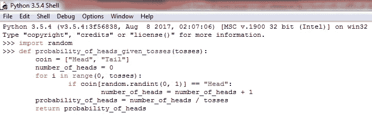
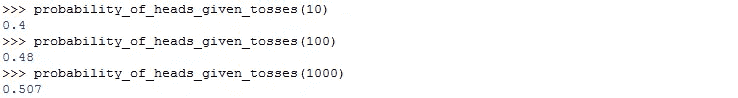

# 1/2 的概率意味着什么？—概率的频率主义方法

> 原文：<https://towardsdatascience.com/what-does-a-probability-of-1-2-even-mean-a-frequentist-approach-towards-probability-60893ba59ecd?source=collection_archive---------10----------------------->

我的一个朋友每当面临困难的决定时就扔硬币。有用吗？我不知道，但他认为是的。从统计学上来说，不应该。一枚硬币有两面，我们大多数人都意识到任何一面出现的几率都是 50%。将此转换为概率(这简单地意味着我们想要给我们的机会分配一个数字)，我们可以说在一次硬币投掷中获得正面的概率正好是 0.5——假设没有人篡改我们的硬币。然而，这些 0.5%或 50%的数值(它们代表同样的东西)实际上意味着什么呢？这是否意味着每掷两次硬币，我们一定会得到一个正面和一个反面？这不可能是真的；我们凭经验直观地知道这一点。

然而，当涉及到这样的问题时，我们的直觉不一定是非常可靠的来源。我们的直觉经常让我们得出令任何数学教授都感到恐惧的结论。现在，在你给这种说法贴上完全垃圾的标签，用无数次你的直觉能够提供与亚里士多德相媲美的洞察力的机会来轰炸我之前，让我给你一个简单的例子。

假设一个假想的场景，你所要做的就是扔一枚硬币，然后把它叫出来——我知道这没什么令人兴奋的，但请继续关注我。因为你知道要么正面要么反面出现的概率正好是一半，所以——只是因为你喜欢——假设你称之为正面；但是，最后都是尾巴。酷毙了。你再扔一次，坚持你的叫牌(正面)，结果又是反面。令人沮丧。在给它第三次投掷之前，你考虑你的下一个电话。你的直觉告诉你，由于前两次投掷都是反面，这一次很可能是正面。有道理，但是直觉几乎总是有道理的，不一定代表就是正确的。有道理和正确是两回事；不幸的是，这次我们的直觉是错误的。

它让我们相信获得正面的概率实际上增加了，即不再是 0.5；事实上，还不止这些。你想想，这可能是真的吗？这不可能。它仍然是同一个硬币，因此，没有理由改变概率。

在概率的世界里，直觉需要退居二线。

然而，现在让我们回到我们最初提出的问题。一半的概率到底是什么意思？如果这并不意味着每次我们掷两次硬币都会得到一个正面，那么为什么它会被指定为数字半(1/2)。为了回答这个问题，我们可以采取两种方法:频率主义方法，或者公理化方法。虽然公理化方法在数学上更优雅，但我们将重点关注频率主义方法，并将公理化方法留待以后讨论。

这两种方法都为我们提供了一种不同的方法来为一个特定的事件分配一个概率值(在我们的例子中:获得人头的概率)。频率主义者的方法要求我们做以下事情:重复实验若干次，然后简单地用你得到你想要的结果的次数除以你进行实验的次数。听起来很棘手？它不是。比方说，你掷一枚硬币 20 次，结果是 12 次正面朝上。因此，我们需要做的就是用 12 除以 20，得到 0.6。但是，这是否意味着获得人头的概率是 0.6 呢？不幸的是，它不是那样工作的。

如果你可能已经注意到，我们定义方法的方式相当模糊。要求某人“多次”重复一个实验不是一个好主意；根据他们如何定义“一些”,他们可能会重复实验二十次、两百次，或者如果他们很匆忙的话，可能只重复两次。你问我们需要重复多少次；确实是一个非常好的问题。简单的答案是:尽可能多的次数。

比方说，你只扔两次硬币。两次都是反面。使用我们的公式，正面的概率是 0/2，也就是 0！

现在来折腾两百次吧。假设 200 次中有 115 次正面朝上，我们可以看到正面朝上的概率可以写成 115/200，即 0.575。我们现在越来越接近了。

如果我们折腾两千次，得到人头的概率会不会更接近 0.5？频率主义者的方法声称它会。事实上，这正是 frequentist 方法的基础:你重复实验的次数越多，你就越接近获得真实的概率值。不过，有一个问题:为了得到真实的概率，你必须进行无数次的实验。但是，不要让这个太困扰你。当我们做了大量的实验后，我们得到正面的概率值可能会看起来像这样:0.5006；实际上，这可以四舍五入到 0.5。

有人实际尝试过这种方法吗？令人惊讶的是，答案是肯定的。列纳德·蒙洛迪诺在其引人入胜的作品《酒鬼之行》中提到了一位南非数学家，他在 20 世纪 40 年代实际上进行了一万次硬币投掷。约翰·克里奇当时是一名德国战俘，因此有充足的时间可以支配。他开始掷一枚公平的硬币，并记录下他的结果。当他投掷了 100 次后，他的正面概率大约是 0.44 (44/100)。然而，当他完成(一万次投掷)时，它已经上升到大约 0.5067 (5067/10000)，非常接近实际值 0.5！

我们能重复 Kerrich 的实验吗？我们当然可以。但是我们实际上并不需要一枚硬币来重复实验。我们可以简单地让计算机为我们模拟实验。电脑最棒的一点是，它们做这个不会累，而且速度极快。下面是我用一种叫做 python 的语言写的一个计算机程序。你不必担心编程部分，那不是我们目前最关心的。

Figure 2: A function which simulates coin tosses, and then uses the frequentist approach in order to calculates the probability of getting a head

我所做的是，我写了一个函数，在这个函数中，我创建了一个虚拟硬币。你只需要提供你想折腾的次数就行了。然后，这个函数将模拟投掷次数——每次投掷随机出现正面或反面。该函数将计算人头出现的次数，然后简单地除以投掷的总次数，以计算出人头出现的概率。

Figure 3: Results of tossing 10 coins, 100 coins, and 1000 coins

我首先试着掷硬币十次，结果得到的概率是 0.4 (4/10)。然后我试着扔了一百次，最后得到的概率是 0.48 (48/100)。我最后试着扔了一千次，果然，最后得到的概率是 0.507 (507/1000)，这看起来非常像 0.5 的真实概率。

因此，当我们说获得正面的概率是 1/2 时，它实际上意味着——根据频率主义者的方法——随着你不断投掷硬币(次数越多越好)，你获得正面的次数与投掷总数的比率将接近 1/2。注意，直觉。

虽然我们可以继续用我们的虚拟硬币投掷器做越来越多的投掷，但我不想让你无聊死；希望到现在为止，你已经相信频率主义者的方法实际上是有效的——最好的部分是，我们做到了，没有累着我们的手。