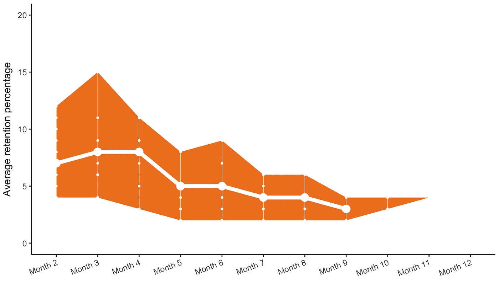
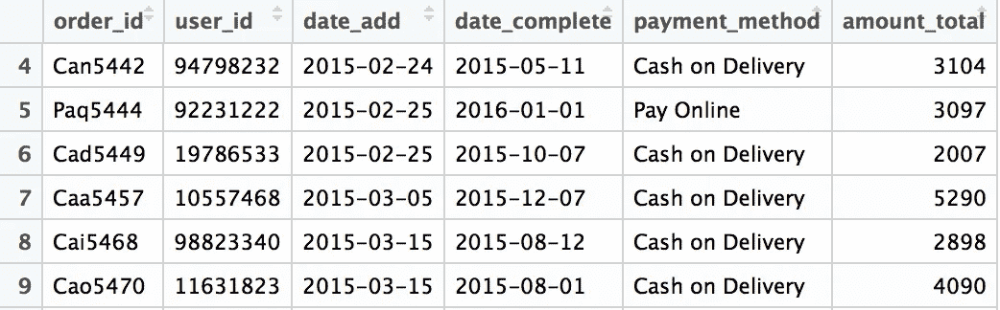
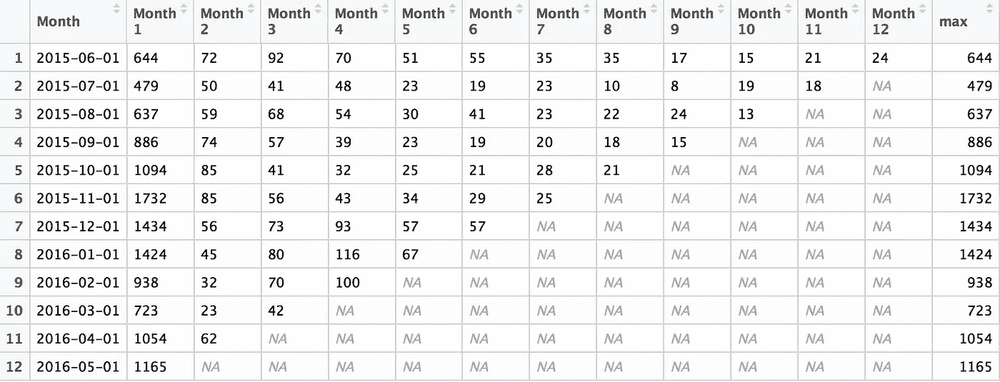
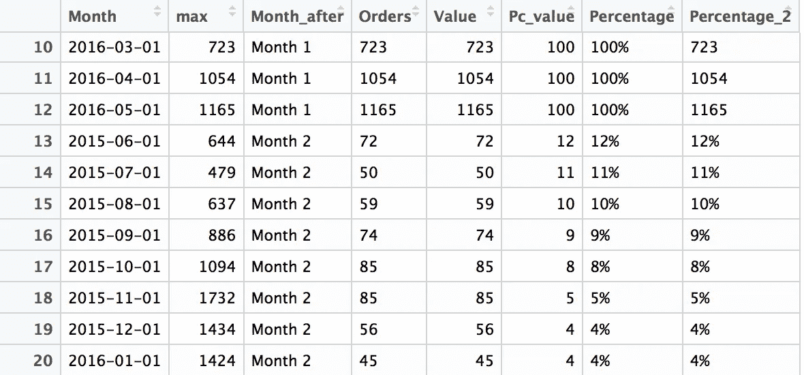
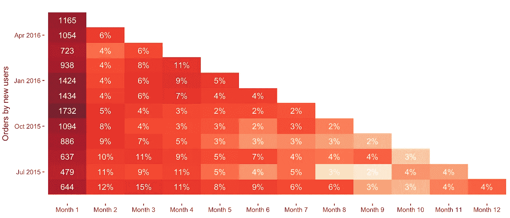
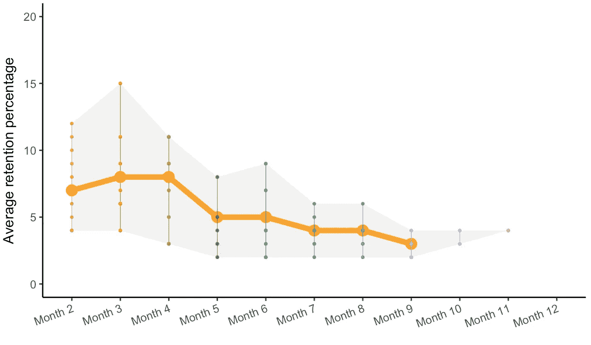

# 古罗马军事与数据分析有什么共同点？

> 原文：<https://towardsdatascience.com/what-does-ancient-roman-military-has-in-common-with-data-analysis-a3f723a063b6?source=collection_archive---------6----------------------->

数据分析很有趣。但更重要的是，这真的很重要！

我很高兴成为网上快时尚品牌[Miracas.com](http://miracas.com)的一员。对我来说，直接从数据库转储出来的销售数据几乎就像玩金沙一样。尽管业内权威人士使用的一些术语可能相当吓人。例如…组群分析。当我在字典里搜索 coorts 这个词时，它把我带到了罗马军事史，才发现 coorts 基本上就是群体的意思。

本质上，群组分析背后的想法是将用户分成群组，或者群组，并研究这些群组的行为以获得更好的洞察力。例如，在给定月份获得的所有用户是我们可以观察的群体，以便了解他们在随后的几个月里如何逗留。

# 银河系漫游指南的一课！

在寻求正确答案之前，我们必须先问正确的问题。否则我们可能会以 42 结束，这也可能是正确的答案，但我们不明白是怎么回事。为了理解我分析的目的，让我从提出以下问题开始。

> 我想研究什么用户行为？

我想了解随着时间的推移，我的用户是如何与我保持联系的。因此，我想计算一段时间内现有用户的订单数量。我的样本数据跨度为一年，因此将月定义为分析的时间单位是有意义的。

> 我们希望如何将用户分成不同的群体？

基本上我问的是，如何将用户分成有意义的群体。例如，可以使用年龄组、人口统计或一阶值来定义群组。在我提出的前一个问题的上下文中，让我将分组定义为在给定月份中首次订购的所有唯一用户。

> 简而言之，我想了解的是，根据我公司的销售数据，我在某个月获得的用户是如何在随后的几个月中保持不变的？

下面这个情节是想出答案的方法之一



Sample data used here is purely for illustration purpose. It does not reflect the typical industry indicators and must not be quoted elsewhere.

图表显示，平均而言，约有 7%的用户在第二个月再次下单。这一数字在第三和第四个月分别增加到约 8%和 9%。橙色信封显示了分析中使用的不同群组的最大和最小保留值。

所以既然问题成立，那就开始玩沙子吧。

# r 规则

r 是一个非常强大的数据处理工具。我在做半导体建模的时候遇到了 R。我很快就变得非常喜欢它。它为喜欢玩数据的人提供的便利可能会让人上瘾。为了处理数据，我将在本文中使用 basic R，并在最后使用`ggplot2`创建一些美观的图表。

我使用下面的 R 包进行分析。

*   [plyr](https://cran.r-project.org/web/packages/plyr/index.html) :拆分、应用和组合数据的工具
*   [整形 2](https://cran.r-project.org/web/packages/reshape2/index.html) :顾名思义，整形数据的包
*   关于 R 最棒的事情之一

除了这些库之外，我还使用了 RColorBrewer、colorRamps 和 gridExtra 包来提高剧情的美感。

为了本文的目的，我生成了一些样本数据。

[](https://github.com/rahulnyk/cohorts_R) [## rahulnyk/组群 _R

### R 中的组群分析

github.com](https://github.com/rahulnyk/cohorts_R) 

这是它的样子。



# 准备数据

下面是我如何读取样本数据的。

```
dr <- read.csv('sample_date.csv', stringsAsFactors = F)dr$date_add <- as.Date(dr$date_add)dr$date_add_month <- as.Date(cut(dr$date_add, breaks = "month"))dr <- subset(dr, (date_add_month > as.Date("2015-05-01") &   (date_add_month < as.Date("2016-06-01") )))number_of_months <-length(unique(as.character(dr$date_add_month)))
```

第一行代码只是将 csv 文件读入数据帧。在第二行，我将数据值转换成日期格式。下一行将日期分成几个月，这样给定月份中的所有订单都可以存储在一起。第 4 行代码只是一个子集命令

> 提示:对日期数据总是使用 R 日期格式。这就让 R 变得聪明，在绘图和其他计算时适当地对待它们。

我在这里也提取了`number_of_months`值。稍后当我将数据分成群组时，我将需要它。

# 计算群组

可以想象，这是最重要的一步。我们将根据用户第一次订购的月份对他们进行分组。让我重申一下我这次分析的目的。

> 我们的想法是了解某个月有多少用户购买，在接下来的几个月里留下来并下更多的订单。

这是我实现这一目标的方法。

1.  列出给定月份的唯一用户(`ulist`)
2.  仅将用户列表中的数据子集化到一个新的数据框中(`dr1`)。从原始数据框中删除数据(`dr`)。
3.  使用 dr1 统计这些用户每月的订单数量。我将结果归纳到另一个数据框架中，叫做`dr1s`
4.  从第一个月开始，每个月都这样做。每一次迭代，我都在过滤掉那一个月获得的用户`m`。
5.  将结果组合成一个名为`Cohorts`的数据帧。

下面是完成这一切的代码。虽然乍一看可能很吓人，但实际上很容易理解(用一点 R 知识)

```
Cohorts <- data.frame() ## empty cohorts data frame. for (m in unique(as.character(dr$date_add_month))){

  u <- subset(dr, dr$date_add_month == m) ## -- data for month m

  ulist <- unique(u$user_id) ## -- orders by unique users in month m dr1 <- subset(dr, dr$user_id %in% ulist) ## -- only month m users
  dr <- subset(dr, !(dr$user_id %in% ulist)) ## -- remove from dr

  ## -- Number of orders by these users for every month
  dr1s <- ddply(dr1, .(date_add_month), summarize, total = length(user_id)) 

  ## -- Combine the calculations into the Cohorts data frame. 
  colnames(dr1s) <- c("Month", m)
  a <- c(m, dr1s[,m])
  a <- data.frame(t(a))
  Cohorts <- rbind.fill(Cohorts, a)
}## Some more processing with the final data frame
col_names = paste("Month", array(1:number_of_months), sep = " ")
colnames(Cohorts) <- c("Month", col_names)
Cohorts["Month"] <- as.Date(Cohorts$Month)
Cohorts["max"] <- as.numeric(as.character(Cohorts[,2]))
```

我在这里使用`ddply`来计算每月的订单数量。该函数来自`plyr`库，是最方便的工具之一，可用于根据多种条件对数据框的行进行子集划分，对每个子集进行计算，并将结果合并到另一个数据框中。我向所有 R 爱好者强烈推荐花些时间玩玩`ddply`。

这是我们的劳动成果，数据框`Cohorts`的样子。



太棒了不是吗！

最困难的部分已经完成了。此时，我已经有了要计算的数字。现在剩下的就是将这些数据绘制成美观的图表。但在此之前，让我谈一谈重塑数据。

# 熔化和铸造

当然是剑…但是数据也是！
在进行任何类型的分析时，重塑数据都非常重要。r 有一个强大的重塑库，可以帮助你根据需要融化和铸造数据。这里有一个不错的教程。

 [## 重塑简介 2

### 长格式数据有一个可能变量类型的列和一个这些变量的值的列。长格式…

seananderson.ca](http://seananderson.ca/2013/10/19/reshape.html) 

有了这些丰富的知识，让我们将队列数据框重塑为更易于绘制的东西。基本上，我们需要将数据转换成一种可以被`ggplot2`轻松使用的格式，我已经提到过这是 r 最棒的地方之一了。相信我……的确如此！

```
df_plot <- melt(Cohorts, id.vars = c('Month', 'max'), value.name = 'Orders', variable.name = 'Month_after')df_plot <- na.omit(df_plot)df_plot["Value"] <- as.numeric(df_plot$Orders)df_plot["Pc_value"] <- ceiling(df_plot$Value*100/df_plot$max)df_plot["Percentage"] <- paste(ceiling(df_plot$Value*100/df_plot$max), "%", sep="")df_plot["Percentage_2"] <- ifelse(df_plot$Percentage == "100%", df_plot$Value , df_plot$Percentage)
```

我们名为`df_plot`的新数据帧如下所示。



注意，添加列`Percentage_2`只是为了绘图方便。`Percentage_2`中的值表示`Month 1`中的订单总数以及后续月份的重复订单百分比。

# 没有艺术的生活是什么

现在是我最喜欢的部分，添加一些颜色。我使用了 RColorBrewer 和 colorRamps 库来增加魅力…然而默认的 ggplot 选项对于我们的目的来说已经足够了。

代码来了

```
## Cohorts tile chart ##
hm.palette <- colorRampPalette((brewer.pal(9, 'YlOrRd')), space='Lab', bias=10)p <- ggplot() p <- p + geom_tile(data = na.omit(df_plot), aes(x = Month, y = Month_after, fill=Value), width=31, height=1) p <- p + geom_text(data =  na.omit(df_plot), aes(x = Month, y = Month_after, label = Percentage_2), color = "white")#, fontface = "bold")p <- p + scale_fill_gradientn(colours = hm.palette(100)) + theme_bw() + coord_flip() p <- p + theme(panel.background = element_blank(), axis.line.x = element_blank(), panel.border = element_blank())p <- p + theme(panel.grid.major = element_blank(), panel.grid.minor = element_blank(), legend.position="none") + ylab("") p <- p + xlab("Orders by new users") 
print(p)
```

还有沃伊拉。！这是我们得到的



> 在这一点上，我想提一下，我在这里使用的数据纯粹是为了本文的目的而生成的，并不是实际的销售数据。此处计算的数字不得在别处引用。

再做一些修改，我可以用另一个有趣的图表来表示这些数据。



Average customer retention rate

我将把这个图表的代码留给你来写。

这些图表对任何企业都非常重要。通常，客户获取成本(CAC)是任何电子商务公司平均订单价值的重要组成部分。因此，衡量用户如何逗留并产生更多订单是很重要的。

第一个图表显示了在给定月份(第 1 个月)中获得的独立用户的订单数量，以及这些用户在随后几个月中再次订购的百分比。例如，2015 年 7 月，共有 479 个独立用户首次订购，其中约 11%在`Month 2`(即 2015 年 8 月)再次订购。该数字在`Month 11`(2016 年 6 月)降至 4%左右。

对于不同的企业，客户保持率可能会有很大的不同。对我来说，这表明了我的客户有多满意。它本身可能没有完整的意义。然而，当与平均订单价值、客户获取成本、客户终身价值、客户投诉数量等其他指标一起考虑时，它对引导业务朝着正确的方向发展非常有帮助。

其中一些参数可以使用我在这里使用的相同样本数据来计算。虽然我会把这个分析留到以后再说。

# 总结

分析用户行为的重要性怎么强调都不为过。群组分析是一种很好的方法。就像罗马军队一样，当数据被分成有意义的组时，它变得更易于管理。在试图找到答案之前，问正确的问题是很重要的。学习正确的工具来处理数据也同样重要。有了 R 和它的大量曲目，学习它几乎不会出错，至少到基础水平。

如果我能对这篇文章或任何其他方面有所帮助，请不吝赐教。感谢阅读，希望你喜欢。