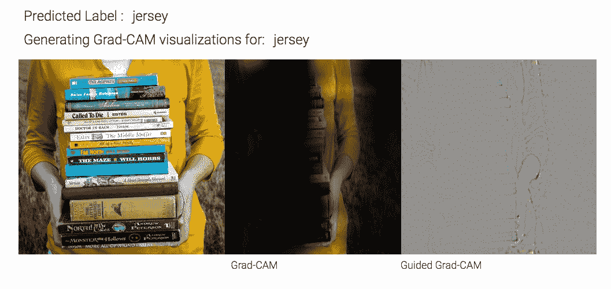
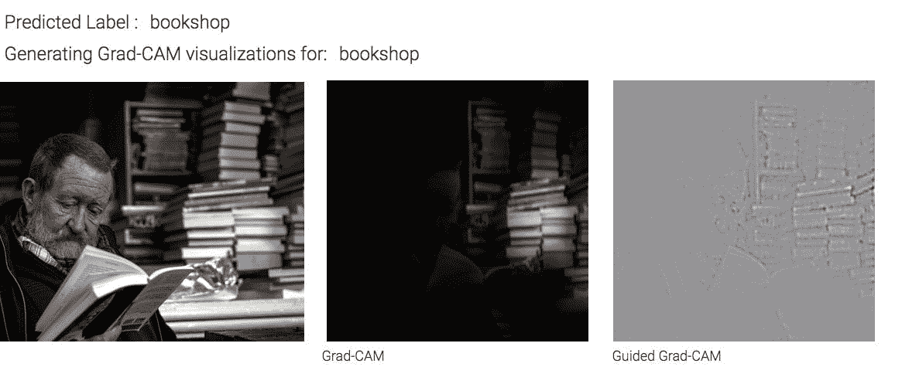
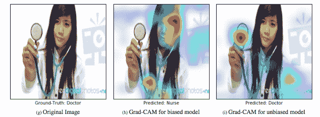

# 它看到了什么？

> 原文：<https://towardsdatascience.com/what-does-it-see-f2dcd9dff9af?source=collection_archive---------17----------------------->

## 人工智能困惑的目光

前几天，我用人工智能搜索了一张我的阴茎土豆的照片，想看看这项技术会怎么称呼它。它会知道我的土豆是一个土豆吗？尽管它有一个像阴茎一样的突起，这个突起为它赢得了一个昵称。

我让系统查看我的阴茎土豆的几个不同的镜头——有闪光灯和没有闪光灯，室内和室外，以及各种角度——得到的答案从“胡桃南瓜”到“面团”，即使我拍摄土豆的方式是故意隐藏其隐私部分。我当时不知道的是，系统永远不会把我的土豆识别为土豆，不是因为它的阴茎，而是因为它根本不了解土豆。

我使用的人工智能在某些领域很有名，并且在几年前的 ImageNet 大规模视觉识别挑战赛(ILSVRC)中表现出色。对于那些不熟悉这场比赛的人来说，我会把它比作肯塔基赛马会，这对那些对马和赛马感兴趣的人来说是众所周知和同样令人兴奋的。这个人工智能被称为 VGG-19，用于训练和测试它的图像数据集 [ImageNet](http://www.image-net.org/papers/imagenet_cvpr09.pdf) 本身就很有名，它提供了数以千计的标记图像，可供研究人员使用。

据该网站称，到目前为止，ImageNet 包含超过 21，000 个类别的超过 1，400 万张图片；然而，这些类别中只有 1000 个用于比赛——1000 个所谓的 synsets，其中“土豆”不在其中。换句话说，因为人工智能已经在 ILSVRC 竞赛数据集上接受了训练，所以无论我多久向系统展示一次马铃薯，或者马铃薯的形状有多完美，系统都不会想到“马铃薯”这个词，因为它没有被教会识别它。土豆不在 1000 之列。

我看了看[的 1000 个类别](https://gist.github.com/yrevar/942d3a0ac09ec9e5eb3a)，得知人工智能应该能够识别胸罩、步枪、羽毛围巾、乳液、井盖、电脑鼠标、风车、祈祷毯和威士忌酒瓶。大多数时候，当我浏览被选中者的名单时，我在想，为什么是这些？

一篇关于比赛的论文解释说，1000 个比赛类别是在比赛的第一年，即 2010 年随机选择的，然后经过精心挑选，以确保它们不会太模糊，并且在等级体系中任何两个类别之间没有重叠(如果包括“猎犬”，那么“猎犬”(超类)或“小猎犬”(子类)就没有重叠)。这些年来，这一套已经发生了变化，但 639 个类别在每次挑战中都被使用过(至少到 2015 年，论文发表的那一年)。换句话说，我要感谢随机性，为什么模型能识别胸罩，但不能识别一幅画，一个石榴，但不能识别猕猴桃，一个土豆泥，不是我的土豆，一个书店，但不能识别一本书。

等等…没有书？

我向人工智能展示了一本书的几张照片，然后我被告知这是一个“橡皮擦”或“信封”，或者有时，更奇怪的是，照片中有一些东西，但我根本没有注意到。例如，当我向人工智能展示一个拿着一摞书的女人时，它将照片归类为“球衣”。

在另一张照片中，人工智能直视正在阅读的人，但识别出背景中的书架是一家书店。人工智能最自信地预测的事情并不是不正确的，只是不一定是当我看照片时我的眼睛被吸引到了哪里。要明确的是，我不期望人工智能看到它不知道的东西，但想想我们在教我们的技术什么，以及他们对什么视而不见，因为我们没有向他们展示例子，这是一件有趣的事情。

由于弗吉尼亚理工大学和佐治亚理工学院研究人员的工作，我能够窥探人工智能，看看它看起来在哪里，他们建造了[制导的 Grad-CAM](https://arxiv.org/pdf/1610.02391.pdf) ，我用它来生成上面的插图。制导 Grad-CAM 技术有许多有趣的应用，但给我印象最深的是基于人工智能凝视的方向来识别偏见。在下面的例子中，有偏见的模型注意到一张女性的脸，并将她识别为护士。

(image from the paper: [https://arxiv.org/abs/1610.02391](https://arxiv.org/abs/1610.02391))

研究人员写道，有偏见的模型从它被训练的数据中学习其偏见，但使用“从 Grad-CAM 可视化中获得的洞察力，我们平衡了数据集并重新训练了模型。”无偏模型在确定职业时看听诊器不看脸。

在另一项发人深省的研究中，脸书大学的研究人员观察了我们的技术在分类物体方面做得如何，以及它们在哪里失败了，特别是篮球和 ImageNet 中用来说明它们的图像。尽管他们看到的至少出现一个白人或一个黑人的图像的百分比非常相似(前者为 55%，后者为 53%)，但根据这一数据训练的模型表现出意想不到的方式。当要求对选择的一组图像进行预测，以便“两幅图像之间的主要明显差异是人的肤色”时，该模型展示了这种模式:“所有包含黑人的图像都被分类为篮球，而具有不同肤色的人的类似照片被不同地标记”(例如，作为排球、乒乓球或棒球运动员)。换句话说，模型已经学会了一种偏向。

(image from the paper: [https://arxiv.org/abs/1711.11443](https://arxiv.org/abs/1711.11443))

研究人员指出:

*模型学习这些偏见的原因尚不清楚。一个假设是，尽管在标有篮球的图片中种族分布均衡，但与其他阶层相比，黑人在这个阶层中的比例更高。*

我把上面这段话读了几遍，思考了一下其中的含义。我想知道，ImageNet 到底代表了谁，没有代表谁。我们的技术仅仅因为数据中包含(或省略)了谁和什么而获得了什么样的模式？

我们的模型非常擅长识别模式，只有一些模式不是有意的，或者更糟，是有害的。由算法做出的令人不安的决定已经出现在[选美比赛](https://www.theguardian.com/technology/2016/sep/08/artificial-intelligence-beauty-contest-doesnt-like-black-people)、[面部识别](https://www.forbes.com/sites/mzhang/2015/07/01/google-photos-tags-two-african-americans-as-gorillas-through-facial-recognition-software/#461986c3713d)和[自然语言处理](https://www.technologyreview.com/s/602025/how-vector-space-mathematics-reveals-the-hidden-sexism-in-language/)等领域。去年，[研究人员](http://markyatskar.com//publications/bias.pdf)在我们的几个大型图像数据集中发现了明显的性别偏见。接受这些图像训练的人工智能不仅发现了这些偏见，还放大了这些偏见，将女性与厨房等事物联系起来，将男性与体育用品联系起来(见《连线》杂志的报道)。

我很欣赏为创建和维护我们用来训练和测试人工智能的图像数据集所付出的巨大努力。如果没有 ImageNet 和围绕它的竞争，我不认为我们的技术会发展得如此之快。尽管如此，我还没有在这个数据集中遇到过与肤色和表征相关的研究，我担心的是，将人类肤色与某些类型的事物联系起来，而不是与其他事物联系起来，这意味着什么。

我反复听到图像数据被称为“真实世界数据”。但这些数据反映了现实吗？我们如何确保这些数据不仅仅是在强化我们作为一个社会必须努力克服的偏见？

* * *

**延伸阅读:**

“Grad-CAM:通过基于梯度的定位从深度网络获得的视觉解释”，Ramprasaath R. Selvaraju，Michael Cogswell，Abhishek Das，Ramakrishna Vedantam，Devi Parikh，Dhruv Batra【https://arxiv.org/abs/1610.02391】T2

“超越准确性的 ConvNets 和 ImageNet:解释、偏差检测、对立的例子和模型批评”，Pierre Stock，Moustapha Cisse【https://arxiv.org/abs/1711.11443 

“ImageNet 大规模视觉识别挑战赛”，Olga Russakovsky* Jia Deng*苏浩 Jonathan Krause Sanjeev Satheesh Sean Ma 黄志恒 Andrej Karpathy Aditya Khosla Michael Bernstein Alexander c . Berg 李菲菲[https://arxiv.org/pdf/1409.0575.pdf](https://arxiv.org/pdf/1409.0575.pdf)