# 电力革命告诉了我们人工智能的未来。

> 原文：<https://towardsdatascience.com/what-electricity-revolution-tells-us-about-our-future-with-a-i-69eff44295d4?source=collection_archive---------14----------------------->

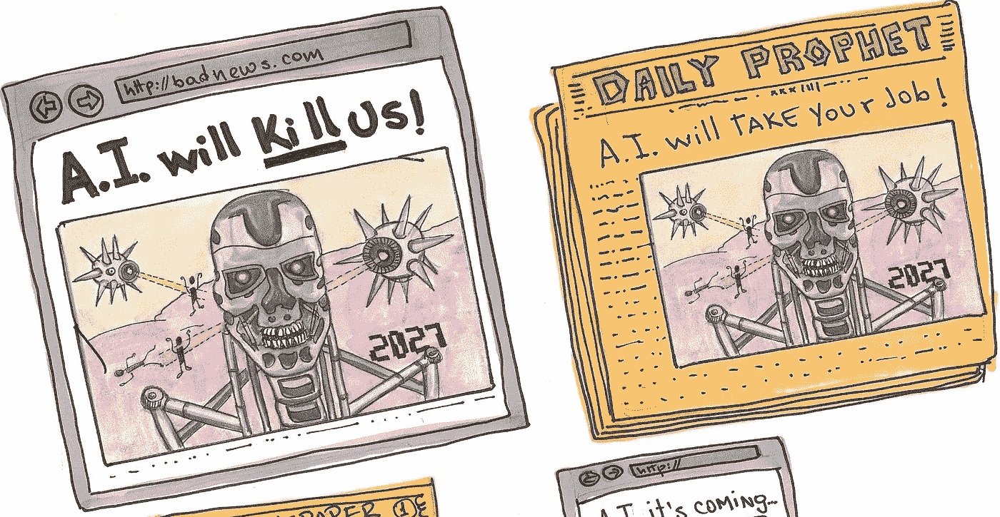

All illustrations by [J. P. Solano](https://medium.com/u/97d14d82330?source=post_page-----69eff44295d4--------------------------------)

我们并不总是有机会见证或经历一场革命，一场真正的革命。历史已经表明革命如何改变人们的生活。无论何种类型(社会、宗教、艺术或技术)，所有革命都有一个共同的核心模式: ***思考或想象事物方式的突然、彻底或完全的改变*** *。*

革命并不总是每个人都失去理智的暴力骚乱；大部分时间都是缓慢的过程，需要数年才能完全展现，给人的印象是什么都没有改变，更像是[煮青蛙的寓言](https://en.wikipedia.org/wiki/Boiling_frog)。

也许如果我们分析像电这样最具革命性的发明之一，我们就能理解人工智能会有什么样的前景。

本杰明·富兰克林(1706-90)一生中，作为一名作家、企业家、政治家和科学家，开辟了一条成功项目的非凡道路。最重要的是，他是一个发明家，为普通问题创造解决方案，创新新技术。尽管他从未申请过一个专利，但他的许多发明仍然在我们身边，比如双焦眼镜或摆动鳍。1752 年 6 月的一个下午，在一个暴风雨的日子里，他认为这是去放风筝以展示闪电的电学性质的最佳时机。这个实验打开了一个新领域的大门:电学。127 年过去了，托马斯·爱迪生(1847-1931)终于在 1879 年在他的实验室里制造出了一个可靠、耐用的电灯泡。从那时起，在接下来的 50 年里，从木炭到电力的转变是缓慢的，远远不是一个自然的过程。总的来说，人类的劳动、城市和生活质量都不会一样。然而，电在我们的生活和日常事务中变得如此重要，以至于没有它我们无法在正常的日子里思考。但情况并非总是如此。商业和工业用了将近 30 年才完全适应，住宅电气化用了 20 年。在这个时期，电从一种神秘的力量变成了一种重要的公用事业。深入了解商业、城市和家庭如何采用电力，可以给我们一些关于人工智能和机器学习革命将如何改变我们思维方式的提示。

在工业革命的巅峰时期，理想的工厂应该是这样的:一个附属于大型多层建筑的蒸汽机房。原因很简单:工厂布局受到传动轴和单一电源的限制。这种设计昂贵且低效，但比人力工作站更有效率。

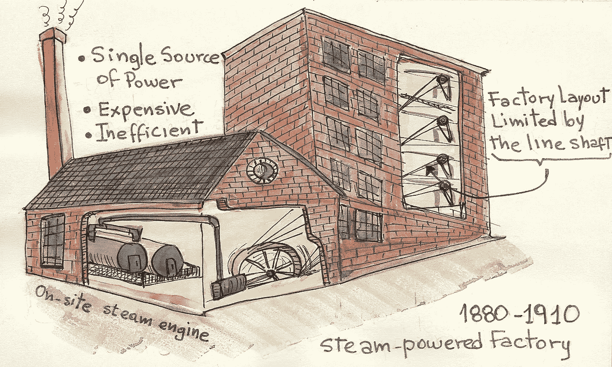

在向电力过渡的初期，制造商不愿意放弃他们大量的知识来采用最初只是略微优越的技术。其结果是，生产流程几乎没有变化，只是将现场的蒸汽机换成了电动机。这一过程仍然效率低下，但他们发现木炭费用的节省已经足够好，不需要再努力了。他们遵循一条**软适应路径**。

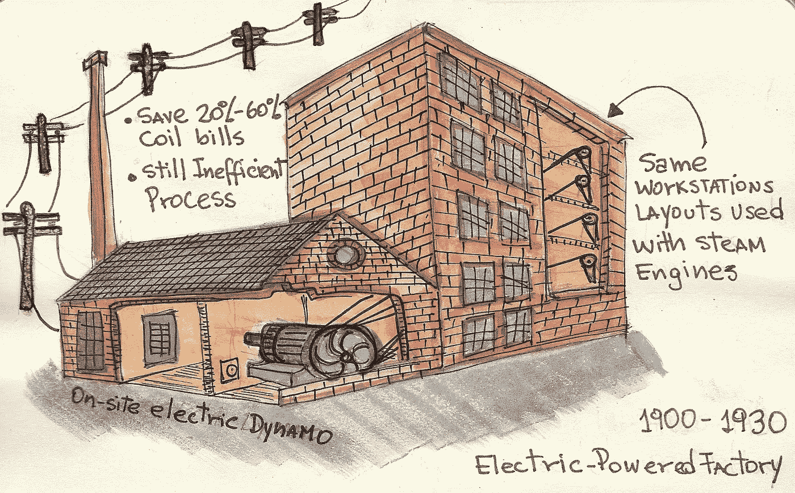

然而，电气化注定是有史以来最具破坏性的技术之一，在 1888 年至 1905 年间形成的工业部门中，超过 40%在 1930 年初失败。那些在这些“电力冲击”中幸存下来的人看到，巨大的收益不是来自简单地用蒸汽机代替电动机，而是来自生产过程本身的重新设计。像*亨利·福特*(1863-1947)，在电气化和其他创新方面遵循**艰难适应道路**的领导者，结束了我们今天所知的工厂和生产的重新设计。

经济史学家保罗·大卫和加文·莱特*发现，用了这么长时间才完全认识到电力的变革潜力的主要原因是“**需要在任务和产品的定义和构造方式上进行组织上，尤其是观念上的变革**。*

这种布局将标志着作者安德鲁·迈克菲和埃里克·布林约尔松所说的“第一个机器时代”或工业革命，即使用机器来自动化和增强我们的肌肉(身体)力量。

另一方面，家庭电气化还面临着其他挑战，如令人担忧的媒体报道和家用电器的缺乏。还需要 20 年的时间，城市和房屋才能反映出电力对提高我们生活质量的真正影响。

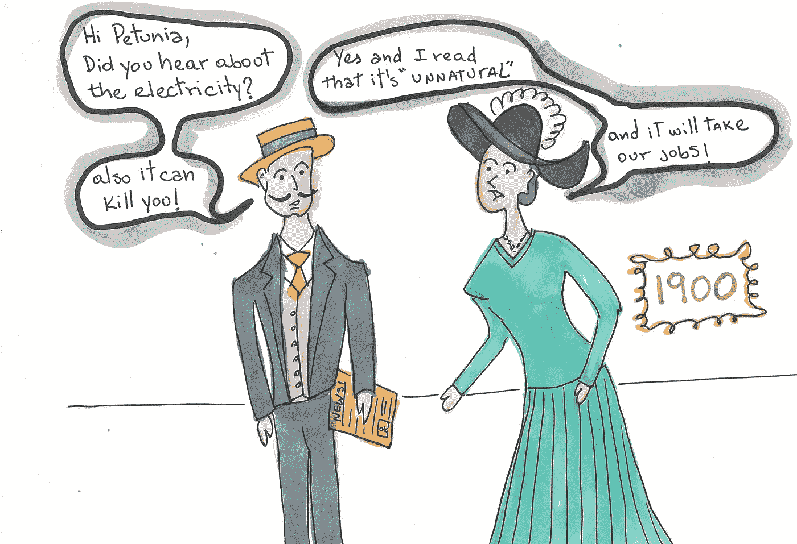

**解读**:我们人类倾向于寻找阻力和风险较小的道路。然而，创新和革命恰恰相反，因为它充满了变化和机遇。就电力而言，我们倾向于维护现状，直到我们被迫改变并接受一种新常态。从 1880 年到 1930 年，企业、城市和家庭不得不采用最新技术来保持竞争力和效率。适应过程显示了这种模式:

1.  **拒绝与批判**。由媒体和普通人领导。
2.  **软适配路径**。由关注经济影响的早期业务采纳者领导。
3.  **硬适应路径**。由专注于颠覆传统的商业远见者领导。
4.  **拥抱变化**。每个人都追随这项技术的大规模应用。

如果我们在创新时间轴上快进，我们将到达我们的时代。人类已经见证了计算机和软件的崛起，这开启了第二个机器时代:机器现在不仅被用来扩展体力，还被用来论证我们的认知能力。这为一系列新的挑战打开了大门，但也为一个新的进步单位打开了大门:指数级

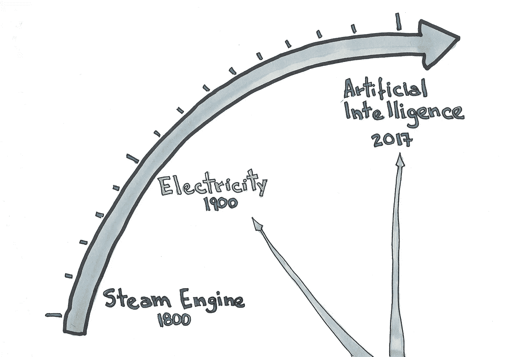

未来学家*杰森·希尔瓦* (1982 -)说大脑在一个线性和局部的世界中进化，但我们现在生活在一个全球化和指数化的世界中。他说，在一个带着线性镜头的思想家的世界里，技术变革正在以指数速度发生，所以我们永远看不到未来的到来。举个例子来理解线性增长和指数增长的区别，如果你走 30 步线性增长，你会得到 30 步，但是如果你走同样的 30 步指数增长，你会得到 10 亿。

在破解了英格玛机器并为二战中打败纳粹德国做出了贡献之后，数学家*艾伦·都灵*(1912–1954)着迷于创造一种能够学习并成为人工智能的“学习机器”的可能性。正如他指出的那样，“思考”很难定义，正因为如此，他在 1950 年发表了他著名的[图灵测试](https://en.wikipedia.org/wiki/Turing_Test)，这是一项测试机器表现出与人类同等或不可区分的智能行为的能力的测试。不幸的是，他因为自己的性倾向而被起诉，并在多年后自杀，但都灵给人工智能留下的遗产就相当于本杰明·富兰克林给电。

人工智能只在大学和实验室中可见，直到 80 年代 Geoffrey Hinton 教授(1947 —)和同事对多层神经网络的研究，创建了一个使用机器学习和深度学习(人工智能的一个子集)的清晰模型。然而，许多冬天过去了，直到人工智能获得主流关注。

但是，为什么人工智能现在如此重要，而不是在 20 或 30 年前，那时所有的理论和概念都已经存在了？答案是计算能力和可用的数据量。当我们与人类的表现相比时，以前在一般问题中使用人工智能的尝试显示出平庸的结果。2014 年，谷歌聘请辛顿教授将人工智能作为重中之重，并开放了对互联网产生的大型数据集的访问。随着计算机性能的不断提高，所有这些变化都为人工智能(特别是深度学习)的商业改编创造了完美的条件。

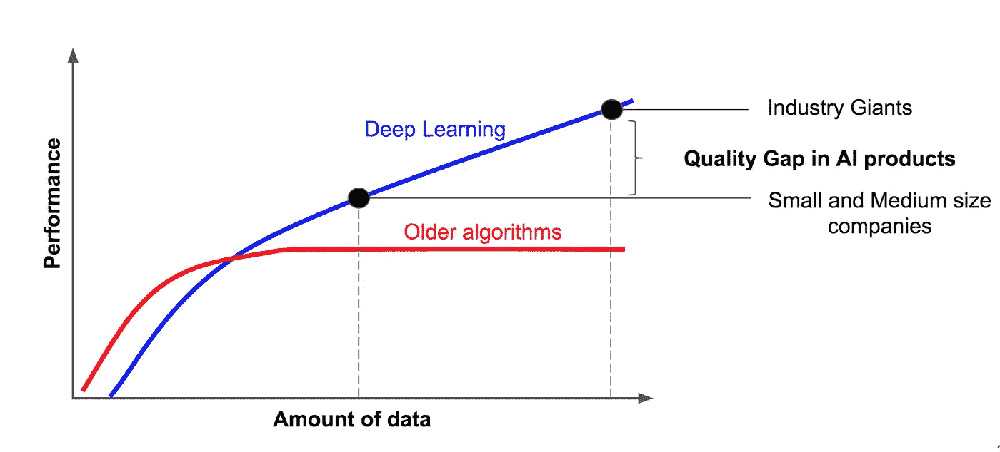

对人工智能的大肆宣传。来自深度学习在某些特定领域取得的令人难以置信的进展。但同时，邪恶人工智能的大肆宣传或终结者的场景这只是媒体策略的一部分，以获得一些容易出售的新闻的关注。事实是人工智能远不能代表对人类的真正威胁。

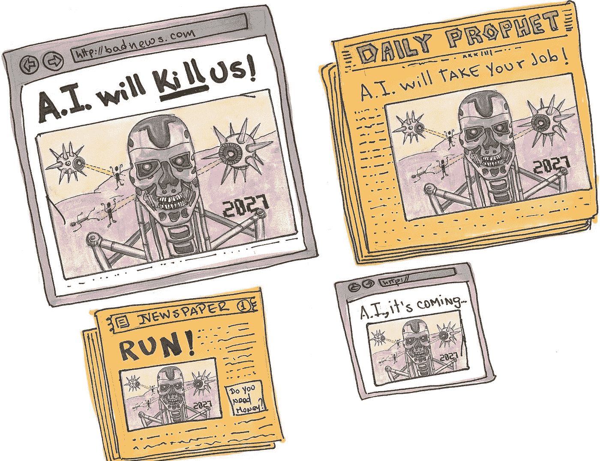

作为斯坦福大学的教授，*吴恩达* (1976 -)，一直是深度学习和机器学习研究的先驱。他联合创立并领导了谷歌大脑项目，曾任 VP &首席科学家；当我们试图理解人工智能对我们社会的影响和作用时，他也是最受尊敬的声音之一。

他创造了这个短语:

“人工智能是新的电力，”他说。“就像 100 年前电力改变了一个又一个行业一样，人工智能现在也将这样做。”

以下是一些例子:

**医学**:

*   基于人工智能的临床决策；
*   医学知识工程；
*   图像分析；
*   生物和临床医学中的计算智能:

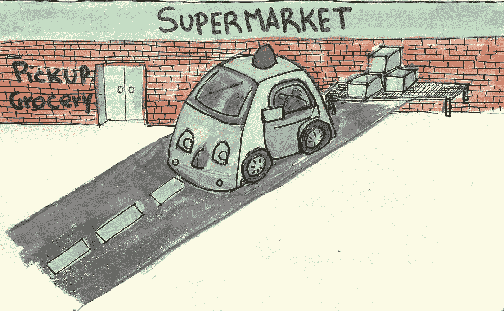

**自动驾驶汽车:**

*   交通即服务
*   免费邮递
*   较少的车祸

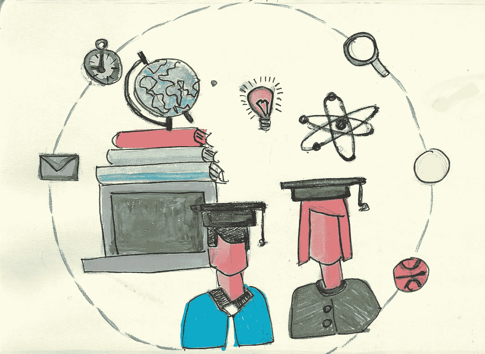

**学历:**

*   课外辅导和支持
*   面向所有学生的普及教育
*   差异化和个性化学习

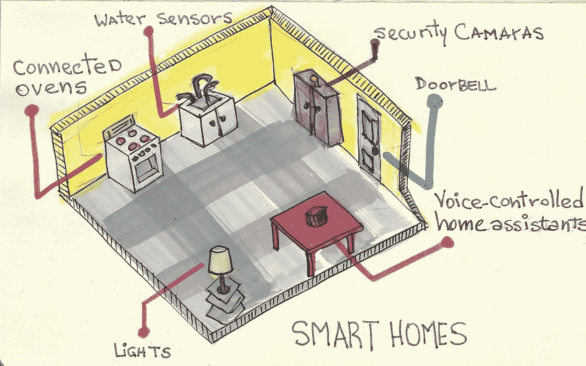

**数字助理:**

*   阿莱夏
*   戒指
*   谷歌主页
*   索诺斯

人工智能的想法已经讨论了一段时间，但直到 2006 年，世界才意识到可行的人工智能的两个主要要求:更快、更便宜的计算机(云计算)和大量的数据(互联网)。从那时起，人工智能，特别是深度学习的成就已经呈指数级增长(就像 AlphaGo 一样)，这意味着我们可能不必再等 50 年才能看到人工智能的全面发展。

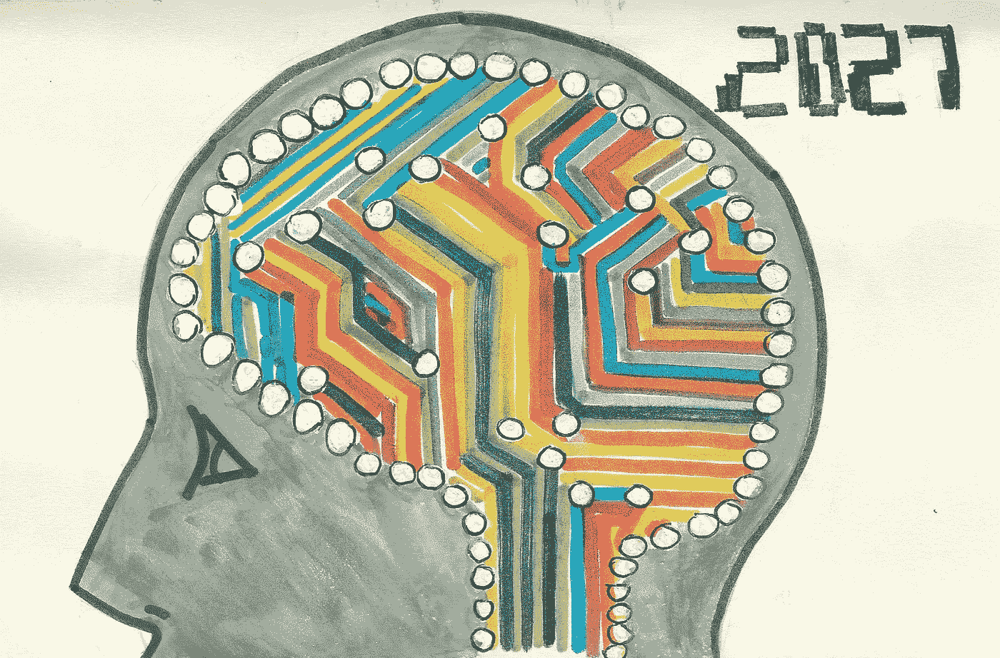

人工智能的适应过程如下:

*   拒绝和批评是预期媒体报道的一部分，但每次关于人工智能的新闻越来越少启示性，越来越科学
*   从业务角度来看，许多公司正在寻找人工智能的**软适应路径**，例如，通过增加聊天机器人服务来取代呼叫中心的人工操作员，而无需重新思考业务流程。正如 100 年前发生那样，这将代表边际成本节约，但不是真正的竞争优势。
*   亚马逊、谷歌、苹果、微软等其他公司已经开始了人工智能的艰难适应之路，进行真正的结构重组，并在世界各地开设人工智能研究实验室。谷歌报告称，通过使用与 AlphaGo 类似的方法，DeepMind 能够将谷歌数据中心的能效提高 15%
*   我们正处于家庭大规模适应数字辅助的开端。亚马逊 Alexa、谷歌 Home 和其他公司都在努力赢得家庭的关注。

人工智能作为一种革命性的颠覆将需要可治理性规则和明确的界限。我们对社交媒体公司的艰难觉醒，是一个伟大的工具如何被用于邪恶提议的例子。

**更多来自 J.P .索拉诺的帖子:**

*   [在世界上最好的餐厅之一用餐是什么感觉？](https://medium.com/@solanojuan/what-its-like-to-eat-at-one-of-the-best-restaurants-in-the-world-3bd05b7b60e6)
*   [大卫·海涅梅尔分享了一些违背常理的原则](https://medium.com/@solanojuan/david-heinemeier-shares-some-principles-to-go-against-the-grain-1ca5c0032f2c)
*   重要的是平台，而不是应用程序。
*   [开发 SaaS 产品前你想知道的事情](https://medium.com/@solanojuan/things-you-want-to-know-before-developing-a-saas-website-part-1-start-80cab09c2f54#.bsc8d4za3)
*   [通勤自我意识](https://medium.com/@solanojuan/commute-self-awareness-50e1fe326b33#.fxx28ehn6)
*   [企业家、可信度和辛纳特拉测试](https://medium.com/@solanojuan/entrepreneurs-credibility-and-the-sinatra-test-c4bdb4acaf52#.1u73hnkk6)
*   [每位企业家都应该参加斯巴达赛跑的 8 个理由](https://medium.com/@solanojuan/8-reasons-why-every-entrepreneur-should-do-the-spartan-race-783a6c5cd0b2)
*   [斯蒂芬·金的 20 条作家法则适用于企业家](https://medium.com/@solanojuan/stephen-king-s-top-20-rules-for-writes-applied-to-entrepreneurs-a8b8145f6b8e)
*   [应力悖论](https://medium.com/@solanojuan/the-stress-paradox-a785933c3e5e)
*   99u IDEO 工作室的 10 个经验教训
*   [El bulli 如何将用餐变成一种体验](https://medium.com/@solanojuan/how-elbulli-turned-dining-into-an-experience-38f1c015e9f6)
*   分享你的想法，反正没人会在意
*   为什么不利用自己呢？
*   释放你内心的超级英雄