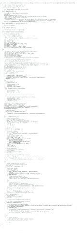

# Infer.NET 代码中潜伏着哪些错误？

> 原文：<https://towardsdatascience.com/what-errors-lurk-in-infer-net-code-e9c52ecc389e?source=collection_archive---------22----------------------->

微软发布的项目资源是进行分析的一个很好的理由。这次也不例外，今天我们就来看看 Infer.NET 法典中发现的可疑之处。不要做总结，说重点！

# 项目及分析仪简介

推断。NET 是微软专家开发的机器学习系统。项目源代码最近在 GitHub 上可用，这引起了它的检查。更多关于该项目的细节可以在[这里](https://dotnet.github.io/infer/)找到。

该项目由 PVS-Studio 6.26 静态代码分析器检查。我提醒一下，PVS-Studio 正在搜索 Windows、Linux、macOS 下 C\C++\C#(很快还有 Java)代码中的错误。C#代码目前为止只在 Windows 下分析。你可以[下载并在你的项目上试用](https://www.viva64.com/en/pvs-studio-download/)这个分析器。

支票本身非常简单，没有任何麻烦。在检查之前，我从 GitHub 下载了项目源代码，恢复了所需的包(依赖项),并确保项目成功构建。这是必需的，以便分析人员可以访问所有需要的信息来执行全面的分析。在几次点击之后，我通过 Visual Studio 的 PVS-Studio 插件运行了解决方案分析。

顺便说一下，这不是微软的第一个项目，用 PVS-Studio 检查过——还有其他的:[罗斯林](https://www.viva64.com/en/b/0363/)、 [MSBuild](https://www.viva64.com/en/b/0424/) 、 [PowerShell](https://www.viva64.com/en/b/0447/) 、 [CoreFX](https://www.viva64.com/en/b/0365/) 和[其他](https://www.viva64.com/en/inspections/)。

**注意。**如果您或您的朋友对 Java 代码分析感兴趣，您可以通过选择“我想要分析 Java”写信给我们的[支持人员](https://www.viva64.com/en/about-feedback/)。目前还没有公开的测试版本，但它很快就会出现。有人在一个秘密实验室里(隔壁)人们正在积极地研究它。

然而，哲学对话已经谈得够多了——让我们看看代码中的问题。

# 是 Bug 还是特性？

我建议你自己找出错误——这是一个完全可能的任务。我保证没有烧伤符合文章“[2017 年 C++项目十大 Bugs】”中的内容。因此，请花时间阅读代码片段后给出的分析器警告。](https://www.viva64.com/en/b/0565/)

```
**private** **void** **MergeParallelTransitions**()
{
  ....
  **if** (   transition1.DestinationStateIndex == 
         transition2.DestinationStateIndex 
      && transition1.Group == 
         transition2.Group) 
  {
    **if** (transition1.IsEpsilon && transition2.IsEpsilon)
    {
      ....
    }
    **else** **if** (!transition1.IsEpsilon && !transition2.IsEpsilon) 
    {
      ....
      **if** (**double**.IsInfinity(transition1.Weight.Value) &&    
          **double**.IsInfinity(transition1.Weight.Value))
      {
        newElementDistribution.SetToSum(
          1.0, transition1.ElementDistribution,
          1.0, transition2.ElementDistribution);
      }
      **else**
      { 
        newElementDistribution.SetToSum(
          transition1.Weight.Value, transition1.ElementDistribution,
          transition2.Weight.Value, transition2.ElementDistribution);
      }
  ....
}
```

> ***PVS-Studio 警告:***[*v 3001*](https://www.viva64.com/en/w/v3001/)*有相同的子表达式 double。IsInfinity(transition1。Weight.Value)'的左边和右边的'&'操作符。运行时自动机。Simplification.cs 479*

从源代码片段中可以看出，该方法使用了几个变量— *transition1* 和 *transition2* 。使用相似的名字有时是合理的，但值得记住的是，在这种情况下，在某个地方偶然犯错误的可能性会增加。

所以在检查无穷上的数字时发生了( *double。IsInfinity* )。由于错误，同一个变量*的值转变 1。重量值*被检查了两次。变量*跃迁 2。第二子表达式中的 Weight.Value* 必须成为一个检查值。

另一个类似的可疑代码。

```
internal MethodBase **ToMethodInternal**(IMethodReference imr)
{
  ....
  bf |=   BindingFlags.Public 
        | BindingFlags.NonPublic 
        | BindingFlags.Public
        | BindingFlags.Instance;
  ....
}
```

> ***PVS-Studio 警告:***[*v 3001*](https://www.viva64.com/en/w/v3001/)*有相同的子表达式' BindingFlags。“|”运算符左侧和右侧的“Public”。编译器 CodeBuilder.cs 194*

形成 *bf* 变量值时，枚举器 *BindingFlags。公共*使用两次。该代码包含冗余标志设置操作，或者代替第二次使用 *BindingFlags。公共的*另一个枚举器必须在这里发生。

顺便说一下，这段代码是在源代码中用一行代码写的。在我看来，如果它是以表格的形式格式化的(就像这里)，就更容易发现问题。

我们继续吧。我引用了整个方法体，并再次建议您自己找出一个(或多个)错误。

```
**private** **void** **ForEachPrefix**(IExpression expr,
                           Action<IExpression> action)
{
  *// This method must be kept consistent with GetTargets.*
  **if** (expr is IArrayIndexerExpression)
    ForEachPrefix(((IArrayIndexerExpression)expr).Target,
                  action);
  **else** **if** (expr is IAddressOutExpression)
    ForEachPrefix(((IAddressOutExpression)expr).Expression,
                  action);
  **else** **if** (expr is IPropertyReferenceExpression)
    ForEachPrefix(((IPropertyReferenceExpression)expr).Target,  
                  action);
  **else** **if** (expr is IFieldReferenceExpression)
  {
    IExpression target = ((IFieldReferenceExpression)expr).Target;
    **if** (!(target is IThisReferenceExpression))
      ForEachPrefix(target, action);
  }
  **else** **if** (expr is ICastExpression)
    ForEachPrefix(((ICastExpression)expr).Expression,
                  action);
  **else** **if** (expr is IPropertyIndexerExpression)
    ForEachPrefix(((IPropertyIndexerExpression)expr).Target, 
                  action);
  **else** **if** (expr is IEventReferenceExpression)
    ForEachPrefix(((IEventReferenceExpression)expr).Target,
                  action);
  **else** **if** (expr is IUnaryExpression)
    ForEachPrefix(((IUnaryExpression)expr).Expression,
                  action);
  **else** **if** (expr is IAddressReferenceExpression)
    ForEachPrefix(((IAddressReferenceExpression)expr).Expression, 
                  action);
  **else** **if** (expr is IMethodInvokeExpression)
    ForEachPrefix(((IMethodInvokeExpression)expr).Method,
                  action);
  **else** **if** (expr is IMethodReferenceExpression)
    ForEachPrefix(((IMethodReferenceExpression)expr).Target,
                  action);
  **else** **if** (expr is IUnaryExpression)
    ForEachPrefix(((IUnaryExpression)expr).Expression,
                  action);
  **else** **if** (expr is IAddressReferenceExpression)
    ForEachPrefix(((IAddressReferenceExpression)expr).Expression, 
                  action);
  **else** **if** (expr is IDelegateInvokeExpression)
    ForEachPrefix(((IDelegateInvokeExpression)expr).Target,
                  action);
  action(expr);
}
```

找到了吗？让我们检查一下！

> ***【PVS-Studio 警告:***
> 
> [*V3003*](https://www.viva64.com/en/w/v3003/) *检测到“if (A) {…} else if (A) {…}”模式的使用。存在逻辑错误的可能性。检查线路:1719，1727。编译器 CodeRecognizer.cs 1719*
> 
> [*V3003*](https://www.viva64.com/en/w/v3003/) *检测到“if (A) {…} else if (A) {…}”模式的使用。存在逻辑错误的可能性。检查线路:1721，1729。编译器 CodeRecognizer.cs 1721*

让我们简化代码，这样问题会变得更加明显。

```
**private** **void** **ForEachPrefix**(IExpression expr,
                           Action<IExpression> action)
{
  **if** (....)
  ....
  **else** **if** (expr is IUnaryExpression)
    ForEachPrefix(((IUnaryExpression)expr).Expression,
                  action);
  **else** **if** (expr is IAddressReferenceExpression)
    ForEachPrefix(((IAddressReferenceExpression)expr).Expression, 
                  action);
  ....
  **else** **if** (expr is IUnaryExpression)
    ForEachPrefix(((IUnaryExpression)expr).Expression,
                  action);
  **else** **if** (expr is IAddressReferenceExpression)
    ForEachPrefix(((IAddressReferenceExpression)expr).Expression, 
                   action)
  ....
}
```

如果语句重复，条件表达式和*然后*-几个*的分支。也许，这段代码是用复制粘贴的方法写的，导致了一个问题。现在结果是*然后*——副本的分支永远不会被执行，因为:*

*   如果条件表达式为真，则从相应对中执行第一个 *if* 语句的主体；
*   如果条件表达式在第一种情况下为假，那么在第二种情况下也为假。

由于*then*-分支包含相同的动作，现在看起来像冗余代码，令人困惑。也许，这里有一种不同的问题——必须运行其他检查，而不是重复检查。

我们继续。

```
**public** **int** **Compare**(Pair<**int**, **int**> x, Pair<**int**, **int**> y)
{
  **if** (x.First < y.First)
  {
    **if** (x.Second >= y.Second)
    {
      *// y strictly contains x*
      **return** 1;
    }
    **else**
    {
      *// No containment - order by left bound*
      **return** 1;
    }
  }
  **else** **if** (x.First > y.First)
  {
    **if** (x.Second <= y.Second)
    {
      *// x strictly contains y*
      **return** -1;
    }
    **else**
    {
      *// No containment - order by left bound*
      **return** -1;
    }
  }
  ....
}
```

> ***PVS-Studio 警告:***
> 
> [*v 3004*](https://www.viva64.com/en/w/v3004/)*‘then’语句相当于‘else’语句。运行时 RegexpTreeBuilder.cs 1080*
> 
> [*v 3004*](https://www.viva64.com/en/w/v3004/)*‘then’语句相当于‘else’语句。运行时 RegexpTreeBuilder.cs 1093*

这段代码看起来非常可疑，因为它包含两个条件语句，这两个条件语句的主体完全相同，分别是*和*以及 *else* 分支。大概在这两种情况下，都值得返回不同的值。另一方面，如果它是构想行为，那么移除冗余的条件语句将是有用的。

我遇到了一些更有趣的循环。下面是一个例子:

```
**private** **static** Set<StochasticityPattern> 
IntersectPatterns(IEnumerable<StochasticityPattern> patterns)
{
    Set<StochasticityPattern> result 
      = **new** Set<StochasticityPattern>();
    result.AddRange(patterns);
    **bool** changed;
    **do**
    {
        **int** count = result.Count;
        AddIntersections(result);
        changed = (result.Count != count);
        **break**;
    } **while** (changed);
    **return** result;
}
```

> ***PVS-Studio 警告:***[*v 3020*](https://www.viva64.com/en/w/v3020/)*一个循环内的无条件‘中断’。编译器 DefaultFactorManager.cs 474*

由于无条件的 *break* 语句，恰好执行一次循环迭代，甚至不使用控制*改变的*变量。一般来说，代码看起来很奇怪，很可疑。

> 同样的方法(精确复制)发生在另一个班级。相应的分析仪警告: [*V3020*](https://www.viva64.com/en/w/v3020/) *一个循环内无条件的‘中断’。可视化工具。windows factor manager view . cs 350*

顺便说一下，我在一个循环中偶然发现了一个无条件的 *continue* 语句(分析器通过相同的诊断发现了它)，但是在它上面有一个注释，声明它是一个特殊的临时解决方案:

```
*// TEMPORARY*
**continue**;
```

让我提醒你，在无条件的 *break* 语句旁边没有这样的注释。

我们继续吧。

```
internal **static** DependencyInformation **GetDependencyInfo**(....)
{
  ....
  IExpression resultIndex = null;
  ....
  **if** (resultIndex != null)
  {
    **if** (parameter.IsDefined(
          typeof(SkipIfMatchingIndexIsUniformAttribute), false))
    {
      **if** (resultIndex == null)
        **throw** **new** InferCompilerException(
                     parameter.Name 
                 + " has SkipIfMatchingIndexIsUniformAttribute but " 
                 + StringUtil.MethodNameToString(method) 
                 + " has no resultIndex parameter");
      ....
     }
     ....
  }
  ....
}
```

> ***PVS-Studio 警告:***[*v 3022*](https://www.viva64.com/en/w/v3022/)*表达式' resultIndex == null '始终为 false。编译器 FactorManager.cs 382*

我想直接指出的是，在声明和给定检查之间， *resultIndex* 变量的值可能会改变。但是，在检查之间 *resultIndex！= null* 和 *resultIndex == null* 该值不能更改。因此，表达式 *resultIndex == null* 的结果将始终为 *false* ，从而永远不会生成异常。

我希望即使没有我的建议，你也有兴趣独立搜索 bug 来发现问题，但为了以防万一，我会建议再做一次。方法代码很小，我就全部引用了。

```
**public** **static** Tuple<**int**, string> ComputeMovieGenre(**int** offset,
                                                   string feature)
{
  string[] genres = feature.Split('|');
  **if** (genres.Length < 1 && genres.Length > 3)
  {
    **throw** 
      **new** ArgumentException(string.Format(
            "Movies should have between 1 and 3 genres; given {0}.",
            genres.Length));
  } **double** value = 1.0 / genres.Length; var result 
    = **new** StringBuilder(
            string.Format(
              "{0}:{1}",
              offset + MovieGenreBuckets[genres[0]],
              value));
  **for** (**int** i = 1; i < genres.Length; ++i)
  {
    result.Append(
      string.Format(
        "|{0}:{1}", 
        offset + MovieGenreBuckets[genres[i].Trim()],
        value));
  } **return** 
    **new** Tuple<**int**, string>(MovieGenreBucketCount, result.ToString());
}
```

让我们看看这里发生了什么。输入字符串由字符“|”解析。如果数组的长度与预期的不匹配，就会产生一个异常。等等… *流派。长度<1&1&流派。长度> 3* ？因为不存在适合表达式( *[int。最小价值..1)* 和 *(3..里面的 MaxValue]* ，表达式的结果永远是*假*。因此，该检查不提供任何保护，并且不会引发预期的异常。

> *这就是分析器阻止我们讲述的:*[*v 3022*](https://www.viva64.com/en/w/v3022/)*表达‘流派。长度< 1 &体裁&。长度>3’始终为假。这里可能应该使用' || '运算符。Evaluator Features.cs 242*

我发现了一个可疑的组织行动。

```
**public** **static** **void** **CreateTrueThetaAndPhi**(....)
{
  ....
  **double** expectedRepeatOfTopicInDoc 
    = averageDocLength / numUniqueTopicsPerDoc;
  ....
  **int** cnt = Poisson.Sample(expectedRepeatOfTopicInDoc);
  ....
}
```

> ***PVS-Studio 警告:***[*v 3041*](https://www.viva64.com/en/w/v3041/)*表达式被隐式地从“int”类型转换为“double”类型。考虑使用显式类型转换来避免小数部分的丢失。举个例子:double A =(double)(X)/Y；。LDA Utilities.cs 74*

这里的可疑之处在于:执行了整数除法(变量 *averageDocLength* 和*numuniquetopisperdoc*属于 *int* 类型)，但是结果被写入一个 *double* 类型的变量中。这就引出了一个问题:这是故意的还是暗示了实数的除法？如果变量*expectedrepeatoftopiciindo*属于 *int* 类型，这将禁止可能的问题。

其他地方的方法*阿松。例如，使用其自变量是可疑变量*的样本*，如下所述。*

```
**int** numUniqueWordsPerTopic 
  = Poisson.Sample((**double**)averageWordsPerTopic);
```

*averagedwordspertopic*为 *int* 类型，在其使用的地方被强制转换为 *double* 。

这是另一个使用的地方:

```
**double** expectedRepeatOfWordInTopic 
  = ((**double**)numDocs) * averageDocLength / numUniqueWordsPerTopic;
....
**int** cnt = Poisson.Sample(expectedRepeatOfWordInTopic);
```

请注意，变量与原始示例中的名称相同，只是在初始化*时使用了实数的 expectedRepeatOfWordInTopic*除法(由于显式的 *numDocs* 转换为 *double* 类型)。

总的来说，上面提到的由分析器用警告突出显示的起始源代码片段值得一看。

让我们把是否修复这个问题的思考留给代码作者(他们知道得更多)，我们会走得更远。下一个可疑部门。

```
**public** **static** NonconjugateGaussian **BAverageLogarithm**(....)
{
  ....
  **double** v_opt = 2 / 3 * (Math.Log(mx * mz / Ex2 / 2) - m);
  **if** (v_opt != v)
  {
    ....
  }
  ....
}
```

> ***PVS-Studio 警告:***[*v 3041*](https://www.viva64.com/en/w/v3041/)*表达式被隐式地从“int”类型转换为“double”类型。考虑使用显式类型转换来避免小数部分的丢失。举个例子:double A =(double)(X)/Y；。运行时 ProductExp.cs 137*

分析器再次发现一个可疑的整数除法运算，因为 *2* 和 *3* 是整数数值，表达式 *2 / 3* 的结果将是 *0* 。因此，表达式如下所示:

```
**double** v_opt = 0 * expr;
```

你必须承认，这有点奇怪。好几次我都回到这个警告，试图找到一个窍门，而不是试图将它添加到文章中。该方法充满了数学和公式(坦率地说，拆除并不十分吸引人)，这里有很多值得期待的东西。此外，我尽量对这些警告保持怀疑的态度，我在文章中提到了这些警告，并在对它们进行了初步的深入研究后对它们进行了描述。

我恍然大悟——为什么需要像 *0* 这样的乘数，写成 *2 / 3* ？因此，这个地方无论如何都值得一看。

```
**public** **static** **void** 
  **WriteAttribute**(TextWriter writer,
                 string name,
                 object defaultValue, 
                 object value, 
                 Func<object, string> converter = null)
{
  **if** (   defaultValue == null && value == null 
      || value.Equals(defaultValue))
  {
    **return**;
  }
  string stringValue = converter == null ? value.ToString() : 
                                           converter(value);
  writer.Write($"{name}=\"{stringValue}\" ");
}
```

> ***PVS-Studio 警告:***[*v 3080*](https://www.viva64.com/en/w/v3080/)*可能的空引用。考虑检查“价值”。编译器 WriteHelpers.cs 78*

相当公平的基于条件的分析器警告。表达式*值中可能出现空引用取消引用。等于(默认值)*，如果*值== null* 。由于该表达式是运算符||的右操作数，对于其求值，左操作数必须具有*假*值，为此，至少一个变量*默认值* \ *值*不等于*空值*就足够了。最后，如果 *defaultValue！= null* ，并且*值== null* :

*   *default value = = null*->-false；
*   *default value = = null&value = = null*->false；(*值*检查未执行)
*   *值。equals(default value)*->-*NullReferenceException*，as*value*-*null*。

让我们看另一个案例:

```
**public** **FeatureParameterDistribution**(
         GaussianMatrix traitFeatureWeightDistribution, 
         GaussianArray biasFeatureWeightDistribution)
{
  Debug.Assert(
    (traitFeatureWeightDistribution == null && 
     biasFeatureWeightDistribution == null)
     ||
     traitFeatureWeightDistribution.All(
       w =>    w != null 
            && w.Count == biasFeatureWeightDistribution.Count),
    "The provided distributions should be valid 
     and consistent in the number of features.");
  ....
}
```

> ***PVS-Studio 警告:***[*v 3080*](https://www.viva64.com/en/w/v3080/)*可能的空引用。请考虑检查“traitFeatureWeightDistribution”。推荐功能 ParameterDistribution.cs 65*

让我们省略额外的字符串，只留下计算布尔值的逻辑，以便于整理:

```
(traitFeatureWeightDistribution == null && 
 biasFeatureWeightDistribution == null)
||
traitFeatureWeightDistribution.All(
  w =>   w != null 
      && w.Count == biasFeatureWeightDistribution.Count)
```

同样，运算符||的右操作数只有在对左操作数求值的结果为 *false* 时才会被求值。左操作数可以取 *false* 值，包括当*traitfeatureweightdession = = null*和*biasfeatureweightdession！= null* 。然后运算符||的右操作数将被求值，并调用*traitFeatureWeightDistribution。所有的*将导致抛出 *ArgumentNullException* 。

另一段有趣的代码:

```
**public** **static** **double** **GetQuantile**(**double** probability,
                                 **double**[] quantiles)
{
  ....
  **int** n = quantiles.Length;
  **if** (quantiles == null)
    **throw** **new** ArgumentNullException(nameof(quantiles));
  **if** (n == 0)
    **throw** **new** ArgumentException("quantiles array is empty", 
                                nameof(quantiles));
  ....
}
```

> ***PVS-Studio 警告:***[*v 3095*](https://www.viva64.com/en/w/v3095/)*“分位数”对象在验证为空之前被使用。检查线路:91，92。运行时 OuterQuantiles.cs 91*

注意*分位数。访问长度*属性，然后检查*分位数*是否等于*空值*。最后，如果 *quantiles == null* ，该方法将抛出一个异常，但是是不正确的异常，并且位于错误的位置。大概是线反了。

如果你已经成功地发现了前面列出的错误，我建议你用下面的方法发现一个错误，然后给自己泡一杯咖啡，试着重复一次英雄行为。为了让它更有趣一点，我将引用整个方法代码。

([全尺寸](https://www.viva64.com/media/images/content/b/0590_InferNET/image3.png))



好吧，好吧，那是个玩笑(还是你干的？！).让我们简化任务:

```
**if** (sample.Precision < 0)
{
  precisionIsBetween = true;
  lowerBound = -1.0 / v;
  upperBound = -mean.Precision;
}
**else** **if** (sample.Precision < -mean.Precision)
{
  precisionIsBetween = true;
  lowerBound = 0;
  upperBound = -mean.Precision;
}
**else**
{
  *// in this case, the precision should NOT be in this interval.*
  precisionIsBetween = false;
  lowerBound = -mean.Precision;
  lowerBound = -1.0 / v;
}
```

好点了吗？分析仪发出以下代码警告:[v 3008](https://www.viva64.com/en/w/v3008/)‘lower bound’变量被连续赋值两次。也许这是一个错误。检查线路:324，323。运行时 GaussianOp.cs 324

事实上，在最后一个 *else* 分支中， *lowerBound* 变量的值被连续赋值两次。显然(从上面的代码判断)，变量 *upperBound* 应该参与其中一个赋值。

我们继续吧。

```
**private** **void** **WriteAucMatrix**(....)
{
  ....
  **for** (**int** c = 0; c < classLabelCount; c++)
  {
    **int** labelWidth = labels[c].Length; columnWidths[c + 1] = 
      labelWidth > MaxLabelWidth ? MaxLabelWidth : labelWidth;
    **for** (**int** r = 0; r < classLabelCount; r++)
    {
      **int** countWidth = MaxValueWidth;
      **if** (countWidth > columnWidths[c + 1])
      {
        columnWidths[c + 1] = countWidth;
      }
    } ....
}
```

> ***PVS-Studio 警告:***[*v 3081*](https://www.viva64.com/en/w/v3081/)*“r”计数器不在嵌套循环内使用。考虑检查“c”计数器的使用情况。命令行分类赋值模块. cs 459*

请注意，内部循环计数器— *r* 没有用在这个循环的主体中。因此，在内部循环的所有迭代中，执行具有相同元素的相同操作——在索引中，也使用外部循环的计数器，而不是内部循环的计数器( *r* )。

再来看看其他有趣的问题。

```
**public** **RegexpFormattingSettings**(
         **bool** putOptionalInSquareBrackets,
         **bool** showAnyElementAsQuestionMark,
         **bool** ignoreElementDistributionDetails,
         **int** truncationLength,
         **bool** escapeCharacters,
         **bool** useLazyQuantifier)
{
  **this**.PutOptionalInSquareBrackets = putOptionalInSquareBrackets;
  **this**.ShowAnyElementAsQuestionMark = showAnyElementAsQuestionMark;
  **this**.IgnoreElementDistributionDetails = 
    ignoreElementDistributionDetails;
  **this**.TruncationLength = truncationLength;
  **this**.EscapeCharacters = escapeCharacters;
}
```

> ***PVS-Studio 警告:***[*v 3117*](https://www.viva64.com/en/w/v3117/)*没有使用构造函数参数' useLazyQuantifier '。运行时 regexpformattingsettings . cs 38*

在构造函数中，没有使用一个参数— *useLazyQuantifier* 。鉴于在一个类中，一个属性是用一个适当的名称和类型定义的，这看起来特别可疑——T2 uselazy quantifier。显然，有人忘记通过相应的参数进行初始化。

我还遇到了几个潜在危险的事件处理程序。下面是其中一个例子:

```
**public** **class** **RecommenderRun**
{
  ....
  **public** event EventHandler Started;
  ....
  **public** **void** **Execute**()
  {
    *// Report that the run has been started*
    **if** (**this**.Started != null)
    {
      **this**.Started(**this**, EventArgs.Empty);
    }
      ....
  }
  ....
}
```

> ***PVS-Studio 警告:***[*v 3083*](https://www.viva64.com/en/w/v3083/)*事件“Started”的不安全调用，NullReferenceException 是可能的。请考虑在调用事件之前将其分配给一个局部变量。评估员推荐 Run.cs 115*

事实是，在检查 *null* 不等式和处理程序调用之间，如果在测试 *null* 和调用事件处理程序之间的时间内，事件没有订阅者，则会引发异常 *NullReferenceException* ，则可能会发生事件取消订阅。为了避免这样的问题，例如，您可以将对委托链的引用保留在一个局部变量中，或者使用？.'运算符来调用处理程序。

除了上面的代码片段，还找到了 35 个这样的地方。

顺便说一下，**785**v 3024 警告发生了。使用运算符比较实数时发出 [V3024](https://www.viva64.com/en/w/v3024/) 警告！= '或' == '。我不会详述为什么这样的比较不总是正确的。关于这个的更多信息写在文档中，还有一个到 [StackOverflow](https://stackoverflow.com/questions/1398753/comparing-double-values-in-c-sharp) 的链接。

考虑到经常遇到公式和计算的事实，这些警告即使被置于第三级也可能是重要的(因为它们几乎与所有项目都不相关)。

如果您确定这些警告是不相关的，您几乎只需点击一下就可以删除它们[，从而减少分析仪触发的总数。](https://www.viva64.com/en/m/0013/)


# 结论

不知何故，碰巧我很久没有写关于项目检查的文章了，所以我很高兴再次参与到这个过程中。我希望你从这篇文章中学到一些新的\有用的东西，或者至少带着兴趣阅读它。

我希望开发人员快速修复问题，我想提醒大家，犯错误是可以的，因为我们是人。这就是为什么我们需要像静态分析器这样的额外工具来发现一个人遗漏了什么，对吗？无论如何，祝你的项目好运，谢谢你的工作！

此外，记住静态分析器的最大使用是在它的*常规使用*时获得的。

万事如意！