# 什么是计算机视觉？

> 原文：<https://towardsdatascience.com/what-even-is-computer-vision-531e4f07d7d0?source=collection_archive---------11----------------------->

## 粗略的探索

**非常可爱的**计算机科学家、企业家、风险投资家保罗·格拉厄姆曾经在他的文章《[像你说的那样写](http://www.paulgraham.com/talk.html)》中提到:

> 非正式语言是思想的运动服。

记住这一点，让我们讨论一下计算机视觉“甚至是什么”，从不真正了解它开始。

[TechCrunch](https://techcrunch.com/2016/11/13/wtf-is-computer-vision/) 巧妙地用这个想法打开了话题:

> 房间对面有人扔给你一个球，你接住了。简单吧？事实上，这是我们试图理解的最复杂的过程之一——更不用说重现了。

现在，快速浏览一下[维基百科](https://en.wikipedia.org/wiki/Computer_vision):

> **计算机视觉**是一个跨学科领域，研究如何让计算机从数字图像或视频中获得高层次的理解。

粗略翻译:计算机视觉和它听起来的一样，只是有一些额外的考虑和与其他相关领域的区别。

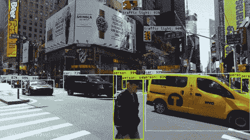

Extracting and Classifying Features in Video

再次引用维基百科，计算机视觉包括:

> 使用借助几何学、物理学、统计学和学习理论构建的模型，从图像数据中解开符号信息。

用不经意的语言来说:计算机视觉是一个丰富而令人兴奋的领域，充满了研究论文，在这个领域，人们不会像说话一样写东西(除了这个家伙)。

## 计算机视觉漫长而传奇的历史

大约在华特·迪士尼去世和维基百科创始人诞生的时候，人们就一直试图赋予计算机视觉的天赋:

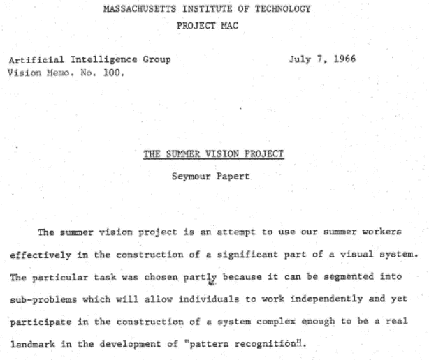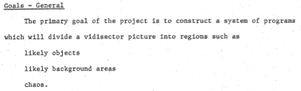

可以说，半个世纪以来，计算、数学和相关领域的进步使我们取得了很大进步。

## 数字图象处理

计算机视觉在很大程度上依赖于数字图像处理**和维恩图**，听起来也是如此，但这是不同的。可以说以下任务属于[数字图像处理](https://www.wikiwand.com/en/Digital_image_processing#/Tasks)的范围:

*   **模式识别:**自明。找到规律。
*   **特征** **提取:**将图像分解成不同的特征。
*   **分类:**这一簇边/形状看起来像汽车吗？一只狗？
*   **多尺度信号分析:**还有哪些方式可以看到这个图像？
*   **图形投影:**我们如何用 2d 表现 3d 物体？

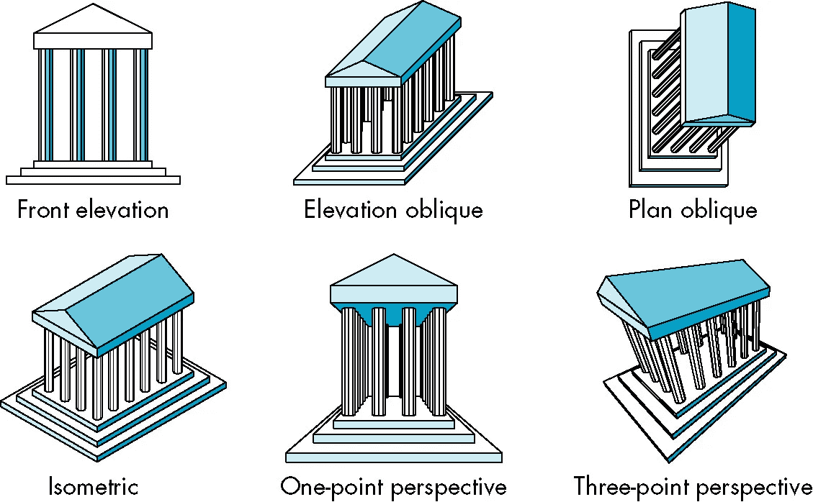

Some ways to project a 3d object into two dimensions: An image processing task

算法模式识别使我们能够自动定位图像的关键点，如角和边。例如，当我们比较连续视频帧之间显著点的相对位置时，我们可以做一些事情，如补偿 x 和 y 轴的过度移动；我们可以稳定颤抖。你可以用 python 中的[开源代码很容易地做到这一点。](https://github.com/AdamSpannbauer/python_video_stab)

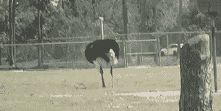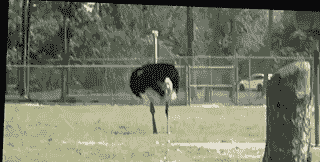

Shaky on the left, stabilized on the right

多尺度信号分析可能是这些图像处理子任务中最令人兴奋的，但在高层次上，它也和它听起来的一样:在几个“尺度”上，呃，从几个角度分析一个信号(比如一幅图像)。Photoshop 在其锐化工具中使用多尺度分析。

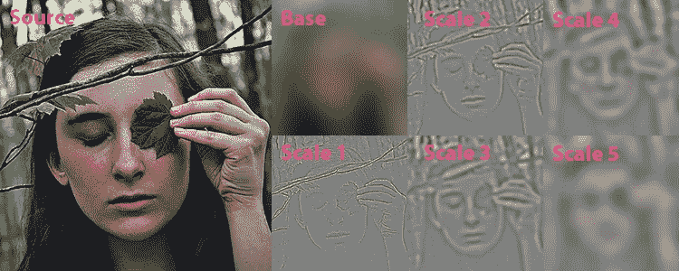

Sometimes, to sharpen an image, you gotta [blur it up first to help figure out where the edges](https://fixelalgorithms.co/news/2016/07/fixel-detailizer-2-ps/index.html) are.

一个有趣的方法是通过*对* *取导数来分离[图像。](http://mccormickml.com/2013/02/26/image-derivative/)*这是一种帮助找到图像边缘的方法，然后可以帮助我们将图像的各个部分聚集成单独的对象，然后这些对象可以接收标签——人类、狗、豹猫、运动球等等。这经常发生在多个“尺度”上。

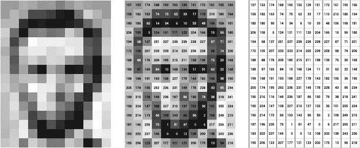

Brightness at the pixel level. Images do start to look like numpy arrays…

上面是诚实的安倍的照片。它的分辨率足够低，你可以看到单个像素。由于我们使用的是 8 位灰度，这些数字代表每个像素的亮度值，范围从 0 到 255。

如果你沿着 x 轴对任何给定的像素取[离散导数](http://mccormickml.com/2013/02/26/image-derivative/)，这意味着你将把它与它左边和右边的像素进行比较，然后得到它们亮度值之间的瞬时变化率的估计值。你可以沿着 y 轴(它的列)对同一个像素进行离散求导，然后将这两条信息结合起来，就可以计算出这个像素是否位于边缘。

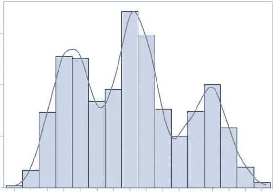

Imagine x is a pixel’s position in a discrete row of pixels, and y is its brightness value. You couldn’t get its derivative from the bar graph, but you could estimate it from a curve of best fit.

边缘往往在亮度或颜色值之间具有更大的瞬时变化率。我的意思是，看看亚伯的黑胡子的对比边缘。无论如何，这里有一个去年最新的物体检测演示，它实时结合了许多这些技术:

Joseph Redmon et al’s YOLOv3 Object Detection Algorithm. His [resumé](https://pjreddie.com/static/Redmon%20Resume.pdf) is awesome.

## 计算机视觉与机器视觉

那么，计算机视觉和数字图像处理的区别是什么呢？有很多重叠，但计算机视觉通常被认为更广泛:计算机视觉倾向于**要求一些关于世界的假设作为输入**，并且还试图**输出一些可操作的决策**。

这里有一种方式来思考这种区别:想象一下我们从飞机上扔下一个配备有降落伞和摄像机的简单机器人。如果它只是在降落时进行数字图像处理，它可能能够分析其摄像头的反馈，以识别其下方的陆地和海洋区域——但它不知道什么是陆地和海洋*也不知道*对它们做了什么*。*

有了计算机视觉，我们可以给我们的机器人一些关于世界的假设，比如“水和热熔岩不适合着陆，”以及“这就是热熔岩和水的样子。”然后，我们的机器人可以使用数字图像处理来分析它的摄像头，将周围的区域分为陆地、海洋或熔岩，并根据它之前的假设，决定在哪里着陆最好——然后去那里。

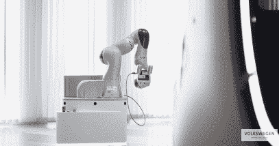

这个假设的跳伞实际上是**机器视觉***的一个例子，是计算机视觉的应用工程子类。机器视觉的一个更现实的应用可能是，自动化和加速装配线上的视觉质量控制任务。计算机视觉与这一学科的理论和科学元素有更多的关系，而不是帮助跳伞机器人安全着陆的实地工作。*

*憎恨者不会同意这些定义。有人说，数字图像处理只寻求以某种方式转换图像，而计算机视觉做任何和所有的模式识别、分析、解析斑点等等。在这一系列学术术语中，它仍然有点像狂野的西部。*

## *未来:好与坏*

*我们已经疯狂地给予计算机近乎实时地观察事物并描述它们是什么的能力。未来工作的重点将是进一步开发通用系统，让计算机能够理解它们看到的东西，并做出适当的反应。*

*我们需要这样的系统来让自动驾驶汽车安全运行。为了让医学成像变得更好更便宜，我们需要它们。我们将需要它来做许多好事，但正如人类建造的任何闪亮的新工具一样，我们必须记住一件事:一旦建立在这些基础上的工具以有意义的方式出售，那些从剥削、战争和其他邪恶行为中获利的人就会拿出他们的支票簿。来自 [Gizmodo](https://gizmodo.com/new-all-seeing-billboard-uses-hidden-cameras-to-show-ad-1819505420) :*

> *伦敦著名的皮卡迪利广场[正在安装一个巨大而可怕的](https://www.theverge.com/2017/10/16/16468452/screen-london-picadilly-circus-cars-targeted-ads-landsec)…巨大的屏幕……【它】可以探测附近的车辆、年龄，甚至人们的情绪，并通过播放有针对性的广告做出反应。*

*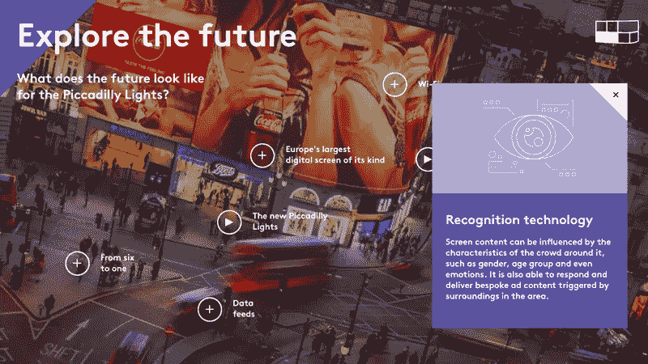*

*多黑的镜子。*

*机器学习和数字图像处理的进步正在融合。想到在我有生之年，在仓库工作的机器人将能够**看到**我正在向它扔扳手，**理解**这意味着什么，**决定**它应该做什么，**抓住**它，这并不疯狂。*