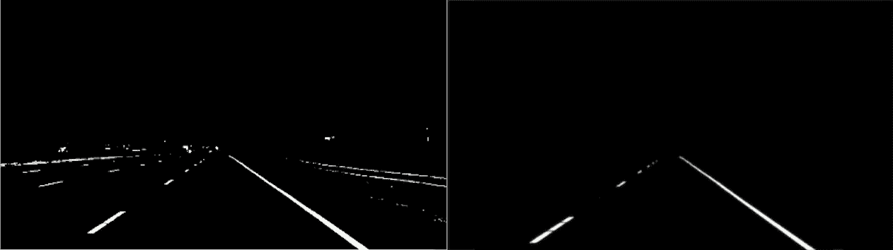
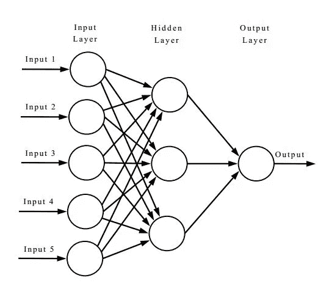
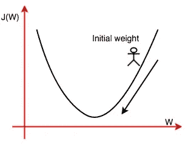
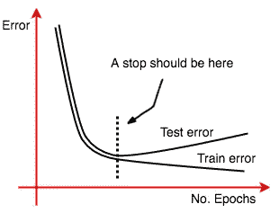
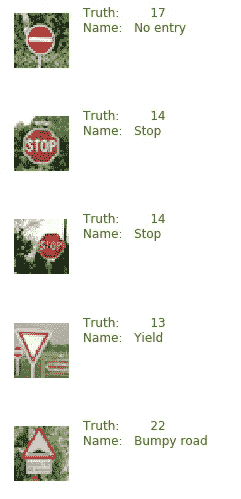
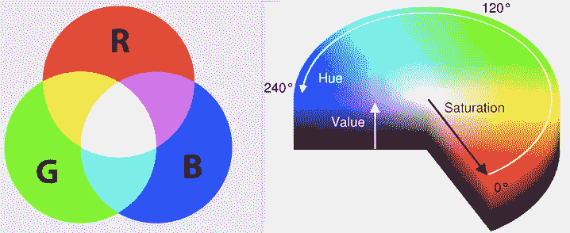
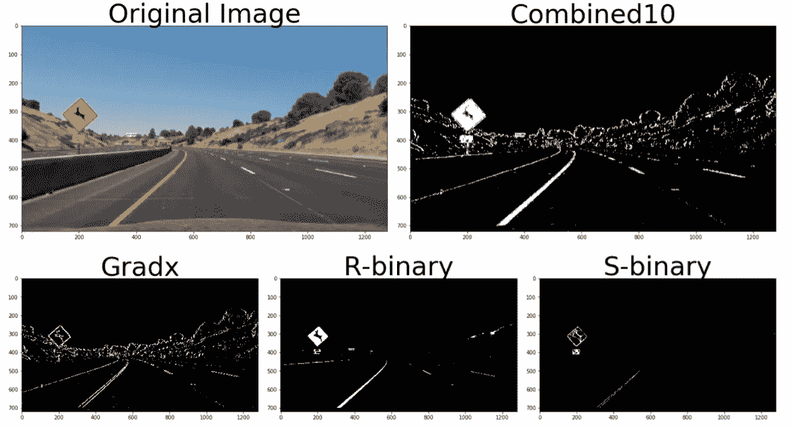
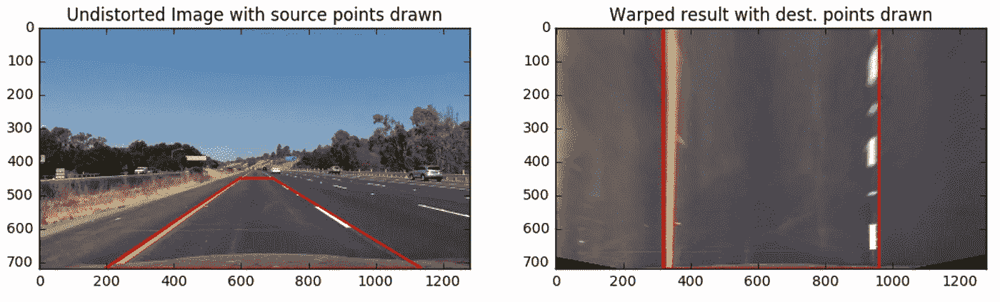
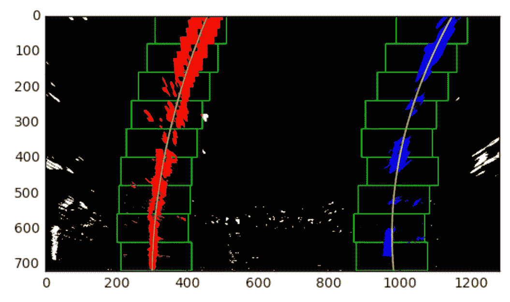
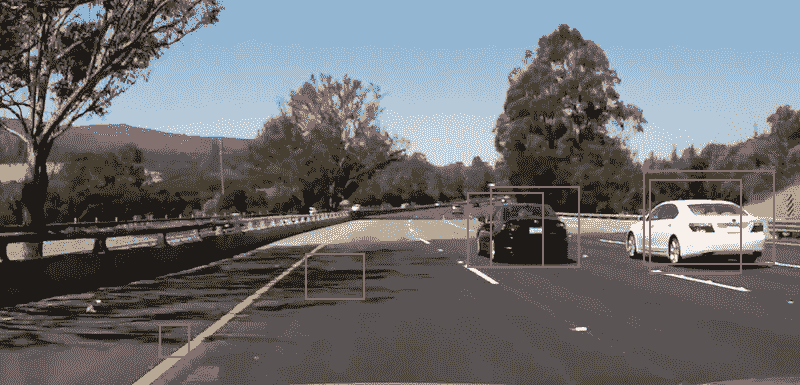

# 我从 Udacity 自动驾驶汽车纳米学位项目第一学期学到的东西。

> 原文：<https://towardsdatascience.com/what-i-have-learned-from-the-first-term-of-udacity-self-driving-car-nanodegree-program-7d36b011f300?source=collection_archive---------0----------------------->

我叫哈迪·阿布·斯内赫，来自约旦安曼。我曾在德国约旦大学学习机电一体化工程。我决定接受挑战，参加 Udacity 自动驾驶汽车项目。在德国生活了一年半之后，促使我寻找替代方案，并思考解决我们在约旦遇到的事故和驾驶心态的方法。在这篇文章中，我将简要说明我的项目是关于什么的，以及我在第一学期学到了什么。

**注意:**所有代码都是用 Python 编程语言编写的，使用了一些有用的库，如 OpenCV。

**项目 1:寻找道路上的车道线:**

第一个项目是机器视觉和基本图像处理方法的基本介绍。这个项目的目的是使用基本算法检测视频中的车道线。这个项目的目标是提供对图像处理和计算机视觉中使用的重要算法和方法的良好理解，例如:

1.  Canny 边缘检测:这是一种用于检测图像边缘的算法。有关此方法的更多信息，请点击 [**此处**](http://docs.opencv.org/trunk/da/d22/tutorial_py_canny.html) 。
2.  区域屏蔽:该函数用于拟合多项式，屏蔽图像中不需要的部分，以便只显示感兴趣的区域(ROI)。例如:

Unmasked image on the left vs. the ROI image on the right

3.霍夫空间(Hough space ):通常，在图像空间中绘制图像，将图像上的每个点表示为 X 对 1962 年，Paul hough 发现了一种表示图像的新方法。新的空间被称为霍夫空间，其以笛卡尔形式用 m 对 b 或者以极坐标形式用 r 对θ来表示每个图像。图像空间中的一条线由 Y=mX+b 表示。这意味着图像空间中的每一条线由一个点表示。这种变换有助于找到图像中线条之间的关系。为了成功地执行霍夫变换并检测正确的线，需要注意不同的参数。有关此转换的更多信息，请点击 [**此处**](http://docs.opencv.org/2.4/doc/tutorials/imgproc/imgtrans/hough_lines/hough_lines.html) 并检查 OpenCV 中的函数，请点击 [**此处**](http://docs.opencv.org/2.4/modules/imgproc/doc/feature_detection.html?highlight=houghlinesp#houghlinesp) 。

4.在实现代码之前，需要将图像转换为灰度图像，而不是红绿蓝(RGB)色彩空间。高斯模糊也用于模糊图像并去除图像中存在的一些噪声。

在使用霍夫变换找到霍夫线之后，基于它们的斜率和位置过滤这些线，以确保检测到的线仅仅是车道线。您可以在管道中的 draw_lines 函数中看到这一点。

第一个项目的代码可以在我的 Github 库**这里**看到。

这是第一个项目的最终结果:

Lane line detection video.

**项目 2:交通标志识别分类器:**

第二个项目侧重于不同的原则，即神经网络(NN)。我会试着在这里简单地解释一下，但是我也会提供一些有用的链接给你查看。

首先，深度学习使用算法和多层来提取特征、学习和预测结果。神经网络是一种深度学习方法，用于教会计算机预测特定的结果。

神经网络由不同平行层组成。每层由一个或多个节点组成。一个节点包含一个特定的数学运算。神经网络的输入称为特征。它们代表从比如说一幅图像中提取的选定信息。例如:图像的像素值。输出是图像的结果，称为标签。例如:指定图像中的物体是什么(狗、猫等)。像素值进入节点，并乘以随机权重，以创建表示图像像素之间关系的数学方程。这些特征进入不同的节点，从而产生不同的方程和不同的关系。

This is an example of a simple Neural Network.

节点还包含激活功能，以确定是否触发网络中的下一个节点，例如:如果结果> 0，则激活下一个节点，如果< 0，例如-0.5，则将其设为 0，不激活下一个节点。

开始时，网络将完成一次转发。结果不会非常准确，因为等式的权重是随机的，这意味着我们可能最终会放大不太重要的特征，并减少更重要的特征(在等式中，w=2 会使特征加倍，而 w=0.5 会将其减半)。因此，计算误差或均方误差将显示预测结果与实际结果的差距。为了获得更小的误差，我们需要更新权重，以获得最小的误差。换句话说，我们的目标是通过在下面的图像中更深入来降低梯度，直到梯度几乎为零。这是梯度下降。

Example of the gradient descent to reduce error. The goal is to reach the bottom (Gradient of almost Zero).

为了更新权重，有一个称为反向传播的过程。它使用在网络末端获得的误差，并且主要使用链规则来寻找每个节点处的误差和梯度。因此，网络向前，找到误差，然后向后更新权重，并一直这样做，直到达到最小均方误差。

在更高级的网络中，任何预测的结果都将是多个标签。每个都有正确结果的概率和误差。因此，在其他标签中，最大的概率和最小的误差应该是正确的猜测。有不同的程序和算法用于提高神经网络的效率和准确性，例如 softmax 函数，它将网络的输出转换成概率。

因此，由标签矩阵 Y 表示的 NN 的标签是等式 Y=Xw+b 的结果，其中 b 是偏差，X 是特征矩阵，w 是整个网络的权重矩阵。在训练过程中，X 中的每一行代表图像像素。要训练网络，必须有一个具有已知标签的大型数据集，以便您可以向网络输入 x。首先，权重将是随机的，当计算与已知 Y 相比的误差时，权重会更新等等。在训练网络之后，通过向网络提供新的图像(X)并使用网络应该能够成功预测结果的更新的权重(标记 Y)来测试网络。完成该操作后，计算精度。

因为数据集非常大，所以矩阵 X 会非常大。这意味着使用普通计算机 CPU 训练网络将花费大量时间，而使用 GPU 要快得多。

训练网络的目标是泛化。我们需要创建一个足够通用的网络来预测任何新的观察结果并给出正确的结果。需要避免的一个重要情况是过度拟合。你可以认为过度拟合是一个网络，它在与训练过的网络相似的观察(图像)中表现得非常好。但是一旦给出一个新的稍微不同的图像，结果就变得不对了。因此，该网络不能推广到成功预测不同的给定。这也意味着训练误差很低，而测试误差很高。应该防止这种情况，这种情况在许多情况下都会发生，例如增加历元数。在神经网络的训练中，历元是向前一遍和向后一遍。另一个原因是通过使用与训练数据相同的数据来测试网络。

A plot shows how overfitting affects the test results.

神经网络有许多参数可以调整以达到最佳精度。例如:改变历元数或学习率。学习率是在每个时期更新权重的速率。

关于神经网络 NNs 或者甚至非常相似的卷积神经网络 CNN 的进一步信息，我推荐这些链接:

1.  [**用于视觉识别的卷积神经网络**](http://cs231n.github.io/convolutional-networks/)

2. [**CS231N —卷积神经网络**](https://www.youtube.com/playlist?list=PL16j5WbGpaM0_Tj8CRmurZ8Kk1gEBc7fg)

不同的公司和组织创建了 CNN 架构，将节点组合在一起，以产生最佳效果。我使用 LeNet 架构实现了我的项目，这是一个非常简单的 CNN，可以提供合理的准确性。

该项目是关于创建一个交通标志分类器，它能够识别汽车前置摄像头检测到的不同交通标志，并区分它们。正如你从下图中看到的，分类器能够对我从互联网上随机选择的交通标志图像进行分类。

Result of the traffic sign classifier in predicting traffic sign images.

要查看我的项目报告，其中我解释了所有实施的步骤和结果，请按 [***此处***](https://drive.google.com/open?id=0BzYT14AYWSA8ZUVuNlZVbVNmNjQ) 。并点击 [***此处***](https://drive.google.com/open?id=0BzYT14AYWSA8aEEtWmtTNzR0SnM) 查看我的项目管道。

**项目 3:行为克隆:**

这个项目的目标是建立一个能够克隆汽车行为的 CNN。通过模拟器，汽车在轨道上行驶。汽车的前窗装有摄像头。摄像机的转向角度和图像可以在任何位置记录并保存。分类器将图像作为特征，将转向角作为 CNN 的标签。在使用用户保存的所有数据集(记录的图像和赛道上的转向角度)训练网络之后，汽车应该能够在从相机获取图像作为输入时，通过预测转向角度，在相同的赛道上自动驾驶。

为了能够构建高效的 CNN，使用了 Keras，这是一种基于 Tensorflow 构建的高级神经网络 API。如果你点击 [**这里**](https://drive.google.com/open?id=0BzYT14AYWSA8Z3U4eTgyZWFHRUU) ，你可以看到我用来实现让汽车自动驾驶的代码。

下面是汽车在自主模式下的视频:

要看我写的关于这个项目的报告，请点击 [**这里**](https://drive.google.com/open?id=0BzYT14AYWSA8QVo3SWNyaFE2bk0) 。

## **项目 4:高级车道线查找:**

Udacity 的第一个项目是寻找车道线。该项目使用先进的算法，能够在阴影等关键情况下预测车道线。

为了做到这一点，汽车的摄像头应该进行校准，以确保图像没有失真。这是通过计算摄像机矩阵和失真系数来完成的。我将在本节末尾的报告中对此进行解释。

要学习的一件非常重要的事情是色彩空间。它是一个数学模型，表示每个图像中使用的颜色系统。一个著名的颜色系统是 RGB(红绿蓝)，它使用不同强度值的红绿蓝颜色来表示和形成任何颜色。每个图像中使用不同的颜色空间，例如 HSV(色调、值和饱和度)。

RGB color space vs. HSV color space.

所以为了提取特定的信息，我们可以使用不同的颜色空间，甚至不同的通道。例如，如果我们从 RGB 和 HSV 颜色空间中提取红色通道和 S 通道，则黄色油漆的车道线比在不同通道中更有可能出现。组合最佳通道有助于增加在图像中找到所需信息的可能性。

另一种在图像中寻找直线或边缘的方法是使用 Canny 边缘检测方法。这种算法的核心依赖于所谓的 Sobel 算子。将这些运算符应用于图像类似于在 X 和 y 方向上对图像求导。这可用于找到边缘的大小，甚至它们的方向，这将有助于找到它们。这也可以与颜色空间相结合，以提高我们的检测算法的效率。(在我的例子中，我将红色通道、S 通道和 X 方向的梯度与特定阈值相结合，以检测车道线)。这也将在本节末尾的报告中解释。

A binary image resulting from combining images from (Gradient X, S channel and the Red channel)

在将彩色图像转换成二值图像后，图像被扭曲成鸟瞰图像。扭曲图像是通过透视变换完成的，也就是将一个对象从一个透视变换到另一个透视。在我们的例子中，我们希望将图像的一部分从正常视角转换为鸟瞰视角，在正常视角下，我们看到的物体比其他物体更大，而在鸟瞰视角下，我们从上方看到物体。这是通过在图像中指定四个点来完成的(应该创建一个梯形)。彼此靠近的两个点将被进一步处理，这将把梯形转换成正方形/矩形。

Warped image (right) vs. an original image with trapezoidal shape (left)

这种扭曲将有助于找到街道上线条的曲率。因此，在扭曲图像后，我们将能够在车道线上拟合多项式。这主要是通过找到直方图中的峰值(白线代表二进制图像中的峰值)，然后在图像中滑动窗口以覆盖这些线来完成的。之后，在直线上拟合一个多项式。这是窗口和多项式的样子:

Polynomial fit on the lane lines that are covered by the sliding windows. (they are colored for demonstration)

这将使计算线条的半径并在视频中突出显示它们变得更加容易。下面的视频显示了高亮显示车道线的结果。

看一下这个项目的报告。请点击 [**这里**](https://drive.google.com/open?id=0BzYT14AYWSA8eDV0c1JBSVk5TUU) 。并且在这里按**看一下代码管道。**

****项目 5:车辆检测:****

**第一学期的最后一个也是第五个项目是写一个程序，通过在每个检测到的车辆上画一个包围盒来检测车辆。该项目是使用支持向量机 SVM 完成的，这是一种用于分类和区分不同类别的分类器。在这种情况下，分类器将图像的多个特征作为输入，并学习将它们分为两类，汽车和非汽车。**

**提取图像特征有不同的方法。第一个 HOG 特征是梯度直方图，寻找图像像素的梯度方向。第二是计算每个通道的颜色直方图。通过计算，你将得到从 0 到 255 的每个通道的直方图。**

**因为车辆有特殊的特性，比如闪亮的油漆。更好的做法是检查在提取特征和识别每幅图像时能够给出最佳结果的最佳颜色空间。特征提取应用于 cars 图像数据集和非 cars 图像数据集，之后它们被保存在两个数组中。然后应用 SVM，并计算新训练的分类器的准确度。**

**不，我们能够识别汽车图像。下一步是能够在包含多个对象的图像中找到汽车。一个简单的方法是在图像上滑动一个特定大小的窗口，搜索里面是否有汽车。最有效的方法是提取整幅图像的 HOG 特征，然后对图像进行二次采样并搜索汽车。要确定检测到的对象是汽车，最好创建不同大小的窗口。这将增加检测汽车的概率。换句话说，汽车将被检测多次，而非汽车对象将被检测一次。这将有助于移除所有不需要的对象。这些被称为假阳性。**

****

**False positives (left) vs. Cars successfully detected by different windows (right)**

**如果你能在图像中看到树的影子，软件就会认为那辆车就在那里。消除误报将有助于提高软件的准确性，并将只保留被多个窗口检测到的对象。这是通过将热图应用到分类器来完成的，该分类器将热量添加到窗口内的每个像素。在有多个窗户的地方热量会增加，而在只有一个窗户的地方热量会保持不变。这在管道中用于消除所有误报。**

**请点击 [**点击**](https://drive.google.com/open?id=0BzYT14AYWSA8dXIwd3FNWjE5ZVU) 查看项目报告。并且还点击[这里的](https://drive.google.com/open?id=0BzYT14AYWSA8OG90UUxicTBkQkk)**来检查管道。****

****下面是我能得到的结果的视频:****