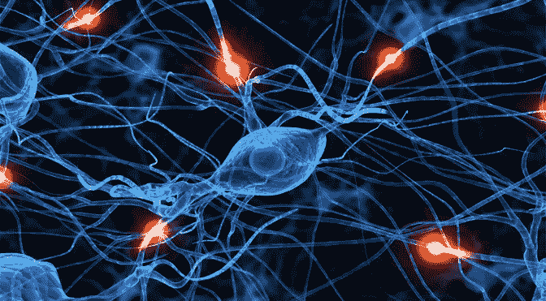
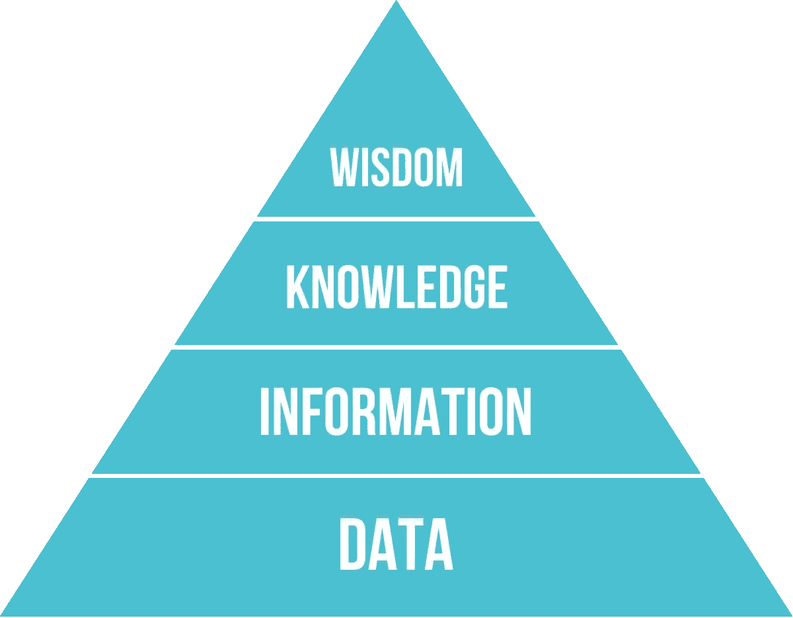
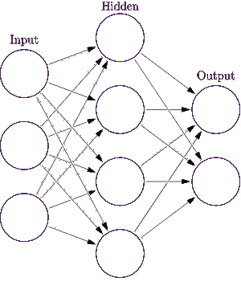
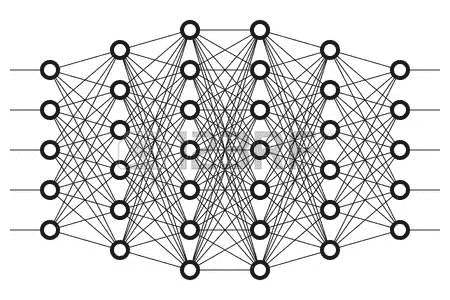
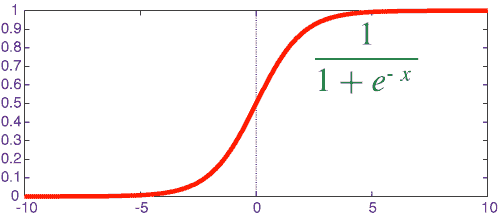
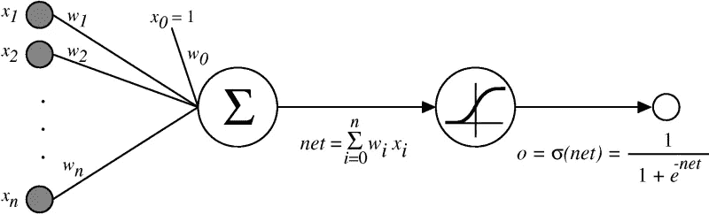
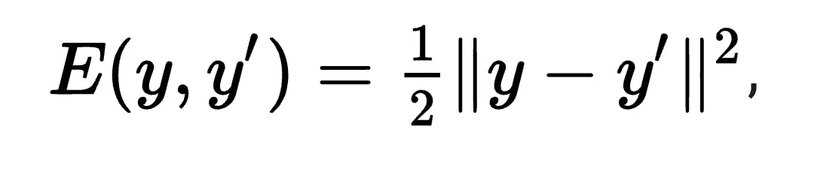
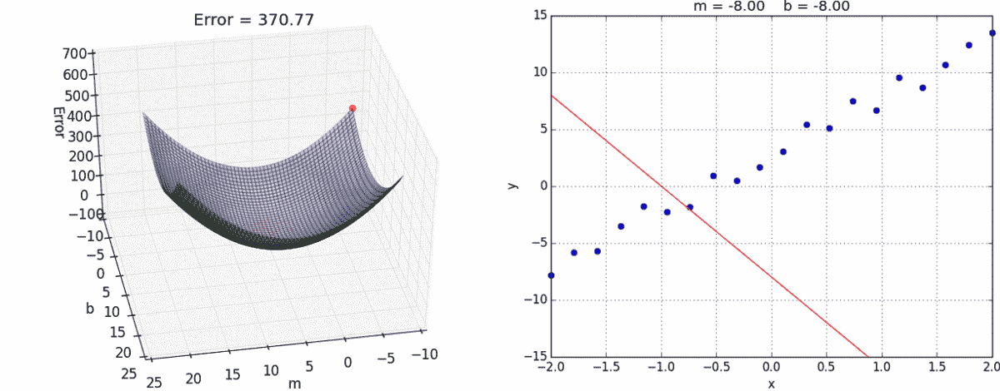
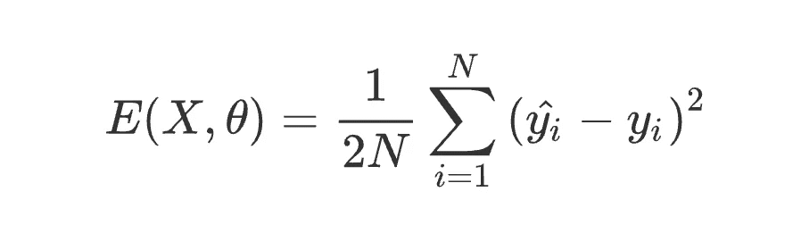
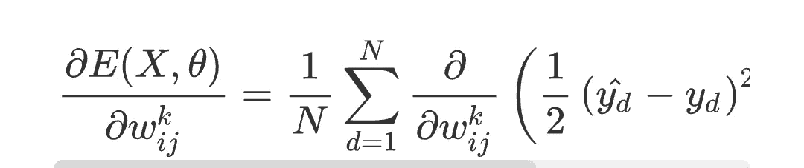

# 到目前为止我对机器学习的理解

> 原文：<https://towardsdatascience.com/what-i-have-understood-about-machine-learning-so-far-836d814dbe84?source=collection_archive---------6----------------------->

每当我想到机器学习或人工智能，我都会想起这句流行的名言——

> “人类大脑有 1000 亿个神经元，每个神经元与 1 万个其他神经元相连。坐在你的肩膀上是已知宇宙中最复杂的物体。”

这句话简单地解释了人类大脑的复杂性，人类大脑由数十亿个被称为**神经元、**神经元的思维单元组成，大脑中的单个神经元通过被称为轴突的电线连接到其他几个神经元，这些轴突为电脉冲提供了在单个神经元之间移动的路径，因此知识在我们的大脑中以电脉冲的形式移动。

## 人脑是如何影响机器学习的？

正如你们许多人所知，人工智能是目前最热门的研究领域之一，它主要涉及人工智能系统的创造。我们人类是聪明的，因为我们有能力获取知识，这是智能的核心部分，实际上计算机很难获取知识，因为它们只是由沙子(硅)制成的，但它们如何学习和获取知识呢？他们如何变得聪明？在不久的将来，他们如何获得影响我们日常生活的潜力？答案很简单..因为机器学习才有可能！！

所以机器学习是让人类创造人工智能系统的东西。(就好像 AI 是名词，机器学习是动词一样)。有许多机器学习的方法，但由于这样或那样的原因，它们都失败了。为什么？因为他们没有提供一个通用的学习方法。当人类开始理解大脑实际上是如何学习的时候，真正的革命就开始了，我们称之为知识金字塔，它代表了不同层次的知识表达。

我们举个例子来了解一下这个知识金字塔。假设你正在看一张电影海报，每当你看到你周围的一些物体时，你眼睛的视网膜能够产生你所看到的电脉冲。这些脉冲被称为数据(知识金字塔的最底层)，默认情况下，数据没有任何意义，大脑中第一级神经元的责任是从中形成一些有意义的形状。因此，第一级神经元将电脉冲视为像素，这些像素可以以多种方式一起摸索，形成许多内部表示。这些表示我们称之为信息。但是光有信息还不足以获得你所看到的完整画面。众所周知，电影海报是一个长方形，但有许多物体可以类似电影海报的形状(可以是电影屏幕、电脑屏幕或任何东西)，所以你需要了解物体是电影海报。更高级别的神经元负责从现有知识中提取你所看到的意义。我们称之为机器学习中的推理。人脑内部将你看到的电影海报与你之前的经历进行匹配，以确定它到底是什么。

所以当你看这张图片的时候，你可以说这是《权力的游戏》,因为你以前就知道《权力的游戏》,而对于一个从未看过《权力的游戏》的人来说，这真的很难。这就是人脑识别物体的方式。同样的知识金字塔可以用来学习任何东西。这是主要影响机器学习的概念。

## 机器学习的类型:

有 3 种类型的学习:

1.监督学习:在监督学习中，我们通过展示 1000 个例子来训练一个 ML 模型。例如，为了让计算机识别猫，我们展示成千上万只猫的图像。这样它就能知道猫到底长什么样。

2.无监督学习:在无监督学习中，我们不需要展示例子。电脑可以自己学习，这就是我们大脑的工作方式。

3.强化学习:这可以简单地定义为“从错误中学习”，计算机执行数以千计的试错步骤，以学习实现目标的最佳技术。强化学习可以用来构建智能游戏机器人。

## 一个简单的神经网络:

因此，让我们建立一个简单的神经网络，在旅途中，我会向你解释它如何与人脑相关。

看一下上图。它被称为具有一个隐藏层的前馈神经网络。输入层是我们给出输入的地方，输出层是我们得到预测结果的地方。例如，如果我们在输入层输入一幅猫的图像，我们在输出层得到猫的预测。正如你在图中看到的，神经元之间的连接叫做边缘。一条边将当前层的一个神经元与下一层的所有神经元连接起来。因此，边类似于人脑中的轴突，网络中的每个节点类似于人脑中的一个神经元。神经网络可以有 n 层，称为隐藏层，如下所示:

## 学习只是一种数学优化:

上面的结构默认不学任何东西。所以我们应该有让神经网络学习的东西。图中的每条边都被赋予一个叫做权重的值。开始时，我们随机分配权重。在学习过程中，学习算法调整每条边的权重，以获得期望的输出。学习算法基本上使用诸如梯度下降的优化器来优化权重。

**输入输出表示:**

当我们训练神经网络时，我们以向量(X，Y)的形式定义输入和期望输出，其中 X 是所有输入值的集合，Y 是期望输出。X 可以表示为一组输入 X = {x1，x2，x3…xn}。应该有一个神经元接受 X 的每个输入值。例如，如果 X = { x1，x2}，则应该有 2 个输入神经元。y 是输出向量，向量 W 表示分配给流出神经元的每个边缘的一组权重。W = {w1，w2，w3…}。在每次迭代中，X 向量与 W 向量相乘，并加上一个称为 Bias 的值。因此，表达式可以写成 W*X + b，然后将值传递给激活函数。

## 使用激活功能:

概率是一种重要的数学工具，可以用来确定一个事件是否可能发生。例如，如果我们向神经网络输入一幅猫的图像，那么猫出现的概率就很高。如果 yi Y 是代表猫的类，而 yj Y 是代表狗的类，那么如果输入是猫的图像，则 yi 具有更高的概率。必须有一种技术将 x*w+b 值转换为概率分布，这可以通过使用一个称为 **sigmoid 的数学函数来完成，** sigmoid 在数学上表示为

sigmoid 函数总是产生 0 到 1.0 范围内的值。x 值越高，sigmoid 将返回值≈ 1，因此我们可以说该特征更有可能存在。这里，X 值是通过将 X*W 与偏差相加得到的。因此权重对乙状结肠功能的结果有较大的影响。由于我们随机分配权重，我们不会得到适当的输出。因此我们计算误差并优化权重以最小化误差。这是通过梯度下降和反向传播实现的。

## 确定输出误差，并使用梯度下降法降低误差:

到目前为止，我们所学到的可以总结在下面的图片中

我们只是将输入向量 X 的每个值(X)与权重向量 W 的每个权重(W)相乘，并添加一个偏差(对所有输入值和权重都是如此)，然后使用 sigmoid 将结果转换为概率分布。

在应用 sigmoid 之后，我们得到一个预测的输出概率，这个值与最后一层的权重相乘，一起产生一个预测的输出。为了计算误差，我们必须将预测输出与期望输出进行比较，这可以使用许多方法来完成，下面给出了其中一种方法..

该表达式根据预测输出和期望输出之间的欧几里德距离计算误差，然后对其进行平方，通过消除负号来获得平均误差。这个误差值也称为损失或成本，在开始时是最大值。随着训练的继续，损失会最小化。怎么会？

当我们仔细观察误差公式时，我们可以说，当 y ≈ y 时，误差 E 将最小或几乎为 0。这只有在我们优化权重时才会发生，这意味着我们必须回到神经网络并调整权重。梯度下降和反向传播帮助我们做到这一点。

## 梯度下降:

微积分几乎应用于所有的科学领域。梯度下降如果你微积分好的话可以很好理解。梯度下降有助于优化权重。w 值代表为了优化而必须应用的重量变化。w 可以是正数，也可以是负数。在训练过程的每一次迭代中，梯度下降确定 w 的值，然后 w 被加上与单个神经元相关联的权重。在此之前，我们必须确定需要优化的权重，这可以使用反向传播算法来完成，一旦我们确定了神经元，我们回到那里执行 w+∏w，我们可以从数学上认为∏w 是 w 的一个小变化，因此权重在每次迭代期间得到小范围的优化。

N 个输出类的误差函数可由下式给出:

我们得到损失函数的偏导数:

wij(k)可以通过反向传播算法来确定。

从上图可以清楚地看出，存在一个最佳权重，其误差约为 0。学习算法的目标是使用梯度下降来优化权重，或者在数学意义上，损失函数的偏导数的斜率导致 w，并且它总是向最优权重移动。我们不强调梯度下降的数学公式，因为它需要大量的微积分知识。

## 反向传播算法及其在神经网络中的应用；

我们知道梯度下降是一个数学函数，可用于优化权重，但我们假设权重 w 是已知的，因此 w 可以应用于它，梯度下降对神经网络的现有权重没有任何概念，因此反向传播用于确定可以应用优化的权重 w。

**计算图中的反向传播**:

如果对 X 和 y 的任何有限向量明确定义了每个神经元的操作，则神经网络 N 可以表示为计算图。将 nn 表示为计算图非常有用，因为它们可以像数学表达式一样进行评估，并且适用于计算图的所有规则也可以应用于神经网络。计算图和反向传播的细节可以在这个链接找到:【http://colah.github.io/posts/2015-08-Backprop/

通俗地说，反向传播可以用来确定每个神经元的权重对输出的影响，这很好地帮助我们反向传播网络，并获得该神经元的 w。一旦 w 已知，我们就可以应用 w+∏w。

## 总结:

给定数据集(X，Y ),其中 X 是输入向量 X={x1，x2…xn}和 Y ={ y1，y2…}，其中 X 是输入训练样本，Y 是输出标签集，N 是执行函数 f:N(X)→Y 的神经网络，其中 Y 是包含一组预测输出的向量 Y = { y1，y2…yn }, W 被称为权重矩阵，并在开始时被随机分配，f:N(X)执行以下函数:

*   在每个神经元上对 xi 进行一些运算，然后乘以权重 wi (xi 和 wi 分别属于 X 和 W)。
*   将偏差 b 添加到产品中。
*   对输出 z= xw+b 应用一些激活函数，它可以是 sigmoid、softmax、ReLu、tanh 或任何其他函数。
*   这种操作在整个网络的每一层执行，这就是所谓的前向传播。
*   在输出层，为每个类产生 yi，(yi 属于 Y)。
*   计算误差函数 E(Y，Y)。
*   通过应用反向传播和梯度下降来调整权重矩阵 W 的值，从而最小化损失。
*   重复以上所有步骤，直到 E ≈ 0。

通过这种方式，可以训练网络执行一些智能动作。简单地说，我们可以将神经网络的基本操作定义为:

# X "* "(？或 W) = Y

如果 X 是输入，Y 是输出，我们必须找到 W 或者？它必须和 X 一起使用才能产生 y。

这里*代表 X 和 W 之间的一系列数学运算，“*”一般是不存在逆的非线性运算。

这只是神经网络的理论介绍。将来会涵盖更多内容。

## 谢谢你，☺