# 我从分析和可视化交通事故数据中学到了什么

> 原文：<https://towardsdatascience.com/what-i-learned-from-analyzing-and-visualizing-traffic-accidents-data-7cd080a15c15?source=collection_archive---------1----------------------->

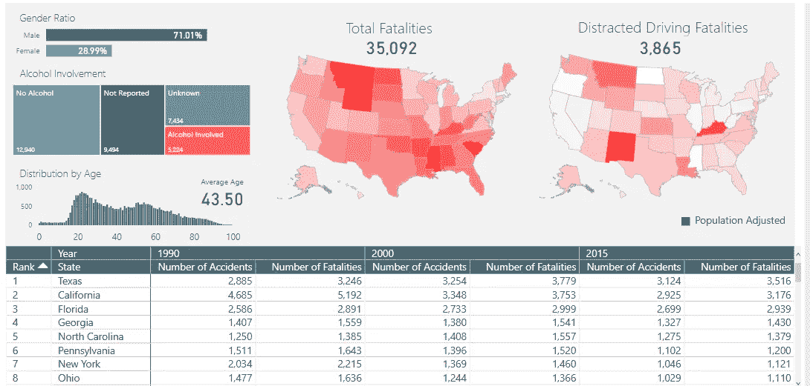

Source: Power BI

# 概观

美国国家公路交通安全管理局(NHTSA)向公众公开了一些非常有趣的数据。我下载了几个数据集，其中包含从 1994 年到 2015 年的致命机动车辆碰撞和死亡的信息。本分析的目的是探索并更好地理解影响车辆碰撞可能性的一些因素。

分析和可视化是用 R 语言完成的。r 是可怕的，因为你会发现。

# 数据

**加载库**

我将使用下面的库进行分析和可视化。为了保持文章简洁，我没有展示大部分数据清理和分析步骤的代码，但是和我所有的文章一样，代码可以在 [Github](https://github.com/susanli2016/Data-Analysis-with-R/blob/master/traffic_safety.Rmd) 上找到。

```
library(XML)
library(RCurl)
library(rvest)
library(dplyr)
library(tidyr)
library(ggplot2)
library(ggthemes)
library(reshape)
library(treemap)
```

美国的交通死亡人数一直呈下降趋势。值得注意的是，2014 年的死亡人数(不到 33，000 人)远低于 2005 年的峰值(超过 43，000 人)。

```
ggplot(aes(x=Year, y=Val), data = df_long_total) + geom_line(size = 2.5, alpha = 0.7, color = "mediumseagreen", group=1) + 
  geom_point(size = 0.5) + 
  ggtitle('Total Number of Accidents and Fatalities in the US 1994 - 2015') +
  ylab('count') +
  xlab('Year') +
  theme_economist_white()
```

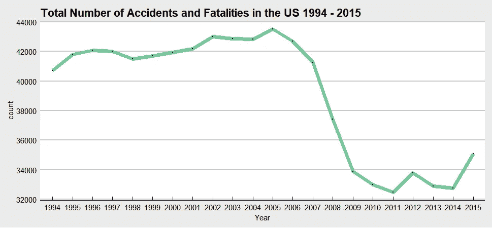

Figure 1

而且上述数字还没有考虑到路上不断增加的汽车数量。美国人开车比以往任何时候都多。

```
ggplot(aes(x=Year, y=Val), data = df_long_travel) + geom_line(size = 2.5, alpha = 0.7, color = "mediumseagreen", group=1) + 
  geom_point(size = 0.5) + 
  ggtitle('Total Vehicle Miles Traveled 1994 - 2015') +
  ylab('Billion Miles') +
  xlab('Year') +
  theme_economist_white()
```


Figure 2

**2015 年各州交通死亡人数以及与 2014 年相比的百分比变化**

```
state <- state[c('State', 2015, 2014, 'Percent.Change')]
newdata <- state[order(-state$`2015`),]
newdata
```

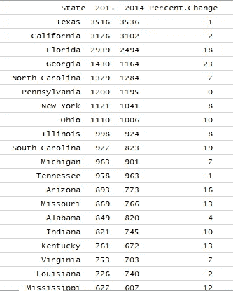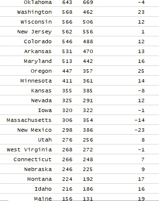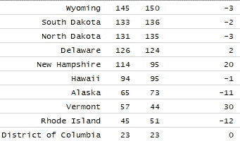

*   德克萨斯州在 2014 年和 2015 年都是美国交通死亡人数最多的州。
*   可以理解的是，交通死亡人数最少的州也是居民最少的州，包括哥伦比亚特区，其次是罗德岛州和佛蒙特州。

**在全国范围内，每年男性的机动车事故死亡率高于女性(两倍以上)。**

```
ggplot(aes(x = year, y=count, fill=killed), data=kill_full) +
  geom_bar(stat = 'identity', position = position_dodge()) + 
  xlab('Year') +
  ylab('Killed') +
  ggtitle('Number of Persons Killed in Traffic Accidents by Gender 1994 - 2015') + theme_economist_white()
```

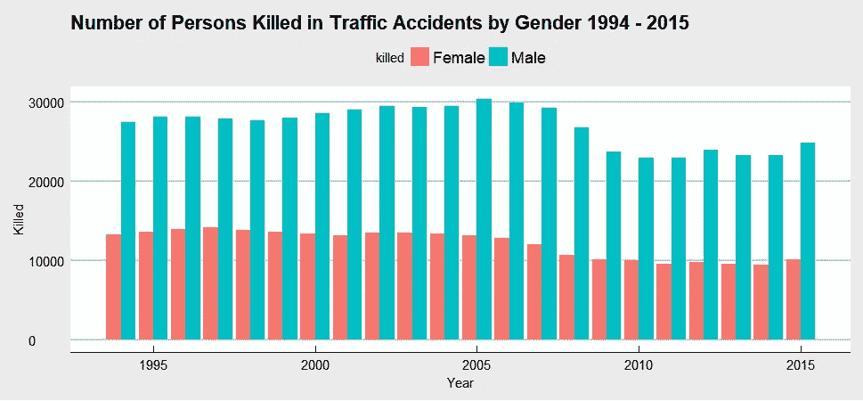

Figure 3

**25 至 34 岁年龄组的死亡人数最多。**

```
age_full$age <- ordered(age_full$age, levels = c('< 5', '5 -- 9', '10 -- 15', '16 -- 20', '21 -- 24', '25 -- 34', '35 -- 44', '45 -- 54', '55 -- 64', '65 -- 74', '> 74'))
ggplot(aes(x = age, y=count), data =age_full) + geom_bar(stat = 'identity') +
  xlab('Age') +
  ylab('Number of Killed') +
  ggtitle('Fatalities Distribution by Age Group 1994 - 2015') + theme_economist_white()
```

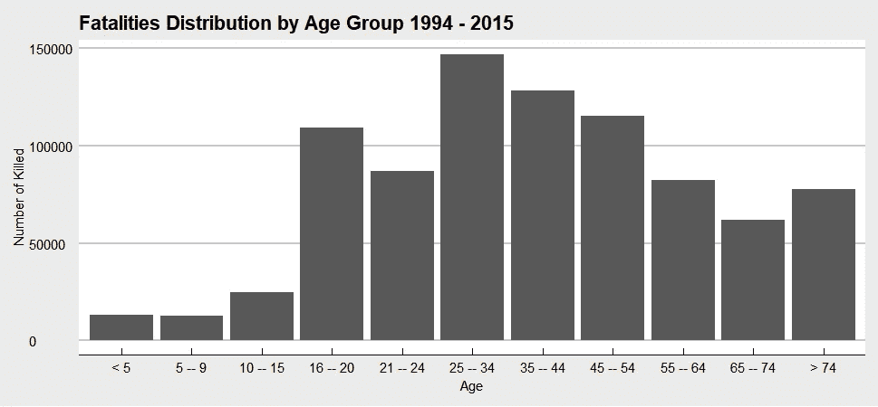

Figure 4

**从 2005 年到 2015 年，只有两个年龄组的死亡人数增加；55 比 64 和 65 比 74。16 至 20 岁和 35 至 44 岁年龄组的死亡率下降幅度最大。**

```
ggplot(age_full, aes(x = year, y = count, colour = age)) + 
  geom_line() +
  geom_point() +
  facet_wrap(~age) + xlab('Year') +
  ggtitle('Traffic Fatalities by Age 1994 - 2015') + 
  theme(legend.position="none")
```

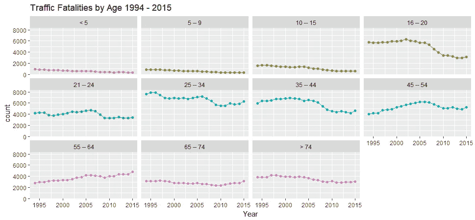

Figure 5

从这张树形图中，我们看到下午 3 点到 5 点 59 分和下午 6 点到 8 点 59 分死亡人数最多。让我们深入了解一下。

```
treemap(kill_by_hour_group, index=c("hours","variable"), vSize="sum_hour", type="index", fontsize.labels=c(15,12), title='Fatalities by time of the day', fontcolor.labels=c("white","orange"), fontface.labels=c(2,1), bg.labels=c("transparent"),  align.labels=list(
  c("center", "center"), c("right", "bottom")), overlap.labels=0.5, inflate.labels=F,
)
```

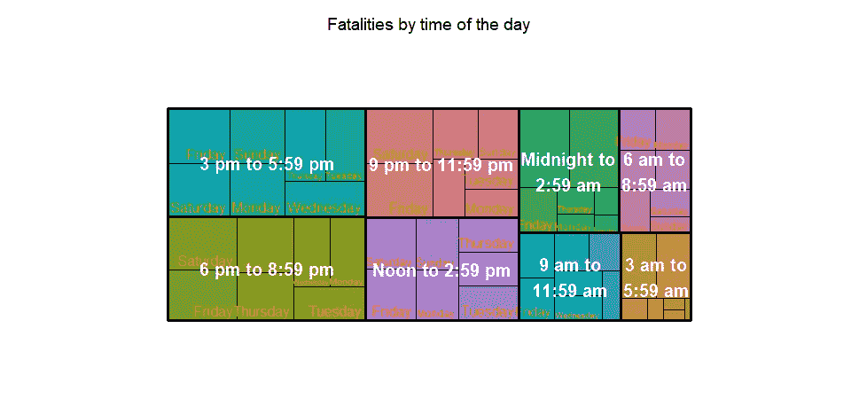

Figure 6

大多数事故发生在周六和周日的午夜到凌晨 2:59 之间。让我们更深入地探究一下原因。

```
ggplot(aes(x = variable, y = sum_hour, fill = hours), data = kill_by_hour_group) +
  geom_bar(stat = 'identity', position = position_dodge()) +
  xlab('Hours') +
  ylab('Total Fatalities') +
  ggtitle('Fatalities Distribution by Time of the Day and Day of the week 1994-2015') + theme_economist_white()
```

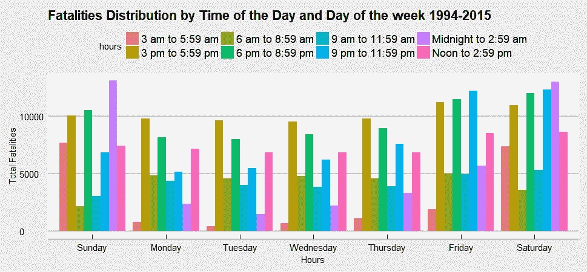

Figure 7

星期六和星期天的午夜到凌晨 2 点 59 分是许多人离开酒吧的时间。我们还要说多少次，不要酒后驾车？

```
ggplot(aes(x = year, y = count, fill = hour), data = pair_all) +
  geom_bar(stat = 'identity', position = position_dodge()) +
  xlab('Year') +
  ylab('Number of Fatalities') +
  ggtitle('Fatal Crashes caused by Alcohol-Impaired Driving, by Time of Day 1994-2015') + theme_economist_white()
```


Figure 8

在过去 10 年里，酒精中毒驾驶致死的比例实际上是持平的。

```
ggplot(aes(x = year, y = mean, color = bac), data = al_all_by_bac) +
  geom_jitter(alpha = 0.05) +
  geom_smooth(method = 'loess') +
  xlab('Year') +
  ylab('Percentage of Killed') +
  ggtitle('Fatalities and Blood Alcohol Concentration of Drivers 1994-2015') + theme_economist_white()
```

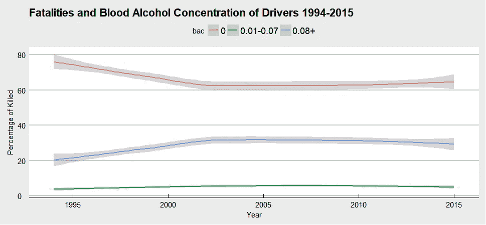

Figure 9

## 轮到你了

[NHTSA](https://www-fars.nhtsa.dot.gov/Main/index.aspx) 为交通死亡信息提供了丰富的数据源。有数百种方法来分析它们，最好的方法取决于数据和你试图回答的问题。我们的工作是讲述一个有数据支持的故事。哪种类型的车辆更有可能发生碰撞？车辆中最安全的座位在哪里？所以，拿出你自己的故事，让我知道你在数据中发现了什么！

数据不能激励人，故事可以。