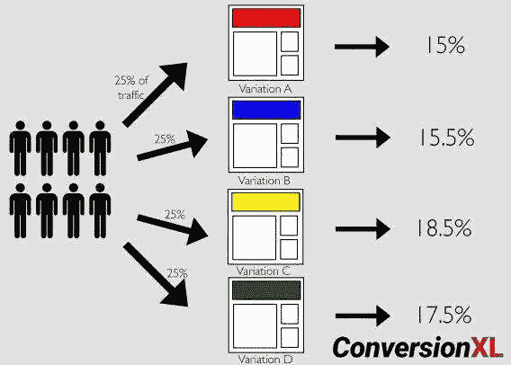
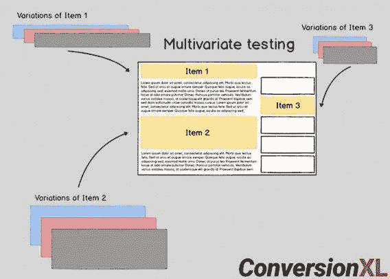
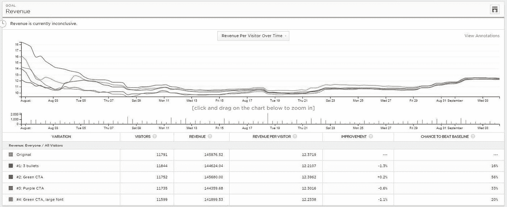

# 我从谷歌的 Udacity 的 A/B 测试课程中学到了什么

> 原文：<https://towardsdatascience.com/what-i-learned-from-udacitys-course-on-a-b-testing-by-google-45f6d3297f42?source=collection_archive---------3----------------------->

在网站和移动应用的发展阶段，A/B 测试仍然是最常用的技术之一，也是经理和决策者回答业务问题的首选。A/B 测试有助于量化用户对新产品或新功能的反应，方法是将其与原始版本进行比较，看哪个版本表现更好。

通过这篇文章，我希望传达我对谷歌 Udacity 的 A/B 测试课程的理解。我会向任何考虑从事数据科学职业的人推荐这门课程。但是在你开始学习这门课程之前，请确保你已经掌握了推断统计学的概念，因为这门课程非常强调 A/B 测试的商业应用。你可以使用任何 stats 101 书籍作为本课程的补充，或者如果有足够的时间，你可以学习另一门关于 Udacity 的非常好的课程[推论统计学简介](https://classroom.udacity.com/courses/ud201)。没有别的事了，让我们开始吧。以下是整篇文章的结构。

## 1.什么是 A/B 测试？

## 2.为什么 A/B 测试很重要？

## 3.为什么要考 A/B？为什么不是对照实验？

## 4.顾名思义，A/B 测试是否仅限于检查两种变体？

## 5.A/B 测试有哪些阶段？

*   *探险*
*   *剥削*

## 6.什么是 A/B 测试，什么不是？

## 7.结构良好的 A/B 测试的步骤

*   *研究*
*   *选择和表征指标*
*   *实验单位和人群的选择*
*   *实验持续时间*
*   *分析结果*

## 8.结论

## 9.关键要点

## 10.摘要

## 11.资源

# 1.重要的事情先来！什么是 A/B 测试？

A/B 测试是用于测试新产品或新功能的可行性的实验。这种技术是基于网络的实验设计的应用，或者更常见的工程实验设计。实验单元(网页或用户的输入流量)被分成两组(A 和 B)，其中一组暴露于原始版本，另一组暴露于新版本。最终目标是评估成功标准并决定是否发布新特性。

# 2.为什么 A/B 测试很重要？

A/B 测试很重要，原因有二:

1.  它们是解决短期商业问题的好方法。
2.  A/B 测试有助于得出因果结论

# 3.为什么要进行 A/B 测试？为什么不是对照实验？

A/B 测试类似于受控实验或分割测试，包括假设、控制和处理组(或原始与您想要尝试的变化)以及统计计算结果。唯一的区别是，当一个实验在受控环境中进行时，它被称为受控实验，而 A/B 测试是在互联网上进行的实验。A/B 测试通常不被称为受控实验的原因是，当涉及到互联网流量时，存在许多相关的可变性，这可以在一定程度上得到缓解，但很难在完全受控的环境中操作。

# 4.顾名思义，A/B 测试是否仅限于检查两个变体？

不要！A/B 测试不仅限于两种变化，你可以尝试 n 种变化。但是随着 n 的增加，每组测试需要更多的流量。其他类型的在线实验包括:

*   多元测试
*   Bandit 算法

我将简要地谈一下其中的每一项。

**A/B 测试或 A/B/C/D/n 测试:**测试，一个属性有多个变量。A/B 测试用于确定最佳布局。在下图中，彩色块(或 4 页中每一页的标题)是属性，4 种不同的颜色代表我们正在测试的变化。我们可以看到黄色的变化比其他颜色做得更好。

[Image source](https://conversionxl.com/blog/ab-testing-guide/#what-you-need-to-know-about-ab-testing-statistics)

**多元测试:**测试多个属性，每个属性都有多个变量。*MVT 用于确定哪组属性变化或属性组合产生最佳结果。*下图中的第 1 项、第 2 项和第 3 项代表三个属性，每个属性都有三种变化，分别用蓝色、粉色和灰色块表示。使用多元测试来润色页面布局。

[Image source](https://conversionxl.com/blog/ab-testing-guide/#what-you-need-to-know-about-ab-testing-statistics)

**Bandit 算法:** Bandit 算法是 A/B/n 测试，根据每个变体的性能实时更新。

# 5.A/B 测试有哪些阶段？

任何 A/B 测试都有两个重要阶段:

1.探索:这是在部署变更之前，在目标人群的一个小的但有代表性的样本上测试您想要启动的变更的阶段，同时给予仔细的考虑以避免 I 型错误(假阳性)和 II 型错误(假阴性)的风险。相当大的声明！让我们把它分解成小块，试着去理解。

*   “目标人群的小而有代表性的样本”:有一个有代表性的样本对于你的结论被认为是有效的是很重要的。在向整个目标受众发布您的变更之前，您可能希望在一个*小但有代表性的*人群样本上尝试您的变更，这样您就可以观察小部分受众的反应，如果结果不错，可以将您的结果推广到整个目标受众。
*   “避免第一类错误(假阳性)和第二类错误(假阴性)的风险”:第一类错误(假阳性)是指，断定某项改变或干预有效果，而实际上没有。第二类错误(假阴性)是未能发起重大的变革。下图显示了一个误报的示例。

[Image source](https://www.continuousimprover.com/2015/06/false-positives-and-semantic-versioning.html)

2.开发:启动变更。不言自明，对吧？

# 6.什么是 A/B 测试，什么不是？

A/B 测试有利于回答“这个还是那个？”类似的问题。一些例子是:

*   页面加载时间的增加会影响收入吗？在这里，您可能对用户界面(UI)进行了一些更改，这可能会增加延迟。因此，您可能希望 A/B 测试原始用户界面与新用户界面，看看收入是否有差异。
*   另一个例子是，测试改变按钮的颜色是否能提高点击率？当你想测试按钮的可用性，看看按钮在当前的阴影和大小下是否明显时，可以使用这个选项。谷歌进行了一个类似的实验，当他们无法在两种蓝色之间做出决定时，他们最终测试了 41 种不同色调的蓝色，介于两种蓝色之间。

另一方面，A/B 测试可能不是检查网站完整性、新体验(如厌恶变化与新奇效果)和任何长期变化(如买车或租房)的好选择。

*   网站的完整性:A/B 测试不能回答这样的问题，我们的网站上是否有缺失的产品？它可以回答产品 A 是否应该在产品 B 之上，但它不能判断网站上是否缺少产品 C，以及我们是否应该包含它。
*   新体验:一些用户可能不喜欢新的变化(这是厌恶变化)，而另一些用户可能对尝试变化感到兴奋(这被称为新奇效应)。所以，这将很难提出一个基线，因为你不会知道你的传入流量的百分之多少属于变化厌恶，百分之多少属于新奇效应。这使得提出一个可比较的控制/治疗分割变得更加困难。另一个问题是时间表，即用户适应变化所需的时间，这样你就可以做出可靠的结论。
*   长期变化:这些也很难衡量。假设您想要检查出租公寓推荐方案的有效性。现在人们不经常租公寓，这使得很难在短时间内收集足够的数据来做出有效的结论。因为你进行实验的时间越长，你所观察到的变化由某个因素引起的可能性就越大，这个因素是最近出现的，但在实验开始时没有包括在内。例如，假设你从五月到八月进行出租公寓的实验。现在八月，通常标志着一个学期的开始，这意味着你可能会观察到出租公寓数量的突然增加。所以，如果你没有考虑这个因素，你可能会有一个假阳性。

# 7.结构良好的 A/B 测试的步骤

## a.研究

在你考虑做任何实验或优化之前，请花点时间思考一下

*   你对商业目标有清晰的概念吗？
*   你有明确的目标吗？
*   你知道你要用什么 KPI(关键绩效指标)吗？
*   你有目标衡量标准吗？

一旦你清楚了这些事情，你就可以继续做一些理智检查，比如:

*   网站有什么 bug 吗？bug 可能是潜在的转换杀手。
*   不同设备和浏览器之间有差异吗？这些差异可能是不同设备和浏览器之间的延迟问题。进行测试来检查不同平台之间的一致性，可能会消除混淆或隐藏变量破坏实验的风险。

## b.选择和描述指标

指标的选择取决于您希望指标服务的目的。有两类指标:

*   用于评估的指标:这些指标包括帮助跟踪深入信息(如用户对产品的体验)的详细指标，还有用于跟踪业务目标的高级业务指标。
*   用于健全性检查的指标:这些指标用于检查控制组和实验组是否具有可比性。因此，您可以检查两个组中的用户数量是否相同。这些组在分布等方面有可比性吗？

得出指标的步骤

***第一步:为指标提出一个高层次的概念***

这通常是一个大家都认同的定义。这些指标可以简单到点击率、点击率、活跃用户数量

***第二步:将高层指标转化为完全实现的定义***

因此，我们在步骤 1 中看到——活动用户数量——是一个高级指标。它的一个完全实现的版本将是定义什么是主动。是 1 分钟主动吗？还是 1 小时主动？还是 1 周活跃？因此，在定义一个完全实现的指标时，要记住的一件事是决定时间戳。你可能要考虑的另一件事是不同浏览器之间的一致性。每个浏览器与您的网站交互的方式可能不同，因此获取数据的方式也可能不同。此外，不同浏览器之间的延迟可能不同，这可能会导致差异。

现在，这些指标的有效性，在很大程度上依赖于您用来计算它们的数据，因此，评估不同的技术和收集数据的来源，值得同等关注。

***那么，用什么数据呢？***

很明显，你会使用从你的网站产生的数据，如点击，在一个页面上花费的时间，页面浏览量，创建的帐户数量等来运行 A/B 测试。但是除了这些数据之外，你还可以使用专注于收集数据的公司生成的外部数据，通过调查来回答有趣的问题，或者你可以雇佣公司使用用户体验研究和焦点小组等技术来生成你自己的深度数据。从这些技术中收集的数据可以作为验证您的指标的良好来源。这可以通过绘制内部数据与外部数据的趋势和季节变化并检查它们是否一致来实现。第二，您还可以使用这些数据来产生关于使用简单的度量标准的想法，作为较难度量的度量标准的代理。一个更难测量的度量标准的例子是，测量用户满意度。在一项研究中，用户报告的满意度与在网站上花费的时间进行了比较，以建立两者之间的一般相关性。通过这种相关性——在网站上花费的持续时间或时间——这很容易测量，被转换成一种衡量用户满意度的指标。

***第三步:将测量结果汇总成一个指标***

到目前为止，我们只有直接的数据测量，如页面浏览量、点击量、延迟等。但是现在我们需要想出一个方法来总结这些。要总结一个指标，我们需要考虑最终总结指标的以下两个特征:

1.  ***敏感性和稳健性:*** 我们希望我们的指标足够敏感，能够捕捉到我们关心的变化，但同时指标也应该足够稳健，不会捕捉到我们不关心的变化。敏感性和稳健性很重要，因为它们使我们免于第一类错误(发起我们不关心的变更)和第二类错误(未能发起我们关心的变更)。为了衡量灵敏度和稳健性，我们可以:

*   运行实验:如果我们可以访问实验数据，那么我们可以运行实验，看看度量标准是否随着变化而移动。这将是一个很好的灵敏度测试。
*   A vs. A 测试(或 A/A 测试):我们也可以用实验数据做 A vs. A 测试。在 A/A 测试中，对照组和治疗组都暴露于完全相同的变化。如果我们的指标在两组之间移动，那么这将是一个很好的迹象，表明该指标不够稳健。
*   回顾性分析:现在，如果我们无法访问实验数据，那么我们可以取出一些我们存档的数据，这些数据在过去用于运行类似的实验，并查看我们感兴趣的指标是否以我们想要的方式做出响应。

***2。指标的分布:*** 分布用于确定一个特定指标相对于其他指标的优先级。比方说，我们有一个像正态分布一样的良好分布，那么均值或中值将是一个不错的选择。如果分布是偏斜的，那么百分位数将是一个很好的选择。

## c.实验单位和人群的选择

下一个要考虑的重要话题是实验单位(分流单位)和你希望锁定的人群。在确定实验规模和决定如何将事件分配给实验组或对照组时，这两者都变得越来越重要。

1.  ***实验单位:*** 这是用于定义哪个用户或哪个事件被分配到控制和实验组的转移单位。转移的单位可以是唯一的标识符，如 user_ID 或 cookie，也可以是基于事件的转移，如页面视图。分流单位的选择取决于三个重要的考虑因素:

*   用户一致性:如果我们正在处理一个用户可见的变化，我们希望我们的用户始终有一致的体验。因此，user_ID 或 cookie 将是一个不错的选择，如果我们试图实现的更改对用户不可见，那么基于事件的转移(如页面视图)将更有意义。这一点很重要，因为如果我们使用页面浏览量作为用户可见变化的转移单位，那么每次用户重新加载页面时，他们可能会被分配到一个新的组，即如果用户最初在实验组，现在他们可能会在控制组结束。
*   伦理考虑:因为真实的人作为实验单位参与了实验，所以仔细考虑实验的伦理是非常重要的。一些伦理考虑是风险、利益和隐私。如果风险超过最低风险的阈值，即包括身体、心理、情感、社会或经济问题，那么获得知情同意就变得至关重要。如果用户在研究完成后会受益，那么说明益处是很重要的。如果收集新数据的内部流程到位，那么隐私就不会是一个大问题，但如果不是，就需要额外的安全措施。
*   指标的可变性:分流单位的选择会极大地影响指标的可变性。与分析单位相比，如果转移单位更宽，则指标的可变性更高。分析单位基本上是指标的分母。因此，对于点击率来说，点击率被定义为#点击量/#页面浏览量，#页面浏览量成为分析的单位，(其中' #点击量'读作'点击次数')。因此，如果我们使用 user_ID 作为我们的转移单位，使用点击率作为我们的分析单位，那么我们的指标点击率的可变性会高得多，因为一个 user_ID 可以对应多个页面视图。

2. ***人口:*** 人口的选择将极大地影响你正在努力实现的新变化或新特性的成功。当您计划发起一项变更时，您会希望向最相关的受众发起变更，即更有可能对变更做出积极响应的用户。尽管您可能出于各种原因想要提前做出这个决定:

*   避免不必要的媒体报道:当你不确定是否要发起变革时，这尤其有用。因此，您可能需要限制暴露的用户数量。
*   第二个原因是，如果你计划在国际上发布变更，你可能需要额外确保使用的语言是正确的。
*   接下来，如果你知道这个变化将会影响到属于某一特定人群的用户，那么向全体用户发布这个变化可能会蒙蔽实验的效果。

现在主要问题！

***公制、分流单位和人口的选择如何影响实验的规模？***

*   我们在上一节中看到，如果分析单位与转移单位相同，指标的可变性就会降低。现在，由于可变性降低，同样的最低可检测效果所需的页面浏览次数也减少了。
*   正确的目标人群也减少了实验所需的样本量，因为我们不考虑无关的观众，因为他们可能会欺骗我们。

## d.实验持续时间

实验的持续时间与您希望通过实验发送的流量比例有关。如果您的实验总共需要 20K 个用户(每个控制组和实验组中的 10K 用户)，每天每组发送 500 个用户，将需要您运行实验 10 天。现在，如果您将数量减少到每天每组 250 个用户，实验的持续时间将会增加到 20 天。

当谈到持续时间时，需要记住的下一件重要事情是，*统计意义并不意味着实际意义！*仅仅因为您的测试显示了统计上的显著结果并不意味着您应该发起变革。统计意义基于统计界限，但实际意义基于你所关心的最小可检测效应。

也就是说，让我们正式声明一些停止规则:

> 停止规则:
> 
> 决定持续时间(通常为 2-4 个业务周期)。我们考虑完整商业周期的原因是为了避免扭曲的结果，并获得一个有代表性的样本，因为它将包括每一个外部因素:一周中的每一天，不同的流量来源，季节性和任何其他外部事件，两次。
> 
> 确定每天每组的最小样本量(如每个治疗组和对照组 400 名用户)

可能出现的一个重要现象是回归均值。根据这种现象，您可能会在初始阶段观察到明显的获胜变化，但是随着测试的进行，转换率没有任何差异。下图显示了转化率，4 周后回归到平均值。因此，如果您在测试过程中观察到不同变化之间的差异在减少，那么这可能是您应该运行更长时间测试的一个指示。这也使我们免于推出与当前版本没有什么不同的变体。

[Image source](https://conversionxl.com/blog/statistical-significance-does-not-equal-validity/)

## e.分析结果

***执行理智检查***

分析任何实验的第一步是检查控制组和实验组是否具有可比性，基本上是使用我们在第 2 节讨论的不变指标(选择和描述指标)进行健全性检查。如果健全性检查失败，就没有必要继续进行实验的其余部分。现在两组可能没有完全相同的实验单位数量，但应该大致相当。

***分析结果***

如果您有一个评估指标，那么您可以直接为您观察到的差异构建一个置信区间。如果置信区间不包含 0，则对照组和治疗组之间观察到的差异具有统计学意义，但正如我们之前讨论的，统计学意义并不意味着实际意义，如果最小可检测差异低于置信区间，则我们可以说我们观察到了我们关心的显著差异。

我们可以将我们的结果与从非参数检验(如符号检验)中获得的结果进行比较，看看它们是否与我们观察到的假设结果一致。

如果我们不观察统计显著性呢？

不要走得太快。A/B 测试是一个迭代的过程。多尝试几次迭代。

第二，寻找辛普森悖论。仅仅因为你的总体测试没有显示出统计学意义，并不意味着你的干预(或改变)不值得发起。这种变化可能会提高特定受众的转化率。在这种情况下，您可以使新版本对该细分市场可用，而不是向更广泛的受众发布，尽管您可能希望确保您可以证明为什么这种变化会改善该细分市场的体验。所以，注意细分。

您可能会考虑以下部分:

*   新用户与经验丰富的用户
*   移动设备/平板电脑与台式机
*   Chrome vs. IE vs. Safari vs. Firefox
*   人口统计(年龄组、性别、城市、州、国家)
*   登录/注销界限内的用户与界限外的用户
*   直接来自页面的流量与来自内部链接的流量

现在，如果您有多个评估指标，这些指标之间可能存在一些相关性，但您总是可以假设独立性并获得保守估计，因此您可以使用类似 Bonferroni 校正的方法

# 8.结论

最后一步是得出结论。要得出结论，你基本上需要回答整个实验过程中的三个关键问题:

*   我们有统计上和实际上有意义的结果吗？
*   我们对变化理解得足够好了吗？
*   改变值得发起吗？

# 9.关键要点

*   检查，两次检查，三次检查实验的设置
*   统计意义并不意味着实际意义
*   变异的辛普森悖论与回归均值
*   如果这是你的第一个实验，可能会有很大的影响，做几个实验，看看你对结果是否满意

# 10.摘要

*   遵循结构化方法
*   研究并定义您想要改进的业务目标或 KPI。
*   进行实验
*   分析、学习和迭代

# 11.资源

*   [从初级到专业的 A/B 测试掌握度](https://conversionxl.com/blog/ab-testing-guide/#what-you-need-to-know-about-ab-testing-statistics)
*   [统计显著性不等于有效性(或者为什么你会得到想象的提升)](https://conversionxl.com/blog/statistical-significance-does-not-equal-validity/)