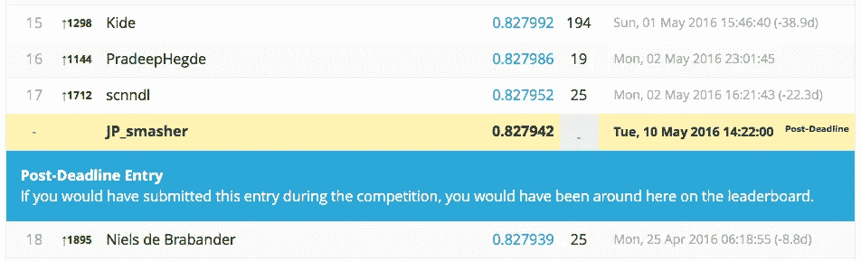

# 我从数据科学竞赛中学到了什么

> 原文：<https://towardsdatascience.com/what-i-learnt-from-a-data-science-competition-428a3d876e56?source=collection_archive---------2----------------------->

2 个月前，我开始参加在 Kaggle.com 举行的数据科学竞赛，用桑坦德银行的数据集预测客户满意度。由于这将是我第一次单独参加非计算机视觉 Kaggle 挑战赛，我认为这将是一个很好的途径，可以将我从论文、论坛和非正式对话中收集的一些建议付诸实践。这篇文章详细介绍了我所采取的步骤，哪些有效，哪些无效，希望它能帮助你在决定采取行动时有所作为！

对于那些对代码感兴趣的人，你可以查看我的 github 库[这里](https://github.com/wongjingping/santander)。

**xgboost**

我几乎是本能地从 [xgboost](https://arxiv.org/pdf/1603.02754v1) 开始的，这是一个流行的梯度增强实现，具有 R 和 python 接口，既能有效地利用服务器 CPU 上的多线程计算，又具有良好的预测性能。xgboost 模型在过去的许多 Kaggle 比赛中表现良好，也是许多脚本的初始选择。这也有助于它不需要很长时间的培训，特别是当运行在我的 48 核服务器在办公室！

**数据清理**

数据非常稀疏，有许多二进制和数字变量。通过在论坛上的一些探索和阅读，我发现有一些相关和重复的专栏，我立即删除了它们。我最初也删除了重复的行，但结果是性能更好的公共脚本没有删除它们，所以我保留了重复的行。不太清楚为什么它表现得更好。

论坛上暴露的另一个问题是出现了奇怪的号码，如-999999、999999999。我将它们替换为 NA，这将允许 xgboost 自动确定给定数据的最佳估算值。

**特征工程**

最初，我尝试了使用分位数的[宁滨](https://en.wikipedia.org/wiki/Data_binning)列，但似乎没有多大帮助，尤其是在公共排行榜上。根据我对 xgboost 实现的理解，该算法按分位数对数据进行分类，并从那里确定最佳分割。因此，这一步似乎有些多余，除非你有令人信服的理由不使用分位数来绑定变量。

与此相反的例子是年龄变量，我以 10 年为间隔进行分类，同时将所有 20 岁以下的客户归为一类。虽然比赛没有提供太多关于年龄的背景信息，但不难想象不同的年龄组会有不同的态度或满意度标准。由于年龄差异很大，让 xgboost 解释默认的年龄分位数可能不是训练模型的最有用的方法。这确实稍微提高了本地和公共 LB 分数，使我的公共 LB 分数超过了 0.840。

最后，我探索了为前 10 个变量添加双向交互。我首先运行一个 xgboost 模型来对变量重要性进行评分(因为它比运行线性模型更快！)，并挑选了计算乘除交互作用的前 10 名。我用两种方法计算了除法相互作用(A/B and B/A)，但我怀疑两种方法都有帮助，因为单调排序(以及分位数和分裂)会简单地反转。具有双向交互的模型在公共 LB 上表现稍差。

**参数调谐**

我用 xgb.cv 进行了一个简单的 5 重交叉验证的网格搜索，保存了 2 个模型；一个有双向交互，另一个没有。我使用 ggplot 来帮助可视化 AUC 的方差和均值。巨大的差异是一个明显的迹象，表明我不太相信我当地的简历分数和公众的 LB 分数。回过头来看，我意识到技术比一个好的公共 LB 重要得多，因为过度适应公共 LB 是很危险的，并且欺骗自己认为你不是。

**分叉公共脚本**

比赛快结束时，我发现时间很紧，公共脚本提供了一个复制最佳实践和特色工程思想的好方法。然而，公共脚本很容易过度适应公共 LB。鉴于各种用户对脚本的积极分流和对结果的现成评估，这意味着只有“更好”的脚本才能获得投票和公众的关注。某些脚本仅发布优化的参数，而没有通过交叉验证进行调整，这导致人们怀疑通过这些脚本获得的公开 LB 分数的可靠性。以下是我更详细的意思:

**过度拟合公共 LB**

我自己已经制作了几个非常相似的模型，我觉得我需要选择最好的一个来提交。由于我在比赛期间没有充裕的时间来慢慢回顾我的提交列表并评估更好的，我决定只选择公共 LB(公开分叉)上表现最好的脚本并提交它。结果是，我提交的模型在公共 LB 上给出的 AUC 为 0.842(在超过 5000 个条目中排名 644)，将下滑到 0.825(排名 1620/5123)，而我的尽职调优但简单的模型只会从 0.840 下降到 0.827(排名 145/5123)！这给了我一个非常重要的教训:相信技术，而不是短暂的分数。

**组装**

当然，事后看来，我应该知道最好的执行模型，但是当我只有公开的 LB 结果时，我应该如何选择我的提交？这就是集成的作用，它消除了过程中的猜测，同时减少了你的误差的[方差。比赛结束后，我尝试了一个合奏，取了我选择的 4 个作品的天真平均值:](http://scikit-learn.org/stable/auto_examples/ensemble/plot_bias_variance.html)

*   一个带有一些功能工程的公共脚本，在公共 LB 上得了 0.842 分(作者是一个叫 Mikhail 的家伙)
*   一个名为 xgb_lalala 的公共脚本(没有 cv，只有一组‘古怪的性能参数’)
*   我自己的脚本有和没有双向互动

结果几乎让我哭了(兴奋的泪水混合着悔恨的痛苦):

我希望这篇文章有所启发，不仅仅是技巧，还有面对排行榜上的激烈竞争坚持己见的重要性。