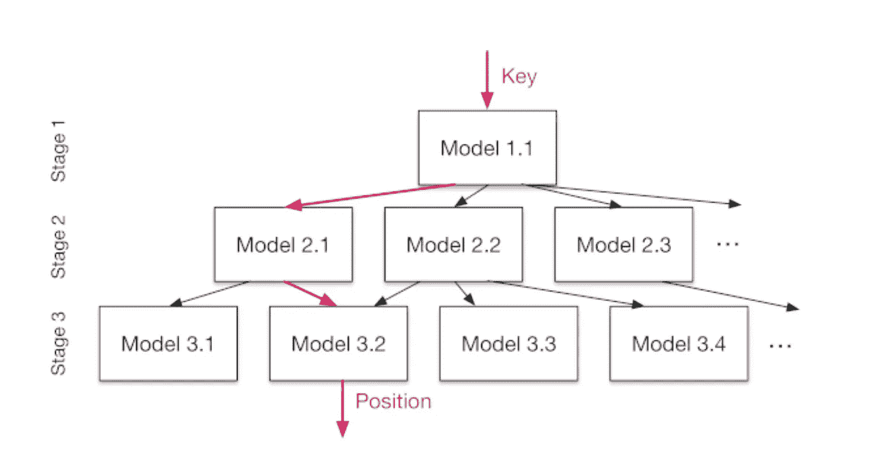
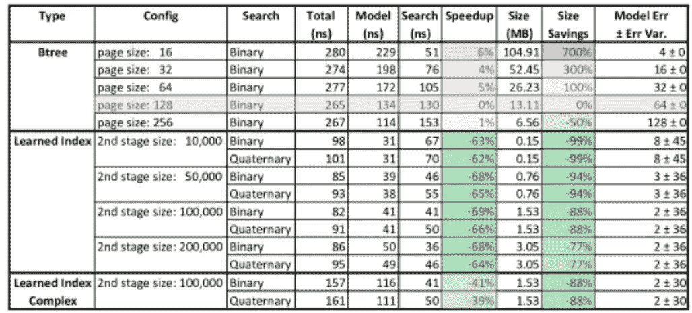

# 如果我告诉你数据库索引是可以学习的呢？

> 原文：<https://towardsdatascience.com/what-if-i-told-you-database-indexes-could-be-learned-6cf8f59bff94?source=collection_archive---------2----------------------->

不幸的是，这篇论文我没能在 NIPS 上看到，但在过去的几天里，它在 ML 圈子里引起了相当多的关注。这些作者中包括杰夫·迪恩(Jeff Dean)，一位非常受尊敬的早期谷歌员工，他们有一个核心观点，他们在整篇论文中重申:在他们的核心，数据库索引是模型。它们可能(通常)不会被统计学习，但是它们是在输入(索引建立所基于的键)和输出(内存中的位置)之间提供映射(希望非常快)的结构。二叉树是用于有序数据的典型结构，它甚至采取树的形式，这是机器学习工具箱中的核心工具。

基于这一关键的直觉，论文接着提出了这样的问题:如果这些结构仅仅是模型，那么统计模型是否可以学习并利用被索引数据的分布，比我们目前使用的索引更好——更小，更高效？剧透:答案(至少对于数值数据类型)是肯定的。

例如，可能所有元素的长度都相同，并且数字键的位置随着每个键前进 5:在这种情况下，您可以很容易地学习键和位置之间的线性回归映射，这将比必须有条不紊地一个一个拆分的 B 树快得多。B 树在最糟糕的情况下是有效的，在这种情况下，键的位置的 CDF 密度(如果你把它们排成一行)确实是随机的，并且假设是未知的。

关于 B 树的一个有趣的事实是，每当有新数据加入时，它们都需要重新平衡，作者认为这个过程类似于模型的重新训练。因此，出于比较的目的，他们简单地比较了在*训练*集上的性能，因为 B 树和候选统计模型只有在被重新训练后才能工作。

# 架构和结果

作者从训练一个基线模型开始:一个两层，每层 32 个隐藏单元，密集连接的网络。这个模型有两个主要问题。

1.  首先，它生成作为关键字函数的最小/最大搜索位置的预测非常慢:它最初是在 Tensorflow 中训练的，它的前期成本很高，对于这样小的模型来说不值得
2.  其次，它只是在单个键的层面上不够准确。虽然它在学习累积密钥分布的整体形状方面做得很好，但它避免了过度适应 CDF 函数中的小局部变化，因此当您“放大”密钥空间的小区域时会变得不太准确。因此，与只进行全键扫描相比，它并没有显著加快查找过程。按照他们设计问题的方式，一个简单的模型可以很容易地将预期的搜索误差从 100 米减少到 10，000 米，但由于模型中固有的平滑假设，很难将它一直减少到 100 秒的数量级

# 提议的解决方案

这些问题有两个关键的解决方案:一个是实施细节，另一个是理论创新。第一种方法相对简单(至少在概念上):构建一个框架，在这个框架中，您可以在 Tensorflow 中训练模型，但是模型是在推理阶段用 C++评估的。这使得之前测试的基准模型的性能大幅提升:从 80，000 纳秒降至 30 纳秒。

第二，作为“最后一英里”准确性问题的解决方案，是递归模型。在这个框架中，我们首先训练一个“顶级”模型，它输出对钥匙位置的预测。然后，我们把空间分成，比方说，三个部分，然后分别为每个子区域学习一个模型。因此，例如，顶部模型可能预测键 4560 映射到 10000 长的存储区域中的位置 2000。因此，他们会根据顶级模型的预测，将观察结果组合在一起，并专门训练一个新模型，比如说，预测位置在 0 到 3500 之间的键。

当这种方法——使用更有意义的优化代码的分层模型——在具有数字键值的数据上进行尝试时，结果确实令人印象深刻。与 B 树相比，使用小得多的模型，学习索引实现了有意义的加速，超过 60%。值得注意的是，下面的结果是*没有使用 GPU。*这表明如果 GPU 在数据库硬件中变得更加标准，这种改进甚至可能会增加。

他们目前只展示了对数字键建模的工作，但建议将目前用于文本的更复杂的方法(RNNs，字符级 CNN)添加到这个通用框架中。

Results for lat/long of Maps data

那么，除了它可能导致新一代数据库索引设计的实际事实之外，为什么所有这些首先是有趣的呢？

首先，我要承认，在我心中，那些在一个知识领域的背景下重新构建另一个知识领域的论文有着特殊的地位。除了介绍一些引人注目的 ML 思想之外，这篇文章还让我更深入、更清晰地思考索引如何工作背后的机制，而在以前，这一直是我通常理解但没有深入研究的东西。

其次，这只是一个实际的事实，作为机器学习模型被用来优化运行它们的低级系统的一个例子，它似乎是有意义的。这是我记得看到的第一篇使用机器学习来优化计算过程本身的论文之一，但它似乎不太可能是最后一篇。