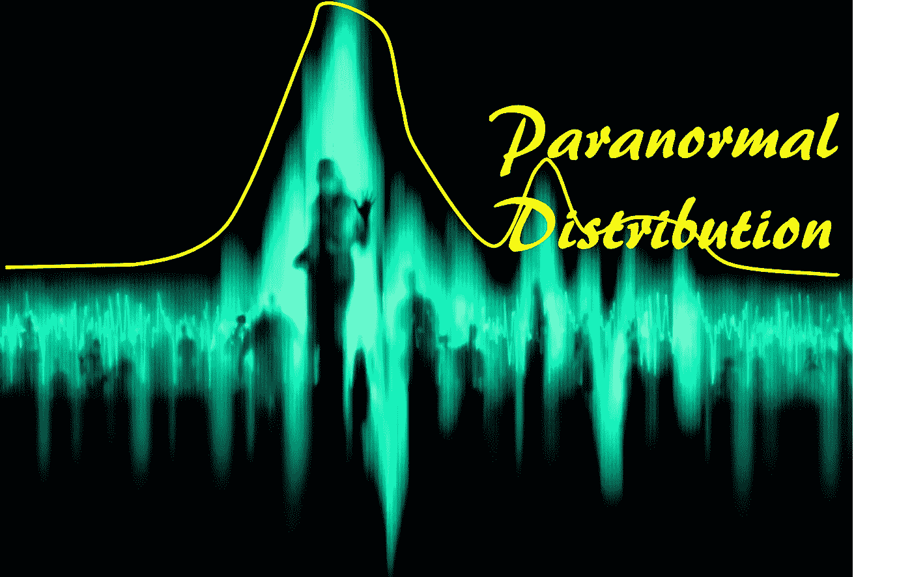
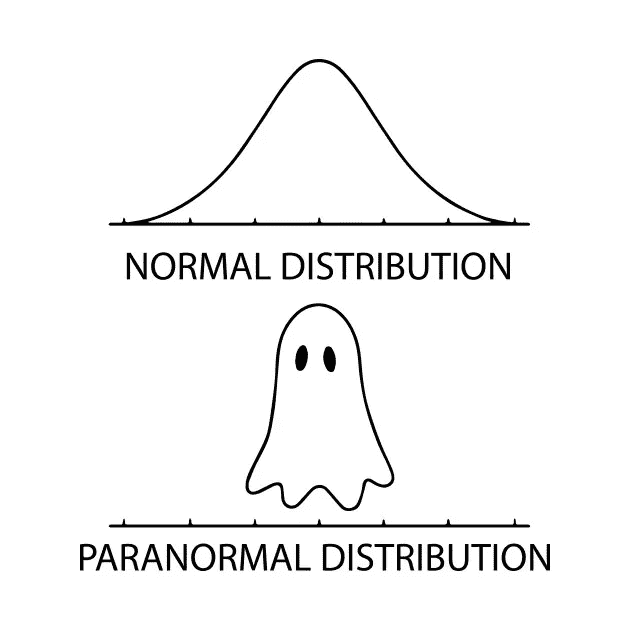
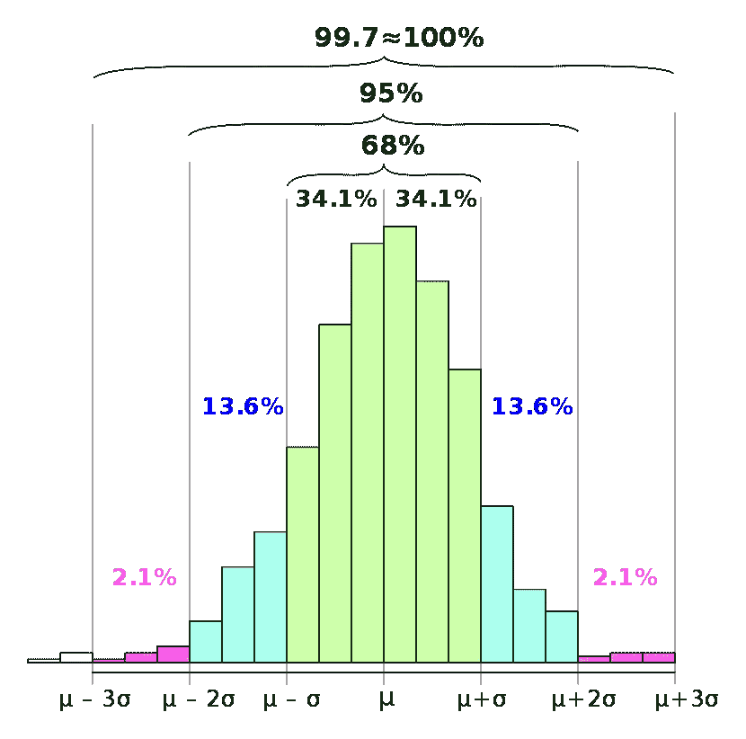
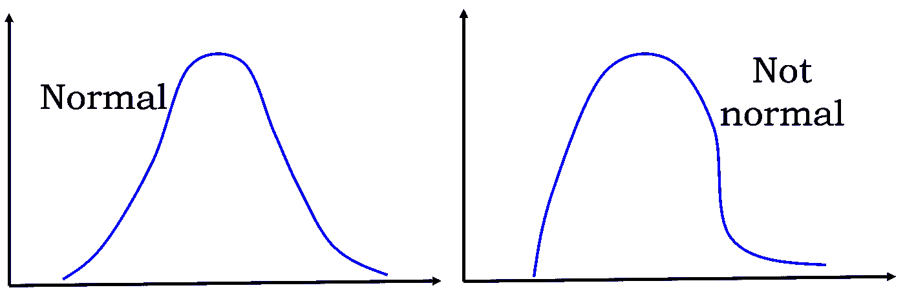
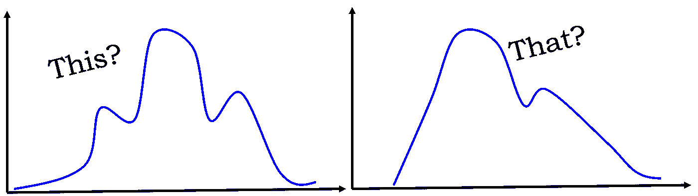
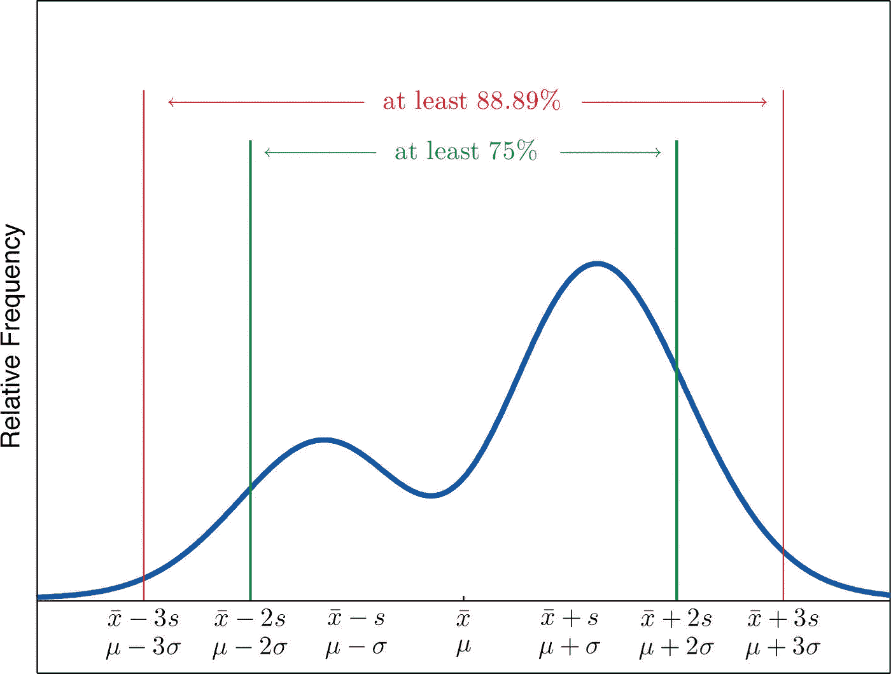
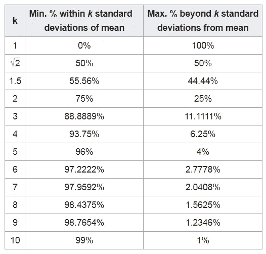

# 你的数据不正常怎么办？

> 原文：<https://towardsdatascience.com/what-if-your-data-is-not-normal-d7293f7b8f0?source=collection_archive---------5----------------------->

## 在本文中，我们讨论了统计数据分析的切比雪夫界。在对给定数据集的正态性没有任何概念的情况下，该界限可用于衡量数据在平均值附近的集中程度。

## 介绍

这是**万圣节周**，在恶作剧和款待的间隙，我们这些数据极客正在社交媒体上为这个可爱的迷因窃笑。

**你认为这是一个笑话？我告诉你，这可不是闹着玩的。这很吓人，符合万圣节的精神！**

> 如果我们不能假设我们的大部分数据(商业、社会、经济或科学来源的)至少是近似“正常的”(即它们是由高斯过程或多个这样的过程的总和产生的)，那么我们就注定要失败！

这里有一个非常简短的列表，列出了一些无效的东西，

*   [六西格玛的整体概念](http://www.six-sigma-material.com/Normal-Distribution.html)
*   著名的[68–95–99.7 法则](https://en.wikipedia.org/wiki/68%E2%80%9395%E2%80%9399.7_rule)
*   [统计分析中 *p* =0.05](http://blog.minitab.com/blog/understanding-statistics/what-can-you-say-when-your-p-value-is-greater-than-005) (来自 2 sigma 区间)的‘神圣’概念

够吓人吗？大家再多聊聊吧…

## 无所不能、无所不在的正态分布

让我们保持这一节的简短和甜蜜。

正态(高斯)分布是最广为人知的概率分布。这里有一些描述其功能和广泛适用性的文章的链接，

*   [**数据科学家为什么爱高斯**](/why-data-scientists-love-gaussian-6e7a7b726859)

 [## 为什么数据科学家喜欢高斯？

### 高斯分布如此受深度学习、机器学习工程师和…

towardsdatascience.com](/why-data-scientists-love-gaussian-6e7a7b726859) 

*   [**如何在数据科学面试的统计部分占据优势**](https://www.datascience.com/blog/statistics-data-science-interview)
*   [**正态分布有什么重要的？**](http://davidmlane.com/hyperstat/A25329.html)

由于它出现在各个领域和[中心极限定理](https://en.wikipedia.org/wiki/Central_limit_theorem) (CLT)，这种分布在数据科学和分析中占据中心位置。

 [## 正态分布-维基百科

### 在概率论中，正态(或高斯或高斯或拉普拉斯-高斯)分布是一种非常常见的连续…

en.wikipedia.org](https://en.wikipedia.org/wiki/Normal_distribution) 

## 那么，有什么问题呢？

这一切都很好，有什么问题？

问题是，您经常会发现特定数据集的分布可能不满足正态性，即正态分布的特性。但是由于过度依赖正态假设，**大多数商业分析框架都是为处理正态分布的数据集而定制的**。

> 它几乎根深蒂固地存在于我们的潜意识中。

假设您被要求检测来自某个流程(工程或业务)的一批新数据是否有意义。通过“*使*有意义”，你的意思是新数据*是否属于*，即它是否在“预期范围”内。

> 这个‘期望’是什么？如何量化范围？

我们自动测量样本数据集的平均值和标准偏差，并继续检查新数据是否在特定的标准偏差范围内，就像受到潜意识驱动的指引一样。

如果我们必须在 95%的置信范围内工作，那么我们很高兴看到数据落在 2 个标准差以内。如果我们需要更严格的界限，我们检查 3 或 4 个标准偏差。我们计算 [Cpk](https://en.wikipedia.org/wiki/Process_capability_index) ，或者我们遵循[六西格玛](https://www.isixsigma.com/new-to-six-sigma/statistical-six-sigma-definition/)的质量 *ppm* (百万分率)标准。

所有这些计算都基于一个隐含的假设，即总体数据(而非样本)遵循高斯分布，也就是说，所有数据(过去和现在)生成的基本过程由左侧的模式控制。

> 但是如果数据遵循右边的模式会发生什么呢？

或者，这个，还有……那个？

## 数据不正态时有没有更普适的界限？

最终，我们仍然需要一种**数学上合理的技术来量化我们的置信区间**，即使数据不正常。这意味着，我们的计算可能会有一点改变，但我们仍然可以这样说-

> “在距平均值一定距离处观察到一个新数据点的概率是这样那样……”

显然，我们需要寻找一个比 68–95–99.7(相当于距离平均值 1/2/3 的标准偏差)更普遍的界限。

幸运的是，有一种这样的束缚叫做“切比雪夫束缚”。

## 什么是切比雪夫界，它有什么用？

切比雪夫不等式(也称为 Bienaymé-Chebyshev 不等式)保证，**对于一大类概率分布，不超过某个分数的值与平均值的距离不超过某个距离**。

> 具体来说，不超过 **1/ *k*** 个分布值可以超过 **k** 个偏离平均值的标准偏差(或者等价地，至少**1 1/k**个分布值在平均值的 **k** 个标准偏差内)。

它适用于几乎无限类型的概率分布，并且基于比正态性更宽松的假设。

它是如何工作的？

**即使你对你的数据背后的秘密过程一无所知**，也有很大的机会你可以说出下面的话，

“*我相信所有数据的 75%应该在平均值的 2 个标准偏差之内*”，

或者，

*我相信 89%的数据应该在平均值的 3 个标准偏差之内”。*

这是任意分布的情况，

Image Credit: [https://2012books.lardbucket.org/books/beginning-statistics/s06-05-the-empirical-rule-and-chebysh.html](https://2012books.lardbucket.org/books/beginning-statistics/s06-05-the-empirical-rule-and-chebysh.html)

## 如何应用？

正如您现在所猜测的，**您的数据分析的基本机制不需要做任何改变**。您仍将收集数据样本(越大越好)，计算您习惯计算的两个量——平均值和标准差，然后应用新的界限，而不是 68–95–99.7 规则。

该表如下所示(这里 k 表示远离平均值的许多标准偏差)，

Image: [https://en.wikipedia.org/wiki/Chebyshev%27s_inequality](https://en.wikipedia.org/wiki/Chebyshev%27s_inequality)

这里是它的应用的视频演示，

## 有什么条件？为什么人们不用这种‘更普遍’的束缚呢？

通过查看表格或数学定义，很明显有什么问题。**切比雪夫规则在对数据设限方面比高斯规则弱得多**。

> 与正态分布的*模式相比，它遵循 ***1/k*** 模式。*

*例如，要以 95%的置信度绑定任何东西，您需要包括多达 4.5 个标准差的数据，而不是只有 2 个标准差(对于正常情况)。*

*但是当数据看起来一点也不像正态分布时，它仍然可以挽救这一天。*

## *还有更好的吗？*

*还有一个界叫做“ [**切尔诺夫界**](https://en.wikipedia.org/wiki/Chernoff_bound)”/[**赫夫丁不等式**](https://en.wikipedia.org/wiki/Hoeffding%27s_inequality) 它给出了独立随机变量和的指数锐尾分布(与 1/k 相比)。*

*当数据看起来不正常时，这也可以用来代替高斯分布，但是只有当我们高度确信底层过程由彼此完全独立的子过程组成时。*

*不幸的是，在许多社会和商业案例中，最终数据是许多子流程极其复杂的交互的结果，这些子流程可能具有很强的相互依赖性。*

## *摘要*

*在本文中，我们了解了一种特殊类型的统计界限，它可以应用于与正态假设无关的最大可能的数据分布。当我们对数据的真实来源知之甚少，并且不能假设它遵循高斯分布时，这就很方便了。该界限遵循幂律，而不是指数性质(如高斯),因此较弱。但是它是一个重要的工具，可以用来分析任意类型的数据分布。*

*你可以查看作者的 [**GitHub 知识库**](https://github.com/tirthajyoti?tab=repositories) 中其他有趣的 Python、R 或 MATLAB 代码片段和机器学习资源。如果你像我一样，对机器学习/数据科学充满热情，请随时[在 LinkedIn 上添加我](https://www.linkedin.com/in/tirthajyoti-sarkar-2127aa7/)或[在 Twitter 上关注我。](https://twitter.com/tirthajyotiS)*

* [## Tirthajyoti Sarkar -数据科学工程经理- Adapdix Corporation | LinkedIn

### 将 AI/ML 的力量放在工业 4.0 和下一代智能工厂的边缘。将人工智能引入工业领域…

www.linkedin.com](https://www.linkedin.com/in/tirthajyoti-sarkar-2127aa7/)*