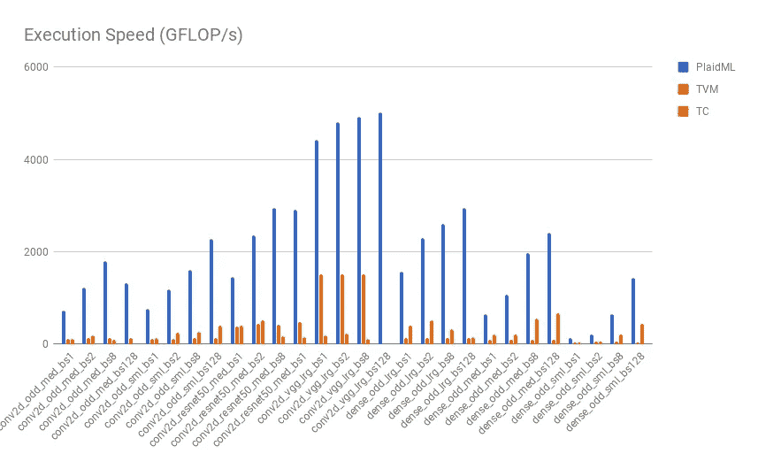

# 英特尔最近的举动将如何影响深度学习

> 原文：<https://towardsdatascience.com/what-intel-acquiring-and-integrating-vertex-ai-with-movidius-means-for-deep-learning-16c0055dc99c?source=collection_archive---------7----------------------->

谁没听说过英特尔这个引领处理器发展的科技巨头呢？虽然它曾经引领计算设备行业，但由于竞争对手不断涌现，用于移动设备和其他下一代设备的处理器不断涌现，它的声誉最近正慢慢黯然失色。幸运的是，这位技术领袖并不打算很快被淹没。引用 Ingrid Lunden 在她的 [TechCrunch 文章](https://techcrunch.com/2018/08/16/intel-buys-deep-learning-startup-vertex-ai-to-join-its-movidius-unit/)中的话，

> 该公司的目标是成为下一波计算浪潮的中心，这是其关注 R&D 和其他人工智能投资的更广泛背景。

没错:英特尔曾经引领计算领域的潮流，它计划在人工智能领域也这样做。这一努力的最新步骤是:获得顶点。AI，正如 2018 年 8 月 16 日宣布的那样，并让这个团队与英特尔的 Movidius 团队一起工作。

Image by author

不太清楚这意味着什么，以及它将如何影响深度学习，是吗？我们将把它分成几个部分，理解每一个部分，以便更好地了解全局。在这样做的时候，我们将看到这一举动将如何影响这一领域的进展。

## 云:去而复返

机器学习(ML)或深度学习(DL)模型需要经过训练、测试和部署才能适合使用，这就是问题所在:这些需要大量的计算！随着更好更复杂的算法被开发出来，笔记本电脑再也无法在合理的时间范围内应付了。谁会愿意让自己的笔记本电脑连续四天不停地进行数学运算呢？因此，开发人员借助谷歌云平台和亚马逊网络服务等服务，将他们的模型运行在云上。通过这种方式，他们可以腾出笔记本电脑来执行其他任务。

这些解决方案虽然在某种意义上很方便，因为开发人员现在可以免费使用他们的笔记本电脑，但不幸的是，它们并不适合解决速度至关重要的问题，换句话说，就是实时问题(下面将提到一些例子)。随着越来越多的人使用这种服务，集中式云计算预计会变得很麻烦，因为通信期间的延迟预计会增加。如果开发人员有一些设备，如 USB，其目的是做这些密集的计算，模型可以部署在本地，并给出几乎即时的响应…进入英特尔 Movidius！

## 英特尔移动

正如 Siraj Raval 的视频中所描述的，英特尔 Movidius 神经计算棒由英特尔的一个名为 Intel Movidius 的团队创建，是一种将模型从“云”(在线，在远程服务器中)带到“边缘”(本地)的设备。换句话说，它允许用户在本地测试和部署模型。由于不需要与数据服务器通信，实时使用现在可以更快地完成。此外，由于数据保存在本地，不会发送到中央服务器，因此数据隐私问题较少。

应用多种多样，例如智能安全摄像头、手势控制无人机和工业机器视觉设备，如[英特尔 NCS 页面](https://developer.movidius.com/)所述。请注意，在这些应用程序中，速度是最重要的。例如，在手势控制的无人机场景中，如果无人机检测到有人向它投掷物体，最好的解决方案是尽可能快地躲开，立即做出决定，而不是记录场景，将其发送到服务器，等待回复，然后根据回复采取行动。

好吧，但这和顶点有什么关系？AI？好吧，我们会查出来的！

## 顶点。人工智能，以及他们加入英特尔将如何影响深度学习

顶点。AI 是一家创业公司，在他们的[网站](http://vertex.ai/blog/hello-world)上写着如下宗旨:

> 我们正致力于将神经网络的力量应用到每一个应用中，使用内部发明和构建的新技术，使不可能的应用成为可能。

顶点。AI 正在建立一个名为 PlaidML 的平台，其任务是在任何设备上启用高性能神经网络。这的确是一个非常崇高的使命，因为正如该项目的 Github 资源库所提到的那样，它们已经是实现这种算法与操作系统(Linux、Windows、macOS)和硬件(Intel、AMD、ARM 等)兼容的最快和最简单的平台。嗯……最快最简单，那么这会给用户的预算造成多大的缺口呢？这个项目是开源的(因此 Github 上的任何人都可以看到)，这个平台是免费使用的！

A [comparison of PlaidML](http://vertex.ai/blog/compiler-comparison) with alternative tensor compilers (TVM and Tensorflow Comprehension)

现在我们有了不同的拼图。剩下的就是把它们放在一起。

*   英特尔 Movidius 团队努力工作，推出了英特尔 Movidius 神经计算棒，可以对本地部署的模型进行计算。这提高了速度，消除了与中央数据服务器通信的需要。
*   英特尔收购了 Vertex。简而言之，AI 的目的是让深度学习在任何地方都能工作，并计划让这个团队与英特尔 Movidius 一起工作。

(Sourced from [https://www.cbronline.com/news/startup-vertex-ai](https://www.cbronline.com/news/startup-vertex-ai))

在未来几年(如果不是几个月的话)可以预期的是，实时深度学习应用(由 Movidius 实现)的繁荣，在所有平台上工作(由 Vertex 实现)。AI)。随着两个团队共同努力实现他们设定的目标，以及对这种组合的认识的提高，这种增长将会发生。实时应用将会像我们想象的那样丰富多彩，并将有助于推动人类沿着人工智能的道路前进。

如果你喜欢这篇文章，请给它一个掌声，这样其他人也可以找到它。在数据科学社区中互相帮助总是好的:)

Hans A. Gunnoo 是一名数据科学家，他的职业生涯始于电子工程，后来专攻机器学习。他还在业余时间为开源人工智能项目和关于数据科学领域最新趋势的博客做出贡献。