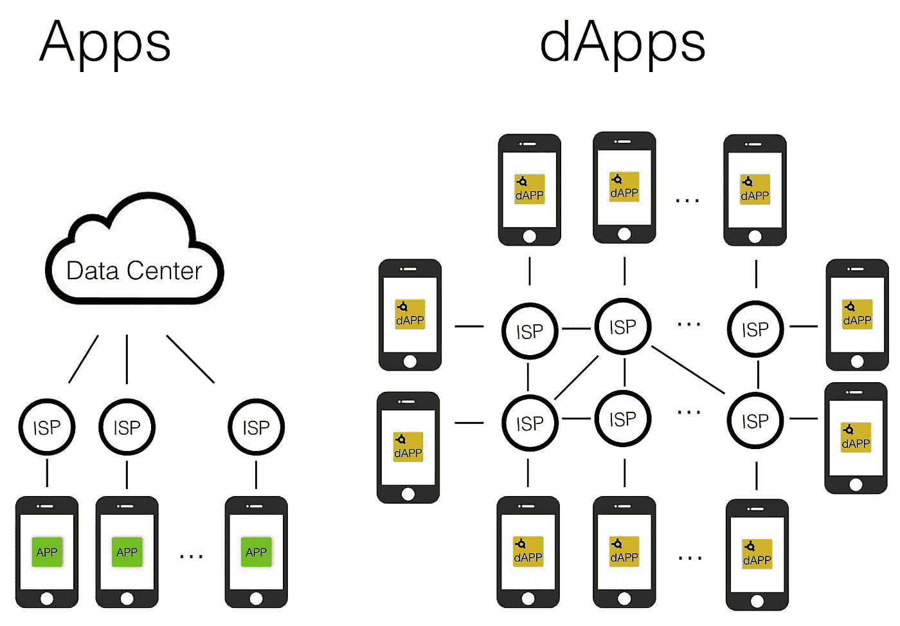
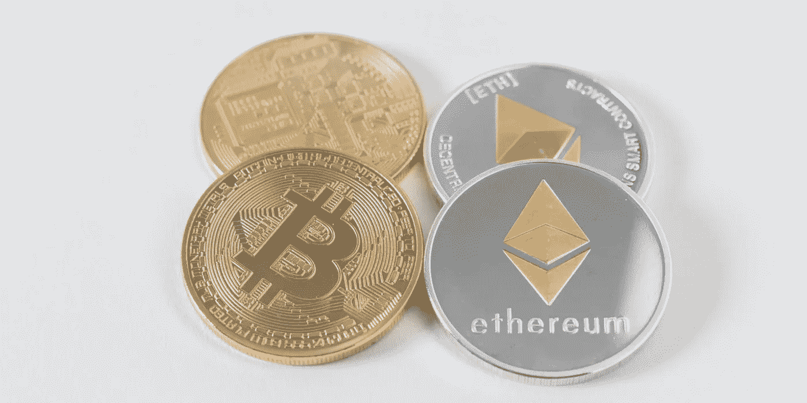

# 什么是 DAPP？

> 原文：<https://towardsdatascience.com/what-is-a-dapp-a455ac5f7def?source=collection_archive---------5----------------------->

Apps vs. DAPPs

DAPP(分布式应用程序)由运行在分布式对等网络上的后端代码组成。DAPP 也可以有一个用户界面，由调用后端的前端代码创建。DAPPs 不需要一个中央机构来运行:它们允许用户和提供商之间的直接交互。

**DAPPs 的特性**

DAPPs 通常具有以下特征:

*   他们在区块链上奔跑
*   他们的代码是开源的，自主运行，没有任何人或团体控制大多数令牌
*   它们生成 DAPP 令牌来为它们的贡献节点提供价值
*   用户被授予对它们的访问权以换取令牌
*   当矿工成功地为生态系统做出贡献时，他们会得到代币作为奖励

Unlike most Apps in use today, DAPPs store all their data on a blockchain and have their back end code running on a blockchain instead of with a central authority.

**DAPPs 的种类**

[以太坊](https://github.com/ethereum/wiki/wiki/White-Paper#applications)描绘了 DAPPs 的三个主要类别:

1.资金管理应用:用户可以在区块链网络上使用其固有货币进行交易。这些 DAPPs 通常都有自己的区块链，我们通常称之为加密货币(比如比特币)。

2.将金钱与外部真实事件相结合的应用程序:例如，一家[物流公司](/blockchain-technology-for-supply-chain-management-3a12b5d67aa3)可能使用 RFID 芯片位置来确定一批货物已经到达港口，然后才支付货款。如果买卖双方签订一份智能合同，这甚至可以用区块链上的资金完成，无需人工干预。

3.分散自治组织(DAOs):区块链上分散的、无领导的组织。这些从概念开始，根据编程定义的规则运行，这些规则关于什么实体可以是成员，成员如何投票，他们可以从事什么业务或活动，以及代币、资金或价值如何交换。一旦部署，DAPPs 会根据它们的规则自动运行。他们的成员可以在地理上分散在任何地方。

迄今为止，DAPP 初创公司(建立在区块链平台之上)已经构成了 ico 的大部分。大多数当前的 2 类和 3 类 DAPPs 使用以太坊平台。

DAPPs present a new paradigm for fintech and money management related applications.

**为什么是 DAPPs？**

DAPPs 本质上允许所有后端代码和数据去中心化，因此是不可变的和防篡改的。考虑到这些应用的分散性质，再加上保护区块链数据的[机制](/mechanisms-securing-blockchain-data-9e762513ae28)，DAPPs 有潜力开启各种各样的用例。

创建 DAPP 而不是普通应用程序的一些好处包括:

支付处理:无需与法定支付提供商集成来接受用户资金，因为用户可以直接使用加密货币进行交易

[用户证书](/https-medium-com-shaanray-how-blockchains-will-solve-privacy-88944f3c67f0):使用公钥和私钥系统，用户可以轻松地以不同程度的匿名处理和绑定他们的用户会话和元数据，无需冗长的注册或登记过程

[信任和可审计性](/how-blockchains-will-enable-privacy-1522a846bf65):聪明的用户可以访问和理解开源的 DAPP 代码。封闭数据的这种透明性和固有的安全性产生了对应用程序的信心。区块链上的公共记录也使得交易信息易于被用户或第三方审计

Ethereum is currently the platform of choice for DAPP developers, with several extremely promising contending platforms closing in.

**结论**

DAPP 的前景正在迅速演变。虽然以太坊目前是 DAPP 开发人员的首选平台，但 Cardano、Lisk、QTUM 和 NEO 也是 DAPP 开发的热门平台。也有许多努力正在进行中，以建立其他大规模的 DAPP 平台。

DAPP 开发正处于萌芽阶段，但 DAPP 提供的优势(传统的集中式应用程序没有)表明，我们可以期待在不久的将来看到区块链技术令人印象深刻的新功能和用例。

—

[陕雷](http://www.shaanray.com/)

关注 [Lansaar Research](https://medium.com/lansaar) 关于媒体的最新新兴技术和新商业模式。