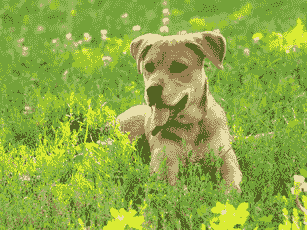
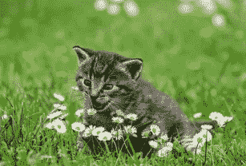
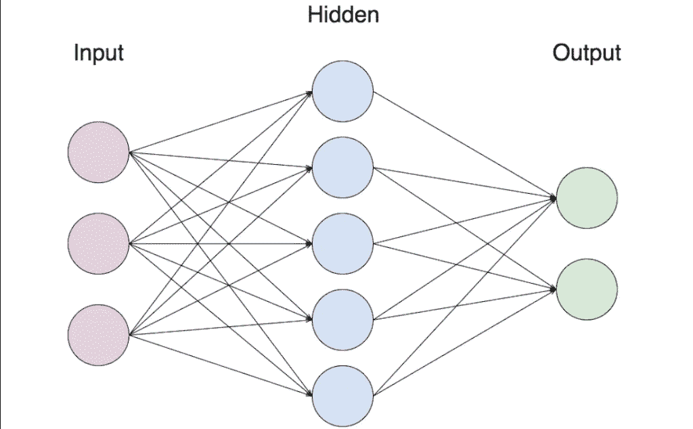
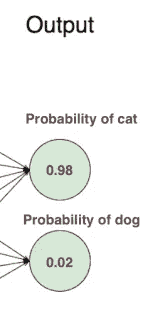
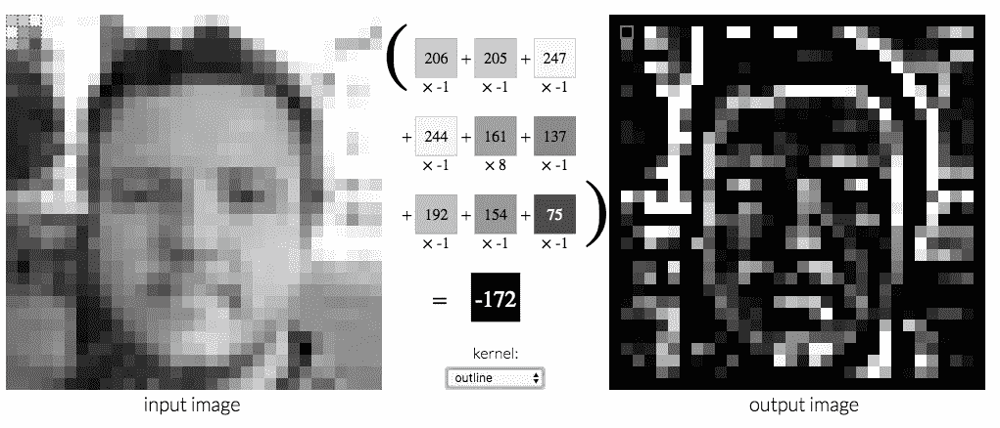
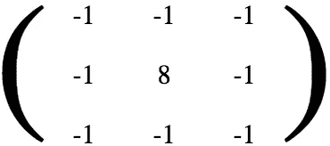
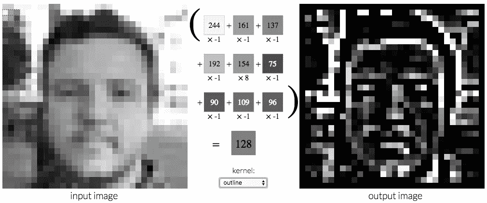
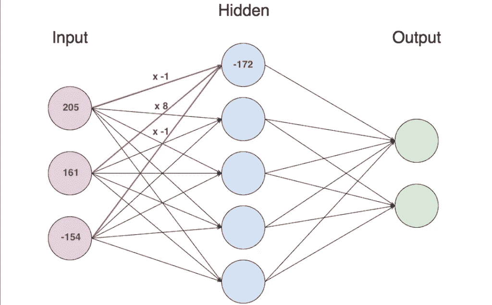

# 卷积神经网络新手入门

> 原文：<https://towardsdatascience.com/what-is-a-neural-network-6010edabde2b?source=collection_archive---------2----------------------->

这是一只狗。

Image 1: Dog // [Source](https://www.flickr.com/photos/msvg/9386968830)

这是一只猫。

Image 2: Cat // [Source](https://pixabay.com/p-2948404/?no_redirect)

当我们的眼睛看到这两张图片时，我们的大脑会立即告诉我们正在展示的是哪种动物。很简单，对吧？但是如果你不得不教一台机器区分猫和狗呢？

如果我们仅仅依靠我们在学校学习的基于逻辑的(“传统”)编程，这几乎是不可能的。我们可以尝试对猫和狗的特征进行分类，比如说，猫有尖尖的耳朵和锋利的爪子，而狗通常有较平的耳朵和较钝的爪子。因此，如果动物有尖尖的耳朵和锋利的爪子，那么它就是猫。如果不是，那就是狗。

然而，这也带来了许多问题。首先，有很多例外。有尖耳朵的狗和耷拉着耳朵的猫。还有，有很多猫不露出爪子的画面。除非我们手动编程所有的例外——会有很多——很难简单地通过从列表中勾掉它们的特征来简单地区分这两种动物。其次，机器将如何识别图片是否包含尖耳朵？图像没有标签说{尖耳朵:真，尖爪子:真}，这意味着我们必须自己找到一种方法来确定它。当我们看图片时，我们会自动看到尖尖的耳朵和锋利的爪子，但机器如何学习呢？

当我们看到一只狗的图像时，我们大脑中的某些神经元受到刺激，向其他神经元发送信号，其他神经元向更多的神经元发送信号，最终导致某些神经元被激活，“告诉”我们看到了一只狗。神经网络试图模拟这一过程，建立一个“迷你大脑”，可以完成简单的任务，如区分猫和狗。

Image 3: Basic neural network // [Source](http://jsfeeds.com/details/neural-networks-in-javascript-5a37a3e104959cec4923fa1d)

最基本的神经网络看起来像这样。我们从神经元的输入层开始，它激活隐藏层的神经元，然后激活输出层的神经元。把上图中的每个圆圈想象成一个神经元。每个神经元包含一个数字，称为它的激活。

在狗和猫的例子中，给我们一张照片，我们必须区分它是狗还是猫。所以我们的输入是照片，我们的输出是它是猫的概率和它是狗的概率。

为了简单起见，我们只给机器黑白照片。假设我们传入一张尺寸为 64 x 64 像素的照片:我们有 64 x 64 = 4096 像素。这些像素中的每一个都有一个对应于像素灰度值的数字。下图中的每个像素都有一个从 0 到 255 的数字，0 代表黑色，255 代表白色。

Image 4: Input image // [Source](http://setosa.io/ev/image-kernels/)

因此，输入层将由 4096 个激活排列在一起的神经元组成，或者由 4096 个数字组成的数组(列表)。

当我们传入一张大小不是 64 x 64 像素的照片时会发生什么？神经网络有一个固定的输入层大小，这意味着它必须分析 64 x 64 像素的照片。如果我们传入的照片比这个大，我们可以给机器编程，只分析中间的 64 x 64 像素，或者缩小整张照片，直到它达到那个尺寸。如果我们传入的照片小于 64 x 64，我们可以放大照片，或者干脆不分析。当然，64 这个数字是我选择的。您可以在每次运行时更改输入大小。计算机科学家通过实验发现，分析正方形部分(例如 64 x 64，而不是 64 x 70)会产生更好的结果，所以通常我们会继续分析正方形部分。

另一方面，输出层应该只包含两个神经元:一个神经元表示它是猫的概率，另一个表示它是狗的概率。理想情况下，如果我们传入一张猫的照片，我们应该得到这样的结果:

Image 5: Cat output

或者，从数值上来说，是这样的数组:[1.00，0.00]。

如果我们传入一张狗的照片，我们应该得到相反的结果。然而，更有可能的是，一个训练有素的神经网络可能会产生这样的结果:

Image 6: Dog output

或者，从数值上来说，是这样的数组:[0.98，0.02]。

神经网络训练得越好，就越接近正确答案。

在输入层和输出层之间，有几个隐藏层。在上图中，只显示了一个由 5 个神经元组成的隐藏层，但大多数神经网络都有多个包含许多神经元的隐藏层。理想情况下，我们可以想象每一层都有特定的用途；例如，第二层(第一隐藏层)将识别动物的轮廓，第三层将识别某些形状(如圆形)，第四层将识别动物部分(例如，圆内的圆可能是眼睛和瞳孔)，最后一层(输出层)将根据动物部分的特征识别它是猫还是狗。

这是怎么回事？这个网站展示了如何很好地分析图像的特征。这里，人的输入图像被转换成人的轮廓的输出。

Image 7: Convolution layer

这可以简单地通过抓取 9 个像素(3 x 3，如输入图像的左上角所示)并将 9 个像素中的每一个乘以某个数字，然后将它们加在一起来完成。在本例中，9 个像素乘以这些数字:

Image 8: Convolution kernel

左上角的像素灰度数乘以-1，右上角的像素灰度数乘以-1…等等。然后，所有的数字加在一起，这个新的灰度值就是输出图像中相关像素的数量。这里，输出是-172，所以输出图像中红色框中的像素是黑色的。

或者，简单地说，机器在一个 3×3 矩阵中取 9 个像素，并让它与另一个 3×3 矩阵进行标量乘法，以产生新图像的新灰度数。

然后，机器向下移动到下一组 3 x 3 像素，如下所示:

Image 9: Convolution layer

它会继续下去，直到创建一个完整的输出图像，只包含原始图像的轮廓。

同样的事情也可以用我们的狗对猫神经网络的前两层来做。狗或猫的照片被传入，然后经过一个变换矩阵，在图片中勾勒出动物的轮廓，以创建一个新的轮廓图片。新轮廓图片中的每个像素是第二层中的一个神经元。

在两层之间可以进行不止一次转换。例如，我们可以选择突出狗图片的垂直边缘和水平边缘。这是两个需要两个变换矩阵的变换，将产生两个输出图像。在这种情况下，两个图像(及其像素)可以放在一起形成第二层。这样，第二层不必包含与输入层相同数量的神经元；事实上，神经网络中的每一层*都不需要*拥有相同数量的神经元。

从第二层开始，对图像进行更多的变换以产生其余的隐藏层。最后一个隐藏层然后经历最后的变换，产生两个数字:它是猫的概率和它是狗的概率。

该视频展示了识别字母的神经网络的不同层，初始图像经历了几次转换，直到最终映射到某个字母。

Image 10: Convolution layer

回到这个例子，输入图像中的 3×3 像素乘以轮廓变换矩阵产生-172，即输出图像中像素的激活。我们称变换矩阵中的数字(1 和 8)为图像的*权重*。为了更好的形象化，这是我们的神经网络图:

Image 11: Weights

因为空间有限，我只将输入图像中中间一列的 3 个像素表示为输入层中的三个神经元。隐藏层中的顶部神经元是输出图像中产生的像素。神经元乘以的每个数字(1 和 8)就是神经元的*权重*。

有时候，我们可能想做矩阵乘法之外的另一种运算。例如，我们可能希望将激活下移一个特定的值。例如，我们可以使用 9 个像素和变换矩阵，取其标量积得到-172，然后减去 10 得到-162。在这种情况下，10 将是它的*偏差*，这意味着神经元必须至少为 10 才能有意义地活跃。

每个神经元都有自己的偏好和权重。通过正确的权重和偏差，神经网络将能够区分猫和狗。