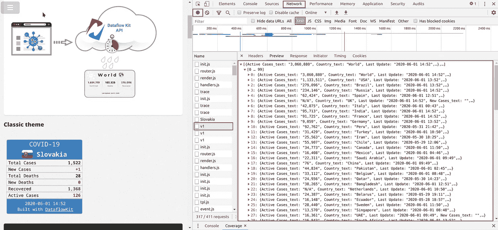
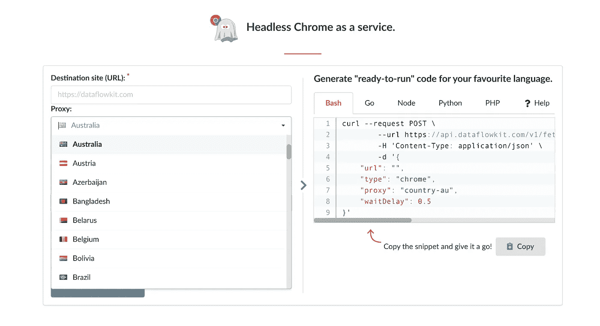
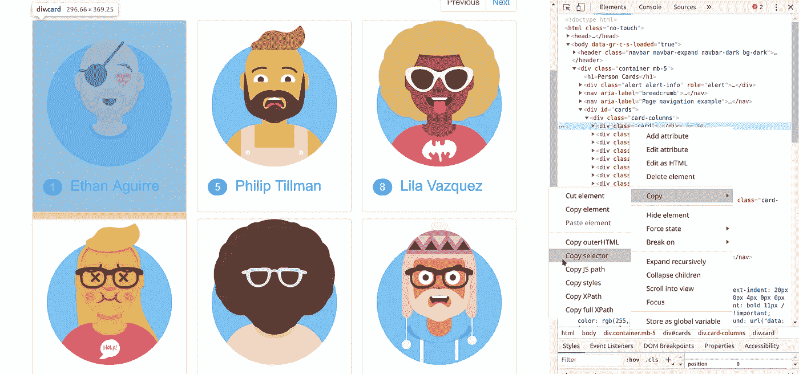
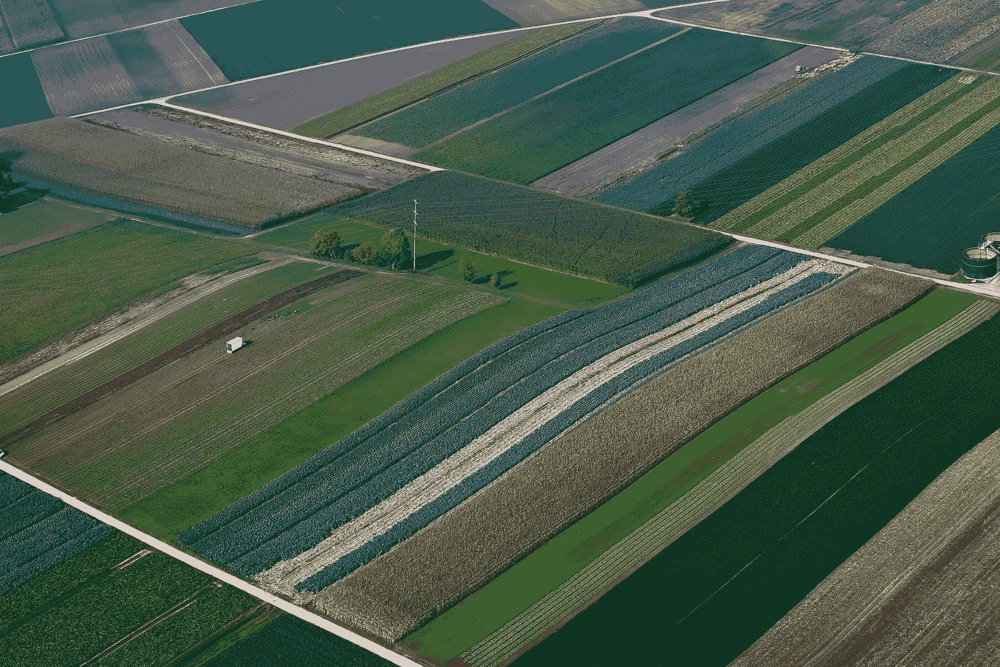

# 2020 年的当代网络刮刀是什么样的？

> 原文：<https://towardsdatascience.com/what-is-a-present-day-scraper-e2c3d3b79648?source=collection_archive---------14----------------------->

## 如果网站所有者不通过 API 授权用户访问，2020 年网络数据提取或网络抓取是获得所需数据的唯一途径。


Photo by [Bruno Mira](https://unsplash.com/@brunomira?utm_source=unsplash&utm_medium=referral&utm_content=creditCopyText) on [Unsplash](https://unsplash.com/s/photos/odivela?utm_source=unsplash&utm_medium=referral&utm_content=creditCopyText)

许多网站，如 Twitter、YouTube 或脸书，提供了一种通过公共 API 访问数据的简单方法。使用 API 获得的所有信息都是结构化的和规范化的。例如，它可以是 JSON、CSV 或 XML 格式。

# 从任何网站提取数据的 3 种方法。

# 排名第一的官方 API。

首先，你应该总是检查是否有一个官方的 API，你可以用它来获得想要的数据。

有时官方 API 更新不准确，或者其中缺少一些数据。

# #2“隐藏的 API”。

后端可能会生成 JSON 或 XML 格式的数据，供前端使用。

使用 web 浏览器检查器研究 XMLHttpRequest (XHR)为我们提供了另一种访问数据的方式。它会像官方 API 那样为我们提供数据。

> *如何获取这些数据？让我们寻找 API 端点！*

例如，让我们看一下[https://covid-19.dataflowkit.com/](https://covid-19.dataflowkit.com/)资源，它为网站访问者展示了当地的新冠肺炎案例。

1.  通过按 Ctrl+Shift+I 调用 Chrome DevTools
2.  控制台出现后，转到“网络”选项卡。
3.  让我们选择 XHR 过滤器来捕捉一个 API 端点作为“XHR”请求，如果它可用的话。"
4.  确保“录制”按钮已启用。
5.  刷新网页。
6.  当您看到与数据相关的内容已经出现在网页上时，请单击停止“记录”。



现在，您可以在左侧看到一个请求列表。调查他们。预览选项卡显示名为`"v1."`的项目的一组值

按“标题”选项卡查看请求的详细信息。对我们来说最重要的是网址。`"v1"`的请求网址是`[https://covid-19.dataflowkit.com/v1](https://covid-19.dataflowkit.com/v1)`。现在，让我们以另一个浏览器标签打开该 URL，看看会发生什么。

> 酷！这就是我们要找的。

直接从 API 获取数据或使用上述技术获取数据是从网站下载数据集的最简单方法。当然，这些方法不会对所有的网站都有效，这就是为什么网络抓取库仍然是必要的。

> 如果网站所有者不通过 API *授予用户访问权限，Web 数据提取或* web 抓取*是获取所需数据的唯一途径。Web 抓取是一种* ***的数据抽取技术*** *，替代手工的重复键入或复制粘贴。*

# #3 网站抓取。

# 懂规矩！

*在抓取网站之前应该检查什么？*


Photo by [Adam Sherez](https://unsplash.com/@mr_sherez?utm_source=medium&utm_medium=referral) on [Unsplash](https://unsplash.com?utm_source=medium&utm_medium=referral)

☑️ **Robots.txt** 是你打算抓取网站数据时首先要检查的。Robots.txt 文件列出了您或机器人应该如何与它们交互的规则。您应该始终尊重并遵守 robots.txt 中列出的所有规则。

☑️确保你也看了网站的**使用条款。**如果使用条款规定没有说限制对僵尸程序和蜘蛛的访问，也没有禁止服务器的快速请求，那么爬行是可以的。

☑️为了遵守新的欧盟通用数据保护条例，或者 GDPR，你应该首先评估你的网络废弃项目。

如果你不收集个人资料，那么 GDPR 就不适用。在这种情况下，您可以跳过这一部分，进入下一步。

☑️:使用提取的数据时要小心，因为有时你可能会侵犯版权。如果使用条款没有对数据的特定用途做出限制，只要爬虫不侵犯版权，什么都可以。

查找更多信息:[网页抓取合法不合法？](https://medium.com/dataflow-kit/is-web-scraping-legal-or-not-f6c26074584)

# 网站地图

典型的网站都有网站地图文件，其中包含属于该网站的链接列表。它们有助于使搜索引擎更容易抓取网站和索引它们的页面。从网站地图中获取 URL 进行抓取总是比用 web scraper 顺序收集要快得多。

# 呈现 JavaScript 驱动的网站

JavaScript 框架如 Angular、React、Vue.js 广泛用于构建现代 web 应用程序。简而言之，典型的 web 应用前端由 HTML + JS 代码+ CSS 样式组成。通常，源 HTML 最初并不包含所有的实际内容。在网页下载过程中，HTML DOM 元素与呈现 JavaScript 代码一起被动态加载。结果，我们得到了静态 HTML。

☑️:你可以使用 Selenium 进行网站抓取，但这不是一个好主意。许多教程都在教授如何使用 Selenium 从网站上抓取数据。他们的主页清楚地说明 Selenium 是用于测试目的的自动化 web 应用程序的。

☑️ *PhantomJS* 早期适合处理此类任务，但自 2018 年以来，其开发已暂停。

☑️或者，Scrapinghub 的 Splash 是在 Headless Chrome 出现之前 Python 程序员的一个选择。

> 你的浏览器本质上是一个网站刮刀。如今最好的方法是使用无头 Chrome，因为它可以“原生地”呈现网页。

*puppeter*节点库是 Javascript 开发者控制 Chrome over DevTools 协议的最佳选择。

Go 开发者可以选择从 [*chromedp*](https://github.com/chromedp/chromedp) 或 [*cdp*](https://github.com/mafredri/cdp) 中选择一个，通过 DevTools 协议访问 Chrome。

# 放聪明点。不要让他们阻挡你。


Photo by [Randy Fath](https://unsplash.com/@randyfath?utm_source=medium&utm_medium=referral) on [Unsplash](https://unsplash.com?utm_source=medium&utm_medium=referral)

一些网站使用反抓取技术来阻止 web scrapper 工具获取在线数据。网络抓取永远是一场“猫捉老鼠”的游戏。因此，在构建 web scraper 时，考虑以下方法来避免阻塞。否则你有可能得不到想要的结果。

# 技巧 1:在请求之间制造随机延迟。

当一个人访问一个网站时，访问不同页面的速度比网络爬虫的速度慢很多倍。相反，Web scraper 可以立即同时提取几个页面。短时间内网站的巨大流量看起来很可疑。

你应该找出理想的爬行速度，这是每个网站的个人。为了模拟人类用户行为，您可以在请求之间添加随机延迟。

不要给站点造成过多的负载。对你从中提取数据的网站要有礼貌，这样你就可以继续抓取数据而不会被屏蔽。

# 技巧 2:改变用户代理。

当浏览器连接到网站时，它在 HTTP 头中传递*用户代理(UA)* 字符串。该字段标识浏览器、其版本号和主机操作系统。

典型的用户代理字符串如下所示:`"Mozilla/5.0 (X11; Linux x86_64) AppleWebKit/537.36 (KHTML, like Gecko) Chrome/77.0.3865.90 Safari/537.36".`

*   如果对同一个域的多个请求包含同一个用户代理，网站可以很快检测并阻止您。
*   一些网站阻止特定的请求，如果他们包含不同于一般浏览器的用户代理。
*   如果“用户代理”价值丢失，许多网站将不允许访问他们的内容。

> **解决方法是什么？**

您必须建立一个用户代理列表，并随机轮换它们。

# 技巧 3:轮换 ip 地址。使用代理服务器。

如果您在抓取过程中从同一个 IP 地址发送多个请求，网站会认为您行为可疑并阻止您。

对于最简单的情况，使用最便宜的*数据中心代理*就足够了。但是一些网站有先进的僵尸检测算法，所以你必须使用*住宅*或*移动*代理来清除它们。

例如，欧洲有人想从一个只允许美国用户访问的网站中提取数据。很明显，通过位于美国的代理服务器进行请求，因为它们的流量似乎来自本地到美国的 IP 地址。



要获得目标网站的特定国家版本，只需在[数据流工具包获取服务](https://dataflowkit.com/render-web)的请求参数中指定任意国家。

# 技巧 4:避免刮擦模式。模仿人类的行为。

人类在浏览网站时是不一致的。他们做不同的随机动作，比如点击页面和移动鼠标。

相反，网页抓取机器人在抓取网站时会遵循特定的模式。

教你的刮刀模仿人类的行为。这样，网站机器人检测算法就没有任何理由阻止你自动化你的抓取任务。

# 提示 5:留意防刮擦工具。

检测黑客攻击或网络抓取企图最常用的工具之一是*“蜜罐”人眼看不到蜜罐，但机器人或网页抓取工具可以看到。就在你的抓取工具点击了这样一个隐藏链接之后，网站很容易就屏蔽了你。*

找出一个链接是否设置了`"display: none"`或`"visibility: hidden"` CSS 属性，如果它们只是停止跟随那个链接。否则，一个网站会立即识别你是一个机器人或刮刀，指纹你的请求的属性，并禁止你。

# 技巧 6:解决在线验证码。

在大规模抓取网站的同时，有机会被网站屏蔽。然后你开始看到验证码页面，而不是网页。

验证码是网站用来反击机器人和爬虫的测试，要求网站访问者在继续之前证明他们是人类。

许多网站使用谷歌的 reCAPTCHA。reCAPTCHA 的最新版本 v3 分析人类行为，并要求他们勾选`"I'm not a robot"`框。

验证码解析服务使用两种方法来解析验证码:

☑️ **基于人工的验证码求解服务**

当你把你的验证码发送到这样的服务，人类工作者解决一个验证码，并把它发送回来。

☑️ **OCR(光学字符识别)解决方案**

在这种情况下，OCR 技术用于自动解决验证码。

# 点击式可视选择器。

当然，我们不打算只下载和呈现 JavaScript 驱动的网页，而是从中提取结构化数据。


在开始数据提取之前，让我们指定数据的模式。请看销售智能手机的网络商店截图。我们想刮一个项目的图像，标题，及其价格。

*谷歌 chrome inspect 工具*在研究 HTML 网页的 DOM 结构方面做得很好。


Click the **Inspect** icon in the top-left corner of DevTools.



Chrome Inspector tool

使用 Chrome Inspect 工具，您可以轻松地找到并复制网页上指定 DOM 元素的 [CSS 选择器或 XPath](https://medium.com/dataflow-kit/css-selectors-vs-xpath-f368b431c9dc?source=friends_link&sk=ac6efc5d55cd648fa3c9488f8e09d4db) 。

通常，当抓取一个网页时，您有不止一个相似的数据块要提取。在一次抓取会话中，您通常会抓取几个页面。

当然，你可以使用 Chrome Inspector 来构建一个有效的抓取工具。在一些复杂的情况下，这只是研究网页上特定元素属性的一种方法。

尽管现代在线 web 抓取器在大多数情况下提供了一种更舒适的方式来指定数据抓取的模式(CSS 选择器或 XPath ),设置分页规则，以及在此过程中处理详细页面的规则。

看看这个视频，了解它是如何工作的。

# 管理您的数据存储策略。

现在最广为人知的存储结构化数据的简单数据格式包括 CSV、Excel、JSON (Lines)。在解析网页之后，提取的数据可以被编码成目的地格式。这些格式适合用作小容量存储。

抓取几个页面可能很容易，但是几百万个页面需要不同的方法。

> *如何抓取几百万个页面，提取几千万条记录？*
> 
> *如果输出数据的大小从中等到巨大怎么办？*

# 选择正确的格式作为输出数据。



Photo by [Ricardo Gomez Angel](https://unsplash.com/@ripato?utm_source=ghost&utm_medium=referral&utm_campaign=api-credit) / [Unsplash](https://unsplash.com/?utm_source=ghost&utm_medium=referral&utm_campaign=api-credit)

## **格式#1。逗号分隔值(CSV)格式**

CSV 是最简单的人类可读数据交换格式。文件的每一行都是一条数据记录。每条记录都由逗号分隔的相同字段列表组成。

以下是以 CSV 数据表示的系列列表:

```
id,father,mother,children
1,Mark,Charlotte,1
2,John,Ann,3 
3,Bob,Monika,2
```

CSV 仅限于存储二维无类型数据。没有办法像普通 CSV 中的孩子的名字一样指定嵌套结构或值的类型*。*

## 格式#2。JSON

```
[
   {
      "id":1,
      "father":"Mark",
      "mother":"Charlotte",
      "children":[
         "Tom"
      ]
   },
   {
      "id":2,
      "father":"John",
      "mother":"Ann",
      "children":[
         "Jessika",
         "Antony",
         "Jack"
      ]
   },
   {
      "id":3,
      "father":"Bob",
      "mother":"Monika",
      "children":[
         "Jerry",
         "Karol"
      ]
   }
]
```

然而，在 JSON 文件中表示嵌套结构很容易。

如今**，JavaScript Object Notation(JSON)**成为事实上的数据交换格式标准，在大多数情况下取代了 XML。

> 我们的一个项目包含 300 万个解析过的页面。因此，最终 JSON 的大小超过 700 Mb。

当您必须处理这样大小的 JSONs 时，问题就出现了。要从 JSON 数组中插入或读取记录，每次都需要解析整个文件，这远非理想。

## 格式#3。JSON 行

让我们看看什么是 **JSON 行**格式，以及它与传统 JSON 的比较。使用 **JSON 行**在业内已经很普遍了。 *Logstash* 和 *Docker* 将日志存储为 JSON 行。

表示为 **JSON 行**格式的相同系列列表如下所示:

```
{"id":1,"father":"Mark","mother":"Charlotte","children":["Tom"]} {"id":2,"father":"John","mother":"Ann","children":["Jessika","Antony","Jack"]} {"id":3,"father":"Bob","mother":"Monika","children":["Jerry","Karol"]}
```

**JSON Lines** 由几行组成，其中每一行都是一个有效的 JSON 对象，由换行符`\n`分隔。

因为 JSON 行中的每个条目都是有效的 JSON，所以可以将每一行解析为独立的 JSON 文档。例如，您可以在其中进行搜索，将一个 10gb 的文件分割成较小的文件，而无需解析整个文件。您可以根据需要读取任意多的行来获得相同数量的记录。

# 摘要

## 一个好的刮削平台应该:

☑️ *同时从网页中获取和提取数据*。

我们使用 Golang 的并发特性，发现它们非常棒；

☑️ *定期将提取的刮掉的* *数据块保存在中央数据库中。*

这样，在抓取许多页面时，您不必在 RAM 中存储太多数据。除此之外，以后可以很容易地将数据多次导出为不同的格式。我们使用 MongoDB 作为我们的中央存储。

☑️ *基于网络。*

在线网站刮刀是可以从任何地方的任何设备连接到互联网。不同的操作系统不再是问题。都是浏览器的问题。

☑️ *对云友好。*

它应该提供一种根据 web 数据提取项目的当前需求快速扩大或缩小云容量的方法。

# 结论

> 在这篇文章中，我试图解释如何在 2020 年抓取网页。但是在考虑抓取之前，试着找出官方 API 的存在或者寻找一些“隐藏的”API 端点。

如果您能花一分钟时间告诉我，2020 年您最常用的网络抓取方式是哪一种，我将不胜感激。就*在*下面给我留言评论吧。

刮的开心！

[关于 2020 年网页抓取器的推文。](https://ctt.ac/d2bFU)

*原载于 2020 年 5 月 27 日 https://blog.dataflowkit.com**的* [*。*](https://blog.dataflowkit.com/what-is-a-present-day-web-scraper/)