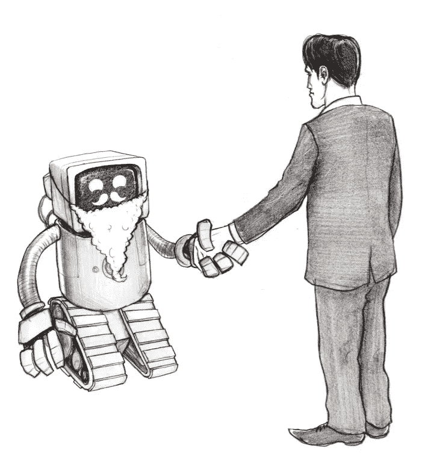

# 什么是 AI 对齐？

> 原文：<https://towardsdatascience.com/what-is-ai-alignment-2bbbe4633c7f?source=collection_archive---------12----------------------->

这篇博客是一个系列的一部分

第一部分是: [AI —控制问题](/ai-the-control-problem-c82bb485bc54)

在之前的博客中，我讨论了控制问题——我们面临的挑战是控制一台以与我们完全不同的方式思考的机器，它很可能比我们聪明得多。即使我们对控制问题有一个完美的解决方案，我们还剩下第二个问题，我们应该要求人工智能做什么，思考什么，重视什么？

这个问题就是 AI 对齐。

人工智能很可能比我们快得多(如果不是，为什么不多建几台服务器呢？那就一定会！)而且对我们来说，确认它想要做出的每一个决定都是不可行的，也是没有价值的。我们想要的是一套规则或原则，人工智能可以参考这些规则或原则，自己做出决定，知道通过遵循这些规则，它的行动将与人类想要的一致。

人工智能的这些规则系统分为两个主要类别——直接规范性和间接规范性。

# **直接规范性**

有了直接的规范性，我们给 AI 提供了一套可以遵循的规则。这些规则中最著名的是艾萨克·阿西莫夫机器人定律，它是一个伟大的…基础…但是分崩离析，正如我们从阿西莫夫写的故事中看到的那样。

一个更现代的例子是 Nick Bostrom 的回形针最大化器。拿一个人工智能来说，让它的效用函数成为它的核心价值，来创造回形针。这听起来无害，并且是要求受控人工智能制作回形针的一种简单方法。我们不想让它做人类会做的事情；我们已经有工厂生产回形针了。我们使用人工智能的目的是找到新的、更好的、更有效的制造回形针的过程，并且制造出它应该制造的回形针。在它完成所有我们可能想要的曲别针之后，它会停止吗？不。它已经被硬连线制作回形针，所以它会继续制作回形针，即使在它使用了所有给它的材料，地球上的所有材料，甚至把我们星球和太阳系以外的材料变成回形针，如果可以的话。那些人类？它们也是由物质制成的，如果它是一个回形针，看起来会更好。如果有什么不同的话，人类变成回形针是特别重要的，因为在他们的人类形态中，他们可能会决定不再需要任何回形针。人工智能希望给自己尽可能高的概率来制作回形针，如果它预测人类可能不希望这种情况发生，他们就有机会以人工智能的方式获得，所以人工智能根除人类以提高其制作更多回形针的概率是合理的。

对此的改编是告诉一个回形针制作有限数量的回形针，比如 1000 个。不幸的是，这也不太管用。假设这个人工智能使用贝叶斯概率来衡量确定性，它永远不可能对任何事情都 100%或 0%确定。在制作了 1，000 个回形针之后，它将继续检查它是否精确地制作了 1，000 个，而不是 999 个，并且它们都是回形针应该有的样子。它将继续使用它将用来变成回形针的所有相同的资源来检查和再次检查这一点，因为 AIs 的最终价值，它的整个存在是关于确保精确地制作 1000 个回形针。另外，它也没什么更好的事情可做。

应用于比对，我们想要做的是找到一系列规则，人工智能可以严格遵守这些规则，并确保它正在做人类想要做的事情。我们目前提出的系统似乎都有漏洞，如果我们能够以人类的智力水平发现这些漏洞，那么对于超越人类水平的智力来说，发现和利用这些漏洞将是轻而易举的事情。

增加越来越多的规则听起来也没有吸引力。我们可以把这比作税法，税法有大量的规则。然而奇怪的是，我们似乎被人包围着，甚至是不纳税的大公司。更多的规则似乎提供了更多可被利用的漏洞，而不是更安全。在直接规范下，我们没有理由期望一个人工智能遵循规则的精神，只是严格遵守它们。

# **间接规范性**

所以，进入替代方案。间接规范性并不要求 AI 遵循一套明确的静态规则。相反，它给了人工智能一个框架来寻找价值本身，通常要求它做我们“想要的”Eliezer Yudkowski 提供了一个框架，称为“连贯的外推意志”，简称 CEV。

用诗歌的术语来说，如果我们知道得更多，思考得更快，成为我们希望成为的人，在一起成长得更远，我们连贯的推断意志就是我们的愿望；外推收敛而不是发散，我们的愿望一致而不是干涉；如我们所愿的推断，如我们所愿的推断，如我们所愿的解释——Eliezer Yudkowski，机器智能研究所

这种方法有一个更深的抽象层来指导规范性，并要求 AI 基于对早期声明的诚实解释来创建自己的规则。我们在这里工作的假设是，我们已经解决了控制问题，所以人工智能不能为了任何邪恶的需要修改第一个声明。

随着间接规范性的出现，一件有趣的事情变得显而易见，那就是我们并不真的希望人工智能去做我们会做的事情，或者精确地评价我们会重视的东西。想象一个在维京时代创造的人工智能，在那里我们成功地编码了我们当时的价值观。我们很可能会拥有一个非常强壮和暴力的人工智能(抱歉，如果维京人不是这样，历史不是我的强项！).我们今天有不同的价值观，但那些价值观可能并不能反映 1000 年后我们将成为的人，甚至不能反映超人智能 AI 出现后我们将立即成为的人。例如，我们今天重视人类的生产力，这将变得不那么重要。我们也重视短期收益，以牺牲环境为代价提高生产率，而这不太可能适合我们未来的社会。我们想要的是一个人工智能，它可以为自己创造一个价值体系，总结我们未来的需求，而不牺牲今天社会的需求或价值。

很难预测人工智能在这种情况下会做什么。正如我们所说的，这个假设场景中的控制已经解决，我们要求人工智能做我们在未来会做的事情，我们的价值观趋同，做我们在这个声明中的意思。它预测的未来版本的我们可能可以接受人工智能为了我们自己的利益操纵我们自己的价值体系，即使这不是我们今天想要的东西，因为这是我们未来可能重视的东西。

# 我们如何找到正确的价值观？

简而言之，我们不知道。

关于伦理和道德的问题已经被哲学家们研究了几千年，而且确实没有令人满意的答案。我们甚至在最基本的问题上没有完全的共识——一些人认为我们可以发现一个普遍的伦理框架，另一些人认为伦理是我们当前理想的平均值，随着时间的推移而变化。仅仅因为人工智能是一个不同的问题，并不意味着我们会更容易找到答案。

提出的一个解决方案是创建一个精灵类型的人工智能，并询问它应该被赋予什么值，或者我们应该使用什么间接指令来实现想要的值。如果我们使用这种类型的人工智能来解决控制问题，这种方法的问题就可想而知了。如果我们用它来解决控制问题，精灵本身是无法被完全控制的。我们可能会试图限制它对数据的访问，并给它一个非常严格的交流系统，比如只能回答是或不是的问题，但人类很难预测一个比我们更强大的智能可能会采取什么方法来逃离我们为它建造的笼子。应用于对齐，问题是我们如何知道未对齐的人工智能给出的答案是否确实符合人类价值观，因为我们期望我们需要一个不同于我们以前想到的任何答案。

Eliezer Yudkowski 将这种类型的人工智能与下棋计算机进行了比较。1950 年，克劳德·香农提出了一个理论上完美的国际象棋算法，从此“深蓝”花了 47 年时间打败了加里·卡斯帕罗夫。香农需要的是让他的算法实现的计算能力。人工智能排列虽然是在前香农天。即使有无限计算，我们也不知道我们将运行什么算法。

凭借我们今天可用的处理能力，理论上完美的算法和功能原型之间的差距可能会更短，但我们首先需要解决一些基本问题，以充分利用这种处理能力。