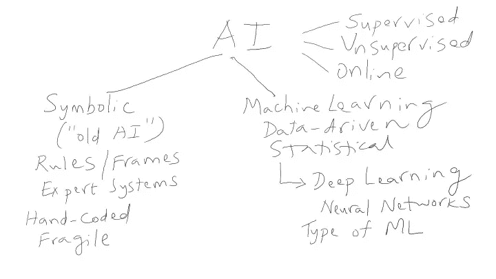

# AI 是什么？

> 原文：<https://towardsdatascience.com/what-is-ai-cc85fb25a981?source=collection_archive---------5----------------------->

我最近与一位非技术业务同事/经理会面，他要求我解释一些人工智能术语，如机器学习和深度学习。“机器学习是深度学习的一种，还是反过来？”。所以，我在白板上画了这幅图，然后开始了一个有点漫无边际的关于人工智能及其历史的演讲。然后我想到，许多业务类型都在问自己(和他们的同事)类似的问题，我看到不止一个经理混淆了这些区别。因此，这篇文章试图做一个快速的非技术性概述。

本着上面匆忙绘制的图片的精神，本文并不打算对人工智能的子领域进行彻底的分类。我也不做任何准确性的声明，所以如果你不同意，或者认为我在某些细节上错了，请对我宽容一些。如果你谷歌“什么是人工智能？”，你会得到大量有深度的文章/博客(包括[维基百科条目](https://en.wikipedia.org/wiki/Artificial_intelligence))、[书籍](http://aima.cs.berkeley.edu/)，以及许多更加全面的[图片](http://legalexecutiveinstitute.com/wp-content/uploads/2016/02/AI-Graphic-NEW.jpg)。但是许多非技术经理既没有时间也没有兴趣钻研细节；这篇文章旨在帮助这些人更好地了解人工智能。

人工智能可以大致分为符号人工智能和机器学习。如今，人工智能一词是机器学习的同义词，最近则是深度学习。但是，人工智能的起源大多是象征性的，带有旨在捕捉专家知识的手工编码规则。通常，精通 Lisp 或 Prolog 等“人工智能语言”的人工智能软件工程师会与领域专家(比如说，医学博士)配对，以 IF-THEN 规则的形式表示相关知识。除了规则，还有很多其他的符号化知识表示机制，比如[框架](https://en.wikipedia.org/wiki/Frame_(artificial_intelligence))。时至今日，你会发现许多产品都使用规则/框架，比如许多最先进的聊天机器人框架，它们使用 [AIML](https://en.wikipedia.org/wiki/AIML) 规则或意图框架来使用脚本对话创作对话。这些产品虽然取得了一些成功，但仍然受到下面提到的限制。

在 20 世纪 60 年代和 80 年代的几次人工智能炒作周期之后，人工智能领域进入了一个漫长的“[人工智能冬天”](https://en.wikipedia.org/wiki/AI_winter)直到 2000 年代中期。为什么？从软件工程的角度来看，规则/框架是脆弱的，一旦我们通过了几百条规则，就很难管理/维护一个符号化的人工智能系统。规则开始相互冲突，并且不可能跟踪规则触发的顺序和调试这些系统。规则必须由昂贵而忙碌的领域专家手动编写，并进行大量输入。这些系统中的“学习”大多是“受监督的”和离线的。人们试图通过基于用户交互反馈的“无监督”和在线学习来自动创建规则。然而，大多数这些尝试仍然是学术上的努力，很少有商业上成功的实现。

机器学习开始于 20 世纪 90 年代中期，当时计算机科学家和统计学家开始相互合作和学习。决策树和支持向量机等算法在 21 世纪初被用于挖掘越来越大的数据库，以获得可用于预测/分类和其他高级分析任务的模式。更快的计算机和 Hadoop 等“大数据”软件工具的出现激发了人们对数据驱动模式识别的兴趣，这种模式识别使计算机能够从历史数据中学习。主要区别是，新的人工智能工程师，现在称为数据科学家，不从事传统的软件工程。相反，他们的工作是从原始数据中提取特征，并使用这些特征来创建监督学习模型，使机器能够学习基于历史数据进行分类和预测。数据科学家提供带标签的数据，用于识别指向每个不同类/标签的要素组合。这种“模型工程”远比“规则工程”更强大，并受益于更快的计算机、更多数据和用户在线反馈的良性循环。无监督的机器学习方法(如聚类)通常与有监督的方法结合使用。

深度学习起源于人工神经网络(ANN)，它是“[连接主义者 AI](https://en.wikipedia.org/wiki/Connectionism) ”的一部分，也可以追溯到 20 世纪 60 年代。许多算法进步，如反向传播、多层感知器、卷积网络和递归网络，是在 20 世纪 80 年代、90 年代和 21 世纪初逐步发现的。但是深度学习，其名称来自大量的神经层(从 5 到 100 或更多)，只是在大约 5 年前随着 GPU 作为计算主力的出现才变得具有商业可行性。这些更快的基于 GPU 的计算机以及大量非结构化数据(如图像、音频、视频和文本)的可用性，是人工智能当前成功的关键。此外，在过去 5 年中，深度学习算法和架构的创新步伐令人难以置信。今天，深度学习系统可以以惊人的准确度执行图像识别、语音识别和自然语言理解任务。

深度学习系统也大多是受监督的学习系统，因为数据科学家必须提供大量带标签的数据来训练这些系统(神经元之间互连的权重)。但是，与更传统的统计机器学习算法(如随机森林)不同，深度学习系统可以自动从原始数据中进行特征提取。因此，数据科学家不必执行特征工程。深度学习的意义在于，连续的层在不断增加的抽象层次上学习特征。因此，虽然前几层可能识别边缘和其他较低层次的图像特征，但接下来的几层识别较高层次的特征，如鼻子/耳朵/嘴巴，而接下来的几层识别整张脸等等。

[生成对抗网络(GANs)](https://en.wikipedia.org/wiki/Generative_adversarial_networks) 和[自动编码器](https://en.wikipedia.org/wiki/Autoencoder)是无监督深度学习系统的例子。[强化学习](https://en.wikipedia.org/wiki/Reinforcement_learning)系统是深度学习系统的例子，可以被认为是在线学习系统，因为它们直接从模拟环境中执行的动作和在真实环境中部署时获得的反馈中学习。自动驾驶汽车和游戏系统，如 [AlphaGo](https://www.tastehit.com/blog/google-deepmind-alphago-how-it-works/) 利用强化学习；AlphaGo 是基于模拟学习的一个很好的例子，因为该系统是通过无数次与自己对弈来训练的。这也是一个无监督学习的例子，因为系统通过观察自己的错误并纠正它们而变得更好。

人工智能还有许多其他相关的子领域，如[进化(遗传)算法](https://en.wikipedia.org/wiki/Evolutionary_algorithm)、[博弈论、](https://en.wikipedia.org/wiki/Game_theory)、[多智能体系统](https://en.wikipedia.org/wiki/Multi-agent_system)等等。此外，请注意，人工智能受益于其他学科，如[数学优化](https://en.wikipedia.org/wiki/Mathematical_optimization)，这些学科已成为其他领域的一部分，如[运筹学](https://en.wikipedia.org/wiki/Operations_research) (OR)。事实上，人工智能最近的繁荣也重振了对控制理论等相关领域的兴趣，因为自动驾驶汽车、无人机和机器人背后的许多算法都有其他学科的数学基础。因此，人工智能是一个真正的跨学科领域，来自各种背景的科学家和工程师能够应用他们的数学和软件技能。

我试图保持这个概述的非技术性和简短。我希望这能帮助一些商业人士掌握办公室里流传的一些流行词汇和行话。